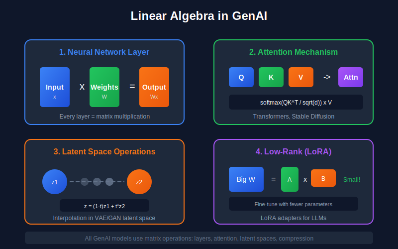

# 📐 Linear Algebra for Generative AI

*The mathematical backbone of neural networks and generative models*

---

## 📖 Introduction

Linear algebra forms the mathematical backbone of virtually all modern machine learning and generative AI systems. From the weight matrices in neural networks to the latent spaces of variational autoencoders, understanding linear algebra is essential for grasping how generative models work at a fundamental level.

This guide covers the essential linear algebra concepts needed for generative AI, with rigorous mathematical treatment and connections to practical applications.

---

## 🎯 Where and Why Use Linear Algebra in Generative AI

### Where It's Used

| Application | Linear Algebra Concepts | Example Models |
|-------------|------------------------|----------------|
| **Neural Network Layers** | Matrix multiplication, weight matrices | All deep learning models |
| **Attention Mechanisms** | Query-Key-Value projections, softmax over dot products | Transformers, GPT, Stable Diffusion |
| **Latent Spaces** | Vector spaces, interpolation, distance metrics | VAEs, GANs, Diffusion Models |
| **Image Generation** | Convolutions (Toeplitz matrices), tensor operations | DCGANs, StyleGAN, U-Net |
| **Dimensionality Reduction** | SVD, PCA, low-rank approximations | Latent space design, LoRA fine-tuning |
| **Covariance Modeling** | Positive definite matrices, Cholesky decomposition | VAE reparameterization, Gaussian processes |
| **Normalization Layers** | Mean/variance computation, affine transforms | BatchNorm, LayerNorm, AdaIN (StyleGAN) |
| **Model Compression** | Low-rank factorization, matrix approximation | Efficient transformers, LoRA adapters |

### Why It's Essential

1. **Understanding Model Architecture:** Every layer in a neural network performs linear transformations. Without understanding matrices, you can't debug shape mismatches, design custom layers, or understand why certain architectures work.

2. **Latent Space Manipulation:** Generative models operate in latent spaces where linear algebra governs interpolation ($z_{interp} = (1-t)z_1 + tz_2$), attribute arithmetic, and distance computation.

3. **Efficient Implementation:** Understanding SVD and low-rank approximations is crucial for:
   - LoRA (Low-Rank Adaptation) for efficient fine-tuning
   - Flash Attention and efficient transformer variants
   - Model quantization and compression

4. **Debugging and Optimization:**
   - Gradient explosions/vanishing → eigenvalue analysis
   - Mode collapse in GANs → spectral normalization
   - Training instability → condition number analysis

5. **Research and Innovation:** Papers in generative AI heavily use linear algebra notation. Without fluency, reading papers like "Attention Is All You Need" or "Denoising Diffusion Probabilistic Models" becomes impossible.

### What Happens Without This Knowledge

- ❌ Can't understand why `torch.matmul(A, B)` fails with shape errors
- ❌ Can't implement custom attention mechanisms
- ❌ Can't apply techniques like LoRA or model pruning
- ❌ Can't read or understand GenAI research papers
- ❌ Can't debug training instabilities related to weight matrices

---

## 📊 Representation Comparison

| Representation | Pros | Cons |
|----------------|------|------|
| **Dense Matrix** | Full expressiveness, simple operations | High memory O(n²), slow for large matrices |
| **Sparse Matrix** | Memory efficient, fast for sparse data | Complex indexing, not all ops supported |
| **Low-Rank (SVD)** | Compression, denoising, interpretable | Approximation error, expensive to compute |
| **Diagonal Matrix** | O(n) storage, O(n) multiplication | Limited expressiveness |
| **Orthogonal Matrix** | Preserves norms, stable gradients | Constrained optimization needed |

---

## 1. Vectors and Vector Spaces

### 1.1 Definition of a Vector Space

A **vector space** $V$ over a field $\mathbb{F}$ (typically $\mathbb{R}$ or $\mathbb{C}$) is a set equipped with two operations:
- Vector addition: $+: V \times V \rightarrow V$
- Scalar multiplication: $\cdot: \mathbb{F} \times V \rightarrow V$

satisfying eight axioms (associativity, commutativity, identity elements, inverse elements, distributivity).

### 1.2 Basis and Dimension

**Definition (Linear Independence):** Vectors $\{v_1, v_2, \ldots, v_n\}$ are linearly independent if:

$$\sum_{i=1}^{n} \alpha_i v_i = 0 \implies \alpha_i = 0 \quad \forall i$$

**Definition (Basis):** A basis $\mathcal{B}$ of a vector space $V$ is a linearly independent set that spans $V$.

**Theorem:** All bases of a finite-dimensional vector space have the same cardinality, called the **dimension** of $V$.

### 1.3 Inner Product Spaces

An **inner product** on a real vector space $V$ is a function $\langle \cdot, \cdot \rangle: V \times V \rightarrow \mathbb{R}$ satisfying:

1. **Symmetry:** $\langle u, v \rangle = \langle v, u \rangle$
2. **Linearity:** $\langle \alpha u + \beta v, w \rangle = \alpha \langle u, w \rangle + \beta \langle v, w \rangle$
3. **Positive definiteness:** $\langle v, v \rangle \geq 0$ with equality iff $v = 0$

The standard inner product on $\mathbb{R}^n$ is:

$$\langle x, y \rangle = \sum_{i=1}^{n} x_i y_i = x^T y$$

**Relevance to GenAI:** Latent spaces in VAEs and diffusion models are vector spaces where we measure distances and similarities using inner products.

---

## 2. Matrices and Linear Transformations

### 2.1 Matrices as Linear Maps

Every linear transformation $T: \mathbb{R}^n \rightarrow \mathbb{R}^m$ can be represented by an $m \times n$ matrix $A$:

$$T(x) = Ax$$

**Theorem (Rank-Nullity):** For a linear map $T: V \rightarrow W$:

$$\dim(V) = \dim(\ker(T)) + \dim(\text{im}(T))$$

Or equivalently for matrix $A \in \mathbb{R}^{m \times n}$:

$$n = \text{nullity}(A) + \text{rank}(A)$$

### 2.2 Matrix Decompositions

#### Eigenvalue Decomposition (EVD)

For a square matrix $A \in \mathbb{R}^{n \times n}$, if there exists a scalar $\lambda$ and non-zero vector $v$ such that:

$$Av = \lambda v$$

then $\lambda$ is an **eigenvalue** and $v$ is an **eigenvector**.

**Theorem (Spectral Theorem):** A real symmetric matrix $A$ can be decomposed as:

$$A = Q \Lambda Q^T$$

where $Q$ is orthogonal ($Q^T Q = I$) and $\Lambda$ is diagonal containing eigenvalues.

**Proof Sketch:**
1. Real symmetric matrices have real eigenvalues
2. Eigenvectors corresponding to distinct eigenvalues are orthogonal
3. For repeated eigenvalues, we can choose an orthonormal basis for the eigenspace
4. Collect eigenvectors as columns of $Q$

#### Singular Value Decomposition (SVD)

**Theorem:** Any matrix $A \in \mathbb{R}^{m \times n}$ can be decomposed as:

$$A = U \Sigma V^T$$

where:
- $U \in \mathbb{R}^{m \times m}$ is orthogonal (left singular vectors)
- $\Sigma \in \mathbb{R}^{m \times n}$ is diagonal (singular values $\sigma_1 \geq \sigma_2 \geq \cdots \geq 0$)
- $V \in \mathbb{R}^{n \times n}$ is orthogonal (right singular vectors)

**Proof:**
1. $A^T A$ is symmetric positive semi-definite, so $A^T A = V \Lambda V^T$
2. Define $\sigma_i = \sqrt{\lambda_i}$ and $\Sigma$ accordingly
3. For non-zero singular values, define $u_i = \frac{1}{\sigma_i} A v_i$
4. Complete $U$ to an orthonormal basis
5. Verify $A = U \Sigma V^T$

**Relevance to GenAI:**
- **Dimensionality reduction** in latent space design
- **Weight initialization** in neural networks
- **Low-rank approximations** for efficient attention mechanisms

### 2.3 Low-Rank Approximation

**Theorem (Eckart-Young-Mirsky):** The best rank-$k$ approximation of $A$ in Frobenius norm is:

$$A_k = \sum_{i=1}^{k} \sigma_i u_i v_i^T$$

with error:

$$\|A - A_k\|_F = \sqrt{\sum_{i=k+1}^{\min(m,n)} \sigma_i^2}$$

---

## 3. Positive Definite Matrices

### 3.1 Definitions and Characterizations

A symmetric matrix $A \in \mathbb{R}^{n \times n}$ is **positive definite** (PD) if:

$$x^T A x > 0 \quad \forall x \neq 0$$

**Equivalent Characterizations:**
1. All eigenvalues are positive
2. All leading principal minors are positive
3. $A = B^T B$ for some invertible $B$
4. There exists a unique PD square root $A^{1/2}$

### 3.2 Cholesky Decomposition

**Theorem:** A symmetric positive definite matrix $A$ has a unique decomposition:

$$A = LL^T$$

where $L$ is lower triangular with positive diagonal entries.

**Algorithm:**
$$l_{jj} = \sqrt{a_{jj} - \sum_{k=1}^{j-1} l_{jk}^2}$$

$$l_{ij} = \frac{1}{l_{jj}}\left(a_{ij} - \sum_{k=1}^{j-1} l_{ik} l_{jk}\right) \quad \text{for } i > j$$

**Relevance to GenAI:** Covariance matrices in VAEs and Gaussian processes must be positive definite. The Cholesky decomposition enables efficient sampling:

$$x = \mu + L z, \quad z \sim \mathcal{N}(0, I)$$

gives $x \sim \mathcal{N}(\mu, LL^T = \Sigma)$.

---

## 4. Norms and Distances

### 4.1 Vector Norms

The $\ell^p$ norm on $\mathbb{R}^n$:

$$\|x\|_p = \left(\sum_{i=1}^{n} |x_i|^p\right)^{1/p}$$

Special cases:
- $\ell^1$ (Manhattan): $\|x\|_1 = \sum_i |x_i|$
- $\ell^2$ (Euclidean): $\|x\|_2 = \sqrt{\sum_i x_i^2}$
- $\ell^\infty$ (Max): $\|x\|_\infty = \max_i |x_i|$

### 4.2 Matrix Norms

**Frobenius Norm:**
$$\|A\|_F = \sqrt{\sum_{i,j} a_{ij}^2} = \sqrt{\text{tr}(A^T A)} = \sqrt{\sum_i \sigma_i^2}$$

**Spectral Norm (Operator Norm):**
$$\|A\|_2 = \max_{\|x\|_2 = 1} \|Ax\|_2 = \sigma_{\max}(A)$$

**Nuclear Norm:**
$$\|A\|_* = \sum_i \sigma_i$$

---

## 5. Calculus with Matrices

### 5.1 Matrix Derivatives

For a scalar function $f: \mathbb{R}^{m \times n} \rightarrow \mathbb{R}$, the gradient is:

$$\nabla_A f = \begin{bmatrix} \frac{\partial f}{\partial a_{11}} & \cdots & \frac{\partial f}{\partial a_{1n}} \\ \vdots & \ddots & \vdots \\ \frac{\partial f}{\partial a_{m1}} & \cdots & \frac{\partial f}{\partial a_{mn}} \end{bmatrix}$$

### 5.2 Important Identities

$$\frac{\partial}{\partial x}(x^T A x) = (A + A^T)x$$

$$\frac{\partial}{\partial A}(x^T A y) = xy^T$$

$$\frac{\partial}{\partial A}\log\det(A) = A^{-T}$$

$$\frac{\partial}{\partial A}\text{tr}(AB) = B^T$$

$$\frac{\partial}{\partial A}\text{tr}(A^T B A C) = BAC + B^T A C^T$$

### 5.3 Chain Rule for Matrices

For composed functions $f(g(X))$:

$$\frac{\partial f}{\partial X_{ij}} = \sum_{k,l} \frac{\partial f}{\partial G_{kl}} \frac{\partial G_{kl}}{\partial X_{ij}}$$

**Relevance to GenAI:** These derivatives are fundamental for:
- **Backpropagation** through neural network layers
- **Optimizing** VAE objectives involving covariance matrices
- **Computing** gradients in attention mechanisms

---

## 6. Projections and Subspaces

### 6.1 Orthogonal Projection

The orthogonal projection of $v$ onto subspace $W$ with orthonormal basis $\{u_1, \ldots, u_k\}$:

$$\text{proj}_W(v) = \sum_{i=1}^{k} \langle v, u_i \rangle u_i = U U^T v$$

where $U = [u_1 | \cdots | u_k]$.

**Theorem:** The projection matrix $P = UU^T$ satisfies:
1. $P^2 = P$ (idempotent)
2. $P^T = P$ (symmetric)
3. $\|v - Pv\|$ is minimized (best approximation)

### 6.2 Principal Component Analysis (PCA)

Given centered data $X \in \mathbb{R}^{n \times d}$ (samples in rows), PCA finds directions of maximum variance.

**Objective:** Find orthonormal $W \in \mathbb{R}^{d \times k}$ maximizing:

$$\text{tr}(W^T \hat{\Sigma} W)$$

where $\hat{\Sigma} = \frac{1}{n} X^T X$ is the sample covariance.

**Solution:** $W$ consists of top-$k$ eigenvectors of $\hat{\Sigma}$.

**Equivalently via SVD:** If $X = U \Sigma V^T$, then $W = V_{:,:k}$.

---

## 7. Tensors in Deep Learning

### 7.1 Tensor Operations

A **tensor** is a multi-dimensional array. Key operations:

**Tensor Contraction:** Generalizes matrix multiplication. For tensors $A_{ijk}$ and $B_{klm}$:

$$(A \cdot B)_{ijlm} = \sum_k A_{ijk} B_{klm}$$

**Hadamard Product:** Element-wise multiplication:

$$(A \odot B)_{ij} = A_{ij} B_{ij}$$

**Kronecker Product:** For $A \in \mathbb{R}^{m \times n}$ and $B \in \mathbb{R}^{p \times q}$:

$$A \otimes B \in \mathbb{R}^{mp \times nq}$$

### 7.2 Reshaping Operations

Neural networks frequently reshape tensors:
- **Flatten:** Convert multi-dimensional to vector
- **Reshape:** Change dimensions while preserving total elements
- **Transpose/Permute:** Reorder axes

---

## 8. Applications to Generative AI

### 8.1 Latent Spaces

Generative models learn mappings $G: \mathcal{Z} \rightarrow \mathcal{X}$ from latent space $\mathcal{Z}$ (usually $\mathbb{R}^d$) to data space $\mathcal{X}$.

**Linear Latent Operations:**
- **Interpolation:** $z_{\text{interp}} = (1-t)z_1 + tz_2$
- **Arithmetic:** $z_{\text{smiling woman}} = z_{\text{woman}} + (z_{\text{smiling man}} - z_{\text{man}})$

### 8.2 Attention Mechanism

The attention operation is fundamentally linear algebraic:

$$\text{Attention}(Q, K, V) = \text{softmax}\left(\frac{QK^T}{\sqrt{d_k}}\right)V$$

where $Q, K, V \in \mathbb{R}^{n \times d}$ are queries, keys, and values.

### 8.3 Weight Matrices in Neural Networks

Each layer applies an affine transformation:

$$h^{(l+1)} = \sigma(W^{(l)} h^{(l)} + b^{(l)})$$

Understanding the spectral properties of $W$ is crucial for:
- **Stability:** Preventing exploding/vanishing gradients
- **Expressiveness:** What transformations can be learned
- **Regularization:** Spectral normalization constrains $\|W\|_2$

---

## Key Theorems Summary

| Theorem | Statement | Application |
|---------|-----------|-------------|
| Spectral Theorem | Symmetric $A = Q\Lambda Q^T$ | PCA, covariance analysis |
| SVD | Any $A = U\Sigma V^T$ | Compression, initialization |
| Eckart-Young | Best rank-$k$ via truncated SVD | Low-rank attention |
| Rank-Nullity | $\dim V = \text{rank} + \text{nullity}$ | Understanding layer capacity |

---

## References

### Textbooks
1. **Strang, G.** (2016). *Introduction to Linear Algebra* (5th ed.). Wellesley-Cambridge Press.
2. **Axler, S.** (2015). *Linear Algebra Done Right* (3rd ed.). Springer.
3. **Horn, R. A., & Johnson, C. R.** (2012). *Matrix Analysis* (2nd ed.). Cambridge University Press.

### Papers
1. **Vaswani, A., et al.** (2017). "Attention Is All You Need." *NeurIPS*. [arXiv:1706.03762](https://arxiv.org/abs/1706.03762)
2. **Miyato, T., et al.** (2018). "Spectral Normalization for Generative Adversarial Networks." *ICLR*. [arXiv:1802.05957](https://arxiv.org/abs/1802.05957)
3. **Kingma, D. P., & Welling, M.** (2014). "Auto-Encoding Variational Bayes." *ICLR*. [arXiv:1312.6114](https://arxiv.org/abs/1312.6114)

### Online Resources
- [The Matrix Cookbook](https://www.math.uwaterloo.ca/~hwolkowi/matrixcookbook.pdf) - Essential reference for matrix derivatives
- [3Blue1Brown: Essence of Linear Algebra](https://www.youtube.com/playlist?list=PLZHQObOWTQDPD3MizzM2xVFitgF8hE_ab) - Excellent visual intuition

---

## Exercises

1. **Prove** that for a symmetric positive definite matrix $A$, the eigenvalues of $A^{-1}$ are reciprocals of eigenvalues of $A$.

2. **Derive** the gradient $\nabla_W \|Wx - y\|_2^2$ and show it equals $2(Wx - y)x^T$.

3. **Show** that the Frobenius norm is induced by the inner product $\langle A, B \rangle = \text{tr}(A^T B)$.

4. **Prove** that projection matrices are idempotent: if $P$ projects onto subspace $W$, then $P^2 = P$.

5. **Compute** the SVD of $A = \begin{bmatrix} 1 & 1 \\ 0 & 1 \\ 1 & 0 \end{bmatrix}$ and find the best rank-1 approximation.

---

**[← Back to Prerequisites](../)** | **[Next: Probability & Statistics →](../02_probability_and_statistics/)**

