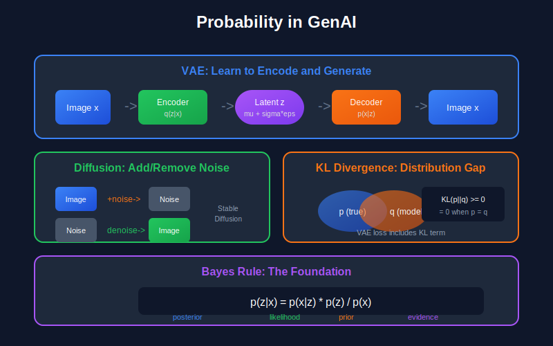

# 🎲 Probability and Statistics for Generative AI

*The mathematical language of generative models*

---

## 📖 Introduction

Generative AI is fundamentally about learning and sampling from probability distributions. Whether it's a GAN implicitly learning a distribution, a VAE explicitly modeling one, or a diffusion model gradually transforming noise into data, probability theory provides the mathematical language to understand these systems.

This guide covers probability and statistics from foundational concepts to advanced topics essential for generative modeling.

---

## 🎯 Where and Why Use Probability & Statistics in Generative AI

### Where It's Used

| Application | Probability Concepts | Example Models |
|-------------|---------------------|----------------|
| **Variational Autoencoders (VAE)** | KL divergence, Gaussian distributions, ELBO, reparameterization trick | VAE, β-VAE, VQ-VAE |
| **Diffusion Models** | Gaussian noise, Markov chains, score functions, Langevin dynamics | DDPM, Stable Diffusion, DALL-E |
| **GANs** | Implicit distributions, Jensen-Shannon divergence, likelihood-free inference | StyleGAN, BigGAN, ProGAN |
| **Autoregressive Models** | Chain rule of probability, conditional distributions | GPT, PixelCNN, WaveNet |
| **Normalizing Flows** | Change of variables, Jacobians, invertible transforms | RealNVP, Glow, Flow++ |
| **Bayesian Deep Learning** | Posterior inference, prior distributions, uncertainty quantification | Bayesian neural networks |
| **Sampling Strategies** | MCMC, importance sampling, rejection sampling | Inference in complex models |
| **Loss Functions** | Cross-entropy, log-likelihood, probabilistic objectives | All generative models |

### Why It's Essential

1. **Core of Generative Modeling:** Generative AI is fundamentally about learning probability distributions $p(x)$ and sampling from them. Every generative model is a probabilistic model.

2. **Understanding Training Objectives:**
   - VAE loss = Reconstruction + KL divergence
   - Diffusion loss = Denoising score matching
   - GAN loss = Minimax game over distributions
   - Without probability, these are just "magic formulas"

3. **Latent Variable Models:** VAEs and diffusion models use latent variables $z$:
   - Marginalizing: $p(x) = \int p(x|z)p(z)dz$
   - Inference: Computing $p(z|x)$ via Bayes' rule
   - Sampling: Reparameterization trick $z = \mu + \sigma \cdot \epsilon$

4. **Evaluating Generative Models:**
   - Log-likelihood / bits-per-dimension
   - FID (based on feature statistics)
   - Perplexity for language models

5. **Classifier-Free Guidance:** Understanding $p(x|y) \propto p(y|x)p(x)$ is essential for guided generation in Stable Diffusion.

### What Happens Without This Knowledge

- ❌ Can't understand why VAE has a KL term in its loss
- ❌ Can't implement or modify diffusion model sampling
- ❌ Can't understand temperature scaling in language models
- ❌ Can't read foundational papers (VAE, DDPM, score matching)
- ❌ Can't implement proper evaluation metrics
- ❌ Can't understand or implement classifier-free guidance

### Real-World Example: Stable Diffusion

Stable Diffusion requires understanding:
1. **Forward process:** Gradually adding Gaussian noise
2. **Reverse process:** Learning $p(x_{t-1}|x_t)$ via neural network
3. **Score function:** $\nabla_x \log p(x)$ for denoising
4. **Conditioning:** $p(x|text)$ via cross-attention
5. **Guidance:** Interpolating conditional and unconditional scores

---

## 📊 Representation Comparison

| Representation | Pros | Cons |
|----------------|------|------|
| **Gaussian** | Tractable, closed-form KL, reparameterizable | Limited expressiveness, unimodal |
| **Mixture Models** | Multimodal, flexible | Intractable marginals, mode collapse |
| **Normalizing Flows** | Exact likelihood, invertible | Architectural constraints, expensive |
| **Energy-Based** | Flexible, unnormalized | Intractable partition function |
| **Implicit (GAN)** | High quality samples | No likelihood, training instability |

---

## 1. Foundations of Probability

### 1.1 Probability Spaces

**Definition (Probability Space):** A probability space $(\Omega, \mathcal{F}, P)$ consists of:
- $\Omega$: Sample space (all possible outcomes)
- $\mathcal{F}$: σ-algebra (collection of events)
- $P$: Probability measure ($P: \mathcal{F} \rightarrow [0,1]$)

**Axioms of Probability (Kolmogorov):**
1. $P(A) \geq 0$ for all $A \in \mathcal{F}$
2. $P(\Omega) = 1$
3. For disjoint $\{A_i\}$: $P\left(\bigcup_i A_i\right) = \sum_i P(A_i)$

### 1.2 Conditional Probability

**Definition:**
$$P(A|B) = \frac{P(A \cap B)}{P(B)}, \quad P(B) > 0$$

**Theorem (Law of Total Probability):** For partition $\{B_i\}$ of $\Omega$:

$$P(A) = \sum_i P(A|B_i)P(B_i)$$

**Theorem (Bayes' Rule):**

$$P(B|A) = \frac{P(A|B)P(B)}{P(A)} = \frac{P(A|B)P(B)}{\sum_j P(A|B_j)P(B_j)}$$

**Relevance to GenAI:** Bayes' rule is the foundation of:
- **VAE inference:** Computing $p(z|x)$ from $p(x|z)$ and $p(z)$
- **Classifier guidance:** $p(x|y) \propto p(y|x)p(x)$
- **Posterior sampling** in all generative models

---

## 2. Random Variables and Distributions

### 2.1 Random Variables

A **random variable** $X: \Omega \rightarrow \mathbb{R}$ is a measurable function from the sample space.

**Cumulative Distribution Function (CDF):**
$$F_X(x) = P(X \leq x)$$

**Probability Mass Function (PMF)** for discrete $X$:
$$p_X(x) = P(X = x)$$

**Probability Density Function (PDF)** for continuous $X$:
$$P(a \leq X \leq b) = \int_a^b f_X(x) \, dx$$

### 2.2 Expectation and Moments

**Expectation:**
$$\mathbb{E}[X] = \int_{-\infty}^{\infty} x \, dF_X(x) = \begin{cases} \sum_x x \cdot p_X(x) & \text{discrete} \\ \int x f_X(x) \, dx & \text{continuous} \end{cases}$$

**Variance:**
$$\text{Var}(X) = \mathbb{E}[(X - \mathbb{E}[X])^2] = \mathbb{E}[X^2] - (\mathbb{E}[X])^2$$

**Moments:**
- $k$-th moment: $\mathbb{E}[X^k]$
- $k$-th central moment: $\mathbb{E}[(X - \mu)^k]$

**Properties:**
1. $\mathbb{E}[aX + bY] = a\mathbb{E}[X] + b\mathbb{E}[Y]$ (linearity)
2. $\text{Var}(aX + b) = a^2 \text{Var}(X)$
3. If $X, Y$ independent: $\mathbb{E}[XY] = \mathbb{E}[X]\mathbb{E}[Y]$

### 2.3 Key Probability Distributions

#### Gaussian (Normal) Distribution

$$\mathcal{N}(x; \mu, \sigma^2) = \frac{1}{\sqrt{2\pi\sigma^2}} \exp\left(-\frac{(x-\mu)^2}{2\sigma^2}\right)$$

**Properties:**
- Closed under linear transformation: $aX + b \sim \mathcal{N}(a\mu + b, a^2\sigma^2)$
- Sum of independent Gaussians: $X + Y \sim \mathcal{N}(\mu_X + \mu_Y, \sigma_X^2 + \sigma_Y^2)$
- Maximum entropy for fixed mean and variance

**Multivariate Gaussian:**

$$\mathcal{N}(x; \mu, \Sigma) = \frac{1}{(2\pi)^{d/2}|\Sigma|^{1/2}} \exp\left(-\frac{1}{2}(x-\mu)^T\Sigma^{-1}(x-\mu)\right)$$

**Relevance to GenAI:** 
- Latent prior in VAEs: $p(z) = \mathcal{N}(0, I)$
- Noise in diffusion models
- Weight initialization

#### Bernoulli and Categorical Distributions

**Bernoulli:** $P(X=1) = p$, $P(X=0) = 1-p$

$$p(x) = p^x (1-p)^{1-x}$$

**Categorical:** For $K$ classes:

$$p(x=k) = \pi_k, \quad \sum_{k=1}^K \pi_k = 1$$

**One-hot encoding:** $p(x|\pi) = \prod_{k=1}^K \pi_k^{x_k}$

#### Exponential Family

A distribution is in the **exponential family** if:

$$p(x|\theta) = h(x) \exp\left(\eta(\theta)^T T(x) - A(\theta)\right)$$

where:
- $T(x)$: Sufficient statistics
- $\eta(\theta)$: Natural parameters
- $A(\theta)$: Log-partition function (normalizer)

**Examples:** Gaussian, Bernoulli, Poisson, Gamma, Beta

**Theorem:** $\nabla_\eta A(\eta) = \mathbb{E}[T(x)]$ and $\nabla^2_\eta A(\eta) = \text{Cov}(T(x))$

---

## 3. Information Theory Concepts

### 3.1 Entropy

**Shannon Entropy:**

$$H(X) = -\sum_x p(x) \log p(x) = \mathbb{E}[-\log p(X)]$$

For continuous distributions (**differential entropy**):

$$h(X) = -\int f(x) \log f(x) \, dx$$

**Properties:**
1. $H(X) \geq 0$ (discrete), but $h(X)$ can be negative
2. $H(X) \leq \log |\mathcal{X}|$ with equality for uniform distribution
3. $H(X, Y) \leq H(X) + H(Y)$ with equality iff independent

**Gaussian has maximum differential entropy:**
For fixed variance $\sigma^2$:

$$h(X) \leq \frac{1}{2}\log(2\pi e \sigma^2)$$

with equality iff $X \sim \mathcal{N}(\mu, \sigma^2)$.

### 3.2 KL Divergence

**Kullback-Leibler Divergence:**

$$D_{KL}(p \| q) = \sum_x p(x) \log \frac{p(x)}{q(x)} = \mathbb{E}_{p}\left[\log \frac{p(X)}{q(X)}\right]$$

**Properties:**
1. $D_{KL}(p \| q) \geq 0$ (Gibbs' inequality)
2. $D_{KL}(p \| q) = 0$ iff $p = q$ almost everywhere
3. **Not symmetric:** $D_{KL}(p \| q) \neq D_{KL}(q \| p)$ in general
4. **Not a metric:** Doesn't satisfy triangle inequality

**Proof of Non-negativity (Gibbs' Inequality):**

$$D_{KL}(p \| q) = -\mathbb{E}_p\left[\log \frac{q(X)}{p(X)}\right] \geq -\log \mathbb{E}_p\left[\frac{q(X)}{p(X)}\right] = -\log 1 = 0$$

using Jensen's inequality and $\mathbb{E}_p[q(X)/p(X)] = \sum_x q(x) = 1$.

---

### 3.2.1 Forward KL vs Reverse KL: Mode-Seeking vs Mass-Covering

This distinction is **critical** for understanding why different generative models behave differently!

<b>📐 Complete Analysis: Mode-Seeking vs Mass-Covering</b>

**Setup:** Let $p$ be the true data distribution (potentially multimodal).
We want to fit $q_\theta$ to $p$.

**Forward KL (Mass-Covering):**
$$\min_\theta D_{KL}(p \| q_\theta) = \min_\theta \mathbb{E}_p\left[\log \frac{p(x)}{q_\theta(x)}\right]$$

**Reverse KL (Mode-Seeking):**
$$\min_\theta D_{KL}(q_\theta \| p) = \min_\theta \mathbb{E}_{q_\theta}\left[\log \frac{q_\theta(x)}{p(x)}\right]$$

---

**Theorem (Forward KL is Mass-Covering):**

Minimizing $D_{KL}(p \| q)$ forces $q$ to cover all modes of $p$.

**Proof:**

$$D_{KL}(p \| q) = \mathbb{E}_p[-\log q(x)] + \text{const}$$

This is the **cross-entropy** of $q$ under $p$.

- If $p(x) > 0$ but $q(x) \to 0$: $-\log q(x) \to \infty$
- Penalty is **infinite** when $q$ doesn't cover $p$'s support

**Consequence:** $q$ must put mass everywhere $p$ does → **mass-covering**

If $p$ is multimodal, $q$ will try to cover all modes, potentially averaging between them.

---

**Theorem (Reverse KL is Mode-Seeking):**

Minimizing $D_{KL}(q \| p)$ causes $q$ to concentrate on modes of $p$.

**Proof:**

$$D_{KL}(q \| p) = \mathbb{E}_q[\log q(x)] - \mathbb{E}_q[\log p(x)]$$

- If $q(x) > 0$ but $p(x) \to 0$: $-\log p(x) \to \infty$
- Penalty is **infinite** when $q$ puts mass where $p$ doesn't

**Consequence:** $q$ avoids regions where $p$ is small → **mode-seeking**

If $p$ is multimodal, $q$ will often collapse to a single mode to avoid the "valley" between modes.

---

**Example: Bimodal $p$**

Let $p = \frac{1}{2}\mathcal{N}(-2, 0.5) + \frac{1}{2}\mathcal{N}(2, 0.5)$ (mixture of two Gaussians)

Fit $q = \mathcal{N}(\mu, \sigma^2)$ (single Gaussian)

| Objective | Optimal $q$ | Behavior |
|-----------|-------------|----------|
| **Forward KL** $D_{KL}(p\|q)$ | $\mu \approx 0$, large $\sigma$ | Covers both modes, blurry |
| **Reverse KL** $D_{KL}(q\|p)$ | $\mu \approx \pm 2$, small $\sigma$ | Locks onto one mode, sharp |

---

**Mathematical Derivation for Gaussian Fit:**

For forward KL with Gaussian $q$:
$$\min_{\mu,\sigma} D_{KL}(p \| \mathcal{N}(\mu, \sigma^2))$$

This matches moments: $\mu^* = \mathbb{E}_p[X]$, $\sigma^{*2} = \text{Var}_p(X)$

For the bimodal example: $\mu^* = 0$, $\sigma^{*2} = 4 + 0.5 = 4.5$

For reverse KL (harder to solve analytically), gradient descent tends to find local optima at $\mu \approx \pm 2$.

**Summary Table:**

| Property | Forward KL $D_{KL}(p\|q)$ | Reverse KL $D_{KL}(q\|p)$ |
|----------|---------------------------|---------------------------|
| **Behavior** | Mass-covering | Mode-seeking |
| **Penalty** | $q=0$ where $p>0$ is fatal | $p=0$ where $q>0$ is fatal |
| **For multimodal $p$** | Covers all modes, may blur | Captures one mode sharply |
| **Used in** | VAE decoder, MLE | VAE encoder, GAN (related) |
| **Risk** | Blurry samples | Mode collapse |

**Applications in GenAI:**

| Model | Objective | Consequence |
|-------|-----------|-------------|
| **VAE** | ELBO $\approx -D_{KL}(q\|p)$ + recon | Encoder is mode-seeking → may miss modes |
| **GAN (original)** | Related to reverse KL | Mode collapse (generator seeks modes) |
| **GAN (non-saturating)** | Closer to reverse KL | Even more mode-seeking |
| **Diffusion Models** | Score matching (different!) | Neither — learns full distribution |

---

**KL Divergence for Gaussians:**

$$D_{KL}(\mathcal{N}(\mu_1, \Sigma_1) \| \mathcal{N}(\mu_2, \Sigma_2)) = \frac{1}{2}\left[\log\frac{|\Sigma_2|}{|\Sigma_1|} - d + \text{tr}(\Sigma_2^{-1}\Sigma_1) + (\mu_2-\mu_1)^T\Sigma_2^{-1}(\mu_2-\mu_1)\right]$$

<b>📐 Complete Derivation of Gaussian KL</b>

**Goal:** Derive $D_{KL}(\mathcal{N}(\mu_1, \Sigma_1) \| \mathcal{N}(\mu_2, \Sigma_2))$

**Step 1: Write out the KL**

$$D_{KL} = \int \mathcal{N}(x; \mu_1, \Sigma_1) \log \frac{\mathcal{N}(x; \mu_1, \Sigma_1)}{\mathcal{N}(x; \mu_2, \Sigma_2)} dx$$

**Step 2: Expand the log ratio**

$$\log \frac{\mathcal{N}_1}{\mathcal{N}_2} = -\frac{1}{2}\log|\Sigma_1| - \frac{1}{2}(x-\mu_1)^T\Sigma_1^{-1}(x-\mu_1) + \frac{1}{2}\log|\Sigma_2| + \frac{1}{2}(x-\mu_2)^T\Sigma_2^{-1}(x-\mu_2)$$

**Step 3: Take expectation under $\mathcal{N}_1$**

$$D_{KL} = \frac{1}{2}\log\frac{|\Sigma_2|}{|\Sigma_1|} - \frac{1}{2}\mathbb{E}_1[(x-\mu_1)^T\Sigma_1^{-1}(x-\mu_1)] + \frac{1}{2}\mathbb{E}_1[(x-\mu_2)^T\Sigma_2^{-1}(x-\mu_2)]$$

**Step 4: Evaluate expectations**

First term: $\mathbb{E}_1[(x-\mu_1)^T\Sigma_1^{-1}(x-\mu_1)] = \text{tr}(\Sigma_1^{-1}\Sigma_1) = d$

Second term, expand $(x-\mu_2) = (x-\mu_1) + (\mu_1-\mu_2)$:
$$\mathbb{E}_1[(x-\mu_2)^T\Sigma_2^{-1}(x-\mu_2)] = \text{tr}(\Sigma_2^{-1}\Sigma_1) + (\mu_1-\mu_2)^T\Sigma_2^{-1}(\mu_1-\mu_2)$$

**Step 5: Combine**

$$D_{KL} = \frac{1}{2}\left[\log\frac{|\Sigma_2|}{|\Sigma_1|} - d + \text{tr}(\Sigma_2^{-1}\Sigma_1) + (\mu_1-\mu_2)^T\Sigma_2^{-1}(\mu_1-\mu_2)\right]$$

$\quad\blacksquare$

**Special case** (VAE with standard normal prior):

$$D_{KL}(\mathcal{N}(\mu, \sigma^2) \| \mathcal{N}(0, 1)) = \frac{1}{2}\left(\mu^2 + \sigma^2 - 1 - \log\sigma^2\right)$$

### 3.3 Mutual Information

$$I(X; Y) = D_{KL}(p(x,y) \| p(x)p(y)) = H(X) + H(Y) - H(X, Y)$$

$$I(X; Y) = H(X) - H(X|Y) = H(Y) - H(Y|X)$$

**Relevance to GenAI:** 
- InfoGAN maximizes $I(c; G(z, c))$ for disentanglement
- Variational bounds involve mutual information

---

## 4. Joint Distributions and Dependence

### 4.1 Joint, Marginal, and Conditional Distributions

**Joint PDF:** $f_{X,Y}(x, y)$

**Marginal PDFs:**
$$f_X(x) = \int f_{X,Y}(x, y) \, dy$$

**Conditional PDF:**
$$f_{Y|X}(y|x) = \frac{f_{X,Y}(x, y)}{f_X(x)}$$

### 4.2 Independence

$X$ and $Y$ are **independent** ($X \perp Y$) if:

$$f_{X,Y}(x, y) = f_X(x) f_Y(y)$$

**Conditional Independence:** $X \perp Y | Z$ if:

$$f_{X,Y|Z}(x, y|z) = f_{X|Z}(x|z) f_{Y|Z}(y|z)$$

### 4.3 Covariance and Correlation

**Covariance:**
$$\text{Cov}(X, Y) = \mathbb{E}[(X - \mu_X)(Y - \mu_Y)] = \mathbb{E}[XY] - \mathbb{E}[X]\mathbb{E}[Y]$$

**Correlation:**
$$\rho(X, Y) = \frac{\text{Cov}(X, Y)}{\sigma_X \sigma_Y}$$

**Note:** Uncorrelated ($\text{Cov}(X,Y)=0$) does not imply independent, but independent implies uncorrelated.

**For multivariate Gaussian:** Uncorrelated $\Leftrightarrow$ Independent

---

## 5. Sampling and Monte Carlo Methods

### 5.1 Inverse Transform Sampling

**Theorem:** If $U \sim \text{Uniform}(0,1)$ and $F$ is a CDF with inverse $F^{-1}$, then:

$$X = F^{-1}(U) \sim F$$

**Proof:** $P(X \leq x) = P(F^{-1}(U) \leq x) = P(U \leq F(x)) = F(x)$

### 5.2 Rejection Sampling

To sample from $p(x)$ using proposal $q(x)$ where $p(x) \leq M \cdot q(x)$:

1. Sample $x \sim q(x)$
2. Sample $u \sim \text{Uniform}(0, 1)$
3. Accept $x$ if $u < \frac{p(x)}{M \cdot q(x)}$, else reject and repeat

**Acceptance rate:** $\frac{1}{M}$

### 5.3 Importance Sampling

To estimate $\mathbb{E}_p[f(X)]$ using samples from $q$:

$$\mathbb{E}_p[f(X)] = \mathbb{E}_q\left[f(X) \frac{p(X)}{q(X)}\right] \approx \frac{1}{N}\sum_{i=1}^N f(x_i) \frac{p(x_i)}{q(x_i)}$$

where $w_i = \frac{p(x_i)}{q(x_i)}$ are **importance weights**.

**Relevance to GenAI:**
- **Importance weighted autoencoders (IWAE)**
- **Training with weighted samples**

### 5.4 Markov Chain Monte Carlo (MCMC)

#### Metropolis-Hastings Algorithm

Target: Sample from $p(x)$
Proposal: $q(x'|x)$

1. Start at $x_0$
2. Propose $x' \sim q(x'|x_t)$
3. Accept with probability $\alpha = \min\left(1, \frac{p(x')q(x_t|x')}{p(x_t)q(x'|x_t)}\right)$
4. Set $x_{t+1} = x'$ if accepted, else $x_{t+1} = x_t$

**Theorem:** The Markov chain has stationary distribution $p(x)$.

**Proof:** Detailed balance condition:
$$p(x)q(x'|x)\alpha(x \to x') = p(x')q(x|x')\alpha(x' \to x)$$

### 5.5 Langevin Dynamics

Sample from $p(x) \propto \exp(-U(x))$ using:

$$x_{t+1} = x_t - \frac{\epsilon}{2}\nabla U(x_t) + \sqrt{\epsilon}\, \eta_t, \quad \eta_t \sim \mathcal{N}(0, I)$$

Equivalently, using score function $\nabla_x \log p(x) = -\nabla U(x)$:

$$x_{t+1} = x_t + \frac{\epsilon}{2}\nabla_x \log p(x_t) + \sqrt{\epsilon}\, \eta_t$$

**Relevance to GenAI:** Foundation of score-based generative models!

---

## 6. Maximum Likelihood Estimation

### 6.1 MLE Principle

Given i.i.d. samples $\{x_1, \ldots, x_n\}$ from $p(x|\theta^*)$, find:

$$\hat{\theta}_{MLE} = \arg\max_\theta \prod_{i=1}^n p(x_i|\theta) = \arg\max_\theta \sum_{i=1}^n \log p(x_i|\theta)$$

### 6.2 Properties of MLE

**Theorem (Consistency):** $\hat{\theta}_{MLE} \xrightarrow{p} \theta^*$ as $n \to \infty$

**Theorem (Asymptotic Normality):**
$$\sqrt{n}(\hat{\theta}_{MLE} - \theta^*) \xrightarrow{d} \mathcal{N}(0, I(\theta^*)^{-1})$$

where $I(\theta)$ is the Fisher Information.

### 6.3 Fisher Information

$$I(\theta) = \mathbb{E}\left[\left(\frac{\partial}{\partial\theta}\log p(X|\theta)\right)^2\right] = -\mathbb{E}\left[\frac{\partial^2}{\partial\theta^2}\log p(X|\theta)\right]$$

**Cramér-Rao Bound:** For any unbiased estimator $\hat{\theta}$:

$$\text{Var}(\hat{\theta}) \geq \frac{1}{nI(\theta)}$$

---

## 7. Latent Variable Models

### 7.1 Marginal Likelihood

For observed $x$ and latent $z$:

$$p(x|\theta) = \int p(x, z|\theta) \, dz = \int p(x|z, \theta) p(z|\theta) \, dz$$

This integral is often intractable, motivating variational inference.

### 7.2 Expectation-Maximization (EM) Algorithm

Maximize $\log p(x|\theta)$ for latent variable models.

**E-step:** Compute posterior $q(z) = p(z|x, \theta^{(t)})$

**M-step:** Maximize expected complete log-likelihood:
$$\theta^{(t+1)} = \arg\max_\theta \mathbb{E}_{q(z)}[\log p(x, z|\theta)]$$

**Theorem:** EM monotonically increases $\log p(x|\theta)$.

**Proof:** Using Jensen's inequality and ELBO:
$$\log p(x|\theta) \geq \mathbb{E}_{q(z)}[\log p(x, z|\theta)] - \mathbb{E}_{q(z)}[\log q(z)]$$

### 7.3 Variational Inference

When $p(z|x)$ is intractable, approximate with $q_\phi(z|x)$.

**Evidence Lower Bound (ELBO):**

$$\log p(x) \geq \mathbb{E}_{q_\phi(z|x)}[\log p_\theta(x|z)] - D_{KL}(q_\phi(z|x) \| p(z))$$

**Derivation:**
$$\log p(x) = \log \int p(x|z)p(z) \, dz = \log \int \frac{p(x|z)p(z)}{q(z|x)} q(z|x) \, dz$$

$$\geq \int q(z|x) \log \frac{p(x|z)p(z)}{q(z|x)} \, dz = \text{ELBO}$$

by Jensen's inequality.

**The gap:**
$$\log p(x) - \text{ELBO} = D_{KL}(q(z|x) \| p(z|x)) \geq 0$$

---

## 8. Probabilistic Graphical Models

### 8.1 Directed Graphical Models (Bayesian Networks)

Joint distribution factorizes according to graph structure:

$$p(x_1, \ldots, x_n) = \prod_{i=1}^n p(x_i | \text{Pa}(x_i))$$

where $\text{Pa}(x_i)$ are parents of node $x_i$.

### 8.2 Undirected Graphical Models (Markov Random Fields)

$$p(x) = \frac{1}{Z} \prod_{c \in \mathcal{C}} \psi_c(x_c)$$

where $\mathcal{C}$ are cliques and $Z = \sum_x \prod_c \psi_c(x_c)$ is the partition function.

### 8.3 Autoregressive Models

$$p(x) = \prod_{i=1}^d p(x_i | x_1, \ldots, x_{i-1})$$

**Relevance:** GPT, PixelCNN, WaveNet

---

## 9. Hypothesis Testing and Generative Model Evaluation

### 9.1 Two-Sample Tests

**Objective:** Given samples from $P$ and $Q$, test $H_0: P = Q$

**Maximum Mean Discrepancy (MMD):**

$$\text{MMD}^2(P, Q) = \mathbb{E}[k(X, X')] - 2\mathbb{E}[k(X, Y)] + \mathbb{E}[k(Y, Y')]$$

where $k$ is a kernel and $X, X' \sim P$, $Y, Y' \sim Q$.

### 9.2 Density Estimation Evaluation

- **Log-likelihood:** $\frac{1}{n}\sum_i \log p(x_i)$ (bits per dimension)
- **Perplexity:** $2^{-\frac{1}{n}\sum_i \log_2 p(x_i)}$

---

## Key Results Summary

| Concept | Formula | Use in GenAI |
|---------|---------|--------------|
| Bayes' Rule | $p(z|x) = \frac{p(x|z)p(z)}{p(x)}$ | Posterior inference |
| KL Divergence | $D_{KL}(p\|q) = \mathbb{E}_p[\log\frac{p}{q}]$ | VAE loss, regularization |
| ELBO | $\log p(x) \geq \mathbb{E}_q[\log p(x|z)] - D_{KL}(q\|p)$ | VAE training |
| Reparameterization | $z = \mu + \sigma \odot \epsilon$ | Gradient estimation |
| Langevin Dynamics | $x_{t+1} = x_t + \frac{\epsilon}{2}\nabla \log p + \sqrt{\epsilon}\eta$ | Score-based models |

---

## References

### Textbooks
1. **Bishop, C. M.** (2006). *Pattern Recognition and Machine Learning*. Springer.
2. **Murphy, K. P.** (2012). *Machine Learning: A Probabilistic Perspective*. MIT Press.
3. **Koller, D., & Friedman, N.** (2009). *Probabilistic Graphical Models*. MIT Press.

### Papers
1. **Kingma, D. P., & Welling, M.** (2014). "Auto-Encoding Variational Bayes." *ICLR*. [arXiv:1312.6114](https://arxiv.org/abs/1312.6114)
2. **Song, Y., & Ermon, S.** (2019). "Generative Modeling by Estimating Gradients of the Data Distribution." *NeurIPS*. [arXiv:1907.05600](https://arxiv.org/abs/1907.05600)
3. **Burda, Y., Grosse, R., & Salakhutdinov, R.** (2016). "Importance Weighted Autoencoders." *ICLR*. [arXiv:1509.00519](https://arxiv.org/abs/1509.00519)

### Online Resources
- [Probability and Statistics Cookbook](http://statistics.zone/)
- [Stanford CS228: Probabilistic Graphical Models](https://ermongroup.github.io/cs228-notes/)

---

## Exercises

1. **Prove** that for independent Gaussians $X \sim \mathcal{N}(\mu_X, \sigma_X^2)$ and $Y \sim \mathcal{N}(\mu_Y, \sigma_Y^2)$, we have $X + Y \sim \mathcal{N}(\mu_X + \mu_Y, \sigma_X^2 + \sigma_Y^2)$.

2. **Derive** the KL divergence between two univariate Gaussians.

3. **Show** that the ELBO equals $\log p(x)$ when $q(z|x) = p(z|x)$.

4. **Implement** Metropolis-Hastings to sample from a 2D Gaussian mixture.

5. **Prove** that maximum entropy distribution with fixed mean and variance is Gaussian.

---

**[← Linear Algebra](../01_linear_algebra/)** | **[Next: Information Theory →](../03_information_theory/)**

