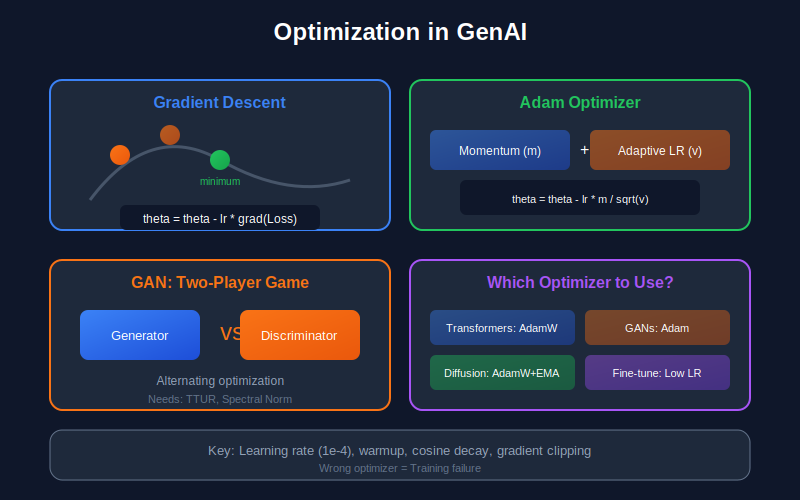

# 🎯 Optimization Methods for Generative AI

*Training algorithms for generative models*

---

## 📖 Introduction

Training generative models is fundamentally an optimization problem. Whether maximizing likelihood in VAEs, playing minimax games in GANs, or minimizing denoising objectives in diffusion models, understanding optimization is crucial for both theory and practice.

This guide covers optimization theory and algorithms essential for modern generative AI, from foundational concepts to advanced techniques.

---

## 🎯 Where and Why Use Optimization Methods in Generative AI

### Where It's Used

| Application | Optimization Concepts | Example Models |
|-------------|----------------------|----------------|
| **All Model Training** | SGD, Adam, AdamW, learning rate schedules | Every neural network |
| **GAN Training** | Minimax optimization, two-timescale updates, spectral normalization | GANs, StyleGAN, BigGAN |
| **Diffusion Models** | EMA (Exponential Moving Average), gradient clipping | DDPM, Stable Diffusion |
| **Large Language Models** | AdamW, warmup schedules, gradient accumulation | GPT, LLaMA, Mistral |
| **Fine-tuning** | Low learning rates, layer-wise LR decay, LoRA | All transfer learning |
| **Hyperparameter Search** | Bilevel optimization, meta-learning | NAS, hyperparameter tuning |
| **Constrained Generation** | Projected gradient, Lagrangian methods | Controlled generation |
| **Model Compression** | Pruning optimization, quantization-aware training | Efficient deployment |

### Why It's Essential

1. **Training Is Optimization:**
   - Finding model parameters that minimize loss
   - Generative models often have complex, non-convex losses
   - Wrong optimizer choice = failed training

2. **GAN-Specific Challenges:**
   - Two-player games don't converge like standard optimization
   - Requires special techniques: TTUR, spectral normalization, gradient penalties
   - Understanding game theory aspects of optimization

3. **Scale Matters:**
   - Large models need: gradient clipping, warmup, proper weight decay
   - Batch size affects optimization dynamics
   - Learning rate scaling rules for distributed training

4. **Debugging Training:**
   - Loss not decreasing → learning rate issues, optimizer choice
   - Unstable training → gradient explosion, need clipping
   - Mode collapse → discriminator optimization issues

5. **Efficient Training:**
   - Mixed precision training (FP16/BF16)
   - Gradient checkpointing for memory
   - Distributed optimization strategies

### What Happens Without This Knowledge

- ❌ Can't train models effectively (wrong LR, wrong optimizer)
- ❌ Can't debug training failures (NaN loss, divergence)
- ❌ Can't train GANs (they require special optimization)
- ❌ Can't scale to large models (memory, distributed training)
- ❌ Can't fine-tune pretrained models properly
- ❌ Can't understand why AdamW beats Adam for transformers

### Practical Defaults for Generative AI

| Model Type | Optimizer | Learning Rate | Key Techniques |
|------------|-----------|---------------|----------------|
| **Transformers/LLMs** | AdamW | 1e-4 to 3e-4 | Warmup, cosine decay, weight decay |
| **GANs** | Adam (β₁=0, β₂=0.99) | 1e-4 to 2e-4 | TTUR, spectral norm, gradient penalty |
| **Diffusion Models** | AdamW | 1e-4 | EMA (0.9999), gradient clipping |
| **VAEs** | Adam | 1e-3 to 1e-4 | KL annealing, warmup |
| **Fine-tuning** | AdamW | 1e-5 to 5e-5 | Layer-wise LR decay, small weight decay |

---

## 📊 Representation Comparison

| Representation | Pros | Cons |
|----------------|------|------|
| **SGD** | Simple, good generalization | Slow, sensitive to LR |
| **Momentum** | Faster convergence, escapes local minima | Extra hyperparameter |
| **Adam** | Adaptive LR, fast convergence | May not generalize well |
| **AdamW** | Proper weight decay, good for transformers | More hyperparameters |
| **LBFGS** | Fast for small problems, second-order | Memory intensive, batch only |

---

## 1. Fundamentals of Optimization

### 1.1 Problem Formulation

**Unconstrained Optimization:**
$$\min_{x \in \mathbb{R}^n} f(x)$$

**Constrained Optimization:**
$$\min_{x} f(x) \quad \text{subject to } g_i(x) \leq 0, \, h_j(x) = 0$$

### 1.2 Optimality Conditions

**First-Order Necessary Condition:**
At a local minimum $x^*$: $\nabla f(x^*) = 0$

**Second-Order Necessary Condition:**
At a local minimum $x^*$: $\nabla^2 f(x^*) \succeq 0$ (positive semi-definite)

**Second-Order Sufficient Condition:**
If $\nabla f(x^*) = 0$ and $\nabla^2 f(x^*) \succ 0$, then $x^*$ is a strict local minimum.

### 1.3 Convexity

**Definition (Convex Set):** $C$ is convex if for all $x, y \in C$ and $\theta \in [0, 1]$:
$$\theta x + (1-\theta)y \in C$$

**Definition (Convex Function):** $f$ is convex if $\text{dom}(f)$ is convex and:
$$f(\theta x + (1-\theta)y) \leq \theta f(x) + (1-\theta)f(y)$$

**Equivalent Characterizations:**
1. First-order: $f(y) \geq f(x) + \nabla f(x)^T(y - x)$
2. Second-order: $\nabla^2 f(x) \succeq 0$ for all $x$

**Key Property:** For convex $f$, any local minimum is a global minimum.

**Relevance to GenAI:** Most deep learning objectives are non-convex, but understanding convexity helps analyze convergence and design better algorithms.

---

## 2. Gradient Descent

### 2.1 Basic Algorithm

$$x_{t+1} = x_t - \eta \nabla f(x_t)$$

where $\eta > 0$ is the learning rate (step size).

### 2.2 Convergence Analysis

**Assumption:** $f$ is $L$-smooth: $\|\nabla f(x) - \nabla f(y)\| \leq L\|x - y\|$

Equivalently: $f(y) \leq f(x) + \nabla f(x)^T(y-x) + \frac{L}{2}\|y-x\|^2$

**Theorem (Convergence for Smooth Functions):**
With $\eta = \frac{1}{L}$, gradient descent satisfies:
$$f(x_T) - f(x^*) \leq \frac{L\|x_0 - x^*\|^2}{2T}$$

**Proof Sketch:**
Using smoothness: $f(x_{t+1}) \leq f(x_t) - \frac{1}{2L}\|\nabla f(x_t)\|^2$

Telescoping and using convexity gives the result.

**Theorem (Strongly Convex Case):**
If $f$ is also $\mu$-strongly convex ($\nabla^2 f \succeq \mu I$):
$$\|x_T - x^*\|^2 \leq \left(1 - \frac{\mu}{L}\right)^T \|x_0 - x^*\|^2$$

The condition number $\kappa = L/\mu$ determines convergence rate.

### 2.3 Learning Rate Schedules

**Constant:** $\eta_t = \eta_0$

**Step Decay:** $\eta_t = \eta_0 \cdot \gamma^{\lfloor t/s \rfloor}$

**Exponential Decay:** $\eta_t = \eta_0 \cdot e^{-\lambda t}$

**Cosine Annealing:**
$$\eta_t = \eta_{min} + \frac{1}{2}(\eta_{max} - \eta_{min})\left(1 + \cos\left(\frac{t}{T}\pi\right)\right)$$

**Warm Restarts:** Combine cosine annealing with periodic resets.

---

## 3. Stochastic Gradient Descent

### 3.1 Motivation

For objective $f(x) = \frac{1}{n}\sum_{i=1}^n f_i(x)$ (empirical risk):

Full gradient: $O(n)$ per iteration
Stochastic gradient: $O(1)$ per iteration using single sample

### 3.2 SGD Algorithm

$$x_{t+1} = x_t - \eta_t g_t$$

where $g_t = \nabla f_{i_t}(x_t)$ for randomly sampled $i_t$.

**Property:** $\mathbb{E}[g_t | x_t] = \nabla f(x_t)$ (unbiased)

### 3.3 Convergence Analysis

**Assumptions:**
1. Unbiased gradient: $\mathbb{E}[g_t] = \nabla f(x_t)$
2. Bounded variance: $\mathbb{E}[\|g_t - \nabla f(x_t)\|^2] \leq \sigma^2$

**Theorem (Convex Case):**
With $\eta_t = \frac{c}{\sqrt{t}}$:
$$\mathbb{E}[f(\bar{x}_T)] - f(x^*) = O\left(\frac{1}{\sqrt{T}}\right)$$

where $\bar{x}_T$ is an average of iterates.

**Theorem (Strongly Convex Case):**
With $\eta_t = \frac{1}{\mu t}$:
$$\mathbb{E}[f(\bar{x}_T)] - f(x^*) = O\left(\frac{1}{T}\right)$$

### 3.4 Mini-Batch SGD

$$g_t = \frac{1}{|B_t|}\sum_{i \in B_t} \nabla f_i(x_t)$$

**Variance Reduction:** $\text{Var}(g_t) = \frac{\sigma^2}{|B_t|}$

Larger batch size reduces variance but increases computation per step.

---

## 4. Momentum Methods

### 4.1 Classical Momentum

$$v_{t+1} = \beta v_t + \nabla f(x_t)$$
$$x_{t+1} = x_t - \eta v_{t+1}$$

**Physical Interpretation:** Accumulates velocity, helps escape shallow local minima.

**Typical values:** $\beta = 0.9$

### 4.2 Nesterov Accelerated Gradient (NAG)

$$v_{t+1} = \beta v_t + \nabla f(x_t - \eta\beta v_t)$$
$$x_{t+1} = x_t - \eta v_{t+1}$$

**Key insight:** Look ahead before computing gradient.

**Theorem:** For $L$-smooth convex $f$, NAG achieves:
$$f(x_T) - f(x^*) = O\left(\frac{1}{T^2}\right)$$

compared to $O(1/T)$ for vanilla gradient descent. This is optimal!

### 4.3 Polyak's Heavy Ball

$$x_{t+1} = x_t - \eta \nabla f(x_t) + \beta(x_t - x_{t-1})$$

Equivalent to momentum formulation with different parameterization.

---

## 5. Adaptive Learning Rate Methods

### 5.1 AdaGrad

Accumulate squared gradients:
$$G_t = \sum_{s=1}^t g_s \odot g_s$$

Update:
$$x_{t+1} = x_t - \frac{\eta}{\sqrt{G_t + \epsilon}} \odot g_t$$

**Properties:**
- Per-parameter learning rates
- Works well for sparse gradients
- Learning rate monotonically decreases (can be too aggressive)

### 5.2 RMSprop

Exponential moving average of squared gradients:
$$v_t = \beta v_{t-1} + (1-\beta) g_t^2$$
$$x_{t+1} = x_t - \frac{\eta}{\sqrt{v_t + \epsilon}} g_t$$

**Typical values:** $\beta = 0.9$, $\epsilon = 10^{-8}$

### 5.3 Adam (Adaptive Moment Estimation)

Combines momentum and RMSprop:

$$m_t = \beta_1 m_{t-1} + (1-\beta_1) g_t \quad \text{(first moment)}$$
$$v_t = \beta_2 v_{t-1} + (1-\beta_2) g_t^2 \quad \text{(second moment)}$$

**Bias Correction:**
$$\hat{m}_t = \frac{m_t}{1-\beta_1^t}, \quad \hat{v}_t = \frac{v_t}{1-\beta_2^t}$$

**Update:**
$$x_{t+1} = x_t - \eta \frac{\hat{m}_t}{\sqrt{\hat{v}_t} + \epsilon}$$

**Default hyperparameters:** $\beta_1 = 0.9$, $\beta_2 = 0.999$, $\epsilon = 10^{-8}$

**Why Bias Correction?**
At $t=1$: $m_1 = (1-\beta_1) g_1$, which is biased towards zero.
$\hat{m}_1 = \frac{(1-\beta_1) g_1}{1-\beta_1} = g_1$ (corrected)

### 5.4 AdamW (Weight Decay)

Decoupled weight decay:
$$x_{t+1} = x_t - \eta\left(\frac{\hat{m}_t}{\sqrt{\hat{v}_t} + \epsilon} + \lambda x_t\right)$$

**Why not L2 regularization?**
L2 regularization $\|\theta\|^2$ becomes part of gradient, interacting badly with adaptive methods.
Weight decay directly shrinks weights, independent of gradient scaling.

### 5.5 Comparison

| Method | Adaptive LR | Momentum | Bias Correction |
|--------|-------------|----------|-----------------|
| SGD | ✗ | ✗ | N/A |
| SGD+Momentum | ✗ | ✓ | N/A |
| AdaGrad | ✓ | ✗ | N/A |
| RMSprop | ✓ | ✗ | ✗ |
| Adam | ✓ | ✓ | ✓ |
| AdamW | ✓ | ✓ | ✓ |

---

## 6. Second-Order Methods

### 6.1 Newton's Method

$$x_{t+1} = x_t - [\nabla^2 f(x_t)]^{-1} \nabla f(x_t)$$

**Advantages:** Quadratic convergence near optimum
**Disadvantages:** $O(n^3)$ per iteration, requires positive definite Hessian

### 6.2 Quasi-Newton Methods (BFGS, L-BFGS)

Approximate Hessian inverse $H_t \approx [\nabla^2 f(x_t)]^{-1}$:

$$x_{t+1} = x_t - \eta H_t \nabla f(x_t)$$

**BFGS Update:**
$$H_{t+1} = \left(I - \frac{s_t y_t^T}{y_t^T s_t}\right) H_t \left(I - \frac{y_t s_t^T}{y_t^T s_t}\right) + \frac{s_t s_t^T}{y_t^T s_t}$$

where $s_t = x_{t+1} - x_t$ and $y_t = \nabla f(x_{t+1}) - \nabla f(x_t)$.

**L-BFGS:** Store only last $m$ pairs $(s_t, y_t)$, compute $H_t \nabla f$ implicitly.

### 6.3 Natural Gradient

For probabilistic models, use Fisher information instead of Hessian:

$$\theta_{t+1} = \theta_t - \eta F(\theta_t)^{-1} \nabla_\theta \mathcal{L}$$

where $F(\theta) = \mathbb{E}[\nabla \log p(x|\theta) \nabla \log p(x|\theta)^T]$

**K-FAC (Kronecker-Factored Approximate Curvature):**
Approximate Fisher as Kronecker product for efficiency.

---

## 7. Optimization for GANs

### 7.1 The Minimax Game

$$\min_G \max_D V(D, G) = \mathbb{E}_{x \sim p_{data}}[\log D(x)] + \mathbb{E}_{z \sim p_z}[\log(1 - D(G(z)))]$$

**Alternating Optimization:**
1. Update $D$ to maximize $V$ (holding $G$ fixed)
2. Update $G$ to minimize $V$ (holding $D$ fixed)

### 7.2 Non-Saturating GAN Loss

Original $G$ loss: $\mathbb{E}[\log(1 - D(G(z)))]$ has vanishing gradients early.

**Non-saturating alternative:** $-\mathbb{E}[\log D(G(z))]$

Same fixed point but better gradients.

### 7.3 Convergence Issues

**Two-player games** don't have simple convergence guarantees:
- May oscillate rather than converge
- Local Nash equilibria may not exist
- Global Nash equilibrium doesn't imply local stability

**Example (Failure of Gradient Descent):**
$$\min_x \max_y xy$$

Gradient descent: $x_{t+1} = x_t - \eta y_t$, $y_{t+1} = y_t + \eta x_t$

This rotates around $(0, 0)$ without converging!

### 7.4 Techniques for GAN Optimization

**Two-Timescale Update Rule (TTUR):**
Use different learning rates: slower for discriminator.

$$\theta_G \leftarrow \theta_G - \eta_G \nabla_G \mathcal{L}_G$$
$$\theta_D \leftarrow \theta_D - \eta_D \nabla_D \mathcal{L}_D$$

with $\eta_D < \eta_G$.

**Spectral Normalization:**
Constrain discriminator Lipschitz constant by normalizing weights:
$$\bar{W} = \frac{W}{\sigma(W)}$$
where $\sigma(W)$ is the largest singular value.

**Gradient Penalty (WGAN-GP):**
Add penalty $\lambda \mathbb{E}[(\|\nabla_{\hat{x}} D(\hat{x})\|_2 - 1)^2]$ where $\hat{x}$ is interpolation.

---

## 8. Variance Reduction Techniques

### 8.1 SVRG (Stochastic Variance Reduced Gradient)

Periodically compute full gradient $\tilde{\mu} = \nabla f(\tilde{x})$, then:

$$g_t = \nabla f_i(x_t) - \nabla f_i(\tilde{x}) + \tilde{\mu}$$

**Property:** As $x_t \to \tilde{x}$, variance of $g_t \to 0$.

**Convergence:** Linear rate for strongly convex objectives.

### 8.2 SAGA

Maintain gradient table $\{g_i\}$:

$$g_t = \nabla f_{i_t}(x_t) - g_{i_t} + \frac{1}{n}\sum_j g_j$$
$$g_{i_t} \leftarrow \nabla f_{i_t}(x_t)$$

No periodic full gradient computation needed.

---

## 9. Constrained Optimization

### 9.1 Lagrangian Methods

For $\min_x f(x)$ s.t. $g_i(x) \leq 0$, $h_j(x) = 0$:

**Lagrangian:**
$$L(x, \lambda, \nu) = f(x) + \sum_i \lambda_i g_i(x) + \sum_j \nu_j h_j(x)$$

**KKT Conditions (Necessary for optimality):**
1. Stationarity: $\nabla_x L = 0$
2. Primal feasibility: $g_i(x) \leq 0$, $h_j(x) = 0$
3. Dual feasibility: $\lambda_i \geq 0$
4. Complementary slackness: $\lambda_i g_i(x) = 0$

### 9.2 Projected Gradient Descent

$$x_{t+1} = \text{Proj}_C(x_t - \eta \nabla f(x_t))$$

where $\text{Proj}_C(y) = \arg\min_{x \in C} \|x - y\|^2$.

**Examples:**
- Box constraints $[a, b]$: Clip to bounds
- Simplex: Softmax projection
- Norm ball: Normalize if too large

### 9.3 Augmented Lagrangian / ADMM

**Augmented Lagrangian:**
$$L_\rho(x, \lambda) = f(x) + \lambda^T g(x) + \frac{\rho}{2}\|g(x)\|^2$$

**ADMM** for $\min f(x) + h(z)$ s.t. $Ax + Bz = c$:

$$x_{t+1} = \arg\min_x L_\rho(x, z_t, \lambda_t)$$
$$z_{t+1} = \arg\min_z L_\rho(x_{t+1}, z, \lambda_t)$$
$$\lambda_{t+1} = \lambda_t + \rho(Ax_{t+1} + Bz_{t+1} - c)$$

---

## 10. Optimization in Deep Learning Practice

### 10.1 Gradient Clipping

Prevent exploding gradients:

**By Value:** $g \leftarrow \text{clip}(g, -\tau, \tau)$

**By Norm:** $g \leftarrow g \cdot \min\left(1, \frac{\tau}{\|g\|}\right)$

### 10.2 Batch Normalization

Normalize layer inputs: $\hat{x} = \frac{x - \mu_B}{\sqrt{\sigma_B^2 + \epsilon}}$

**Effect on optimization:**
- Reduces internal covariate shift
- Allows higher learning rates
- Smooths loss landscape

### 10.3 Layer Normalization

Normalize across features instead of batch:
$$\hat{x}_i = \frac{x_i - \mu_i}{\sqrt{\sigma_i^2 + \epsilon}}$$

Used in transformers where batch statistics are unstable.

### 10.4 Initialization

**Xavier/Glorot:** $W \sim \mathcal{N}\left(0, \frac{2}{n_{in} + n_{out}}\right)$

**He/Kaiming:** $W \sim \mathcal{N}\left(0, \frac{2}{n_{in}}\right)$ (for ReLU)

**Goal:** Preserve variance of activations through layers.

### 10.5 Learning Rate Warmup

Gradually increase learning rate for first few iterations:
$$\eta_t = \frac{t}{T_{warmup}} \eta_{max}$$ for $t < T_{warmup}$

**Why?** Adam statistics $m_t$, $v_t$ are unreliable early; large steps can be harmful.

---

## 11. Advanced Topics

### 11.1 Implicit Differentiation

For $x^*(\theta) = \arg\min_x f(x, \theta)$, compute $\frac{dx^*}{d\theta}$:

At optimum: $\nabla_x f(x^*, \theta) = 0$

Differentiate: $\nabla^2_{xx} f \cdot \frac{dx^*}{d\theta} + \nabla^2_{x\theta} f = 0$

$$\frac{dx^*}{d\theta} = -(\nabla^2_{xx} f)^{-1} \nabla^2_{x\theta} f$$

**Relevance:** Meta-learning, hyperparameter optimization

### 11.2 Bilevel Optimization

$$\min_\phi \mathcal{L}_{val}(\theta^*(\phi), \phi) \quad \text{s.t. } \theta^*(\phi) = \arg\min_\theta \mathcal{L}_{train}(\theta, \phi)$$

**Applications:**
- Neural architecture search
- Hyperparameter optimization
- Meta-learning

### 11.3 Riemannian Optimization

Optimize over manifolds (e.g., orthogonal matrices, positive definite matrices):

**Riemannian gradient descent:**
$$x_{t+1} = \text{Exp}_{x_t}(-\eta \text{grad} f(x_t))$$

where $\text{Exp}$ is the exponential map and $\text{grad}$ is the Riemannian gradient.

---

## Key Algorithms Summary

| Algorithm | Update Rule | Best For |
|-----------|-------------|----------|
| SGD | $x - \eta g$ | Simple baselines |
| Momentum | $x - \eta(g + \beta v)$ | Vision models |
| Adam | $x - \eta \hat{m}/\sqrt{\hat{v}}$ | Transformers, general |
| AdamW | Adam + weight decay | Language models |
| LAMB | Adam + layer-wise scaling | Large batch training |

---

## References

### Foundational
1. **Nesterov, Y.** (1983). "A Method of Solving a Convex Programming Problem with Convergence Rate $O(1/k^2)$."
2. **Kingma, D. P., & Ba, J.** (2015). "Adam: A Method for Stochastic Optimization." *ICLR*. [arXiv:1412.6980](https://arxiv.org/abs/1412.6980)
3. **Loshchilov, I., & Hutter, F.** (2019). "Decoupled Weight Decay Regularization." *ICLR*. [arXiv:1711.05101](https://arxiv.org/abs/1711.05101)

### Deep Learning Optimization
4. **Bottou, L., Curtis, F. E., & Nocedal, J.** (2018). "Optimization Methods for Large-Scale Machine Learning." *SIAM Review*. [arXiv:1606.04838](https://arxiv.org/abs/1606.04838)
5. **Zhang, G., et al.** (2020). "Why Gradient Clipping Accelerates Training: A Theoretical Justification for Adaptivity." *ICLR*. [arXiv:1905.11881](https://arxiv.org/abs/1905.11881)

### GAN Optimization
6. **Mescheder, L., Geiger, A., & Nowozin, S.** (2018). "Which Training Methods for GANs do actually Converge?" *ICML*. [arXiv:1801.04406](https://arxiv.org/abs/1801.04406)
7. **Heusel, M., et al.** (2017). "GANs Trained by a Two Time-Scale Update Rule Converge to a Local Nash Equilibrium." *NeurIPS*. [arXiv:1706.08500](https://arxiv.org/abs/1706.08500)

### Textbooks
8. **Boyd, S., & Vandenberghe, L.** (2004). *Convex Optimization*. Cambridge University Press. [Free online](https://web.stanford.edu/~boyd/cvxbook/)
9. **Nocedal, J., & Wright, S.** (2006). *Numerical Optimization* (2nd ed.). Springer.

---

## Exercises

1. **Prove** that gradient descent with step size $\eta = 1/L$ decreases the function value by at least $\frac{1}{2L}\|\nabla f(x)\|^2$ per iteration.

2. **Derive** the bias correction formulas for Adam.

3. **Show** that simultaneous gradient descent on $\min_x \max_y xy$ results in circular motion.

4. **Implement** gradient descent with momentum and compare to vanilla GD on a 2D quadratic.

5. **Prove** that for strongly convex $f$, gradient descent converges linearly: $\|x_t - x^*\| \leq (1-\mu/L)^t \|x_0 - x^*\|$.

---

**[← Information Theory](../03_information_theory/)** | **[Next: PyTorch Basics →](../05_pytorch_basics/)**

