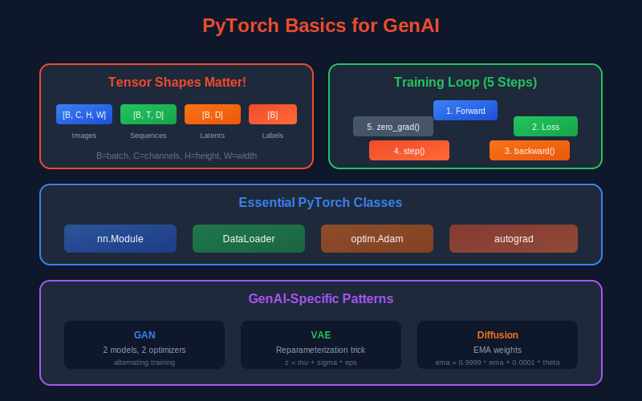
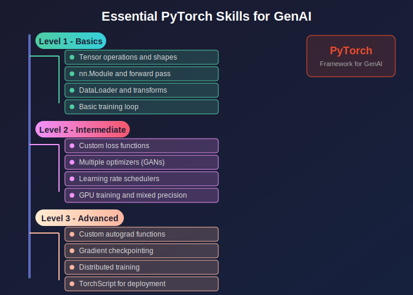

# 🔥 PyTorch Basics for Generative AI

<div align="center">


*The essential framework for building Generative AI models*

</div>

---

## 📖 Introduction

> **PyTorch has become the dominant framework for generative AI research and development.** Its dynamic computation graph, intuitive API, and strong ecosystem make it ideal for implementing and experimenting with generative models.

This guide covers PyTorch fundamentals essential for generative AI, focusing on concepts rather than exhaustive API coverage.

<div align="center">



</div>

---

## 🎯 Where and Why Use PyTorch in Generative AI

### 📍 Where It's Used

| Application | PyTorch Features | Example Implementations |
|:------------|:-----------------|:-----------------------|
| 🧠 **Model Implementation** | nn.Module, custom layers, forward pass | All generative models |
| 🔄 **Training Loops** | Autograd, optimizers, loss functions | Training any model |
| 📦 **Data Loading** | Dataset, DataLoader, transforms | Preprocessing pipelines |
| ⚡ **GPU Acceleration** | CUDA tensors, multi-GPU, mixed precision | Large-scale training |
| 🔬 **Research Prototyping** | Dynamic graphs, easy debugging | New model architectures |
| 🌊 **Diffusion Models** | U-Net, attention, noise scheduling | Stable Diffusion, DDPM |
| 🎭 **GANs** | Generator/Discriminator modules | StyleGAN, BigGAN |
| 🤖 **Transformers** | Attention mechanisms, positional encoding | GPT, Vision Transformers |

### 💡 Why It's Essential

<table>
<tr>
<td width="50%">

**🏭 Industry Standard**
- Most GenAI research uses PyTorch (>80% of papers)
- Hugging Face Diffusers, Transformers built on PyTorch
- Stable Diffusion, LLaMA, Mistral all use PyTorch

</td>
<td width="50%">

**🔧 Dynamic Computation Graphs**
- Debug with standard Python (print, pdb)
- Variable-length sequences, conditional execution
- Essential for complex generative architectures

</td>
</tr>
<tr>
<td width="50%">

**🎨 Implementing GenAI Requires**
- Custom loss functions (perceptual, adversarial)
- Complex forward passes (U-Net skip connections)
- Gradient manipulation (clipping, accumulation)

</td>
<td width="50%">

**📚 Rich Ecosystem**
- Hugging Face: pretrained models, datasets
- torchvision: image transforms, pretrained CNNs
- PyTorch Lightning: training boilerplate reduction

</td>
</tr>
</table>

### ⚠️ What Happens Without This Knowledge

> 🚫 Can't implement or modify generative models  
> 🚫 Can't use pretrained models from Hugging Face effectively  
> 🚫 Can't debug training issues (shape errors, gradient problems)  
> 🚫 Can't customize architectures for your use case  
> 🚫 Can't optimize training for speed or memory  

---

## 🗺️ PyTorch Patterns in Generative AI

| Pattern | Used In | Key PyTorch Features |
|:--------|:--------|:--------------------|
| 🎭 **Generator-Discriminator** | GANs | Separate nn.Module, alternating optimization |
| 🔄 **Encoder-Decoder** | VAE, U-Net | Sequential layers, skip connections |
| 👁️ **Attention Blocks** | Transformers, Diffusion | Custom modules, einsum operations |
| 📊 **EMA** | Diffusion Models | Manual parameter updates, no_grad |
| 💾 **Gradient Checkpointing** | Large Models | torch.utils.checkpoint |

### 📈 Essential PyTorch Skills for GenAI

<div align="center">



</div>

---

## 📊 Representation Comparison

| Representation | Pros | Cons |
|----------------|------|------|
| **torch.Tensor** | GPU support, autograd, flexible | Memory overhead for small data |
| **nn.Module** | Organized, stateful, composable | Boilerplate for simple ops |
| **nn.Sequential** | Quick prototyping, clean code | No skip connections |
| **nn.ModuleList** | Dynamic architectures | Manual forward needed |
| **Functional API** | Stateless, flexible | No parameter management |

---

## 📚 1. Tensors: The Foundation

> 💡 **Tensors are multi-dimensional arrays** — the fundamental data structure in PyTorch.

### 1.1 Tensor Basics

```python
import torch

# 📦 Creation
x = torch.tensor([[1, 2], [3, 4]])           # From data
x = torch.zeros(3, 4)                         # Zeros
x = torch.ones(3, 4)                          # Ones
x = torch.randn(3, 4)                         # Standard normal
x = torch.empty(3, 4)                         # Uninitialized

# 🔍 Properties
x.shape        # torch.Size([3, 4])
x.dtype        # torch.float32
x.device       # cpu or cuda:0
x.requires_grad # False (default)
```

### 1.2 Tensor Operations

**Mathematical Operations:**

```python
# ➕ Element-wise
y = x + 1         # Addition
y = x * 2         # Multiplication
y = torch.exp(x)  # Exponential
y = torch.log(x)  # Logarithm

# ✖️ Matrix operations
y = x @ w         # Matrix multiplication
y = torch.mm(x, w)  # Explicit matmul
y = x.T           # Transpose
```

**Broadcasting:**

```python
x = torch.randn(3, 4)
y = torch.randn(4)    # Shape (4,)
z = x + y             # y broadcast to (3, 4)
```

### 1.3 Indexing and Slicing

```python
x = torch.randn(3, 4, 5)

# 📍 Basic indexing
x[0]          # First element along dim 0
x[:, 1]       # Second element along dim 1
x[..., -1]    # Last element along last dim

# 🎯 Advanced indexing
idx = torch.tensor([0, 2])
x[idx]        # Select indices 0 and 2
x[x > 0]      # Boolean indexing
```

### 1.4 Reshaping Operations

```python
x = torch.randn(2, 3, 4)

x.view(6, 4)           # Reshape (contiguous required)
x.reshape(6, 4)        # Reshape (handles non-contiguous)
x.permute(2, 0, 1)     # Reorder dimensions → (4, 2, 3)
x.transpose(0, 1)      # Swap two dimensions
x.unsqueeze(0)         # Add dimension → (1, 2, 3, 4)
x.squeeze()            # Remove size-1 dimensions
x.flatten()            # Flatten to 1D
```

---

## ⚡ 2. Automatic Differentiation

> 💡 **PyTorch builds a dynamic computational graph** as operations are executed.

### 2.1 The Computational Graph

```python
x = torch.tensor([2.0], requires_grad=True)
y = x ** 2 + 3 * x + 1  # y = x² + 3x + 1

# 🔙 Backward pass
y.backward()

# 📐 Gradient: dy/dx = 2x + 3 = 7 at x=2
print(x.grad)  # tensor([7.])
```

### 2.2 Gradient Computation

**Chain Rule in Action:**

```python
x = torch.randn(3, requires_grad=True)
y = x.sum() ** 2

y.backward()
# dy/dx_i = 2 * sum(x) for each i
```

### 2.3 Controlling Gradient Computation

```python
# 🚫 Disable gradients
with torch.no_grad():
    y = x * 2  # No graph built

# ✂️ Detach from graph
y = x.detach()  # y has no gradient history

# 🛑 Stop gradient flow
y = x.clone().detach()
```

### 2.4 Custom Autograd Functions

```python
class MyReLU(torch.autograd.Function):
    @staticmethod
    def forward(ctx, x):
        ctx.save_for_backward(x)
        return x.clamp(min=0)
    
    @staticmethod
    def backward(ctx, grad_output):
        x, = ctx.saved_tensors
        grad_input = grad_output.clone()
        grad_input[x < 0] = 0
        return grad_input

# Usage
y = MyReLU.apply(x)
```

---

## 🏗️ 3. Neural Network Modules

### 3.1 The nn.Module Class

> 💡 **All neural networks inherit from `nn.Module`**

```python
import torch.nn as nn

class SimpleNet(nn.Module):
    def __init__(self, input_dim, hidden_dim, output_dim):
        super().__init__()
        self.fc1 = nn.Linear(input_dim, hidden_dim)
        self.fc2 = nn.Linear(hidden_dim, output_dim)
        self.relu = nn.ReLU()
    
    def forward(self, x):
        x = self.relu(self.fc1(x))
        x = self.fc2(x)
        return x
```

### 3.2 Common Layers

<table>
<tr>
<td>

**📏 Linear Layers**
```python
nn.Linear(in_features, out_features, bias=True)
```

</td>
<td>

**🖼️ Convolutional Layers**
```python
nn.Conv2d(in_ch, out_ch, kernel_size, stride=1, padding=0)
nn.ConvTranspose2d(...)  # Transposed convolution
```

</td>
</tr>
<tr>
<td>

**📊 Normalization**
```python
nn.BatchNorm2d(num_features)
nn.LayerNorm(normalized_shape)
nn.GroupNorm(num_groups, num_channels)
```

</td>
<td>

**⚡ Activation Functions**
```python
nn.ReLU()
nn.LeakyReLU(negative_slope=0.01)
nn.GELU()
nn.Sigmoid()
nn.Tanh()
```

</td>
</tr>
</table>

### 3.3 Sequential and ModuleList

```python
# 📦 Sequential
model = nn.Sequential(
    nn.Linear(784, 256),
    nn.ReLU(),
    nn.Linear(256, 10)
)

# 📋 ModuleList (for dynamic architectures)
class DynamicNet(nn.Module):
    def __init__(self, num_layers):
        super().__init__()
        self.layers = nn.ModuleList([
            nn.Linear(64, 64) for _ in range(num_layers)
        ])
    
    def forward(self, x):
        for layer in self.layers:
            x = torch.relu(layer(x))
        return x
```

### 3.4 Parameter Management

```python
model = SimpleNet(784, 256, 10)

# 🔍 Access parameters
for name, param in model.named_parameters():
    print(name, param.shape)

# 📊 Count parameters
total = sum(p.numel() for p in model.parameters())
trainable = sum(p.numel() for p in model.parameters() if p.requires_grad)

# 🧊 Freeze parameters
for param in model.fc1.parameters():
    param.requires_grad = False
```

---

## 🔄 4. Training Loop

### 4.1 Basic Training Loop

```python
model = SimpleNet(784, 256, 10)
optimizer = torch.optim.Adam(model.parameters(), lr=1e-3)
criterion = nn.CrossEntropyLoss()

for epoch in range(num_epochs):
    for batch_x, batch_y in dataloader:
        # 🔜 Forward pass
        outputs = model(batch_x)
        loss = criterion(outputs, batch_y)
        
        # 🔙 Backward pass
        optimizer.zero_grad()  # Clear gradients
        loss.backward()        # Compute gradients
        optimizer.step()       # Update weights
```

### 4.2 Optimizers

```python
# 🏃 SGD with momentum
optimizer = torch.optim.SGD(model.parameters(), lr=0.01, momentum=0.9)

# 🎯 Adam
optimizer = torch.optim.Adam(model.parameters(), lr=1e-3, betas=(0.9, 0.999))

# ⭐ AdamW (decoupled weight decay) - Best for Transformers!
optimizer = torch.optim.AdamW(model.parameters(), lr=1e-3, weight_decay=0.01)
```

### 4.3 Learning Rate Schedulers

```python
from torch.optim.lr_scheduler import StepLR, CosineAnnealingLR

scheduler = StepLR(optimizer, step_size=10, gamma=0.1)
# or
scheduler = CosineAnnealingLR(optimizer, T_max=100)

for epoch in range(num_epochs):
    train_one_epoch()
    scheduler.step()
```

---

## 📦 5. Data Loading

### 5.1 Dataset Class

```python
from torch.utils.data import Dataset, DataLoader

class CustomDataset(Dataset):
    def __init__(self, data, labels, transform=None):
        self.data = data
        self.labels = labels
        self.transform = transform
    
    def __len__(self):
        return len(self.data)
    
    def __getitem__(self, idx):
        x = self.data[idx]
        y = self.labels[idx]
        
        if self.transform:
            x = self.transform(x)
        
        return x, y
```

### 5.2 DataLoader

```python
dataset = CustomDataset(data, labels)
dataloader = DataLoader(
    dataset,
    batch_size=32,
    shuffle=True,
    num_workers=4,      # 🚀 Parallel loading
    pin_memory=True,    # ⚡ Faster GPU transfer
    drop_last=True      # 📏 Drop incomplete last batch
)
```

### 5.3 Transforms

```python
from torchvision import transforms

transform = transforms.Compose([
    transforms.Resize(256),
    transforms.CenterCrop(224),
    transforms.ToTensor(),
    transforms.Normalize(mean=[0.485, 0.456, 0.406],
                        std=[0.229, 0.224, 0.225])
])
```

---

## 🚀 6. GPU Acceleration

### 6.1 Device Management

```python
device = torch.device('cuda' if torch.cuda.is_available() else 'cpu')

# 📤 Move model
model = model.to(device)

# 📤 Move data
x = x.to(device)

# ✨ Create on device
x = torch.randn(3, 4, device=device)
```

### 6.2 Multi-GPU Training

```python
# 🔀 DataParallel (simple)
model = nn.DataParallel(model)

# ⚡ DistributedDataParallel (recommended for multi-GPU)
from torch.nn.parallel import DistributedDataParallel as DDP
model = DDP(model, device_ids=[local_rank])
```

### 6.3 Mixed Precision Training

```python
from torch.cuda.amp import autocast, GradScaler

scaler = GradScaler()

for batch in dataloader:
    optimizer.zero_grad()
    
    with autocast():  # 🔥 FP16 forward pass
        outputs = model(batch)
        loss = criterion(outputs, targets)
    
    scaler.scale(loss).backward()
    scaler.step(optimizer)
    scaler.update()
```

---

## 💾 7. Saving and Loading

### 7.1 State Dict

```python
# 💾 Save
torch.save(model.state_dict(), 'model.pth')

# 📂 Load
model = SimpleNet(784, 256, 10)
model.load_state_dict(torch.load('model.pth'))
model.eval()
```

### 7.2 Full Checkpoint

```python
# 💾 Save checkpoint
checkpoint = {
    'epoch': epoch,
    'model_state_dict': model.state_dict(),
    'optimizer_state_dict': optimizer.state_dict(),
    'loss': loss,
}
torch.save(checkpoint, 'checkpoint.pth')

# 📂 Load checkpoint
checkpoint = torch.load('checkpoint.pth')
model.load_state_dict(checkpoint['model_state_dict'])
optimizer.load_state_dict(checkpoint['optimizer_state_dict'])
epoch = checkpoint['epoch']
```

---

## 🎨 8. Generative Model Patterns

### 8.1 Generator-Discriminator Pattern (GANs)

```python
class Generator(nn.Module):
    def __init__(self, latent_dim, img_channels):
        super().__init__()
        self.net = nn.Sequential(
            nn.ConvTranspose2d(latent_dim, 512, 4, 1, 0),
            nn.BatchNorm2d(512),
            nn.ReLU(True),
            # ... more layers
            nn.Tanh()
        )
    
    def forward(self, z):
        return self.net(z.view(z.size(0), -1, 1, 1))

class Discriminator(nn.Module):
    def __init__(self, img_channels):
        super().__init__()
        self.net = nn.Sequential(
            nn.Conv2d(img_channels, 64, 4, 2, 1),
            nn.LeakyReLU(0.2),
            # ... more layers
            nn.Sigmoid()
        )
    
    def forward(self, x):
        return self.net(x).view(-1)
```

### 8.2 Encoder-Decoder Pattern (VAE)

```python
class VAE(nn.Module):
    def __init__(self, latent_dim):
        super().__init__()
        self.encoder = Encoder()
        self.fc_mu = nn.Linear(hidden_dim, latent_dim)
        self.fc_var = nn.Linear(hidden_dim, latent_dim)
        self.decoder = Decoder()
    
    def reparameterize(self, mu, log_var):
        std = torch.exp(0.5 * log_var)
        eps = torch.randn_like(std)
        return mu + eps * std  # 🎲 Reparameterization trick!
    
    def forward(self, x):
        h = self.encoder(x)
        mu, log_var = self.fc_mu(h), self.fc_var(h)
        z = self.reparameterize(mu, log_var)
        return self.decoder(z), mu, log_var
```

### 8.3 U-Net Pattern (Diffusion Models)

```python
class UNet(nn.Module):
    def __init__(self, in_ch, out_ch, time_emb_dim):
        super().__init__()
        self.time_mlp = nn.Sequential(
            nn.Linear(time_emb_dim, time_emb_dim),
            nn.GELU(),
            nn.Linear(time_emb_dim, time_emb_dim)
        )
        
        # ⬇️ Encoder
        self.down1 = DownBlock(in_ch, 64, time_emb_dim)
        self.down2 = DownBlock(64, 128, time_emb_dim)
        
        # ⬆️ Decoder with skip connections
        self.up2 = UpBlock(128 + 128, 64, time_emb_dim)
        self.up1 = UpBlock(64 + 64, out_ch, time_emb_dim)
    
    def forward(self, x, t):
        t_emb = self.time_mlp(t)
        
        x1, skip1 = self.down1(x, t_emb)
        x2, skip2 = self.down2(x1, t_emb)
        
        x = self.up2(torch.cat([x2, skip2], dim=1), t_emb)
        x = self.up1(torch.cat([x, skip1], dim=1), t_emb)
        
        return x
```

---

## 🔧 9. Advanced Techniques

### 9.1 Gradient Checkpointing

> 💡 **Trade compute for memory** — essential for large models!

```python
from torch.utils.checkpoint import checkpoint

class MemoryEfficientNet(nn.Module):
    def forward(self, x):
        x = checkpoint(self.layer1, x)  # 💾 Saves memory
        x = checkpoint(self.layer2, x)
        return x
```

### 9.2 Custom Loss Functions

```python
class PerceptualLoss(nn.Module):
    def __init__(self, vgg):
        super().__init__()
        self.vgg = vgg
        self.criterion = nn.L1Loss()
        
        for param in self.vgg.parameters():
            param.requires_grad = False  # 🧊 Freeze VGG
    
    def forward(self, pred, target):
        pred_features = self.vgg(pred)
        target_features = self.vgg(target)
        return self.criterion(pred_features, target_features)
```

### 9.3 Exponential Moving Average (EMA)

> 💡 **Used in diffusion models for stable generation**

```python
class EMA:
    def __init__(self, model, decay=0.999):
        self.model = model
        self.decay = decay
        self.shadow = {}
        
        for name, param in model.named_parameters():
            self.shadow[name] = param.data.clone()
    
    def update(self):
        for name, param in self.model.named_parameters():
            self.shadow[name] = (
                self.decay * self.shadow[name] + 
                (1 - self.decay) * param.data
            )
```

---

## 🐛 10. Debugging and Profiling

### 10.1 Shape Debugging

```python
class DebugModule(nn.Module):
    def forward(self, x):
        print(f"📥 Input: {x.shape}")
        x = self.conv1(x)
        print(f"📤 After conv1: {x.shape}")
        return x
```

### 10.2 Gradient Debugging

```python
# 🔍 Check for NaN gradients
for name, param in model.named_parameters():
    if param.grad is not None:
        if torch.isnan(param.grad).any():
            print(f"⚠️ NaN gradient in {name}")
```

### 10.3 Memory Profiling

```python
# 📊 Peak memory usage
print(f"Allocated: {torch.cuda.memory_allocated() / 1e9:.2f} GB")
print(f"Reserved: {torch.cuda.memory_reserved() / 1e9:.2f} GB")

# 🧹 Clear cache
torch.cuda.empty_cache()
```

---

## 📋 Key Patterns Summary

| Pattern | Use Case | Key Components |
|:--------|:---------|:---------------|
| 🎭 Generator-Discriminator | GANs | Two networks, adversarial training |
| 🔄 Encoder-Decoder | VAE, AE | Compress then reconstruct |
| 🌊 U-Net | Diffusion, Segmentation | Skip connections, multi-scale |
| 🤖 Transformer | Attention-based | Self-attention, positional encoding |

---

## 📚 References

### 📖 Documentation
- [PyTorch Official Documentation](https://pytorch.org/docs/stable/index.html)
- [PyTorch Tutorials](https://pytorch.org/tutorials/)

### 📕 Books
- **Stevens, E., et al.** (2020). *Deep Learning with PyTorch*. Manning Publications.

### 📄 Papers
- **Paszke, A., et al.** (2019). "PyTorch: An Imperative Style, High-Performance Deep Learning Library." *NeurIPS*. [arXiv:1912.01703](https://arxiv.org/abs/1912.01703)

### 🔗 GenAI Implementations
- [Hugging Face Diffusers](https://github.com/huggingface/diffusers)
- [PyTorch-GAN](https://github.com/eriklindernoren/PyTorch-GAN)
- [Lucidrains implementations](https://github.com/lucidrains)

---

## ✏️ Exercises

1. **Implement** a custom autograd function for the Swish activation: $\text{swish}(x) = x \cdot \sigma(x)$.

2. **Create** a DataLoader for a folder of images with augmentations.

3. **Write** a training loop for a GAN with gradient clipping and learning rate scheduling.

4. **Profile** memory usage of a U-Net and optimize using gradient checkpointing.

5. **Implement** EMA for model weights and compare generation quality with and without EMA.

---

<div align="center">

**[← Optimization Methods](../04_optimization_methods/)** | **[Next: CNNs →](../06_convolutional_neural_networks/)**

</div>
