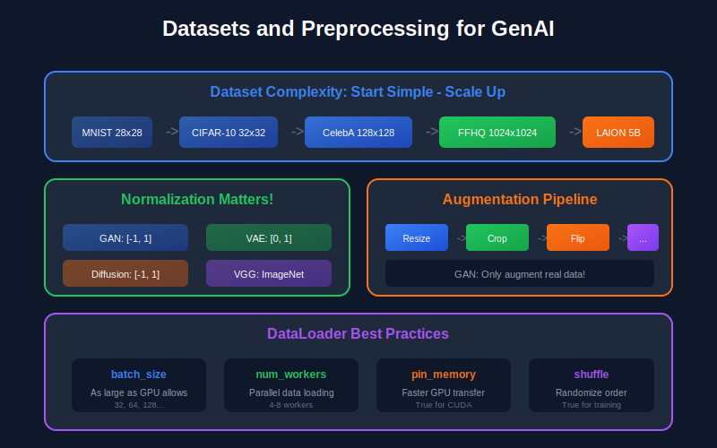
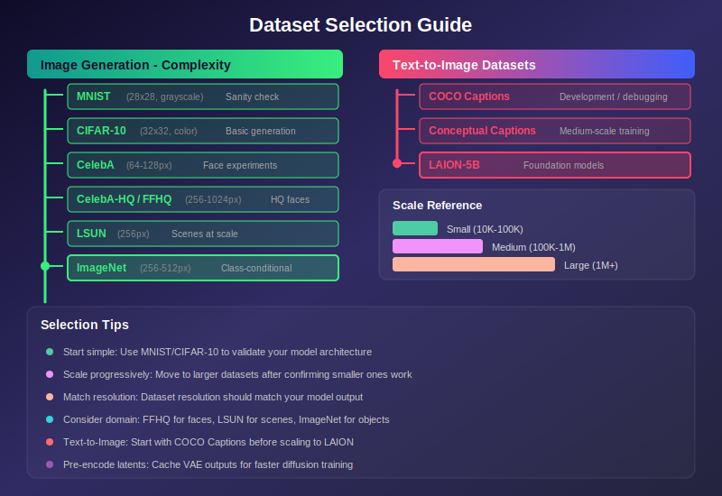

# 📊 Datasets and Preprocessing for Generative AI

<div align="center">


*Data quality = Model quality. Master the art of data handling.*

</div>

---

## 📖 Introduction

> **The quality and characteristics of training data fundamentally determine what generative models can learn.** Understanding datasets, preprocessing techniques, and data augmentation is crucial for training effective generative models.

This guide covers common datasets for generative AI research, preprocessing pipelines, and best practices for data handling.

<div align="center">



</div>

---

## 🎯 Where and Why Use Proper Datasets & Preprocessing

### 📍 Where It's Used

| Application | Dataset/Preprocessing Needs | Example Scenarios |
|:------------|:---------------------------|:------------------|
| 🎨 **Training Generative Models** | Large, clean, diverse datasets | StyleGAN on FFHQ, Stable Diffusion on LAION |
| 📏 **Normalization** | Proper scaling for model architecture | [-1,1] for GANs, ImageNet stats for perceptual loss |
| 🔄 **Data Augmentation** | Increase effective dataset size | Limited data training, ADA for GANs |
| 📈 **Evaluation** | Standard benchmarks, FID statistics | CIFAR-10, ImageNet, CelebA-HQ |
| 📝 **Text-to-Image** | Image-caption pairs, proper tokenization | COCO Captions, LAION-5B |

### 💡 Why It's Essential

<table>
<tr>
<td width="50%">

**🎯 Data Quality = Model Quality**
- "Garbage in, garbage out" applies strongly
- Training on low-quality data → low-quality generations
- Dataset biases directly transfer to model biases

</td>
<td width="50%">

**⚙️ Preprocessing Affects Training**
- Wrong normalization → unstable training
- Inconsistent image sizes → batch processing issues
- Poor augmentation → overfitting, memorization

</td>
</tr>
</table>

### ⚠️ What Happens Without This Knowledge

> 🚫 Model fails to converge (wrong normalization)  
> 🚫 Generated images have wrong color/brightness  
> 🚫 Can't compare results with published work  
> 🚫 Training is slow (inefficient data loading)  
> 🚫 Model overfits with limited data  

---

## 🗺️ Dataset Selection Guide

<div align="center">



</div>

### 📊 Quick Reference: Normalization by Model Type

| Model Type | Output Activation | Normalization | Range |
|:-----------|:-----------------|:--------------|:------|
| 🎭 **GANs** | Tanh | `(x - 0.5) / 0.5` | [-1, 1] |
| 🔄 **VAEs** | Sigmoid | `x / 255` | [0, 1] |
| 🌊 **Diffusion Models** | None (noise prediction) | `(x - 0.5) / 0.5` | [-1, 1] |
| 👁️ **Perceptual Loss (VGG)** | N/A | ImageNet stats | Per-channel |

---

## 📊 Representation Comparison

| Representation | Pros | Cons |
|----------------|------|------|
| **Raw Pixels** | No information loss | High dimensionality, redundant |
| **Normalized [-1,1]** | Centered, stable gradients | Requires denormalization |
| **Latent Codes** | Compact, semantic | Lossy, requires encoder |
| **Tokenized** | Discrete, LLM-compatible | Quantization artifacts |
| **Frequency Domain** | Separates scales, compression | Complex, not intuitive |

---

## 📚 1. Standard Benchmark Datasets

### 1.1 Image Datasets

<table>
<tr>
<td width="50%">

#### 🔢 MNIST
- **Size:** 60,000 training + 10,000 test
- **Resolution:** 28×28 grayscale
- **Classes:** 10 handwritten digits
- **Use:** Basic sanity checks, debugging

#### 👔 Fashion-MNIST
- **Size:** 60,000 training + 10,000 test
- **Resolution:** 28×28 grayscale
- **Classes:** 10 clothing categories
- **Use:** Slightly harder alternative to MNIST

</td>
<td width="50%">

#### 🖼️ CIFAR-10/100
- **Size:** 50,000 training + 10,000 test
- **Resolution:** 32×32 RGB
- **Classes:** 10 or 100 categories
- **Use:** Small-scale image generation benchmarks

#### 👤 CelebA
- **Size:** 202,599 face images
- **Resolution:** Variable (usually 64×64 or 128×128)
- **Attributes:** 40 binary attributes
- **Use:** Face generation, attribute manipulation

</td>
</tr>
<tr>
<td width="50%">

#### 👤✨ CelebA-HQ
- **Size:** 30,000 images
- **Resolution:** 1024×1024
- **Use:** High-resolution face generation

#### 👤🎭 FFHQ
- **Size:** 70,000 images
- **Resolution:** 1024×1024
- **Use:** State-of-the-art faces (StyleGAN)

</td>
<td width="50%">

#### 🏠 LSUN
- **Size:** Millions of images
- **Categories:** Bedrooms, churches, cars, cats
- **Resolution:** Variable (commonly 256×256)
- **Use:** Large-scale scene generation

#### 🌍 ImageNet
- **Size:** 1.2M training images
- **Resolution:** Variable (commonly 256×256)
- **Classes:** 1,000 categories
- **Use:** Class-conditional generation

</td>
</tr>
</table>

### 📈 Dataset Statistics

| Dataset | Size | Resolution | Channels | Complexity |
|:--------|:-----|:-----------|:---------|:-----------|
| MNIST | 70K | 28×28 | 1 | 🟢 Low |
| CIFAR-10 | 60K | 32×32 | 3 | 🟡 Medium |
| CelebA | 200K | 178×218 | 3 | 🟡 Medium |
| FFHQ | 70K | 1024×1024 | 3 | 🔴 High |
| ImageNet | 1.2M | Variable | 3 | 🔴 Very High |

---

## 🔧 2. Image Preprocessing

### 2.1 Normalization Schemes

#### [0, 1] Normalization

```python
# Scale pixel values from [0, 255] to [0, 1]
x = x / 255.0
```

> 💡 **Use:** When using sigmoid output activation (VAEs)

#### [-1, 1] Normalization

```python
# Scale pixel values from [0, 255] to [-1, 1]
x = (x / 255.0) * 2 - 1
# or equivalently
x = (x - 127.5) / 127.5
```

> 💡 **Use:** Standard for GANs (with tanh output)

#### ImageNet Normalization

```python
# Per-channel normalization with ImageNet statistics
mean = [0.485, 0.456, 0.406]
std = [0.229, 0.224, 0.225]
x = (x - mean) / std
```

> 💡 **Use:** When using pretrained models (VGG, ResNet for perceptual loss)

### 2.2 Mathematical Justification

<table>
<tr>
<td>

**Why normalize to zero mean?**

For layer $y = Wx + b$:
- If $\mathbb{E}[x_i] \neq 0$, gradients have consistent sign
- This creates zig-zag updates, slowing convergence

</td>
<td>

**Why unit variance?**

For activation $a = \sigma(Wx)$:
- Too large → saturated activations, vanishing gradients
- Too small → near-linear regime, limited expressiveness

</td>
</tr>
</table>

### 2.3 Resizing Strategies

| Method | Description | Use Case |
|:-------|:------------|:---------|
| **Bilinear** | Linear interpolation in 2D | Fast, general purpose |
| **Bicubic** | Uses 4×4 neighborhood with cubic polynomials | Smoother results |
| **Lanczos** | Based on sinc function | Preserves high frequencies |
| **Anti-aliasing** | Low-pass filter before downsampling | Prevents artifacts |

### 2.4 Cropping Strategies

```python
# 📍 Center Crop
crop_size = 224
start = (img_size - crop_size) // 2
cropped = img[start:start+crop_size, start:start+crop_size]

# 🎲 Random Crop (for augmentation)
x = random.randint(0, img_size - crop_size)
y = random.randint(0, img_size - crop_size)
cropped = img[x:x+crop_size, y:y+crop_size]
```

---

## 🔄 3. Data Augmentation

### 3.1 Geometric Augmentations

<table>
<tr>
<td>

**↔️ Horizontal Flip**
```python
if random.random() > 0.5:
    img = img[:, ::-1]
```
⚠️ Don't use for asymmetric data (text)

</td>
<td>

**🔄 Random Rotation**
$$\begin{bmatrix} x' \\ y' \end{bmatrix} = \begin{bmatrix} \cos\theta & -\sin\theta \\ \sin\theta & \cos\theta \end{bmatrix} \begin{bmatrix} x \\ y \end{bmatrix}$$

</td>
</tr>
</table>

### 3.2 Color Augmentations

| Augmentation | Formula | Effect |
|:-------------|:--------|:-------|
| **Brightness** | $I' = I + \delta$ | Lighter/darker |
| **Contrast** | $I' = \mu + (I - \mu) \cdot c$ | More/less difference |
| **Saturation** | Scale S in HSV | More/less colorful |
| **Hue Shift** | Add offset to H in HSV | Color shift |

```python
transforms.ColorJitter(
    brightness=0.2,
    contrast=0.2,
    saturation=0.2,
    hue=0.1
)
```

### 3.3 Advanced Augmentations

<table>
<tr>
<td>

**✂️ Cutout**

Randomly mask out square regions

```python
mask = torch.ones_like(img)
cx, cy = random_position()
mask[cy:cy+size, cx:cx+size] = 0
img = img * mask
```

</td>
<td>

**🔀 Mixup**

Convex combination of samples

$$\tilde{x} = \lambda x_i + (1-\lambda) x_j$$
$$\tilde{y} = \lambda y_i + (1-\lambda) y_j$$

</td>
</tr>
</table>

### 3.4 Augmentation for Generative Models

> ⚠️ **Important Considerations:**
> - Augment real data only (for discriminator training in GANs)
> - Don't augment for exact likelihood models during density estimation
> - Use differentiable augmentation for both real and fake

**Adaptive Discriminator Augmentation (ADA):**
- Adjusts augmentation strength based on overfitting heuristic
- Prevents discriminator from memorizing training data
- Essential for limited data training

---

## 📦 4. Data Loading Best Practices

### 4.1 Efficient Loading

```python
class EfficientDataset(Dataset):
    def __init__(self, root, transform=None):
        self.paths = sorted(glob(f"{root}/*.jpg"))
        self.transform = transform
    
    def __len__(self):
        return len(self.paths)
    
    def __getitem__(self, idx):
        # 📂 Load on demand (not preload entire dataset)
        img = Image.open(self.paths[idx]).convert('RGB')
        if self.transform:
            img = self.transform(img)
        return img
```

### 4.2 DataLoader Configuration

```python
dataloader = DataLoader(
    dataset,
    batch_size=32,
    shuffle=True,
    num_workers=8,       # 🚀 Parallel loading
    pin_memory=True,     # ⚡ Faster GPU transfer
    drop_last=True,      # 📏 Consistent batch sizes
    prefetch_factor=2    # 📦 Prefetch batches
)
```

### 4.3 Pre-computed Features

> 💡 **Speed up training by caching expensive computations**

```python
# 💾 Precompute and save features
features = encoder(images)
torch.save(features, 'features.pt')

# 📂 Load during training (faster than recomputing)
features = torch.load('features.pt')
```

---

## 🧹 5. Dataset Quality and Curation

### 5.1 Data Cleaning

| Task | Method | Purpose |
|:-----|:-------|:--------|
| 🔍 **Duplicate Detection** | Perceptual hashing (pHash, dHash) | Remove redundant data |
| 📏 **Outlier Removal** | Check aspect ratios, resolution | Remove problematic images |
| 🔒 **Content Filtering** | NSFW detection, watermark detection | Quality control |

### 5.2 Train/Val/Test Splits

```python
from sklearn.model_selection import train_test_split

# 🎲 Random Split
train, test = train_test_split(data, test_size=0.1, random_state=42)

# 📊 Stratified Split (preserve class distribution)
train, test = train_test_split(data, test_size=0.1, stratify=labels)
```

---

## 📝 6. Text Data for Multimodal Models

### 6.1 Image-Text Datasets

| Dataset | Size | Description |
|:--------|:-----|:------------|
| **COCO Captions** | 330K images | 5 captions each, object detection |
| **Conceptual Captions** | 3.3M pairs | Web-crawled, cleaned |
| **LAION-5B** | 5.85B pairs | Used for Stable Diffusion |

### 6.2 Text Preprocessing

```python
from transformers import CLIPTokenizer

tokenizer = CLIPTokenizer.from_pretrained("openai/clip-vit-base-patch32")
tokens = tokenizer(
    text, 
    padding=True, 
    truncation=True, 
    max_length=77
)
```

---

## 💾 7. Latent Space Datasets

### 7.1 Pre-encoded Data

> 💡 **For latent diffusion models — 4-8× faster training!**

```python
vae = AutoencoderKL.from_pretrained("stabilityai/sd-vae-ft-mse")

latents = []
for img in dataloader:
    with torch.no_grad():
        latent = vae.encode(img).latent_dist.sample()
        latent = latent * 0.18215  # 📏 Scaling factor
        latents.append(latent)

torch.save(torch.cat(latents), 'latents.pt')
```

**Advantages:**
- ⚡ Faster training (no VAE forward pass)
- 💾 Lower GPU memory
- 📦 Can use larger batch sizes

---

## 📊 8. Evaluation Datasets

### 8.1 Reference Datasets for FID

```python
# 📈 Compute reference statistics
mu_ref, sigma_ref = compute_statistics(real_images, inception_model)
np.savez('reference_stats.npz', mu=mu_ref, sigma=sigma_ref)
```

### 8.2 Best Practices

> ✅ Never use test set for training or hyperparameter selection  
> ✅ Fixed random seed for reproducibility  
> ✅ Report confidence intervals  
> ✅ Test on out-of-distribution data for generalization  

---

## 🛠️ Complete Preprocessing Pipeline

```python
import torch
from torch.utils.data import Dataset, DataLoader
from torchvision import transforms
from PIL import Image
from pathlib import Path

class CelebAHQDataset(Dataset):
    def __init__(self, root, resolution=256, augment=True):
        self.paths = sorted(Path(root).glob("*.jpg"))
        
        # 📦 Base transforms
        base_transforms = [
            transforms.Resize(resolution, 
                            interpolation=transforms.InterpolationMode.LANCZOS),
            transforms.CenterCrop(resolution),
        ]
        
        # 🔄 Augmentation transforms
        if augment:
            aug_transforms = [
                transforms.RandomHorizontalFlip(p=0.5),
                transforms.ColorJitter(brightness=0.1, contrast=0.1),
            ]
        else:
            aug_transforms = []
        
        # 📏 Final transforms (normalize to [-1, 1])
        final_transforms = [
            transforms.ToTensor(),
            transforms.Normalize([0.5, 0.5, 0.5], [0.5, 0.5, 0.5])
        ]
        
        self.transform = transforms.Compose(
            base_transforms + aug_transforms + final_transforms
        )
    
    def __len__(self):
        return len(self.paths)
    
    def __getitem__(self, idx):
        img = Image.open(self.paths[idx]).convert('RGB')
        return self.transform(img)

# 🚀 Create dataloader
dataset = CelebAHQDataset('/path/to/celeba-hq', resolution=256, augment=True)
dataloader = DataLoader(
    dataset,
    batch_size=32,
    shuffle=True,
    num_workers=8,
    pin_memory=True,
    drop_last=True
)
```

---

## 📋 Key Considerations Summary

| Aspect | Recommendation |
|:-------|:---------------|
| 📏 **Normalization** | [-1, 1] for GANs with tanh; [0, 1] for VAEs with sigmoid |
| 🔄 **Augmentation** | Horizontal flip + color jitter; use ADA for limited data |
| 🖼️ **Resolution** | Start small (64-128), scale up progressively |
| 📦 **Batch Size** | As large as memory allows; affects BatchNorm statistics |
| 🚀 **Loading** | `num_workers ≈ 4-8`; `pin_memory=True` for GPU |

---

## 📚 References

### 📄 Dataset Papers
1. **LeCun, Y., et al.** (1998). MNIST
2. **Krizhevsky, A.** (2009). CIFAR-10/100
3. **Liu, Z., et al.** (2015). CelebA - *ICCV*
4. **Karras, T., et al.** (2019). FFHQ - *CVPR*
5. **Schuhmann, C., et al.** (2022). LAION-5B - *NeurIPS*

### 📄 Augmentation Papers
6. **DeVries, T., & Taylor, G. W.** (2017). Cutout
7. **Zhang, H., et al.** (2018). Mixup - *ICLR*
8. **Zhao, S., et al.** (2020). Differentiable Augmentation - *NeurIPS*
9. **Karras, T., et al.** (2020). ADA - *NeurIPS*

---

## ✏️ Exercises

1. **Implement** a data loader for LSUN bedrooms with random crops and horizontal flips.

2. **Compare** bilinear vs. bicubic vs. Lanczos resizing on high-frequency content.

3. **Compute** FID reference statistics for CIFAR-10.

4. **Implement** differentiable augmentation for GAN training.

5. **Create** a balanced subset of CelebA with equal representation of key attributes.

---

<div align="center">

**[← CNNs](../06_convolutional_neural_networks/)** | **[Back to Prerequisites →](../)**

</div>
