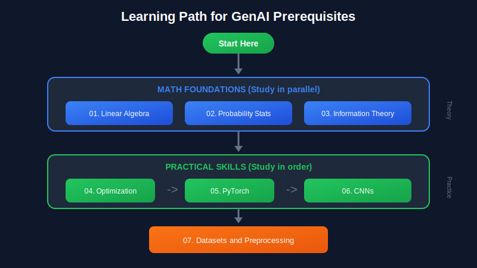
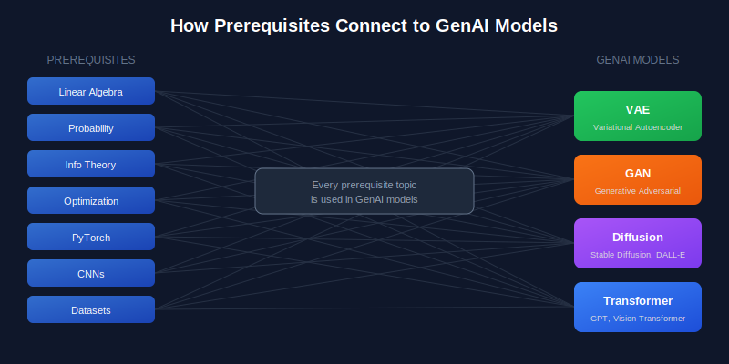

# 🚀 Prerequisites for Generative AI

*Master the foundational knowledge required for VAEs, GANs, Diffusion Models, and Transformers*

---

## 📚 Topics Overview

| # | Topic | What You'll Learn | Why It Matters |
|:-:|:------|:------------------|:---------------|
| 01 | [🔢 Linear Algebra](./01_linear_algebra/) | Matrices, vectors, SVD, eigenvalues | Every neural network layer is a matrix operation |
| 02 | [📊 Probability & Statistics](./02_probability_and_statistics/) | Distributions, Bayes rule, sampling | GenAI = learning probability distributions |
| 03 | [📐 Information Theory](./03_information_theory/) | Entropy, KL divergence, cross-entropy | Loss functions and model evaluation |
| 04 | [⚡ Optimization Methods](./04_optimization_methods/) | SGD, Adam, GAN training | How models learn from data |
| 05 | [🔥 PyTorch Basics](./05_pytorch_basics/) | Tensors, autograd, nn.Module | The framework for building GenAI |
| 06 | [🖼️ CNNs](./06_convolutional_neural_networks/) | Convolutions, U-Net, upsampling | Image generation architectures |
| 07 | [📦 Datasets & Preprocessing](./07_datasets_and_preprocessing/) | Data loading, normalization, augmentation | Data quality = model quality |

---

## 🎯 Learning Path

---

## 🔗 How Topics Connect to GenAI Models

<table>
<tr>
<td width="50%">

### 🔄 VAE (Variational Autoencoder)
- **Linear Algebra**: Encoder/decoder are matrix operations
- **Probability**: Gaussian latent space, reparameterization trick
- **Information Theory**: ELBO = Reconstruction - KL divergence
- **Optimization**: Adam optimizer, KL annealing
- **PyTorch**: nn.Module for encoder/decoder
- **CNNs**: Convolutional encoder/decoder for images

</td>
<td width="50%">

### 🎭 GAN (Generative Adversarial Network)
- **Linear Algebra**: Generator/discriminator weight matrices
- **Probability**: Implicit distribution learning
- **Information Theory**: JS divergence (original), Wasserstein (WGAN)
- **Optimization**: Two-player game, TTUR, spectral normalization
- **PyTorch**: Two models, two optimizers
- **CNNs**: DCGAN, StyleGAN architectures

</td>
</tr>
<tr>
<td width="50%">

### 🌊 Diffusion Models (Stable Diffusion, DALL-E)
- **Linear Algebra**: U-Net weights, attention QKV
- **Probability**: Gaussian noise, score functions, Langevin dynamics
- **Information Theory**: Denoising score matching
- **Optimization**: AdamW, EMA weights
- **PyTorch**: U-Net implementation, noise scheduling
- **CNNs**: U-Net encoder-decoder with skip connections

</td>
<td width="50%">

### 🤖 Transformers (GPT, Vision Transformers)
- **Linear Algebra**: Attention = QK^T × V, all linear layers
- **Probability**: Autoregressive p(x_t | x_<t)
- **Information Theory**: Cross-entropy loss, perplexity
- **Optimization**: AdamW, warmup, cosine decay
- **PyTorch**: nn.MultiheadAttention, positional encoding

</td>
</tr>
</table>

---

## ⏱️ Suggested Time Investment

| Topic | Time | Priority |
|:------|:-----|:---------|
| 🔢 Linear Algebra | 1-2 weeks | 🔴 **Critical** |
| 📊 Probability & Statistics | 1-2 weeks | 🔴 **Critical** |
| 📐 Information Theory | 3-5 days | 🟡 Important |
| ⚡ Optimization | 3-5 days | 🟡 Important |
| 🔥 PyTorch Basics | 1 week | 🔴 **Critical** |
| 🖼️ CNNs | 3-5 days | 🟡 Important |
| 📦 Datasets & Preprocessing | 2-3 days | 🟢 Practical |

> **Total: 4-6 weeks** for solid foundations

---

## 📖 Each Topic Includes

<table>
<tr>
<td align="center">
<h3>🎨</h3>
<b>Visual Overview</b> 
SVG diagram of key concepts
</td>
<td align="center">
<h3>🎯</h3>
<b>Where & Why</b> 
Practical applications in GenAI
</td>
<td align="center">
<h3>📐</h3>
<b>Theory</b> 
Mathematical foundations with proofs
</td>
</tr>
<tr>
<td align="center">
<h3>💻</h3>
<b>Examples</b> 
Code snippets and formulas
</td>
<td align="center">
<h3>✏️</h3>
<b>Exercises</b> 
Practice problems
</td>
<td align="center">
<h3>📚</h3>
<b>References</b> 
Papers, books, online resources
</td>
</tr>
</table>

---

## 🚀 Quick Start

<table>
<tr>
<td width="50%">

### 🆕 New to GenAI?

Start with:
1. `05_pytorch_basics` - Get comfortable with the framework
2. `01_linear_algebra` - Understand what happens in layers
3. `02_probability_and_statistics` - Understand what models learn

</td>
<td width="50%">

### 🎓 Already familiar with ML?

Focus on:
1. `03_information_theory` - VAE/GAN loss functions
2. `04_optimization_methods` - GAN training specifics
3. `06_convolutional_neural_networks` - U-Net for diffusion

</td>
</tr>
</table>

---

## 📁 Folder Structure

| Folder | Contents |
|:-------|:---------|
| 📂 `images/` | Main diagrams (learning path, connections) |
| 📂 `01_linear_algebra/` | README + `images/matrix_operations_genai.svg` |
| 📂 `02_probability_and_statistics/` | README + `images/probability_genai.svg` |
| 📂 `03_information_theory/` | README + `images/information_theory_genai.svg` |
| 📂 `04_optimization_methods/` | README + `images/optimization_genai.svg` |
| 📂 `05_pytorch_basics/` | README + `images/pytorch_genai.svg` |
| 📂 `06_convolutional_neural_networks/` | README + `images/cnn_genai.svg` |
| 📂 `07_datasets_and_preprocessing/` | README + `images/datasets_preprocessing_genai.svg` |

---

## 🎓 After Completing Prerequisites

You'll be ready to study:

<table>
<tr>
<td align="center">
<h3>🔄 VAE</h3>
Variational Autoencoders
</td>
<td align="center">
<h3>🎭 GAN</h3>
Generative Adversarial Networks
</td>
<td align="center">
<h3>🌊 Diffusion</h3>
DDPM, Stable Diffusion
</td>
<td align="center">
<h3>🤖 Transformers</h3>
GPT, Vision Transformers
</td>
<td align="center">
<h3>🌈 Multimodal</h3>
CLIP, DALL-E
</td>
</tr>
</table>

---

*Start with any topic that interests you, but make sure to cover all of them before diving deep into GenAI architectures!*

**Made with ❤️ for the GenAI community**

