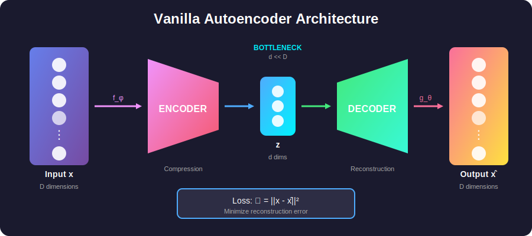
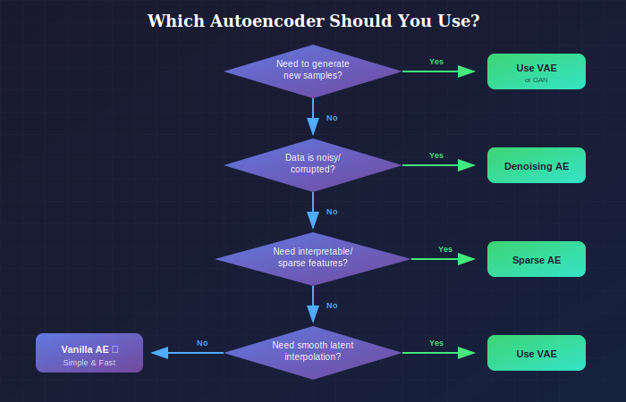
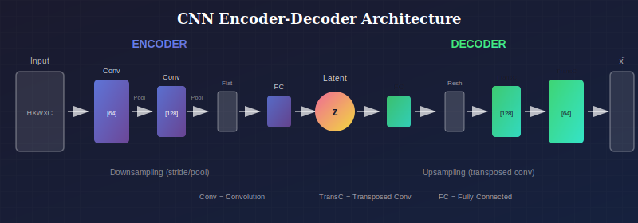
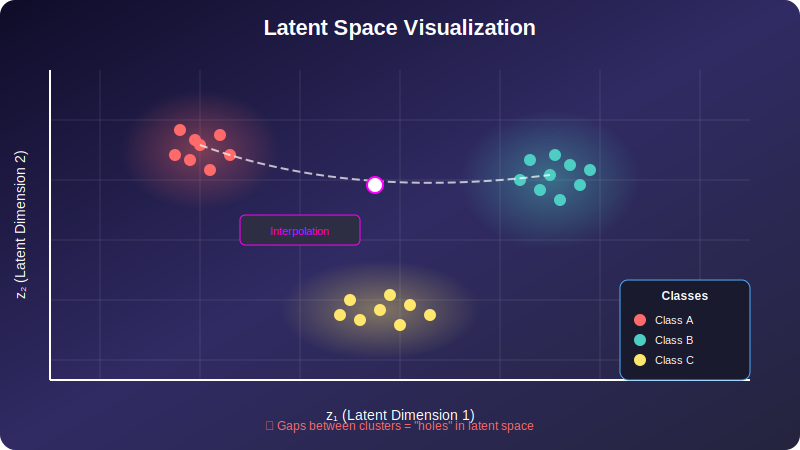
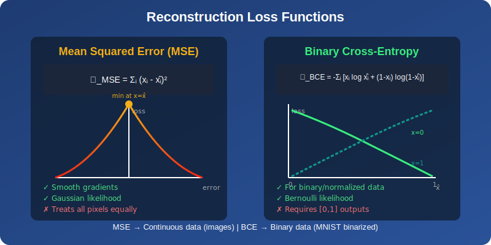

# 🔷 Vanilla Autoencoders

<div align="center">



*The foundation of representation learning*

</div>

---

## 📖 Introduction

> **TL;DR:** Autoencoders compress data into a compact representation (encoding) and then reconstruct it (decoding). They learn what features matter most for reconstruction.

Autoencoders are neural networks that learn to compress data into a lower-dimensional representation and then reconstruct it. While not generative models in the strictest sense (they don't model $p(x)$), they form the foundation for variational autoencoders and the encoder-decoder architectures used throughout generative AI.

<details>
<summary>🎯 <b>Key Insight</b> (click to expand)</summary>

The **bottleneck** forces the network to learn the most important features. If you have 784 pixels (MNIST) but only 32 latent dimensions, the network must figure out what's essential!

</details>

---

## When to Use Vanilla Autoencoders

### Where to Use

| Domain | Use Case | Why It Works |
|--------|----------|--------------|
| **Data Compression** | Reducing storage/bandwidth for images, audio, sensor data | Learns compact representations tailored to specific data distributions |
| **Dimensionality Reduction** | Visualizing high-dimensional data (genomics, embeddings) | Non-linear alternative to PCA; captures complex manifold structure |
| **Feature Extraction** | Pretraining encoders for downstream classification/regression | Unsupervised learning of meaningful representations |
| **Anomaly Detection** | Fraud detection, manufacturing defects, network intrusion | High reconstruction error signals out-of-distribution inputs |
| **Image Deblurring/Super-resolution** | Restoring degraded images | Encoder-decoder learns to map degraded → clean |
| **Semantic Hashing** | Fast approximate nearest neighbor search | Compact binary codes for similarity search |

### Why Choose Vanilla AE (vs. Other Variants)

| Choose Vanilla AE When... | Don't Use When... |
|---------------------------|-------------------|
| You need **simple, fast** training | You need to **generate** new samples (use VAE/GAN) |
| **Reconstruction quality** is the main goal | You need **interpretable** features (use Sparse AE) |
| Data is relatively **clean** | Data is **noisy** (use Denoising AE) |
| You have **sufficient data** | You need **regularized** latent space for interpolation (use VAE) |
| **Deterministic** encoding is acceptable | You need **probabilistic** uncertainty estimates (use VAE) |

### Decision Flowchart

<div align="center">



*When to use which autoencoder variant*

</div>

### Industry Examples

1. **E-commerce (Amazon, Alibaba):** Product image compression for faster loading
2. **Healthcare:** Medical image dimensionality reduction for visualization
3. **Cybersecurity:** Network traffic anomaly detection using reconstruction error
4. **Recommendation Systems:** Learning user/item embeddings from interaction data

---

## 📊 Representation Comparison

| Representation | Pros | Cons |
|----------------|------|------|
| **Linear AE** | Equivalent to PCA, interpretable | Limited capacity |
| **Deep AE** | Nonlinear manifolds, powerful | Harder to train |
| **Undercomplete** | Forces compression | May lose information |
| **Overcomplete** | Can learn identity | Needs regularization |
| **Tied Weights** | Fewer parameters, regularization | Less flexible |

---

## 1. Architecture and Formulation

### 1.1 Basic Structure

> 💡 **The Core Idea:** Input → Compress → Expand → Reconstruct

An autoencoder consists of two components:

**Encoder:** $f_\phi: \mathcal{X} \rightarrow \mathcal{Z}$
$$z = f_\phi(x)$$

**Decoder:** $g_\theta: \mathcal{Z} \rightarrow \mathcal{X}$
$$\hat{x} = g_\theta(z)$$

where:
- $x \in \mathcal{X} \subseteq \mathbb{R}^D$ is the input
- $z \in \mathcal{Z} \subseteq \mathbb{R}^d$ is the latent representation (typically $d \ll D$)
- $\hat{x}$ is the reconstruction

### 1.2 Training Objective

Minimize reconstruction loss:

$$\mathcal{L}(\phi, \theta) = \mathbb{E}_{x \sim p_{data}}[\ell(x, g_\theta(f_\phi(x)))]$$

Common choices for $\ell$:

**Mean Squared Error (MSE):**
$$\ell_{MSE}(x, \hat{x}) = \|x - \hat{x}\|_2^2 = \sum_{i=1}^D (x_i - \hat{x}_i)^2$$

**Binary Cross-Entropy (for binary data):**
$$\ell_{BCE}(x, \hat{x}) = -\sum_{i=1}^D [x_i \log \hat{x}_i + (1-x_i)\log(1-\hat{x}_i)]$$

### 1.3 Information-Theoretic View

The autoencoder objective can be viewed as maximizing mutual information:

$$\max_{f, g} I(X; \hat{X})$$

subject to the bottleneck constraint $\dim(Z) = d$.

**Theorem:** Perfect reconstruction implies $I(X; Z) = H(X)$, meaning the latent space captures all information about $X$.

---

## 2. Mathematical Analysis

### 2.1 Linear Autoencoders and PCA

**Theorem:** For linear encoder $f(x) = Wx$ and decoder $g(z) = W'z$ with MSE loss:

$$\min_{W, W'} \mathbb{E}[\|x - W'Wx\|^2]$$

The optimal solution spans the same subspace as the top-$d$ principal components of the data covariance.

**Proof Sketch:**

The reconstruction error for linear autoencoder:
$$\mathcal{L} = \mathbb{E}[\|x - W'Wx\|^2] = \text{tr}(\Sigma) - 2\text{tr}(W'\Sigma W^T) + \text{tr}(W'WW^T\Sigma W'W)$$

where $\Sigma = \mathbb{E}[xx^T]$ is the data covariance.

Setting $W' = W^T$ (tied weights) and optimizing:
- Optimal $W$ has rows as top eigenvectors of $\Sigma$
- This is exactly PCA!

**Implication:** Linear autoencoders learn the same representation as PCA. Nonlinear autoencoders can learn more complex manifolds.

### 2.2 Manifold Learning Perspective

Assume data lies on a $d$-dimensional manifold $\mathcal{M} \subset \mathbb{R}^D$.

The encoder learns a mapping to the intrinsic coordinates:
$$f: \mathcal{M} \rightarrow \mathbb{R}^d$$

The decoder learns the inverse (embedding):
$$g: \mathbb{R}^d \rightarrow \mathcal{M}$$

**Bottleneck forces compression:** If $d < D$, the network must learn the manifold structure.

### 2.3 Reconstruction Error Analysis

**Theorem (Approximation Bound):** For a sufficiently expressive autoencoder and data on a smooth $d$-dimensional manifold:

$$\mathbb{E}[\|x - \hat{x}\|^2] \leq C \cdot \epsilon_{\text{manifold}}$$

where $\epsilon_{\text{manifold}}$ depends on manifold curvature and dimension.

**Intuition:** Reconstruction error depends on:
1. Intrinsic dimensionality of data
2. Smoothness of the manifold
3. Capacity of encoder/decoder

---

## 3. Architectural Choices

### 3.1 Encoder-Decoder Architectures

<div align="center">



*CNN-based encoder-decoder architecture for images*

</div>

**Encoder (Downsampling via):**
- Strided convolutions (learnable)
- Max/Average pooling (fixed)

**Decoder (Upsampling via):**
- Transposed convolutions
- Resize + convolution (avoids checkerboard)
- Sub-pixel convolution

### 3.3 Symmetric vs Asymmetric

**Symmetric:** Decoder mirrors encoder architecture
- Tied weights possible
- Conceptually simple

**Asymmetric:** Different encoder/decoder
- More flexibility
- Encoder can be more aggressive (classification-like)
- Decoder can have more capacity (generation-like)

### 3.4 Skip Connections (U-Net style)

Connect encoder layers directly to decoder:
$$\text{decoder}_i = g_i(\text{concat}(\text{decoder}_{i-1}, \text{encoder}_{L-i}))$$

**Benefits:**
- Preserves fine-grained details
- Better gradient flow
- Essential for image-to-image tasks

---

## 4. Latent Space Properties

<div align="center">



*Latent space visualization showing cluster structure and the "hole problem"*

</div>

### 4.1 Dimensionality Selection

**Too small ($d$ too low):**
- High reconstruction error
- Loses important information

**Too large ($d$ too high):**
- May learn identity function
- No meaningful compression

**Heuristics:**
- Start with $d \approx$ intrinsic dimensionality
- Use reconstruction error vs. $d$ curve
- Cross-validation on downstream task

### 4.2 Latent Space Structure

**Problem:** Vanilla autoencoders don't constrain latent space structure.
- Different inputs may map to distant, disconnected regions
- Interpolation may pass through "holes"
- No meaningful sampling possible

**Visualization:** t-SNE or UMAP of latent codes often shows:
- Clusters corresponding to classes
- But gaps between clusters

### 4.3 The Hole Problem

For points $z_1 = f(x_1)$ and $z_2 = f(x_2)$:

$$z_\lambda = (1-\lambda)z_1 + \lambda z_2$$

The decoder $g(z_\lambda)$ may produce:
- Blurry averages
- Meaningless outputs
- Mode collapse artifacts

**This is why we need VAEs** for proper generative modeling.

---

## 5. Regularization Techniques

### 5.1 Weight Regularization

$$\mathcal{L}_{reg} = \mathcal{L}_{recon} + \lambda(\|\phi\|^2 + \|\theta\|^2)$$

Prevents overfitting, encourages simpler mappings.

### 5.2 Contractive Autoencoder (CAE)

**Rifai et al. (2011)**

Add penalty on encoder Jacobian:

$$\mathcal{L}_{CAE} = \mathcal{L}_{recon} + \lambda \|J_f(x)\|_F^2$$

where $J_f(x) = \frac{\partial f(x)}{\partial x}$ is the Jacobian.

**Effect:** Latent representation is insensitive to small input perturbations.

**Computation:**
$$\|J_f\|_F^2 = \sum_{j=1}^d \sum_{i=1}^D \left(\frac{\partial z_j}{\partial x_i}\right)^2$$

For single hidden layer with sigmoid:
$$\|J_f\|_F^2 = \sum_j (W_j)^2 z_j^2 (1-z_j)^2$$

### 5.3 Dropout Regularization

Apply dropout during training:
- In encoder: forces distributed representation
- In decoder: forces robust reconstruction

---

## 6. Loss Functions in Detail

<div align="center">



*Comparison of MSE and Binary Cross-Entropy loss functions*

</div>

### 6.1 MSE Loss Analysis

$$\mathcal{L}_{MSE} = \frac{1}{D}\sum_{i=1}^D (x_i - \hat{x}_i)^2$$

**Probabilistic interpretation:** Assumes $p(x|z) = \mathcal{N}(\hat{x}, \sigma^2 I)$

$$-\log p(x|z) = \frac{1}{2\sigma^2}\|x - \hat{x}\|^2 + \text{const}$$

Minimizing MSE ≡ Maximizing log-likelihood under Gaussian assumption.

**Problem:** Treats all pixels equally, produces blurry outputs for multimodal data.

### 6.2 Perceptual Loss

Use features from pretrained network (e.g., VGG):

$$\mathcal{L}_{perceptual} = \sum_l \|\Phi_l(x) - \Phi_l(\hat{x})\|^2$$

where $\Phi_l$ extracts features at layer $l$.

**Benefits:**
- Captures semantic similarity
- Produces sharper reconstructions
- More aligned with human perception

**Reference:** Johnson et al. (2016). "Perceptual Losses for Real-Time Style Transfer and Super-Resolution."

### 6.3 Adversarial Loss

Add discriminator to judge reconstruction quality:

$$\mathcal{L}_{total} = \mathcal{L}_{recon} + \lambda \mathcal{L}_{adv}$$

where $\mathcal{L}_{adv}$ encourages reconstructions to be indistinguishable from real images.

**Reference:** Larsen et al. (2016). "Autoencoding beyond pixels using a learned similarity metric."

---

## 7. Applications

### 7.1 Dimensionality Reduction

- Visualization (encode to 2D/3D)
- Feature extraction for downstream tasks
- Compression

### 7.2 Anomaly Detection

**Reconstruction-based:** High reconstruction error indicates anomaly.

$$\text{anomaly\_score}(x) = \|x - g_\theta(f_\phi(x))\|^2$$

**Assumption:** Autoencoder trained on normal data cannot reconstruct anomalies well.

### 7.3 Pretraining

Train autoencoder on unlabeled data, use encoder as feature extractor:
1. Train autoencoder on large unlabeled dataset
2. Freeze encoder
3. Train classifier on top with labeled data

### 7.4 Image Compression

Learned compression:
1. Encode image to compact latent
2. Quantize and entropy code latent
3. Decode to reconstruct

**Reference:** Ballé et al. (2017). "End-to-End Optimized Image Compression."

---

## 8. Limitations

### 8.1 Not a Proper Generative Model

- No explicit density $p(x)$
- Cannot sample meaningfully
- Latent space not structured for generation

### 8.2 Blurry Reconstructions

- MSE loss averages over modes
- No adversarial pressure for sharpness

### 8.3 Mode Collapse in Latent Space

- Different inputs may map to same latent
- Decoder may ignore parts of latent space

---

## 📊 Key Equations Summary

<div align="center">

| Concept | Equation | Description |
|---------|----------|-------------|
| **Encoding** | $z = f_\phi(x)$ | Map input to latent |
| **Decoding** | $\hat{x} = g_\theta(z)$ | Reconstruct from latent |
| **MSE Loss** | $\mathcal{L} = \|x - \hat{x}\|_2^2$ | Pixel-wise error |
| **CAE Penalty** | $\lambda\|J_f(x)\|_F^2$ | Encourages smoothness |
| **Perceptual Loss** | $\sum_l\|\Phi_l(x) - \Phi_l(\hat{x})\|^2$ | Feature-level similarity |

</div>

> 🧮 **Mathematical Beauty:** The autoencoder objective is equivalent to maximizing mutual information $I(X; \hat{X})$ subject to a bottleneck constraint!

---

## References

### Foundational Papers
1. **Rumelhart, D. E., Hinton, G. E., & Williams, R. J.** (1986). "Learning representations by back-propagating errors." *Nature*, 323(6088), 533-536.
2. **Hinton, G. E., & Salakhutdinov, R. R.** (2006). "Reducing the Dimensionality of Data with Neural Networks." *Science*, 313(5786), 504-507.

### Regularization
3. **Rifai, S., et al.** (2011). "Contractive Auto-Encoders: Explicit Invariance During Feature Extraction." *ICML*.

### Advanced Losses
4. **Johnson, J., Alahi, A., & Fei-Fei, L.** (2016). "Perceptual Losses for Real-Time Style Transfer and Super-Resolution." *ECCV*.
5. **Larsen, A. B. L., et al.** (2016). "Autoencoding beyond pixels using a learned similarity metric." *ICML*. [arXiv:1512.09300](https://arxiv.org/abs/1512.09300)

---

## ✏️ Exercises

<details>
<summary><b>Exercise 1:</b> Linear AE = PCA (Theory)</summary>

**Prove** that with tied weights ($W' = W^T$), the optimal linear autoencoder learns PCA directions.

*Hint: Start with the SVD of the data matrix and show the optimal W contains top eigenvectors.*
</details>

<details>
<summary><b>Exercise 2:</b> Implement CNN Autoencoder (Coding)</summary>

**Implement** a convolutional autoencoder for MNIST and visualize the latent space.

```python
# Starter code
class ConvAutoencoder(nn.Module):
    def __init__(self, latent_dim=32):
        # Your implementation here
        pass
```
</details>

<details>
<summary><b>Exercise 3:</b> Loss Function Comparison (Experiment)</summary>

**Compare** MSE loss vs. perceptual loss on CelebA reconstructions.

*Measure: PSNR, SSIM, and conduct a human preference study.*
</details>

<details>
<summary><b>Exercise 4:</b> Contractive Penalty Derivation (Math)</summary>

**Derive** the contractive penalty $\|J_f\|_F^2$ for a two-layer encoder with ReLU activations.

*Hint: The Jacobian of ReLU is a diagonal matrix of 0s and 1s.*
</details>

<details>
<summary><b>Exercise 5:</b> Bottleneck Size Analysis (Experiment)</summary>

**Experiment** with different bottleneck sizes and plot reconstruction error vs. dimensionality.

*Expected: You should see an "elbow" where adding more dimensions gives diminishing returns.*
</details>

---

<div align="center">

**[← Back to Autoencoders](../)** | **[Next: Sparse Autoencoder →](../02_sparse_autoencoder/)**

</div>
