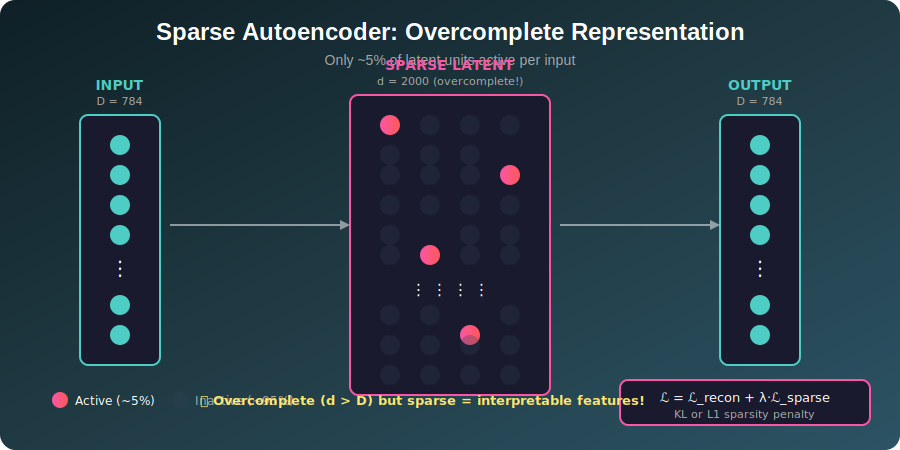
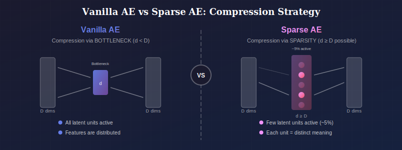
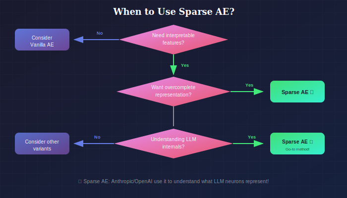
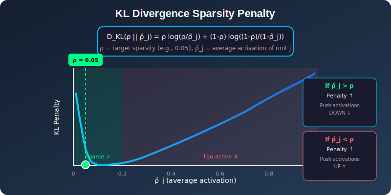

# 🔹 Sparse Autoencoders

*Overcomplete but sparse: Most neurons are inactive*

---

## 📖 Introduction

> **TL;DR:** Instead of a bottleneck, use **sparsity** to compress. Most neurons stay inactive (~95%), but those that activate are highly interpretable!

Sparse autoencoders impose sparsity constraints on the latent representation, forcing the network to learn efficient, interpretable features. Unlike standard autoencoders that use a bottleneck for compression, sparse autoencoders can have overcomplete representations (more latent dimensions than input dimensions) while still learning meaningful features.

🎯 <b>Key Insight</b> (click to expand)

**Why sparsity = interpretability?** 
- Each neuron learns to detect ONE specific feature
- Like a dictionary where each word has a clear meaning
- Used by Anthropic/OpenAI to understand what LLM neurons represent!

---

## When to Use Sparse Autoencoders

### Where to Use

| Domain | Use Case | Why It Works |
|--------|----------|--------------|
| **Interpretable AI / Mechanistic Interpretability** | Understanding what neurons in LLMs represent | Sparse codes reveal distinct, human-interpretable concepts |
| **Feature Learning for Vision** | Learning Gabor-like filters from natural images | Sparsity induces edge detectors similar to biological vision |
| **Text/NLP** | Topic modeling, document representation | Sparse codes correspond to distinct topics/themes |
| **Bioinformatics** | Gene expression analysis, protein structure | Identifies distinct biological pathways/modules |
| **Signal Processing** | Audio/speech decomposition | Learns dictionary of basis functions (like wavelets) |
| **Recommender Systems** | User preference modeling | Sparse factors = distinct taste dimensions |

### Why Choose Sparse AE (vs. Other Variants)

| Choose Sparse AE When... | Don't Use When... |
|--------------------------|-------------------|
| You need **interpretable** latent dimensions | Raw reconstruction quality is paramount |
| You want **overcomplete** representations (more features than input dim) | You need compact bottleneck compression |
| Features should be **distinct/independent** | Features can be distributed/entangled |
| You're doing **dictionary learning** | You need probabilistic generation (use VAE) |
| Understanding **what the model learned** matters | Black-box representations are acceptable |

### Key Differentiator from Vanilla AE

*Vanilla AE uses bottleneck compression, Sparse AE uses sparsity*

### Decision Flowchart

*When to choose Sparse AE*

### Industry & Research Examples

1. **Anthropic/OpenAI:** Sparse autoencoders for LLM interpretability (finding "truth" neurons, toxicity features)
2. **Neuroscience:** Modeling sparse coding in visual cortex (V1 simple cells)
3. **Medical Imaging:** Sparse features for pathology detection (distinct biomarkers)
4. **Audio (Spotify, Shazam):** Learning sparse audio fingerprints for music identification

---

## 📊 Representation Comparison

| Representation | Pros | Cons |
|----------------|------|------|
| **L1 Penalty** | Simple, convex, automatic sparsity | May underfit, tuning λ |
| **KL Sparsity** | Explicit target sparsity ρ | More hyperparameters |
| **k-Sparse** | Exact sparsity, interpretable | Non-differentiable, hard k choice |
| **Winner-Take-All** | Extreme sparsity, fast | Very restrictive |
| **Lifetime Sparsity** | Balanced usage across features | Requires batch statistics |

---

## 1. Motivation and Intuition

### 1.1 Why Sparsity?

**Biological Inspiration:**
- Neurons in visual cortex have sparse activation patterns
- Only ~1-4% of neurons fire for any given stimulus
- Efficient coding hypothesis (Barlow, 1961)

**Machine Learning Benefits:**
- Interpretable features (each dimension has clear meaning)
- Overcomplete representations (can capture more features than input dim)
- Disentanglement (features tend to be independent)
- Robustness (distributed sparse codes are noise-tolerant)

### 1.2 Sparse vs. Bottleneck

| Bottleneck AE | Sparse AE |
|---------------|-----------|
| $d < D$ (undercomplete) | $d \geq D$ (can be overcomplete) |
| Compression via dimension | Compression via sparsity |
| All units can be active | Few units active per input |
| PCA-like features | Dictionary-like features |

---

## 2. Mathematical Formulation

### 2.1 Basic Objective

$$\mathcal{L} = \mathcal{L}_{recon} + \lambda \mathcal{L}_{sparse}$$

where:
- $\mathcal{L}_{recon} = \|x - \hat{x}\|^2$ is reconstruction loss
- $\mathcal{L}_{sparse}$ encourages sparse activations
- $\lambda$ controls sparsity strength

### 2.2 Sparsity Measures

#### L1 Regularization on Activations

$$\mathcal{L}_{sparse} = \sum_{j=1}^{d} |z_j|$$

**Properties:**
- Convex penalty
- Encourages exact zeros
- Easy to optimize (subgradient methods)

#### KL Divergence Sparsity (Ng, 2011)

Define average activation of unit $j$ over training set:

$$\hat{\rho}_j = \frac{1}{N}\sum_{i=1}^{N} z_j^{(i)}$$

Target sparsity: $\rho$ (e.g., 0.05)

KL penalty:

$$\mathcal{L}_{sparse} = \sum_{j=1}^{d} D_{KL}(\rho \| \hat{\rho}_j) = \sum_{j=1}^{d} \left[\rho \log \frac{\rho}{\hat{\rho}_j} + (1-\rho) \log \frac{1-\rho}{1-\hat{\rho}_j}\right]$$

**Properties:**
- Smooth penalty
- Directly controls average activation level
- Works well with sigmoid activations

#### Lifetime Sparsity

For each unit, measure how often it's active:

$$\text{Lifetime}(j) = \frac{1}{N}\sum_{i=1}^{N} \mathbf{1}[z_j^{(i)} > \tau]$$

Penalize units that are always or never active.

#### Population Sparsity

For each input, measure how many units are active:

$$\text{Population}(i) = \sum_{j=1}^{d} \mathbf{1}[z_j^{(i)} > \tau]$$

---

## 3. KL Divergence Sparsity: Detailed Analysis

*KL penalty pushes average activations toward target sparsity ρ*

### 3.1 Derivation

Treat each hidden unit as a Bernoulli variable with activation probability $\hat{\rho}_j$.

The KL divergence between target Bernoulli($\rho$) and actual Bernoulli($\hat{\rho}_j$):

$$D_{KL}(\rho \| \hat{\rho}_j) = \rho \log \frac{\rho}{\hat{\rho}_j} + (1-\rho) \log \frac{1-\rho}{1-\hat{\rho}_j}$$

### 3.2 Gradient Computation

$$\frac{\partial D_{KL}}{\partial \hat{\rho}_j} = -\frac{\rho}{\hat{\rho}_j} + \frac{1-\rho}{1-\hat{\rho}_j}$$

For unit $j$ with activation $z_j = \sigma(a_j)$ (sigmoid):

$$\frac{\partial \mathcal{L}_{sparse}}{\partial a_j} = \frac{\partial D_{KL}}{\partial \hat{\rho}_j} \cdot \frac{\partial \hat{\rho}_j}{\partial z_j} \cdot \frac{\partial z_j}{\partial a_j}$$

### 3.3 Effect on Training

- If $\hat{\rho}_j > \rho$: penalty increases, pushes activations down
- If $\hat{\rho}_j < \rho$: penalty increases, pushes activations up
- At $\hat{\rho}_j = \rho$: penalty is zero (achieved target)

### 3.4 Choosing $\rho$

| $\rho$ | Effect |
|--------|--------|
| 0.01 | Very sparse (1% active) |
| 0.05 | Typical choice |
| 0.1 | Moderately sparse |
| 0.5 | No sparsity (same as standard AE) |

---

## 4. Sparse Coding Connection

### 4.1 Classical Sparse Coding

Find sparse representation $z$ for input $x$ given dictionary $D$:

$$\min_z \|x - Dz\|^2 + \lambda \|z\|_1$$

**Inference:** Solve optimization for each $x$ (expensive)
**Learning:** Update $D$ given solved $z$

### 4.2 Sparse Autoencoder as Amortized Inference

The encoder $f_\phi$ amortizes the inference:
- Instead of solving optimization per input
- Learn a function that directly predicts sparse $z$

$$z = f_\phi(x) \approx \arg\min_z \|x - Dz\|^2 + \lambda\|z\|_1$$

**Advantage:** Fast inference (single forward pass)
**Disadvantage:** Approximate (learned function may not find exact optimum)

### 4.3 ISTA and LISTA

**Iterative Shrinkage-Thresholding Algorithm (ISTA):**

$$z^{(k+1)} = \mathcal{S}_{\lambda/L}\left(z^{(k)} + \frac{1}{L}D^T(x - Dz^{(k)})\right)$$

where $\mathcal{S}_\tau$ is soft-thresholding: $\mathcal{S}_\tau(u) = \text{sign}(u) \max(|u| - \tau, 0)$

**Learned ISTA (LISTA):** Unroll ISTA iterations as neural network layers.

**Reference:** Gregor & LeCun (2010). "Learning Fast Approximations of Sparse Coding."

---

## 5. Overcomplete Representations

### 5.1 Definition

**Overcomplete:** $d > D$ (more latent dimensions than input)

### 5.2 Why Overcomplete + Sparse?

**Without sparsity:** Overcomplete autoencoder can learn identity
**With sparsity:** Must select which features to activate

**Benefit:** Can learn richer set of features
- In images: more edge orientations, frequencies, positions
- In audio: more frequency bands, time scales

### 5.3 Dictionary Learning View

Overcomplete sparse AE learns a dictionary $D \in \mathbb{R}^{D \times d}$ where:
- Each column is a "dictionary atom"
- Input is reconstructed as sparse combination
- More atoms than dimensions allows richer representations

---

## 6. Activation Functions for Sparsity

### 6.1 Sigmoid with KL Sparsity

$$z_j = \sigma(W_j x + b_j) = \frac{1}{1 + e^{-(W_j x + b_j)}}$$

- Natural interpretation as probability
- Works well with KL divergence penalty
- Range [0, 1]

### 6.2 ReLU for Natural Sparsity

$$z_j = \max(0, W_j x + b_j)$$

- Naturally produces zeros
- Can use L1 penalty on positive activations
- No upper bound (may need normalization)

### 6.3 Softmax for Winner-Take-All

$$z_j = \frac{e^{a_j / \tau}}{\sum_k e^{a_k / \tau}}$$

- Only one (or few) units active
- $\tau \to 0$: hard selection
- Useful for clustering/quantization

### 6.4 Top-k Sparsity

Explicitly keep only top-k activations:

$$z_j = \begin{cases} a_j & \text{if } a_j \in \text{top-}k \\ 0 & \text{otherwise} \end{cases}$$

**Reference:** Makhzani & Frey (2013). "k-Sparse Autoencoders."

---

## 7. Training Considerations

### 7.1 Batch vs. Full Dataset Statistics

For KL sparsity, $\hat{\rho}_j$ should be computed over:
- Full dataset (accurate but slow)
- Mini-batch (noisy estimate)
- Running average (compromise)

**Running average:**
$$\hat{\rho}_j^{(t)} = \beta \hat{\rho}_j^{(t-1)} + (1-\beta) \bar{z}_j^{(batch)}$$

### 7.2 Sparsity-Reconstruction Trade-off

Too much sparsity ($\lambda$ too high):
- Poor reconstruction
- "Dead" units (never active)

Too little sparsity ($\lambda$ too low):
- No sparsity benefit
- Distributed, uninterpretable features

**Annealing:** Start with low $\lambda$, increase gradually.

### 7.3 Dead Units Problem

Some units may never activate (especially with ReLU).

**Solutions:**
- Initialize biases to small positive values
- Use leaky ReLU
- Add unit-specific penalties
- Periodically reinitialize dead units

---

## 8. Theoretical Connections

### 8.1 Independent Component Analysis (ICA)

ICA assumes: $x = As$ where $s$ has independent, non-Gaussian components.

**Sparse coding:** If $s$ is sparse, we get sparse representations.

**Connection:** Sparse autoencoders can learn ICA-like features when trained on natural images.

### 8.2 Compressed Sensing

**Theorem (RIP):** If $D$ satisfies Restricted Isometry Property and $z$ is $k$-sparse:

$$z = \arg\min \|z\|_0 \text{ s.t. } x = Dz$$

can be relaxed to:

$$z = \arg\min \|z\|_1 \text{ s.t. } x = Dz$$

**Relevance:** Justifies L1 penalty for finding sparse solutions.

### 8.3 Minimum Description Length

Sparse codes minimize description length:
$$\text{MDL}(x, z) = \underbrace{L(z)}_{\text{code length}} + \underbrace{L(x|z)}_{\text{reconstruction}}$$

Sparsity → fewer non-zero elements → shorter code.

---

## 9. Applications

### 9.1 Feature Learning

- Learn interpretable visual features
- Edge detectors, Gabor-like filters emerge from natural images

### 9.2 Anomaly Detection

Sparse code statistics differ for anomalies:
- Different sparsity level
- Different activated units

### 9.3 Denoising

Sparse representations are robust to noise:
- Noise spreads across all dimensions
- Signal concentrates in sparse code

### 9.4 Interpretable AI

Recently, sparse autoencoders applied to neural network activations:
- Learn interpretable features from model internals
- "Mechanistic interpretability"

**Reference:** Cunningham et al. (2023). "Sparse Autoencoders Find Highly Interpretable Features in Language Models."

---

## Key Equations Summary

| Concept | Equation |
|---------|----------|
| Sparse Objective | $\mathcal{L} = \|x - \hat{x}\|^2 + \lambda \mathcal{L}_{sparse}$ |
| L1 Sparsity | $\mathcal{L}_{sparse} = \sum_j |z_j|$ |
| KL Sparsity | $\sum_j D_{KL}(\rho \| \hat{\rho}_j)$ |
| Soft Threshold | $\mathcal{S}_\tau(u) = \text{sign}(u)\max(|u|-\tau, 0)$ |

---

## References

### Foundational
1. **Olshausen, B. A., & Field, D. J.** (1996). "Emergence of simple-cell receptive field properties by learning a sparse code for natural images." *Nature*, 381(6583), 607-609.
2. **Ng, A.** (2011). "Sparse autoencoder." CS294A Lecture notes.

### Algorithms
3. **Gregor, K., & LeCun, Y.** (2010). "Learning Fast Approximations of Sparse Coding." *ICML*.
4. **Makhzani, A., & Frey, B.** (2013). "k-Sparse Autoencoders." [arXiv:1312.5663](https://arxiv.org/abs/1312.5663)

### Theory
5. **Barlow, H. B.** (1961). "Possible Principles Underlying the Transformation of Sensory Messages." *Sensory Communication*.
6. **Donoho, D. L.** (2006). "Compressed sensing." *IEEE Transactions on Information Theory*.

### Applications
7. **Cunningham, H., et al.** (2023). "Sparse Autoencoders Find Highly Interpretable Features in Language Models." [arXiv:2309.08600](https://arxiv.org/abs/2309.08600)

---

## Exercises

1. **Derive** the gradient of KL sparsity penalty with respect to pre-activation values.

2. **Implement** a sparse autoencoder with L1 penalty and visualize learned filters on MNIST.

3. **Compare** KL vs. L1 sparsity on the same architecture—which achieves target sparsity more reliably?

4. **Experiment** with overcomplete representations ($d = 2D$) and analyze learned features.

5. **Implement** k-sparse autoencoder and compare feature interpretability to soft sparsity methods.

---

**[← Vanilla Autoencoder](../01_vanilla_autoencoder/)** | **[Next: Denoising Autoencoder →](../03_denoising_autoencoder/)**

