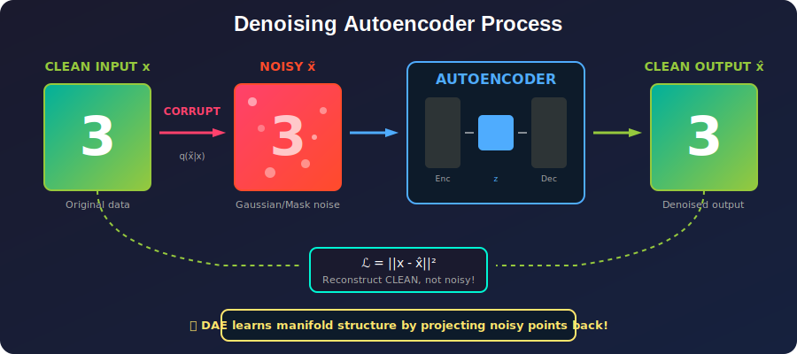
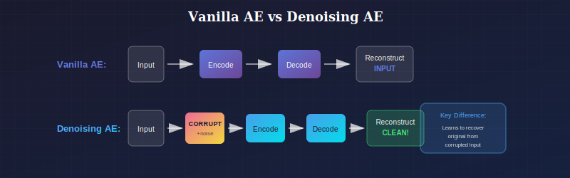
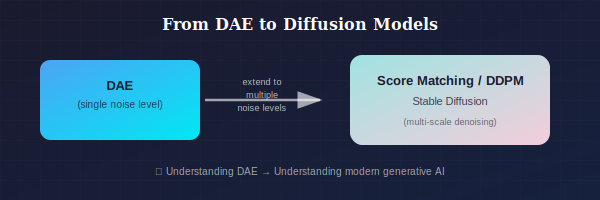
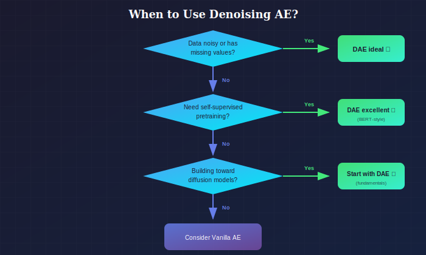
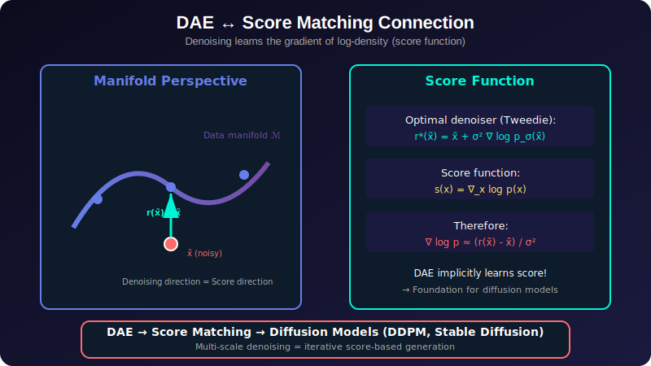
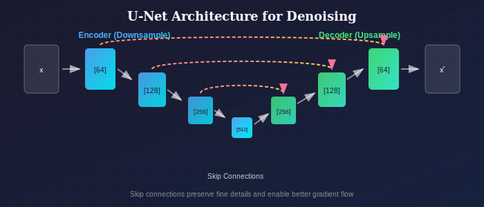

# 🔷 Denoising Autoencoders

*Corrupt → Encode → Decode → Recover the clean signal*

---

## 📖 Introduction

> **TL;DR:** Train the autoencoder on **corrupted** inputs but ask it to reconstruct the **clean** original. This forces it to learn the underlying data structure!

Denoising autoencoders (DAEs) learn to reconstruct clean data from corrupted inputs. This seemingly simple modification leads to robust feature learning and, remarkably, provides a connection to score-based generative models—forming a theoretical bridge to modern diffusion models.

🔗 <b>Connection to Diffusion Models</b> (click to expand)

**DAE is the foundation of Stable Diffusion!**
- Diffusion = multi-scale denoising
- Score matching = learning the denoising direction
- Understanding DAE → Understanding modern generative AI

---

## When to Use Denoising Autoencoders

### Where to Use

| Domain | Use Case | Why It Works |
|--------|----------|--------------|
| **Image Denoising** | Removing noise from photos, medical scans, satellite imagery | Trained to recover clean signal from noisy input |
| **Pretraining for NLP/Vision** | Self-supervised representation learning (like BERT's MLM) | Corruption + reconstruction = powerful self-supervision |
| **Inpainting** | Filling missing regions in images | Masking corruption naturally trains for hole-filling |
| **Data Augmentation** | Generating augmented training samples | Corrupt-and-reconstruct creates meaningful variations |
| **Robust Feature Learning** | Features that generalize despite input noise | Denoising forces learning of essential structure |
| **Diffusion Model Foundation** | Understanding/implementing diffusion models | DAE is the core building block of DDPM, Score Matching |

### Why Choose Denoising AE (vs. Other Variants)

| Choose Denoising AE When... | Don't Use When... |
|-----------------------------|-------------------|
| Your data is **noisy/corrupted** | Data is already clean and noise-free |
| You need **robust** features invariant to perturbations | You need the exact input reconstructed |
| You're doing **self-supervised pretraining** | You have abundant labeled data |
| You want to understand **diffusion models** | You need interpretable sparse features |
| Input may have **missing values** | All inputs are complete |

### Key Differentiator from Vanilla AE

*Denoising AE learns to recover clean input from corrupted version*

### Connection to Modern Generative AI

*DAE is the foundation of modern diffusion models*

This makes understanding DAEs essential for modern GenAI research.

### Decision Flowchart

*When to choose Denoising AE*

### Industry & Research Examples

1. **Medical Imaging (GE Healthcare, Siemens):** Denoising low-dose CT scans
2. **Photography (Google, Adobe):** Night mode, low-light image enhancement
3. **NLP (Google BERT):** Masked Language Model is a DAE with token masking
4. **Satellite Imagery (Planet Labs):** Removing atmospheric noise/clouds
5. **Audio (Krisp, NVIDIA RTX Voice):** Real-time voice denoising

---

## 📊 Representation Comparison

| Representation | Pros | Cons |
|----------------|------|------|
| **Gaussian Noise** | Simple, matches diffusion models | May not match real corruption |
| **Masking (Dropout)** | Forces distributed representation | Can destroy structure |
| **Salt & Pepper** | Tests robustness to outliers | Less smooth gradients |
| **Structured Masking** | Learns global context | May be too easy |
| **Adversarial Corruption** | Maximum robustness | Expensive to generate |

---

## 1. Formulation

### 1.1 Basic Objective

Given clean data $x$, corrupt it to obtain $\tilde{x}$:

$$\tilde{x} \sim q(\tilde{x}|x)$$

Train autoencoder to recover $x$ from $\tilde{x}$:

$$\mathcal{L} = \mathbb{E}_{x \sim p_{data}} \mathbb{E}_{\tilde{x} \sim q(\tilde{x}|x)} \|x - g_\theta(f_\phi(\tilde{x}))\|^2$$

**Key insight:** The network cannot simply learn identity—it must learn the data structure to denoise.

### 1.2 Corruption Processes

#### Additive Gaussian Noise

$$\tilde{x} = x + \epsilon, \quad \epsilon \sim \mathcal{N}(0, \sigma^2 I)$$

**Properties:**
- Continuous corruption
- Smooth gradients
- Connection to score matching

#### Masking Noise (Dropout)

$$\tilde{x}_i = \begin{cases} x_i & \text{with probability } 1-p \\ 0 & \text{with probability } p \end{cases}$$

**Properties:**
- Sparse corruption
- Forces distributed representations
- Robust to missing data

#### Salt-and-Pepper Noise

$$\tilde{x}_i = \begin{cases} 0 & \text{with probability } p/2 \\ 1 & \text{with probability } p/2 \\ x_i & \text{otherwise} \end{cases}$$

#### Gaussian Masking

Combine masking with Gaussian noise:
$$\tilde{x} = m \odot x + (1-m) \odot \mathcal{N}(0, \sigma^2)$$

where $m$ is a binary mask.

---

## 2. Theoretical Analysis

### 2.1 Why Denoising Leads to Good Features

**Theorem (Vincent et al., 2010):** Training a DAE with infinitesimal Gaussian noise is equivalent to contractive autoencoder training.

**Proof Sketch:**

For small noise $\epsilon$, Taylor expansion:
$$f_\phi(\tilde{x}) = f_\phi(x + \epsilon) \approx f_\phi(x) + J_f(x)\epsilon$$

where $J_f$ is the Jacobian.

The denoising objective becomes:
$$\mathbb{E}[\|x - g(f(x + \epsilon))\|^2] \approx \mathbb{E}[\|x - g(f(x))\|^2] + \sigma^2 \|J_f(x)\|_F^2$$

The second term is exactly the contractive penalty!

### 2.2 Manifold Learning Interpretation

**Key insight:** DAE learns to project corrupted points back onto the data manifold.

Let $\mathcal{M}$ be the data manifold. The denoising function learns:
$$r_\theta(\tilde{x}) \approx \text{proj}_\mathcal{M}(\tilde{x})$$

**Geometric view:**
- Corrupted point $\tilde{x}$ is off the manifold
- DAE learns to map it to nearest point on manifold
- Reconstruction function traces out manifold structure

### 2.3 Energy-Based View

Define energy function:
$$E(x) = -\log p(x)$$

The optimal denoising function for Gaussian noise satisfies:
$$r^*(x + \epsilon) = x + \epsilon + \sigma^2 \nabla_x \log p(x) + O(\sigma^3)$$

Rearranging:
$$\nabla_x \log p(x) \approx \frac{r^*(x) - x}{\sigma^2}$$

**This is the score function!** DAEs implicitly learn the score.

---

## 3. Connection to Score Matching

*DAE implicitly learns the score function — the foundation of diffusion models*

### 3.1 Score Function

The **score function** is the gradient of log-density:
$$s(x) = \nabla_x \log p(x)$$

### 3.2 Denoising Score Matching

**Theorem (Vincent, 2011):** The denoising autoencoder objective is equivalent to score matching.

**Objective:** Learn $s_\theta(x) \approx \nabla_x \log p(x)$

**Denoising score matching:**
$$\mathcal{L}_{DSM} = \mathbb{E}_{x \sim p_{data}} \mathbb{E}_{\tilde{x} \sim \mathcal{N}(x, \sigma^2 I)} \left\|s_\theta(\tilde{x}) - \frac{x - \tilde{x}}{\sigma^2}\right\|^2$$

**Connection:** For Gaussian corruption, the optimal denoiser satisfies:
$$r^*(\tilde{x}) - \tilde{x} = \sigma^2 \nabla_{\tilde{x}} \log p_\sigma(\tilde{x})$$

where $p_\sigma$ is the noise-corrupted distribution.

### 3.3 From DAE to Diffusion Models

The core idea of diffusion models:
1. Add noise at multiple scales $\sigma_1 < \sigma_2 < \cdots < \sigma_T$
2. Train denoiser (score network) for each scale
3. Generate by iteratively denoising from pure noise

**DAE is the building block of diffusion models!**

---

## 4. Walkback Training

### 4.1 Motivation

Standard DAE: one-step denoising
Problem: May not learn correct manifold for large corruption

### 4.2 Algorithm

**Bengio et al. (2013):**

1. Start with clean $x_0$
2. Corrupt: $x_1 = x_0 + \epsilon_1$
3. Denoise: $\hat{x}_1 = r_\theta(x_1)$
4. Corrupt again: $x_2 = \hat{x}_1 + \epsilon_2$
5. Denoise: $\hat{x}_2 = r_\theta(x_2)$
6. Continue for $K$ steps
7. Loss: $\sum_{k=1}^K \|x_0 - \hat{x}_k\|^2$

**Effect:** Learns to denoise from multiple corruption levels simultaneously.

---

## 5. Architectural Considerations

### 5.1 U-Net Architecture

Standard for image denoising:

*U-Net with skip connections for denoising*

**Why skip connections?**
- Preserve fine details that survive corruption
- Better gradient flow
- Separate "what to denoise" from "what to preserve"

### 5.2 Noise Level Conditioning

For multi-scale denoising, condition on noise level:

$$r_\theta(\tilde{x}, \sigma)$$

**Methods:**
1. **Concatenate:** Add $\sigma$ as input channel
2. **FiLM:** Modulate features based on $\sigma$
3. **Positional encoding:** Embed $\sigma$ with sinusoidal features

### 5.3 Residual Prediction

Instead of predicting clean $x$, predict noise $\epsilon$:

$$\hat{\epsilon} = f_\theta(\tilde{x})$$
$$\hat{x} = \tilde{x} - \hat{\epsilon}$$

**Equivalent but often easier to train** (especially for diffusion models).

---

## 6. Training Strategies

### 6.1 Noise Schedule

**Fixed noise:**
- Simple to implement
- May not cover full manifold

**Random noise (per sample):**
$$\sigma \sim \text{Uniform}(\sigma_{min}, \sigma_{max})$$

**Learned noise:** Adapt $\sigma$ during training.

### 6.2 Progressive Training

Start with low noise, gradually increase:

$$\sigma_t = \sigma_0 + \frac{t}{T}(\sigma_{max} - \sigma_0)$$

**Benefit:** Learn easy denoising first, then harder.

### 6.3 Data Augmentation

DAE can be combined with standard augmentations:
- Random crops
- Flips
- Color jitter

But don't confuse augmentation with corruption!

---

## 7. Analysis of Learned Representations

### 7.1 Feature Quality

DAE features are:
- **Robust:** Invariant to the corruption type
- **Distributed:** Information spread across units
- **Smooth:** Similar inputs → similar representations

### 7.2 Comparison with Other AE Variants

| Variant | Forces | Resulting Features |
|---------|--------|-------------------|
| Bottleneck | Compression | PCA-like |
| Sparse | Sparsity | Dictionary atoms |
| Contractive | Local invariance | Smooth manifold |
| Denoising | Noise robustness | Manifold projection |

### 7.3 Visualization

**Learned filters:** Often resemble Gabor wavelets for image DAEs

**Reconstruction paths:** Visualize $r(\tilde{x})$ for points off manifold shows projection direction

---

## 8. Applications

### 8.1 Pretraining for Downstream Tasks

1. Train DAE on large unlabeled dataset
2. Use encoder features for classification, detection, etc.

**Results:** Often competitive with supervised pretraining.

**Reference:** Vincent et al. (2010). "Stacked Denoising Autoencoders."

### 8.2 Image Denoising

Direct application:
- Train on (noisy, clean) pairs
- Or train on clean images with synthetic noise

**State-of-the-art:** Deep denoisers (DnCNN, etc.) extend DAE principles.

### 8.3 Inpainting

Mask corruption naturally leads to inpainting:
- Mask regions of image
- Learn to reconstruct masked regions

### 8.4 Generative Modeling

**Generative Stochastic Networks (GSN):**
- Train DAE with walkback
- Sample by iterating denoising from noise

**DDPM and Score Models:**
- Modern diffusion models are sophisticated DAEs
- Multiple noise scales with learned denoising

---

## 9. Mathematical Details

### 9.1 Optimal Denoiser

For Gaussian noise with variance $\sigma^2$:

$$r^*(\tilde{x}) = \mathbb{E}[X | \tilde{X} = \tilde{x}] = \int x \frac{p(x) \mathcal{N}(\tilde{x}; x, \sigma^2 I)}{p_\sigma(\tilde{x})} dx$$

where $p_\sigma(\tilde{x}) = \int p(x) \mathcal{N}(\tilde{x}; x, \sigma^2 I) dx$.

### 9.2 Tweedie's Formula

**Theorem:** For $\tilde{x} = x + \epsilon$, $\epsilon \sim \mathcal{N}(0, \sigma^2 I)$:

$$\mathbb{E}[X | \tilde{X}] = \tilde{x} + \sigma^2 \nabla_{\tilde{x}} \log p_\sigma(\tilde{x})$$

**Proof:**
$$\nabla_{\tilde{x}} \log p_\sigma(\tilde{x}) = \frac{\nabla_{\tilde{x}} p_\sigma(\tilde{x})}{p_\sigma(\tilde{x})}$$

$$= \frac{\int p(x) \nabla_{\tilde{x}} \mathcal{N}(\tilde{x}; x, \sigma^2 I) dx}{p_\sigma(\tilde{x})}$$

$$= \frac{\int p(x) \mathcal{N}(\tilde{x}; x, \sigma^2 I) \frac{x - \tilde{x}}{\sigma^2} dx}{p_\sigma(\tilde{x})}$$

$$= \frac{\mathbb{E}[X | \tilde{X}] - \tilde{x}}{\sigma^2}$$

### 9.3 Denoising as Gradient Step

Optimal denoising can be written as:

$$r^*(\tilde{x}) = \tilde{x} + \sigma^2 \nabla_{\tilde{x}} \log p_\sigma(\tilde{x})$$

This is a gradient ascent step toward high-density regions!

---

## Key Equations Summary

| Concept | Equation |
|---------|----------|
| DAE Objective | $\mathbb{E}[\|x - r_\theta(\tilde{x})\|^2]$ |
| Gaussian Corruption | $\tilde{x} = x + \mathcal{N}(0, \sigma^2 I)$ |
| Optimal Denoiser | $r^*(\tilde{x}) = \mathbb{E}[X|\tilde{X}=\tilde{x}]$ |
| Tweedie's Formula | $r^*(\tilde{x}) = \tilde{x} + \sigma^2 \nabla \log p_\sigma(\tilde{x})$ |
| Score Connection | $\nabla \log p \approx (r(\tilde{x}) - \tilde{x})/\sigma^2$ |

---

## References

### Foundational
1. **Vincent, P., et al.** (2008). "Extracting and Composing Robust Features with Denoising Autoencoders." *ICML*.
2. **Vincent, P., et al.** (2010). "Stacked Denoising Autoencoders: Learning Useful Representations in a Deep Network with a Local Denoising Criterion." *JMLR*.
3. **Vincent, P.** (2011). "A Connection Between Score Matching and Denoising Autoencoders." *Neural Computation*.

### Theory
4. **Alain, G., & Bengio, Y.** (2014). "What Regularized Auto-Encoders Learn from the Data-Generating Distribution." *JMLR*.
5. **Bengio, Y., et al.** (2013). "Generalized Denoising Auto-Encoders as Generative Models." *NeurIPS*.

### Modern Applications
6. **Song, Y., & Ermon, S.** (2019). "Generative Modeling by Estimating Gradients of the Data Distribution." *NeurIPS*.
7. **Ho, J., Jain, A., & Abbeel, P.** (2020). "Denoising Diffusion Probabilistic Models." *NeurIPS*.

---

## Exercises

1. **Derive** Tweedie's formula for the optimal denoiser under Gaussian noise.

2. **Implement** a DAE with both masking and Gaussian noise corruption on MNIST.

3. **Visualize** the denoising direction $(r(\tilde{x}) - \tilde{x})$ for points around the data manifold.

4. **Compare** representations learned with different corruption types using linear probe accuracy.

5. **Implement** walkback training and compare sample quality to standard DAE training.

---

**[← Sparse Autoencoder](../02_sparse_autoencoder/)** | **[Next: Variational Autoencoder →](../04_variational_autoencoder/)**

