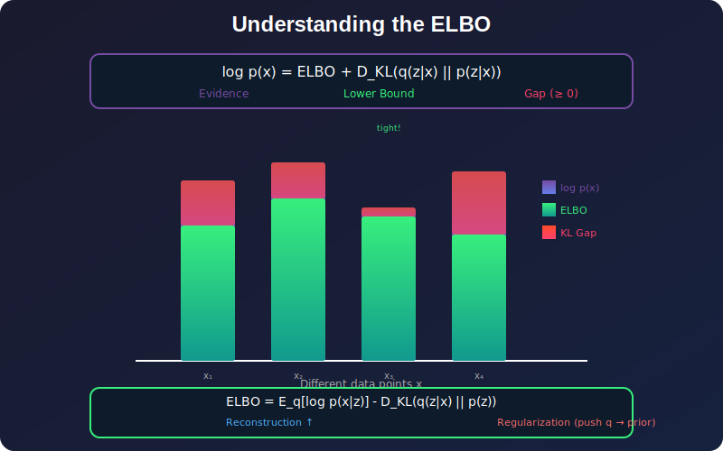
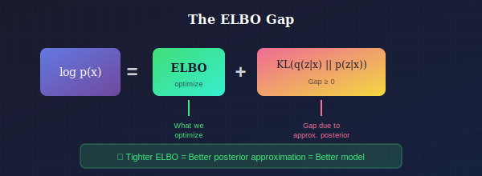

# 📐 ELBO and KL Divergence in VAEs

*The ELBO is a lower bound on log p(x) — the tighter, the better!*

---

## 📖 Introduction

> **TL;DR:** We can't compute log p(x) directly, so we optimize a lower bound called ELBO. The gap between them is the KL divergence between our approximate and true posterior.

The Evidence Lower Bound (ELBO) is the cornerstone of variational inference and VAE training. This document provides rigorous derivations, interpretations, and practical considerations for the ELBO and its KL divergence component.

---

## When and Why ELBO Matters

### Where ELBO is Used

| Context | Why ELBO is Essential |
|---------|----------------------|
| **VAE Training** | Only tractable objective for optimizing latent variable models |
| **Model Comparison** | Higher ELBO = better model (on same data) |
| **Bayesian Deep Learning** | Training Bayesian neural networks with variational inference |
| **Topic Models (LDA)** | Variational inference for document modeling |
| **Probabilistic PCA** | Variational approach to dimensionality reduction |
| **Any Latent Variable Model** | When exact marginal likelihood is intractable |

### Why Understand ELBO Deeply

| Benefit | Explanation |
|---------|-------------|
| **Debugging VAEs** | Understanding ELBO components helps diagnose training issues |
| **Posterior Collapse** | KL term going to zero indicates encoder is being ignored |
| **Capacity Control** | KL term acts as information bottleneck—tune β for desired compression |
| **Model Selection** | ELBO serves as approximate log-likelihood for comparing models |
| **Research** | Many VAE improvements modify ELBO (β-VAE, IWAE, etc.) |

### Key Insight: The ELBO Gap

*The gap between log p(x) and ELBO*

---

## 📊 Representation Comparison

| Representation | Pros | Cons |
|----------------|------|------|
| **Standard ELBO** | Simple, single sample | High variance, loose bound |
| **IWAE (K samples)** | Tighter bound | K forward passes |
| **DReG (Doubly Reparam)** | Lower variance gradients | More complex |
| **β-ELBO** | Controllable KL weight | Hyperparameter tuning |
| **Free-bits** | Prevents posterior collapse | Harder optimization |

---

## 1. Detailed ELBO Derivation

### 1.1 From First Principles

**Goal:** Maximize log-likelihood $\log p_\theta(x)$

**Problem:** $p_\theta(x) = \int p_\theta(x|z)p(z)dz$ is intractable.

**Solution:** Find a tractable lower bound.

### 1.2 Derivation via Jensen's Inequality

$$\log p_\theta(x) = \log \int p_\theta(x, z) dz$$

Introduce any distribution $q(z)$:

$$= \log \int q(z) \frac{p_\theta(x, z)}{q(z)} dz$$

$$= \log \mathbb{E}_{q(z)}\left[\frac{p_\theta(x, z)}{q(z)}\right]$$

Apply Jensen's inequality ($\log$ is concave):

$$\geq \mathbb{E}_{q(z)}\left[\log \frac{p_\theta(x, z)}{q(z)}\right]$$

$$= \mathbb{E}_{q(z)}[\log p_\theta(x, z)] - \mathbb{E}_{q(z)}[\log q(z)]$$

$$= \mathbb{E}_{q(z)}[\log p_\theta(x, z)] + H(q)$$

This is the **ELBO**.

### 1.3 Derivation via KL Divergence

$$D_{KL}(q(z) \| p_\theta(z|x)) = \mathbb{E}_{q(z)}\left[\log \frac{q(z)}{p_\theta(z|x)}\right]$$

$$= \mathbb{E}_{q(z)}[\log q(z)] - \mathbb{E}_{q(z)}[\log p_\theta(z|x)]$$

$$= \mathbb{E}_{q(z)}[\log q(z)] - \mathbb{E}_{q(z)}\left[\log \frac{p_\theta(x, z)}{p_\theta(x)}\right]$$

$$= \mathbb{E}_{q(z)}[\log q(z)] - \mathbb{E}_{q(z)}[\log p_\theta(x, z)] + \log p_\theta(x)$$

Rearranging:

$$\log p_\theta(x) = D_{KL}(q(z) \| p_\theta(z|x)) + \mathbb{E}_{q(z)}[\log p_\theta(x, z)] - \mathbb{E}_{q(z)}[\log q(z)]$$

$$= D_{KL}(q(z) \| p_\theta(z|x)) + \mathcal{L}(q, \theta)$$

Since $D_{KL} \geq 0$:

$$\log p_\theta(x) \geq \mathcal{L}(q, \theta)$$

---

## 2. ELBO Decompositions

### 2.1 Standard Form

$$\mathcal{L} = \mathbb{E}_{q_\phi(z|x)}[\log p_\theta(x|z)] - D_{KL}(q_\phi(z|x) \| p(z))$$

**Interpretation:**
- **Term 1:** Expected reconstruction log-likelihood
- **Term 2:** Complexity penalty (deviation from prior)

### 2.2 Joint Likelihood Form

$$\mathcal{L} = \mathbb{E}_{q_\phi(z|x)}[\log p_\theta(x, z)] + H(q_\phi(z|x))$$

$$= \mathbb{E}_{q_\phi(z|x)}[\log p_\theta(x|z) + \log p(z)] + H(q_\phi(z|x))$$

### 2.3 Importance Weighted Form

$$\mathcal{L} = \mathbb{E}_{q_\phi(z|x)}\left[\log \frac{p_\theta(x, z)}{q_\phi(z|x)}\right]$$

This is the expectation of the log importance weight.

---

## 3. KL Divergence Analysis

### 3.1 General KL Formula

For distributions $P$ and $Q$:

$$D_{KL}(P \| Q) = \int p(x) \log \frac{p(x)}{q(x)} dx = \mathbb{E}_P\left[\log \frac{P(X)}{Q(X)}\right]$$

### 3.2 KL Between Gaussians

**Univariate case:**

$$D_{KL}(\mathcal{N}(\mu_1, \sigma_1^2) \| \mathcal{N}(\mu_2, \sigma_2^2))$$

**Derivation:**

$$= \int \mathcal{N}(x; \mu_1, \sigma_1^2) \log \frac{\mathcal{N}(x; \mu_1, \sigma_1^2)}{\mathcal{N}(x; \mu_2, \sigma_2^2)} dx$$

Let $p_1(x) = \frac{1}{\sqrt{2\pi\sigma_1^2}} \exp\left(-\frac{(x-\mu_1)^2}{2\sigma_1^2}\right)$

$$\log \frac{p_1(x)}{p_2(x)} = \log\frac{\sigma_2}{\sigma_1} - \frac{(x-\mu_1)^2}{2\sigma_1^2} + \frac{(x-\mu_2)^2}{2\sigma_2^2}$$

Taking expectation under $p_1$:

$$D_{KL} = \log\frac{\sigma_2}{\sigma_1} - \frac{1}{2} + \frac{\sigma_1^2 + (\mu_1 - \mu_2)^2}{2\sigma_2^2}$$

$$= \log\frac{\sigma_2}{\sigma_1} + \frac{\sigma_1^2 + (\mu_1 - \mu_2)^2}{2\sigma_2^2} - \frac{1}{2}$$

### 3.3 KL to Standard Normal (VAE Case)

$$D_{KL}(\mathcal{N}(\mu, \sigma^2) \| \mathcal{N}(0, 1))$$

Setting $\mu_2 = 0$, $\sigma_2 = 1$:

$$= \log\frac{1}{\sigma} + \frac{\sigma^2 + \mu^2}{2} - \frac{1}{2}$$

$$= -\log\sigma + \frac{\sigma^2 + \mu^2}{2} - \frac{1}{2}$$

$$= \frac{1}{2}\left(\mu^2 + \sigma^2 - 1 - \log\sigma^2\right)$$

### 3.4 Multivariate KL (Diagonal Covariance)

For $q = \mathcal{N}(\mu, \text{diag}(\sigma^2))$ and $p = \mathcal{N}(0, I)$:

$$D_{KL}(q \| p) = \frac{1}{2}\sum_{j=1}^{d}\left(\mu_j^2 + \sigma_j^2 - 1 - \log\sigma_j^2\right)$$

**Derivation:**

For independent dimensions:
$$D_{KL}(\prod_j q_j \| \prod_j p_j) = \sum_j D_{KL}(q_j \| p_j)$$

Apply univariate formula to each dimension.

### 3.5 Full Covariance KL

For $q = \mathcal{N}(\mu_q, \Sigma_q)$ and $p = \mathcal{N}(\mu_p, \Sigma_p)$:

$$D_{KL}(q \| p) = \frac{1}{2}\left[\log\frac{|\Sigma_p|}{|\Sigma_q|} - d + \text{tr}(\Sigma_p^{-1}\Sigma_q) + (\mu_p - \mu_q)^T\Sigma_p^{-1}(\mu_p - \mu_q)\right]$$

---

## 4. Understanding the ELBO Gap

### 4.1 Tightness of the Bound

$$\log p_\theta(x) = \mathcal{L}(\theta, \phi; x) + D_{KL}(q_\phi(z|x) \| p_\theta(z|x))$$

The bound is **tight** when $q_\phi(z|x) = p_\theta(z|x)$.

### 4.2 Approximate Posterior Gap

The KL gap measures how well $q_\phi$ approximates the true posterior.

**Implications:**
- If $q_\phi$ is misspecified (e.g., mean-field), gap is unavoidable
- Better $q_\phi$ (e.g., normalizing flows) → tighter bound
- Gap affects both learning ($\theta$) and inference ($\phi$)

### 4.3 Amortization Gap

**Definition:** The difference between:
1. Optimal per-instance $q^*(z|x) = \arg\max_q \mathcal{L}(q; x)$
2. Amortized $q_\phi(z|x)$ with shared parameters

**Amortized inference** (using encoder) trades optimality for efficiency.

---

## 5. Information-Theoretic View

### 5.1 Rate-Distortion Interpretation

$$\mathcal{L} = \underbrace{-\mathbb{E}_{p(x)}\mathbb{E}_{q(z|x)}[-\log p_\theta(x|z)]}_{\text{Distortion}} - \underbrace{\mathbb{E}_{p(x)}[D_{KL}(q(z|x) \| p(z))]}_{\text{Rate}}$$

**Rate:** Mutual information $I_q(X; Z)$ upper bounded by KL term
**Distortion:** Reconstruction error

### 5.2 Information Bottleneck

The VAE objective is related to the information bottleneck:

$$\max_{q(z|x)} I(Z; Y) - \beta I(X; Z)$$

VAE with β-weighting:
$$\mathcal{L}_\beta = \text{Reconstruction} - \beta \cdot D_{KL}$$

### 5.3 Bits-Back Coding

VAE provides a compression scheme:
- **Encode:** Send $z \sim q(z|x)$ using $q(z|x)$ as prior → costs $H_q(Z|X)$ bits
- **Decode:** Reconstruct $x$ from $z$ → costs $-\log p(x|z)$ bits
- **Bits back:** Recover bits from $z$ using $p(z)$ → gain $-\log p(z)/q(z|x)$ bits

Net cost = ELBO (in nats/bits).

---

## 6. Practical Considerations

### 6.1 KL Annealing

Start with low KL weight, gradually increase:

$$\mathcal{L}_t = \text{Recon} - \beta_t \cdot D_{KL}$$

where $\beta_t = \min(1, t/T_{anneal})$.

**Why:** Prevents posterior collapse early in training.

### 6.2 Free Bits

Ensure minimum information per dimension:

$$D_{KL} = \sum_j \max(\lambda, D_{KL,j})$$

Forces each latent dimension to encode at least $\lambda$ nats.

### 6.3 KL Balancing

For hierarchical VAEs, balance KL across levels:

$$\mathcal{L} = \text{Recon} - \sum_l \beta_l D_{KL,l}$$

### 6.4 Numerical Stability

Log-variance parameterization:
$$\log\sigma^2 = \text{encoder}(x)$$

KL computation:
$$D_{KL} = \frac{1}{2}\sum_j\left(\mu_j^2 + \exp(\log\sigma_j^2) - 1 - \log\sigma_j^2\right)$$

Clamp $\log\sigma^2$ to prevent numerical issues.

---

## 7. ELBO Variants

### 7.1 Importance Weighted ELBO (IWAE)

$$\mathcal{L}_K = \mathbb{E}_{z_1, \ldots, z_K \sim q}\left[\log \frac{1}{K}\sum_{k=1}^{K} \frac{p_\theta(x, z_k)}{q_\phi(z_k|x)}\right]$$

**Properties:**
- $\mathcal{L}_1 = \mathcal{L}_{ELBO}$
- $\mathcal{L}_K \leq \mathcal{L}_{K+1} \leq \log p(x)$
- As $K \to \infty$: $\mathcal{L}_K \to \log p(x)$

### 7.2 Doubly Reparameterized Gradient

For tighter bounds on encoder gradients:

$$\nabla_\phi \mathcal{L}_K = \mathbb{E}\left[\sum_k \tilde{w}_k \nabla_\phi \log q_\phi(z_k|x)\right]$$

where $\tilde{w}_k$ are normalized importance weights.

### 7.3 χ-VAE (CUBO)

Use χ-divergence instead of KL:

$$\mathcal{L}_\chi = \log\mathbb{E}_{p(z)}\left[\left(\frac{p_\theta(x|z)}{q_\phi(z|x)}\right)^{1-\alpha}\right]^{\frac{1}{1-\alpha}}$$

---

## 8. Visualization of KL Behavior

### 8.1 Per-Dimension KL

Plot $D_{KL,j}$ for each latent dimension:
- High KL: dimension is used
- Low KL: dimension collapsed to prior

### 8.2 KL During Training

Track KL over epochs:
- Should increase initially (learning)
- May decrease with powerful decoder (collapse)

### 8.3 Posterior vs Prior

Visualize $q_\phi(z|x)$ aggregate vs $p(z)$:
- Match indicates regularization working
- Mismatch indicates "holes" in latent space

---

## Key Equations Summary

| Concept | Formula |
|---------|---------|
| ELBO | $\mathcal{L} = \mathbb{E}_q[\log p(x|z)] - D_{KL}(q\|p)$ |
| Gap | $\log p(x) - \mathcal{L} = D_{KL}(q(z|x)\|p(z|x))$ |
| KL (diagonal) | $\frac{1}{2}\sum_j(\mu_j^2 + \sigma_j^2 - 1 - \log\sigma_j^2)$ |
| IWAE bound | $\mathbb{E}[\log\frac{1}{K}\sum_k w_k]$, $w_k = p(x,z_k)/q(z_k|x)$ |

---

## References

1. **Kingma, D. P., & Welling, M.** (2014). "Auto-Encoding Variational Bayes." *ICLR*.
2. **Burda, Y., Grosse, R., & Salakhutdinov, R.** (2016). "Importance Weighted Autoencoders." *ICLR*.
3. **Hoffman, M. D., & Johnson, M. J.** (2016). "ELBO surgery: yet another way to carve up the variational evidence lower bound." *NeurIPS Workshop*.
4. **Alemi, A., et al.** (2018). "Fixing a Broken ELBO." *ICML*.

---

## Exercises

1. **Derive** the KL divergence between two full-covariance Gaussians.

2. **Prove** that $\mathcal{L}_K \leq \mathcal{L}_{K+1}$ for the IWAE bound.

3. **Implement** per-dimension KL tracking and identify which dimensions are "active."

4. **Compare** standard ELBO vs. IWAE on a simple dataset—which gives tighter bounds?

5. **Visualize** the gap $\log p(x) - \mathcal{L}$ using importance sampling estimates.

---

**[← Back to VAE](../)** | **[Next: Reparameterization Trick →](../02_reparameterization_trick/)**

