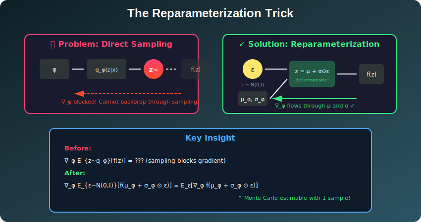
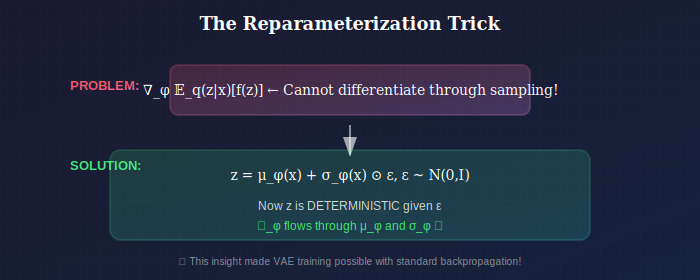
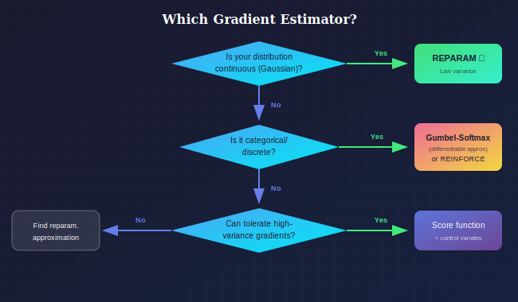

# ⚡ The Reparameterization Trick

<div align="center">



*The key insight that made VAE training possible*

</div>

---

## 📖 Introduction

> **TL;DR:** You can't backprop through sampling z ~ q(z|x). But if you write z = μ + σ⊙ε where ε ~ N(0,I), now z is a deterministic function of (μ, σ, ε) and gradients flow!

The reparameterization trick is a fundamental technique that enables gradient-based optimization through stochastic nodes. It transforms the problem of differentiating through sampling into differentiating through deterministic functions, making VAE training possible with standard backpropagation.

---

## When and Why to Use Reparameterization

### Where Reparameterization is Used

| Context | Why It's Needed |
|---------|-----------------|
| **VAE Training** | Backprop through z ~ q(z|x) is impossible without it |
| **Stochastic Neural Networks** | Any network with sampling layers needs gradient estimators |
| **Bayesian Neural Networks** | Training weight distributions requires reparameterization |
| **Reinforcement Learning** | Policy gradient for continuous action spaces |
| **Generative Models** | Any model sampling from learned distributions |
| **Normalizing Flows** | Gradient through invertible transforms |

### Why Reparameterization Over Alternatives

| Method | Variance | When to Use |
|--------|----------|-------------|
| **Reparameterization** | **Low** ✓ | Continuous distributions (Gaussian, etc.) |
| **Score Function (REINFORCE)** | High | Discrete distributions, non-differentiable f |
| **Gumbel-Softmax** | Low | Categorical/discrete with continuous relaxation |
| **Straight-Through** | Medium | Binary/discrete with biased gradients acceptable |

### The Core Insight

<div align="center">



*The key insight that made VAE training possible*

</div>

### Decision: When to Use Which Gradient Estimator

<div align="center">



*Choosing the right gradient estimator*

</div>

---

## 📊 Representation Comparison

| Representation | Pros | Cons |
|----------------|------|------|
| **Reparameterization** | Low variance, simple | Requires continuous |
| **Score Function (REINFORCE)** | Works for discrete | High variance |
| **Gumbel-Softmax** | Differentiable discrete | Temperature tuning |
| **Straight-Through** | Simple, works in practice | Biased gradients |
| **Implicit Reparam** | General distributions | Complex implementation |

---

## 1. The Problem

### 1.1 Gradient Through Expectations

We need to compute:

$$\nabla_\phi \mathbb{E}_{z \sim q_\phi(z|x)}[f(z)]$$

where $f(z) = \log p_\theta(x|z)$ in the VAE context.

### 1.2 Why It's Difficult

**The sampling operation $z \sim q_\phi(z|x)$ is not differentiable!**

$$\frac{\partial z}{\partial \phi} = \frac{\partial}{\partial \phi}[\text{sample from } q_\phi] = \text{undefined}$$

The randomness "blocks" the gradient.

### 1.3 Naive Approach: Score Function Estimator

**REINFORCE / Score Function Gradient:**

$$\nabla_\phi \mathbb{E}_{q_\phi}[f(z)] = \mathbb{E}_{q_\phi}[f(z) \nabla_\phi \log q_\phi(z|x)]$$

**Proof:**
$$\nabla_\phi \mathbb{E}_{q_\phi}[f(z)] = \nabla_\phi \int q_\phi(z|x) f(z) dz = \int f(z) \nabla_\phi q_\phi(z|x) dz$$

$$= \int f(z) q_\phi(z|x) \frac{\nabla_\phi q_\phi(z|x)}{q_\phi(z|x)} dz = \int f(z) q_\phi(z|x) \nabla_\phi \log q_\phi(z|x) dz$$

$$= \mathbb{E}_{q_\phi}[f(z) \nabla_\phi \log q_\phi(z|x)]$$

**Problem:** Very high variance! Requires many samples for stable gradients.

---

## 2. The Reparameterization Trick

### 2.1 Key Insight

Instead of sampling $z$ directly from $q_\phi(z|x)$, express $z$ as a **deterministic function** of $\phi$ and a **noise variable** $\epsilon$:

$$z = g_\phi(\epsilon, x)$$

where $\epsilon \sim p(\epsilon)$ is independent of $\phi$.

### 2.2 For Gaussian Distributions

If $q_\phi(z|x) = \mathcal{N}(\mu_\phi(x), \sigma^2_\phi(x))$:

$$\epsilon \sim \mathcal{N}(0, I)$$
$$z = \mu_\phi(x) + \sigma_\phi(x) \odot \epsilon$$

Now $z$ is a deterministic function of $(\mu_\phi, \sigma_\phi, \epsilon)$.

### 2.3 Gradient Computation

$$\nabla_\phi \mathbb{E}_{z \sim q_\phi}[f(z)] = \nabla_\phi \mathbb{E}_{\epsilon \sim p(\epsilon)}[f(g_\phi(\epsilon, x))]$$

$$= \mathbb{E}_{\epsilon}\left[\nabla_\phi f(g_\phi(\epsilon, x))\right]$$

$$= \mathbb{E}_{\epsilon}\left[\nabla_z f(z) \cdot \nabla_\phi g_\phi(\epsilon, x)\right]$$

This can be estimated with Monte Carlo using a single sample!

### 2.4 Explicit Gradients for Gaussian VAE

For $z = \mu + \sigma \odot \epsilon$:

$$\frac{\partial z}{\partial \mu} = I$$

$$\frac{\partial z}{\partial \sigma} = \text{diag}(\epsilon)$$

For the reconstruction term $\mathcal{L}_{recon} = \log p_\theta(x|z)$:

$$\frac{\partial \mathcal{L}_{recon}}{\partial \mu} = \frac{\partial \mathcal{L}_{recon}}{\partial z} \cdot \frac{\partial z}{\partial \mu} = \frac{\partial \mathcal{L}_{recon}}{\partial z}$$

$$\frac{\partial \mathcal{L}_{recon}}{\partial \sigma} = \frac{\partial \mathcal{L}_{recon}}{\partial z} \odot \epsilon$$

---

## 3. Mathematical Formalization

### 3.1 Reparameterizable Distributions

A distribution $q_\phi(z)$ is **reparameterizable** if there exists:
1. A base distribution $p(\epsilon)$ independent of $\phi$
2. A differentiable function $g_\phi$ such that $z = g_\phi(\epsilon)$ implies $z \sim q_\phi$

### 3.2 Location-Scale Families

Any location-scale distribution is reparameterizable:

$$q_\phi(z) = \frac{1}{\sigma}h\left(\frac{z - \mu}{\sigma}\right)$$

Reparameterization: $z = \mu + \sigma \cdot \epsilon$ where $\epsilon \sim h(\cdot)$.

**Examples:**
- Gaussian: $\epsilon \sim \mathcal{N}(0, 1)$
- Laplace: $\epsilon \sim \text{Laplace}(0, 1)$
- Logistic: $\epsilon \sim \text{Logistic}(0, 1)$

### 3.3 Inverse CDF Method

For any distribution with invertible CDF $F$:

$$\epsilon \sim \text{Uniform}(0, 1)$$
$$z = F^{-1}(\epsilon)$$

Then $z \sim F$.

**Limitation:** Requires tractable inverse CDF.

---

## 4. Variance Analysis

### 4.1 Score Function vs. Reparameterization

**Score function estimator:**
$$\hat{g}_{SF} = f(z) \nabla_\phi \log q_\phi(z)$$

$$\text{Var}(\hat{g}_{SF}) = \mathbb{E}[f(z)^2 (\nabla_\phi \log q_\phi)^2] - (\nabla_\phi \mathbb{E}[f(z)])^2$$

**Reparameterization estimator:**
$$\hat{g}_{RP} = \nabla_\phi f(g_\phi(\epsilon))$$

$$\text{Var}(\hat{g}_{RP}) = \mathbb{E}[(\nabla_\phi f)^2] - (\nabla_\phi \mathbb{E}[f])^2$$

### 4.2 Why Reparameterization Has Lower Variance

The score function estimator's variance depends on $f(z)^2$, which can be very large.

The reparameterization estimator's variance depends only on the gradient magnitude, which is typically smaller.

**Empirically:** Reparameterization often has **orders of magnitude lower variance**.

### 4.3 Variance Reduction for Score Function

**Control variates:**
$$\hat{g}_{CV} = (f(z) - b) \nabla_\phi \log q_\phi(z)$$

where $b$ is a baseline that doesn't depend on $z$.

**Optimal baseline:** $b^* = \frac{\mathbb{E}[f(z)(\nabla\log q)^2]}{\mathbb{E}[(\nabla\log q)^2]}$

---

## 5. Beyond Gaussian: Other Distributions

### 5.1 Categorical (Gumbel-Softmax)

For categorical distributions, direct reparameterization is not possible (discrete).

**Gumbel-Max Trick:**

$$z = \text{one\_hot}(\arg\max_k [g_k + \log \pi_k])$$

where $g_k \sim \text{Gumbel}(0, 1)$.

**Gumbel-Softmax (Relaxation):**

$$z_k = \frac{\exp((\log \pi_k + g_k)/\tau)}{\sum_j \exp((\log \pi_j + g_j)/\tau)}$$

Temperature $\tau \to 0$: approaches one-hot
Temperature $\tau \to \infty$: approaches uniform

**Reference:** Jang et al. (2017). "Categorical Reparameterization with Gumbel-Softmax."

### 5.2 Bernoulli (Concrete Distribution)

Binary relaxation:

$$z = \sigma\left(\frac{\log u - \log(1-u) + \log\frac{\pi}{1-\pi}}{\tau}\right)$$

where $u \sim \text{Uniform}(0, 1)$.

### 5.3 Gamma Distribution

$$z \sim \text{Gamma}(\alpha, \beta)$$

**Reparameterization (Figurnov et al., 2018):**

$$z = \beta \cdot \left(\alpha - \frac{1}{3} + \frac{\epsilon}{\sqrt{9\alpha - 3}}\right)^3$$

where $\epsilon \sim \mathcal{N}(0, 1)$ (approximately).

### 5.4 Von Mises-Fisher (Directional)

For data on spheres:

$$z \sim \text{vMF}(\mu, \kappa)$$

**Rejection sampling based reparameterization** (Davidson et al., 2018).

---

## 6. Implicit Reparameterization

### 6.1 The Implicit Function Theorem

For distributions defined implicitly through constraints:

If $z \sim q_\phi$ is defined by $h(z, \phi) = 0$, then:

$$\frac{dz}{d\phi} = -\left(\frac{\partial h}{\partial z}\right)^{-1} \frac{\partial h}{\partial \phi}$$

### 6.2 Application: Normalizing Flows

Flow: $z = f_\phi(\epsilon)$ where $\epsilon \sim p(\epsilon)$

Gradient through flow:
$$\frac{\partial z}{\partial \phi} = \frac{\partial f_\phi}{\partial \phi}$$

Log-density gradient requires $\det(\partial f / \partial \epsilon)$.

---

## 7. Pathwise vs. Score Function: When to Use What

### 7.1 Use Reparameterization When:

- Distribution is continuous
- Reparameterization is available
- Low variance is crucial
- Few samples per update

### 7.2 Use Score Function When:

- Distribution is discrete
- Reparameterization not available
- Combined with control variates
- Working with non-differentiable $f$

### 7.3 Hybrid Approaches

**Straight-Through Estimator:**
- Forward: use discrete samples
- Backward: pretend continuous (use soft approximation)

**REBAR, RELAX:**
- Combine score function with control variates from continuous relaxation

---

## 8. Implementation Details

### 8.1 Standard Implementation

```python
def reparameterize(mu, log_var):
    """
    Reparameterization trick for Gaussian.
    
    Args:
        mu: Mean of q(z|x), shape [batch, latent_dim]
        log_var: Log variance of q(z|x), shape [batch, latent_dim]
    
    Returns:
        z: Sampled latent, shape [batch, latent_dim]
    """
    std = torch.exp(0.5 * log_var)
    eps = torch.randn_like(std)
    return mu + eps * std
```

### 8.2 Numerical Stability

**Problem:** Very small $\sigma$ → gradient explosion

**Solutions:**
1. Clamp log_var: `log_var = torch.clamp(log_var, -20, 2)`
2. Softplus for $\sigma$: `std = F.softplus(raw_std)`
3. Add small constant: `std = torch.exp(0.5 * log_var) + 1e-6`

### 8.3 Multiple Samples

```python
def reparameterize_k_samples(mu, log_var, k):
    """Sample k times for each input."""
    std = torch.exp(0.5 * log_var)
    # [batch, k, latent_dim]
    eps = torch.randn(mu.size(0), k, mu.size(1))
    # Broadcast: [batch, 1, latent] + [batch, k, latent]
    return mu.unsqueeze(1) + eps * std.unsqueeze(1)
```

---

## 9. Extensions and Advanced Topics

### 9.1 Stochastic Gradient Variational Bayes (SGVB)

The reparameterization trick enables **doubly stochastic** optimization:
1. Stochastic over data (mini-batches)
2. Stochastic over latent (Monte Carlo)

### 9.2 Importance Weighted Reparameterization

For IWAE:
$$\mathcal{L}_K = \mathbb{E}\left[\log \frac{1}{K}\sum_{k=1}^K w_k\right]$$

Need gradients through log-sum-exp of importance weights.

### 9.3 Reparameterized Rejection Sampling

For complex distributions, combine reparameterization with rejection:

1. Reparameterize proposal
2. Accept/reject (non-differentiable step)
3. Use surrogate gradient for rejection step

---

## Key Equations Summary

| Concept | Formula |
|---------|---------|
| Gaussian reparam | $z = \mu + \sigma \odot \epsilon$, $\epsilon \sim \mathcal{N}(0,I)$ |
| Gradient | $\nabla_\phi \mathbb{E}_q[f] = \mathbb{E}_\epsilon[\nabla_\phi f(g_\phi(\epsilon))]$ |
| Score function | $\nabla_\phi \mathbb{E}_q[f] = \mathbb{E}_q[f \nabla_\phi \log q]$ |
| Gumbel-Softmax | $z_k \propto \exp((\log\pi_k + g_k)/\tau)$ |

---

## References

### Foundational
1. **Kingma, D. P., & Welling, M.** (2014). "Auto-Encoding Variational Bayes." *ICLR*.
2. **Rezende, D. J., Mohamed, S., & Wierstra, D.** (2014). "Stochastic Backpropagation and Approximate Inference in Deep Generative Models." *ICML*.

### Categorical Reparameterization
3. **Jang, E., Gu, S., & Poole, B.** (2017). "Categorical Reparameterization with Gumbel-Softmax." *ICLR*.
4. **Maddison, C. J., Mnih, A., & Teh, Y. W.** (2017). "The Concrete Distribution: A Continuous Relaxation of Discrete Random Variables." *ICLR*.

### Variance Reduction
5. **Tucker, G., et al.** (2017). "REBAR: Low-variance, unbiased gradient estimates for discrete latent variable models." *NeurIPS*.
6. **Grathwohl, W., et al.** (2018). "Backpropagation through the Void: Optimizing control variates for black-box gradient estimation." *ICLR*.

### Extensions
7. **Figurnov, M., Mohamed, S., & Mnih, A.** (2018). "Implicit Reparameterization Gradients." *NeurIPS*.
8. **Davidson, T. R., et al.** (2018). "Hyperspherical Variational Auto-Encoders." *UAI*.

---

## Exercises

1. **Derive** the reparameterized gradient for a Laplace distribution.

2. **Implement** Gumbel-Softmax for a VAE with discrete latent variables.

3. **Compare** variance of score function vs. reparameterization estimators empirically.

4. **Prove** that the score function estimator is unbiased.

5. **Implement** importance-weighted gradient estimation for IWAE.

---

<div align="center">

**[← ELBO and KL](../01_elbo_and_kl/)** | **[Next: β-VAE →](../03_beta_vae/)**

</div>
