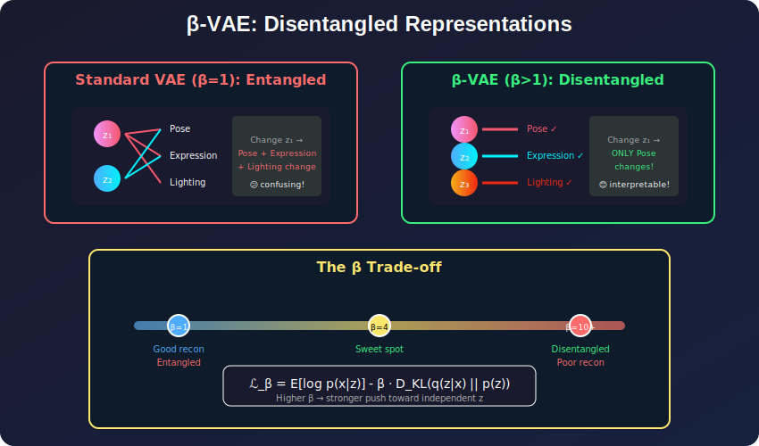
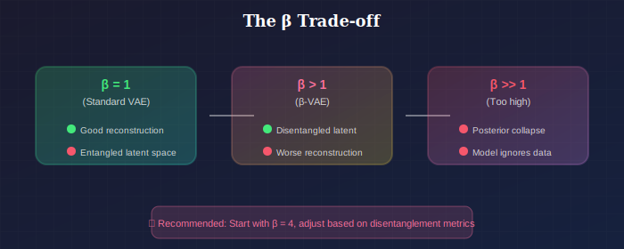
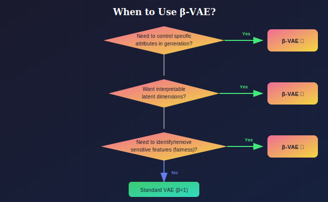

# 🎛️ β-VAE: Disentangled Representation Learning

*Each latent dimension controls ONE attribute — pose, expression, lighting separately*

---

## 📖 Introduction

> **TL;DR:** Multiply the KL term by β > 1, and magic happens! Each latent dimension starts to control a single, interpretable attribute.

β-VAE (Higgins et al., 2017) is a simple but powerful modification to the VAE that encourages **disentangled representations** by increasing the weight on the KL divergence term. Disentangled representations have individual latent dimensions that correspond to independent factors of variation in the data.

---

## When to Use β-VAE

### Where to Use

| Domain | Use Case | Why β-VAE Works |
|--------|----------|-----------------|
| **Controllable Generation** | Manipulating specific attributes (smile, pose, lighting) | Each z_i controls one attribute |
| **Explainable AI** | Understanding what model learned | Disentangled = interpretable |
| **Fair ML** | Identifying/removing sensitive attributes | Isolate and control bias factors |
| **Transfer Learning** | Features that generalize across domains | Independent factors transfer better |
| **Data Augmentation** | Generating targeted variations | Change one factor while preserving others |
| **Causal Representation** | Learning causal variables | Disentanglement approximates causal structure |

### Why Choose β-VAE (vs. Standard VAE)

| Choose β-VAE When... | Stick with Standard VAE When... |
|----------------------|--------------------------------|
| **Interpretability** of latent space matters | Black-box latent is acceptable |
| You need **controllable** generation | Random sampling is sufficient |
| Want to **isolate** factors of variation | Entangled features are fine |
| **Downstream tasks** benefit from disentanglement | Only generation quality matters |
| Willing to trade **reconstruction quality** | Reconstruction is paramount |

### Key Trade-off

*The trade-off between reconstruction and disentanglement*

### Decision Flowchart

*When to choose β-VAE*

### Industry & Research Examples

1. **Deepmind (original β-VAE):** Understanding visual concepts in games
2. **Fair ML Research:** Removing protected attributes from representations
3. **Drug Discovery:** Controlling molecular properties independently
4. **Face Generation:** Separate control of identity, expression, lighting, pose
5. **Robotics:** Learning disentangled state representations for planning

---

## 📊 Representation Comparison

| Representation | Pros | Cons |
|----------------|------|------|
| **β-VAE (β>1)** | Simple, disentanglement | Worse reconstruction |
| **β-TCVAE** | Targets TC specifically | More complex |
| **FactorVAE** | Adversarial TC minimization | Training instability |
| **DIP-VAE** | Covariance constraints | Hyperparameter sensitive |
| **InfoGAN** | GAN-quality + controllable | Harder to train |

---

## 1. Motivation: What is Disentanglement?

### 1.1 Definition

A representation is **disentangled** if single latent dimensions correspond to single generative factors.

**Example (faces):**
- $z_1$: controls pose (left-right)
- $z_2$: controls expression (smile)
- $z_3$: controls lighting
- etc.

Changing one dimension changes only one aspect of the generated image.

### 1.2 Why Disentanglement Matters

**Interpretability:** Understand what the model learned

**Controllability:** Manipulate specific attributes

**Generalization:** Better transfer to downstream tasks

**Fairness:** Identify and control sensitive attributes

### 1.3 Entangled vs. Disentangled

**Entangled:** Each $z_i$ affects multiple factors
$$\text{pose} = f(z_1, z_2, z_3), \quad \text{expression} = g(z_1, z_2, z_4)$$

**Disentangled:** Each $z_i$ affects one factor
$$\text{pose} = f(z_1), \quad \text{expression} = g(z_2)$$

---

## 2. β-VAE Formulation

### 2.1 Modified Objective

$$\mathcal{L}_\beta = \mathbb{E}_{q_\phi(z|x)}[\log p_\theta(x|z)] - \beta \cdot D_{KL}(q_\phi(z|x) \| p(z))$$

**Only change:** Multiply KL term by $\beta > 1$.

### 2.2 Effect of β > 1

**Higher pressure** to match posterior to prior:
- Prior $p(z) = \mathcal{N}(0, I)$ has **independent** dimensions
- Forcing $q(z|x) \approx p(z)$ encourages **independence** in posterior
- Independence promotes disentanglement

### 2.3 Trade-off

**β = 1:** Standard VAE (may be entangled but good reconstruction)

**β > 1:** Better disentanglement but worse reconstruction

**β >> 1:** Strong disentanglement but posterior collapse

---

## 3. Theoretical Analysis

### 3.1 Information Bottleneck View

The VAE objective can be written as:

$$\mathcal{L} = I_q(X; Z) - \beta \cdot D_{KL}(q(z|x) \| p(z))$$

where $I_q(X; Z)$ is the mutual information under the variational distribution.

**Key insight:** The KL term upper bounds mutual information:
$$I_q(X; Z) \leq D_{KL}(q(z|x) \| p(z))$$

Increasing $\beta$ constrains the **information capacity** of the channel $X \to Z$.

### 3.2 Rate-Distortion Interpretation

$$\mathcal{L}_\beta = -\underbrace{D}_{\text{Distortion}} - \beta \underbrace{R}_{\text{Rate}}$$

where:
- $D = -\mathbb{E}[\log p(x|z)]$: reconstruction error
- $R = D_{KL}(q(z|x) \| p(z))$: information rate

Higher $\beta$ → lower rate → must use **efficient** encoding → disentanglement.

### 3.3 Why Does This Promote Disentanglement?

**Argument 1 (Statistical efficiency):**
- If true generative factors are independent
- Most efficient encoding uses independent latent dimensions
- Constrained capacity forces efficient encoding

**Argument 2 (Axis alignment):**
- Isotropic Gaussian prior $\mathcal{N}(0, I)$ is axis-aligned
- Matching posterior to prior promotes axis-aligned structure
- If data has axis-aligned factors, latent will align

**Argument 3 (Information-theoretic):**
- Total Correlation: $TC(z) = D_{KL}(q(z) \| \prod_j q(z_j))$
- Lower capacity → lower TC → more independence

---

## 4. Extensions and Variants

### 4.1 Understanding β-VAE Objective

Decompose the KL term (Hoffman & Johnson, 2016):

$$\mathbb{E}_{p(x)}[D_{KL}(q(z|x) \| p(z))] = \underbrace{I_q(X; Z)}_{\text{Index-Code MI}} + \underbrace{D_{KL}(q(z) \| p(z))}_{\text{Marginal KL}}$$

Different terms encourage different properties.

### 4.2 β-TCVAE (Chen et al., 2018)

Decompose KL into three terms:

$$D_{KL}(q(z|x) \| p(z)) = \underbrace{I_q(X; Z)}_{\text{MI}} + \underbrace{TC(z)}_{\text{Total Correlation}} + \underbrace{\sum_j D_{KL}(q(z_j) \| p(z_j))}_{\text{Dimension-wise KL}}$$

**β-TCVAE:** Only penalize the Total Correlation term:

$$\mathcal{L}_{\beta-TC} = \mathbb{E}[\log p(x|z)] - I_q(X;Z) - \beta \cdot TC(z) - \sum_j D_{KL}(q(z_j)\|p(z_j))$$

This targets disentanglement directly without overly constraining capacity.

### 4.3 FactorVAE (Kim & Mnih, 2018)

Use adversarial training to minimize Total Correlation:

$$\mathcal{L}_{Factor} = \mathcal{L}_{VAE} + \gamma \cdot D_{KL}(q(z) \| \bar{q}(z))$$

where $\bar{q}(z) = \prod_j q(z_j)$ (product of marginals).

Discriminator distinguishes $q(z)$ from $\bar{q}(z)$ (shuffled dimensions).

### 4.4 DIP-VAE (Kumar et al., 2018)

Directly penalize covariance structure:

**DIP-VAE-I:**
$$\mathcal{L}_{DIP-I} = \mathcal{L}_{VAE} + \lambda_{od}\sum_{i \neq j} [\text{Cov}_q(z)]_{ij}^2 + \lambda_d \sum_i ([\text{Cov}_q(z)]_{ii} - 1)^2$$

**DIP-VAE-II:** Penalize covariance of expected posterior:
$$\text{Cov}(\mathbb{E}_{q(z|x)}[z])$$

### 4.5 Comparison

| Method | What it penalizes | Advantage |
|--------|-------------------|-----------|
| β-VAE | Total KL | Simple |
| β-TCVAE | Total Correlation | Targeted |
| FactorVAE | TC (adversarial) | No sampling bias |
| DIP-VAE | Covariance | Direct constraint |

---

## 5. Measuring Disentanglement

### 5.1 Quantitative Metrics

#### β-VAE Metric (Higgins et al., 2017)

1. Generate data varying one factor
2. Encode to latent space
3. Train classifier to predict which factor varied
4. Accuracy measures disentanglement

#### FactorVAE Metric (Kim & Mnih, 2018)

Similar but uses majority vote instead of classifier:
1. For each factor, find dimension with highest variance
2. Check if correct factor is predicted

#### Mutual Information Gap (MIG)

$$\text{MIG} = \frac{1}{K}\sum_k \frac{1}{H(v_k)}\left(I(z_{j^{(k)}}; v_k) - \max_{j \neq j^{(k)}} I(z_j; v_k)\right)$$

where $j^{(k)} = \arg\max_j I(z_j; v_k)$.

Measures gap between top two latent dimensions for each factor.

#### DCI Disentanglement (Eastwood & Williams, 2018)

Three metrics:
- **Disentanglement:** Each code captures at most one factor
- **Completeness:** Each factor captured by at most one code
- **Informativeness:** Codes are predictive of factors

### 5.2 Qualitative Evaluation

**Latent traversals:** Vary one $z_j$ while fixing others, visualize generated images.

If disentangled: each traversal changes one semantic attribute.

---

## 6. Challenges and Limitations

### 6.1 Reconstruction-Disentanglement Trade-off

Higher β improves disentanglement but hurts reconstruction.

**Pareto frontier:** Cannot improve both simultaneously.

### 6.2 Supervision and Identifiability

**Theorem (Locatello et al., 2019):** Unsupervised disentanglement is theoretically impossible without inductive biases.

Different random seeds → different disentangled representations.

**Implications:**
- Need some supervision or strong inductive biases
- Evaluation requires ground truth factors (synthetic datasets)

### 6.3 Dataset Dependence

Disentanglement metrics depend heavily on:
- Dataset (dSprites, 3DShapes, CelebA)
- Ground truth factors available
- Correlation structure of data

### 6.4 What "Disentangled" Means

Different communities have different definitions:
- Independent factors (statistical)
- Axis-aligned (geometric)
- Interpretable (semantic)
- Equivariant (group-theoretic)

---

## 7. Practical Guidelines

### 7.1 Choosing β

**Start:** β = 4 (common in literature)

**Increase if:**
- Latent traversals show entanglement
- Reconstruction is good but features are coupled

**Decrease if:**
- Reconstruction quality is poor
- Posterior collapse (KL → 0)

### 7.2 Architecture Considerations

**Decoder capacity:** Weaker decoder may force more information through z

**Latent dimension:** Too high → unused dimensions; too low → entanglement

**Typical:** 10-32 latent dimensions for visual datasets

### 7.3 Training Tips

1. **KL annealing:** Still useful, anneal to target β
2. **Monitor per-dimension KL:** Check for collapse
3. **Visualize traversals:** Qualitative check during training
4. **Multiple seeds:** Results can vary significantly

---

## 8. Applications

### 8.1 Controllable Generation

Manipulate latent codes to control generated outputs:
- Change expression while keeping identity
- Modify object attributes
- Style transfer

### 8.2 Fair Representation Learning

Identify and remove sensitive attributes:
- Find latent dimension for gender, age, etc.
- Generate counterfactuals
- Train fair classifiers

### 8.3 Transfer Learning

Disentangled representations often transfer better:
- Few-shot learning
- Domain adaptation
- Zero-shot generalization

### 8.4 Causal Representation Learning

Disentanglement related to causal variables:
- Identifiable factors may correspond to causal mechanisms
- Intervention on one doesn't affect others

---

## Key Equations Summary

| Concept | Formula |
|---------|---------|
| β-VAE | $\mathcal{L}_\beta = \mathbb{E}[\log p(x|z)] - \beta D_{KL}(q\|p)$ |
| Total Correlation | $TC(z) = D_{KL}(q(z) \| \prod_j q(z_j))$ |
| KL Decomposition | $D_{KL} = I(X;Z) + TC(z) + \sum_j D_{KL}(q_j\|p_j)$ |
| MIG Metric | $\frac{1}{K}\sum_k \frac{I_{top} - I_{second}}{H(v_k)}$ |

---

## References

### Foundational
1. **Higgins, I., et al.** (2017). "β-VAE: Learning Basic Visual Concepts with a Constrained Variational Framework." *ICLR*.
2. **Burgess, C. P., et al.** (2018). "Understanding disentangling in β-VAE." *NeurIPS Workshop*. [arXiv:1804.03599](https://arxiv.org/abs/1804.03599)

### Extensions
3. **Chen, R. T. Q., et al.** (2018). "Isolating Sources of Disentanglement in Variational Autoencoders." *NeurIPS*. [arXiv:1802.04942](https://arxiv.org/abs/1802.04942)
4. **Kim, H., & Mnih, A.** (2018). "Disentangling by Factorising." *ICML*. [arXiv:1802.05983](https://arxiv.org/abs/1802.05983)
5. **Kumar, A., Sattigeri, P., & Balakrishnan, A.** (2018). "Variational Inference of Disentangled Latent Concepts from Unlabeled Observations." *ICLR*.

### Evaluation and Limitations
6. **Locatello, F., et al.** (2019). "Challenging Common Assumptions in the Unsupervised Learning of Disentangled Representations." *ICML*. [arXiv:1811.12359](https://arxiv.org/abs/1811.12359)
7. **Eastwood, C., & Williams, C. K. I.** (2018). "A Framework for the Quantitative Evaluation of Disentangled Representations." *ICLR*.

---

## Exercises

1. **Implement** β-VAE and compare latent traversals for β = 1, 4, 10 on dSprites.

2. **Compute** the MIG metric for your trained models.

3. **Visualize** the reconstruction-disentanglement trade-off curve.

4. **Implement** β-TCVAE and compare to standard β-VAE.

5. **Reproduce** the finding that random seeds significantly affect disentanglement metrics.

---

**[← Reparameterization Trick](../02_reparameterization_trick/)** | **[Next: Hierarchical VAE →](../04_hierarchical_vae/)**

