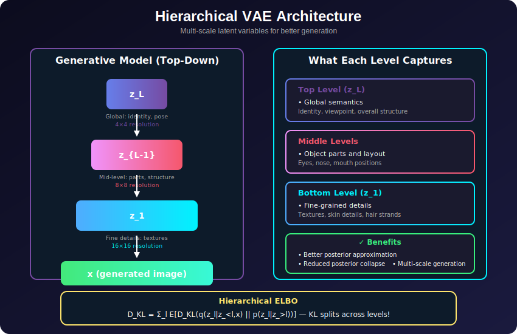
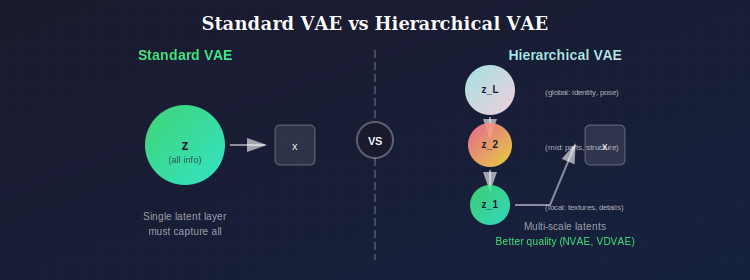
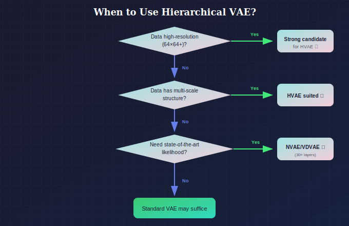
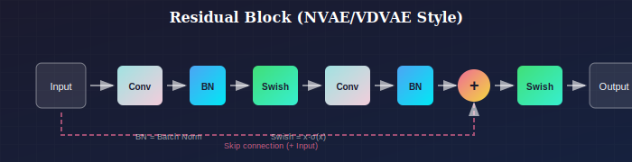

# 🏗️ Hierarchical Variational Autoencoders

*Multi-scale latents: global structure at the top, fine details at the bottom*

---

## 📖 Introduction

> **TL;DR:** Instead of one z, use a hierarchy z_L → z_{L-1} → ... → z_1 → x. Top levels capture global semantics, bottom levels capture fine details. This is how NVAE achieves GAN-level quality!

Hierarchical VAEs extend the standard VAE by using multiple layers of latent variables, enabling more expressive posterior approximations and better modeling of complex, multi-scale data structures. These models have become the foundation for state-of-the-art likelihood-based generative models like NVAE and VDVAE.

---

## When to Use Hierarchical VAEs

### Where to Use

| Domain | Use Case | Why Hierarchical Works |
|--------|----------|------------------------|
| **High-Resolution Image Generation** | Generating 256×256+ images | Multi-scale latents capture global→local structure |
| **Complex Data Distributions** | Data with multi-level structure | Hierarchy matches data complexity |
| **State-of-the-Art Likelihood** | When you need best bits/dim | NVAE, VDVAE achieve near-autoregressive quality |
| **Progressive Encoding/Decoding** | Coarse-to-fine generation | Natural for streaming/progressive applications |
| **Learning Hierarchical Representations** | Semantic→syntactic features | Top levels=concepts, bottom levels=details |
| **Image Compression** | Progressive/scalable codecs | Different levels = different quality layers |

### Why Choose Hierarchical VAE (vs. Standard VAE)

| Choose Hierarchical VAE When... | Stick with Standard VAE When... |
|---------------------------------|--------------------------------|
| Modeling **high-resolution** images | Low-resolution or simple data |
| Standard VAE has **poor likelihood** | Standard VAE works well enough |
| Data has **multi-scale structure** | Data is relatively flat/simple |
| Need **state-of-the-art** VAE quality | Simplicity is preferred |
| Have **compute resources** for deep models | Limited compute budget |
| Standard VAE suffers **posterior collapse** | No collapse issues |

### Key Benefits

*Multi-scale latents capture global→local structure*

**Result:** Better posterior approximation, more expressive model, reduced collapse

### Performance Comparison (bits/dim, lower = better)

| Model | CIFAR-10 | ImageNet 32×32 |
|-------|----------|----------------|
| Standard VAE | ~4.5 | ~4.5 |
| Hierarchical (Ladder) | ~3.9 | ~3.9 |
| NVAE | ~2.91 | ~3.13 |
| VDVAE | — | ~2.87 |

### Decision Flowchart

*When to choose Hierarchical VAE*

### Industry & Research Examples

1. **NVIDIA (NVAE):** High-fidelity face generation competitive with GANs
2. **Image Compression:** Progressive codecs with hierarchical latents
3. **Medical Imaging:** Multi-resolution analysis of pathology slides
4. **Video Generation:** Hierarchical models for temporal + spatial structure
5. **Audio (WaveNet variants):** Multi-scale audio modeling

---

## 📊 Representation Comparison

| Representation | Pros | Cons |
|----------------|------|------|
| **Ladder VAE** | Bottom-up + top-down | Complex training |
| **NVAE** | SOTA image quality | Very deep, expensive |
| **VD-VAE** | Video + hierarchical | High memory usage |
| **BIVA** | Bidirectional inference | Slower inference |
| **ResNet VAE** | Residual posterior | Moderate improvement |

---

## 1. Motivation

### 1.1 Limitations of Single-Layer VAE

**Posterior approximation gap:**
- Mean-field Gaussian $q(z|x)$ may be too simple
- True posterior $p(z|x)$ can be complex, multimodal

**Limited expressiveness:**
- Single latent layer must capture all variation
- Difficult to model hierarchical structure in data

**Posterior collapse:**
- Powerful decoders ignore latent variables
- Information bottleneck not utilized

### 1.2 Why Hierarchies?

**Multi-scale structure:**
- Images have coarse (global) and fine (local) features
- Hierarchy naturally captures this

**More flexible posteriors:**
- Composition of simple distributions can approximate complex ones
- Similar to normalizing flows

**Better optimization:**
- Shorter paths between latents and pixels
- Reduced posterior collapse

---

## 2. Model Architecture

### 2.1 Generative Model (Top-Down)

Hierarchical prior with $L$ levels:

$$p_\theta(z) = p(z_L) \prod_{l=1}^{L-1} p_\theta(z_l | z_{>l})$$

Likelihood:
$$p_\theta(x | z) = p_\theta(x | z_1, \ldots, z_L)$$

Joint distribution:
$$p_\theta(x, z_{1:L}) = p_\theta(x | z_{1:L}) \cdot p(z_L) \prod_{l=1}^{L-1} p_\theta(z_l | z_{>l})$$

### 2.2 Inference Model (Bottom-Up)

Hierarchical posterior:

$$q_\phi(z | x) = q_\phi(z_1 | x) \prod_{l=2}^{L} q_\phi(z_l | z_{<l}, x)$$

Or equivalently with conditioning:

$$q_\phi(z_{1:L} | x) = \prod_{l=1}^{L} q_\phi(z_l | z_{<l}, x)$$

### 2.3 ELBO for Hierarchical VAE

$$\mathcal{L} = \mathbb{E}_{q_\phi(z|x)}[\log p_\theta(x|z)] - D_{KL}(q_\phi(z|x) \| p_\theta(z))$$

The KL term decomposes:

$$D_{KL}(q \| p) = \mathbb{E}_q\left[\sum_{l=1}^{L} \log \frac{q_\phi(z_l | z_{<l}, x)}{p_\theta(z_l | z_{>l})}\right]$$

---

## 3. Architectural Variants

### 3.1 Ladder VAE (Sønderby et al., 2016)

**Key idea:** Share information between inference and generative paths.

**Bottom-up pass:** Compute deterministic features $d_l$
**Top-down pass:** Combine with prior, sample $z_l$

$$q_\phi(z_l | z_{>l}, x) = \mathcal{N}(\mu_l, \sigma_l^2)$$

where $\mu_l, \sigma_l$ combine bottom-up features $d_l$ and top-down context.

**Precision-weighted combination:**
$$\mu_l = \frac{\sigma_{prior}^{-2} \mu_{prior} + \sigma_{enc}^{-2} \mu_{enc}}{\sigma_{prior}^{-2} + \sigma_{enc}^{-2}}$$

### 3.2 BIVA (Maaløe et al., 2019)

**Bidirectional inference:**
- Bottom-up deterministic path
- Top-down stochastic path  
- Skip connections at each level

$$z_l \sim q_\phi(z_l | z_{l+1}, h_l)$$

where $h_l$ is bottom-up feature at level $l$.

### 3.3 NVAE (Vahdat & Kautz, 2020)

**State-of-the-art hierarchical VAE** with:
- Deep residual cells
- Batch normalization in decoder
- Spectral regularization
- Many (30+) latent groups

**Architecture:**
- Encoder: residual blocks, pooling
- Decoder: residual blocks, upsampling
- Each scale has multiple latent groups

### 3.4 Very Deep VAE (VDVAE) (Child, 2021)

**Key innovations:**
- Very deep (78 stochastic layers)
- All skip connections
- Residual parameterization for posteriors
- Careful initialization

---

## 4. Mathematical Analysis

### 4.1 KL Decomposition per Level

$$D_{KL}(q(z_{1:L}|x) \| p(z_{1:L})) = \sum_{l=1}^{L} \mathbb{E}_{q(z_{<l}|x)}\left[D_{KL}(q(z_l|z_{<l},x) \| p(z_l|z_{>l}))\right]$$

Each term measures mismatch at level $l$.

### 4.2 Information Flow

**Bits-back interpretation:**
- Top levels: coarse, global information (high-level concepts)
- Bottom levels: fine, local information (details)

**Rate allocation:**
- Ideally, information distributed across levels
- Monitor KL per level to check

### 4.3 Expressiveness of Hierarchical Posteriors

**Theorem:** A hierarchical posterior can approximate any distribution arbitrarily well (given enough levels and capacity).

**Intuition:** Similar to normalizing flows—composition of conditional Gaussians can create complex marginals.

---

## 5. Training Challenges

### 5.1 Posterior Collapse (Per Level)

**Problem:** Some levels may collapse (KL → 0).

**Symptoms:**
- Higher levels often collapse first
- Decoder ignores those latent levels

**Solutions:**
1. **Free bits per level:** $\max(\lambda, D_{KL,l})$
2. **KL annealing:** Gradually increase β
3. **Skip connections:** Ensure gradients flow

### 5.2 Optimization Difficulties

**Problem:** Deep hierarchies are hard to train.

**Solutions:**
1. **Residual connections** in both paths
2. **Careful initialization** (e.g., zero-init for residuals)
3. **Spectral normalization** for stability
4. **Gradient clipping**

### 5.3 Mode Covering vs. Mode Seeking

**Top-down training:** May not cover all modes
**Bottom-up features:** Help cover modes

**BIVA solution:** Bidirectional helps cover modes while maintaining coherence.

---

## 6. Comparison of Approaches

### 6.1 Inference Strategies

| Model | Bottom-up | Top-down | Bidirectional |
|-------|-----------|----------|---------------|
| Vanilla VAE | ✗ | ✗ | ✗ |
| Ladder VAE | ✓ | ✓ | Combined |
| BIVA | ✓ | ✓ | ✓ |
| NVAE | ✓ | ✓ | Combined |

### 6.2 Performance (Bits/dim on ImageNet)

| Model | 32×32 | 64×64 |
|-------|-------|-------|
| VAE | ~4.5 | ~4.0 |
| Ladder VAE | ~3.9 | ~3.6 |
| NVAE | ~3.13 | — |
| VDVAE | — | ~2.87 |

---

## 7. Implementation Details

### 7.1 Residual Blocks

*NVAE/VDVAE style residual block with skip connection*

### 7.2 Latent Group Structure

Each level may have multiple "groups" of latent variables:

$$z_l = \{z_l^{(1)}, z_l^{(2)}, \ldots, z_l^{(G)}\}$$

Processed sequentially within a level.

### 7.3 Posterior Parameterization

**Standard:**
$$q(z_l | \cdot) = \mathcal{N}(\mu_l, \sigma_l^2)$$

**Residual (NVAE/VDVAE):**
$$q(z_l | \cdot) = \mathcal{N}(\mu_p + \Delta\mu, \sigma_p \cdot \exp(\Delta\log\sigma))$$

where $(\mu_p, \sigma_p)$ are from prior, $(\Delta\mu, \Delta\log\sigma)$ are from encoder.

**Benefit:** Posterior initialized at prior; easier optimization.

### 7.4 Sampling Strategies

**Ancestral sampling:**
1. Sample $z_L \sim p(z_L)$
2. For $l = L-1, \ldots, 1$: sample $z_l \sim p(z_l | z_{>l})$
3. Decode $x \sim p(x | z_{1:L})$

**Temperature sampling:**
$$z_l \sim \mathcal{N}(\mu_l, \tau^2 \sigma_l^2)$$

$\tau < 1$: more deterministic, sharper samples
$\tau > 1$: more diverse, potentially less coherent

---

## 8. Multi-Scale Architecture (NVAE-style)

### 8.1 Resolution Levels

**Encoder:**
$$x \xrightarrow{} 32\times32 \xrightarrow{} 16\times16 \xrightarrow{} 8\times8 \xrightarrow{} 4\times4$$

Each spatial level has multiple latent groups.

**Decoder:**
$$4\times4 \xrightarrow{} 8\times8 \xrightarrow{} 16\times16 \xrightarrow{} 32\times32 \xrightarrow{} x$$

### 8.2 Latent at Different Scales

**Low resolution (4×4):** Global structure, identity, pose
**Mid resolution (8-16):** Object parts, mid-level features
**High resolution (32):** Fine details, textures

### 8.3 Channel Dimensions

Typical pattern:
- Low resolution: many channels (512-1024)
- High resolution: fewer channels (64-128)

Trade-off between spatial and channel information.

---

## 9. Connection to Other Models

### 9.1 Hierarchical VAE ↔ Diffusion

**DDPM as Hierarchical VAE:**
- $T$ latent levels corresponding to noise scales
- Each level: $z_t = \sqrt{\alpha_t}z_{t-1} + \sqrt{1-\alpha_t}\epsilon$

**Key difference:**
- Diffusion: fixed forward process
- Hierarchical VAE: learned encoder

### 9.2 Hierarchical VAE ↔ Normalizing Flows

**Similarity:** Both increase posterior flexibility

**Difference:**
- Flows: deterministic invertible transforms
- Hierarchical VAE: stochastic layers

### 9.3 Hierarchical VAE ↔ Autoregressive

**Can combine:** Autoregressive decoder with hierarchical latents

**PixelVAE:** Hierarchical latents + PixelCNN decoder

---

## 10. Applications

### 10.1 High-Resolution Image Generation

- NVAE: 256×256 faces
- VDVAE: Competitive with GANs on some metrics

### 10.2 Representation Learning

- Different levels capture different abstractions
- Top levels: semantic; bottom levels: syntactic

### 10.3 Image Compression

- Hierarchical structure natural for progressive coding
- Different levels → different quality levels

### 10.4 Anomaly Detection

- Per-level likelihoods can identify anomalies
- Anomalies may have unusual KL at specific levels

---

## Key Equations Summary

| Concept | Formula |
|---------|---------|
| Generative model | $p(z) = p(z_L)\prod_{l<L}p(z_l|z_{>l})$ |
| Inference model | $q(z|x) = \prod_l q(z_l|z_{<l}, x)$ |
| KL decomposition | $D_{KL} = \sum_l \mathbb{E}[D_{KL}(q_l \| p_l)]$ |
| Residual posterior | $q = \mathcal{N}(\mu_p + \Delta\mu, \sigma_p e^{\Delta\log\sigma})$ |

---

## References

### Foundational
1. **Sønderby, C. K., et al.** (2016). "Ladder Variational Autoencoders." *NeurIPS*. [arXiv:1602.02282](https://arxiv.org/abs/1602.02282)
2. **Kingma, D. P., et al.** (2016). "Improving Variational Inference with Inverse Autoregressive Flow." *NeurIPS*. [arXiv:1606.04934](https://arxiv.org/abs/1606.04934)

### State-of-the-Art
3. **Maaløe, L., et al.** (2019). "BIVA: A Very Deep Hierarchy of Latent Variables for Generative Modeling." *NeurIPS*. [arXiv:1902.02102](https://arxiv.org/abs/1902.02102)
4. **Vahdat, A., & Kautz, J.** (2020). "NVAE: A Deep Hierarchical Variational Autoencoder." *NeurIPS*. [arXiv:2007.03898](https://arxiv.org/abs/2007.03898)
5. **Child, R.** (2021). "Very Deep VAEs Generalize Autoregressive Models and Can Outperform Them on Images." *ICLR*. [arXiv:2011.10650](https://arxiv.org/abs/2011.10650)

### Analysis
6. **Zhao, S., Song, J., & Ermon, S.** (2017). "Towards Deeper Understanding of Variational Autoencoding Models." [arXiv:1702.08658](https://arxiv.org/abs/1702.08658)

---

## Exercises

1. **Implement** a 3-level hierarchical VAE for MNIST.

2. **Plot** KL per level during training—do higher levels collapse?

3. **Compare** samples from different temperature values.

4. **Visualize** what each level encodes by manipulating latents at different levels.

5. **Implement** the residual posterior parameterization and compare training stability.

---

**[← β-VAE](../03_beta_vae/)** | **[Back to VAE →](../)**

