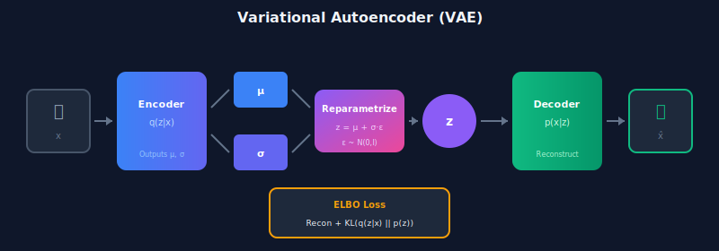
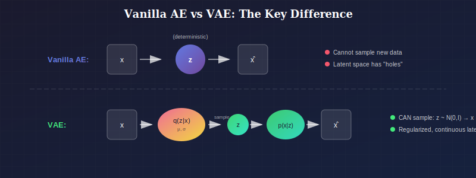
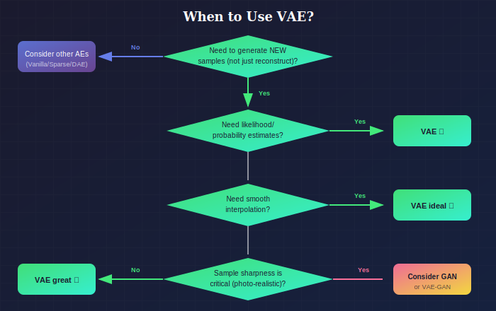

# 🔮 Variational Autoencoders (VAE)

*The first deep generative model with a principled probabilistic framework*

---

## 📖 Introduction

> **TL;DR:** VAE adds **probability** to autoencoders. Instead of mapping to a single point z, we map to a distribution q(z|x). This lets us **generate** new samples!

The Variational Autoencoder (VAE), introduced by Kingma & Welling (2014) and independently by Rezende et al. (2014), is a foundational generative model that combines deep learning with Bayesian inference. Unlike standard autoencoders, VAEs provide a principled probabilistic framework for learning latent representations and generating new samples.

🚀 <b>Why VAE is Revolutionary</b> (click to expand)

**Before VAE (2014):** No good way to train deep generative models with latent variables
**After VAE:** 
- Principled ELBO objective
- Reparameterization trick for backprop through sampling
- Foundation for modern generative AI

---

## When to Use Variational Autoencoders

### Where to Use

| Domain | Use Case | Why It Works |
|--------|----------|--------------|
| **Generative Modeling** | Generating new images, molecules, music | Structured latent space allows meaningful sampling |
| **Drug Discovery** | Generating novel molecular structures | Smooth latent space enables molecule interpolation/optimization |
| **Latent Space Interpolation** | Morphing between images, style transfer | Continuous, regularized latent space |
| **Semi-Supervised Learning** | Learning with few labels | Latent structure provides useful inductive bias |
| **Anomaly Detection** | Detecting out-of-distribution samples | ELBO provides principled likelihood estimate |
| **Representation Learning** | Learning disentangled features | Regularization encourages meaningful structure |
| **Data Imputation** | Filling missing data with uncertainty | Probabilistic framework provides confidence intervals |

### Why Choose VAE (vs. Other Variants)

| Choose VAE When... | Don't Use When... |
|--------------------|-------------------|
| You need to **generate** new samples | Only reconstruction matters (use Vanilla AE) |
| You want **smooth latent interpolation** | Interpolation quality is not important |
| You need **uncertainty quantification** | Deterministic outputs are sufficient |
| **Probabilistic** modeling is required | Probabilistic overhead is unacceptable |
| You want **likelihood estimates** for data | Only sample quality matters (consider GAN) |
| **Disentangled** representations are valuable | Entangled features are acceptable |

### VAE vs. GAN: When to Choose Which

| Criterion | Choose VAE | Choose GAN |
|-----------|-----------|------------|
| Training stability | ✓ VAE is more stable | GAN can mode collapse |
| Sample sharpness | GAN typically sharper | VAE often blurrier |
| Likelihood estimation | ✓ VAE provides ELBO | GAN has no density |
| Latent interpolation | ✓ VAE is smooth | GAN may have artifacts |
| Mode coverage | ✓ VAE covers all modes | GAN may miss modes |
| Inference (encoding) | ✓ VAE has encoder | GAN requires optimization |

### Key Differentiator from Vanilla AE

*VAE adds probability to enable generation*

### Decision Flowchart

*When to choose VAE*

### Industry & Research Examples

1. **Pharmaceutical (Insilico Medicine, Recursion):** Generating novel drug molecules
2. **Gaming (Unity, EA):** Procedural content generation (textures, levels)
3. **Finance:** Synthetic data generation for training while preserving privacy
4. **Fashion (Stitch Fix):** Generating clothing designs, style interpolation
5. **Music (OpenAI Jukebox foundation):** Learning latent representations of audio
6. **Robotics:** Learning task-agnostic representations for transfer

---

## 📊 Representation Comparison

| Representation | Pros | Cons |
|----------------|------|------|
| **Standard VAE** | Simple, stable training | Blurry outputs |
| **β-VAE** | Disentangled latents | Worse reconstruction |
| **VQ-VAE** | Discrete, no posterior collapse | Codebook collapse |
| **Hierarchical VAE** | Multi-scale features | Complex training |
| **Conditional VAE** | Controlled generation | Needs labels |

---

## 1. Probabilistic Formulation

### 1.1 Generative Model

The VAE defines a generative process:

1. Sample latent variable: $z \sim p(z)$ (typically $\mathcal{N}(0, I)$)
2. Generate observation: $x \sim p_\theta(x|z)$

**Joint distribution:**
$$p_\theta(x, z) = p_\theta(x|z) p(z)$$

**Marginal likelihood (model evidence):**
$$p_\theta(x) = \int p_\theta(x|z) p(z) \, dz$$

### 1.2 The Inference Problem

**Goal:** Learn parameters $\theta$ by maximizing $\log p_\theta(x)$

**Problem:** The integral $\int p_\theta(x|z) p(z) dz$ is intractable for complex $p_\theta(x|z)$.

**True posterior:** $p_\theta(z|x) = \frac{p_\theta(x|z) p(z)}{p_\theta(x)}$ is also intractable.

### 1.3 Variational Inference

**Solution:** Approximate the true posterior $p_\theta(z|x)$ with a tractable distribution $q_\phi(z|x)$.

**Inference network (encoder):** $q_\phi(z|x) = \mathcal{N}(z; \mu_\phi(x), \text{diag}(\sigma^2_\phi(x)))$

**Generative network (decoder):** $p_\theta(x|z)$ (Gaussian or Bernoulli)

---

## 2. The Evidence Lower Bound (ELBO)

### 2.1 Derivation

**Starting point:** For any distribution $q(z)$:

$$\log p_\theta(x) = \log \int p_\theta(x, z) dz = \log \int \frac{p_\theta(x, z)}{q(z)} q(z) dz$$

**Apply Jensen's inequality** ($\log$ is concave):

$$\log p_\theta(x) \geq \int q(z) \log \frac{p_\theta(x, z)}{q(z)} dz = \mathcal{L}(\theta, \phi; x)$$

This is the **Evidence Lower Bound (ELBO)**.

### 2.2 ELBO Decomposition

$$\mathcal{L}(\theta, \phi; x) = \mathbb{E}_{q_\phi(z|x)}[\log p_\theta(x|z)] - D_{KL}(q_\phi(z|x) \| p(z))$$

**Terms:**
- **Reconstruction term:** $\mathbb{E}_{q_\phi(z|x)}[\log p_\theta(x|z)]$ — accuracy of reconstruction
- **KL term:** $D_{KL}(q_\phi(z|x) \| p(z))$ — regularization toward prior

### 2.3 Alternative Derivation

$$\log p_\theta(x) = \mathbb{E}_{q_\phi(z|x)}[\log p_\theta(x)]$$

$$= \mathbb{E}_{q_\phi(z|x)}\left[\log \frac{p_\theta(x, z)}{p_\theta(z|x)}\right]$$

$$= \mathbb{E}_{q_\phi(z|x)}\left[\log \frac{p_\theta(x, z)}{q_\phi(z|x)} \cdot \frac{q_\phi(z|x)}{p_\theta(z|x)}\right]$$

$$= \underbrace{\mathbb{E}_{q_\phi(z|x)}\left[\log \frac{p_\theta(x, z)}{q_\phi(z|x)}\right]}_{\text{ELBO } \mathcal{L}} + \underbrace{D_{KL}(q_\phi(z|x) \| p_\theta(z|x))}_{\geq 0}$$

Therefore: $\log p_\theta(x) = \mathcal{L} + D_{KL}(q \| p) \geq \mathcal{L}$

**The gap:** $\log p_\theta(x) - \mathcal{L} = D_{KL}(q_\phi(z|x) \| p_\theta(z|x))$

---

## 3. The VAE Architecture

### 3.1 Encoder Network

Maps input $x$ to distribution parameters:

$$(\mu_\phi(x), \log \sigma^2_\phi(x)) = \text{EncoderNN}_\phi(x)$$

**Posterior approximation:**
$$q_\phi(z|x) = \mathcal{N}(z; \mu_\phi(x), \text{diag}(\sigma^2_\phi(x)))$$

### 3.2 Decoder Network

Maps latent $z$ to reconstruction:

**For continuous data:**
$$p_\theta(x|z) = \mathcal{N}(x; \mu_\theta(z), \sigma^2 I)$$

The decoder outputs $\mu_\theta(z) = \text{DecoderNN}_\theta(z)$

**For binary data:**
$$p_\theta(x|z) = \prod_i \text{Bernoulli}(x_i; \pi_\theta(z)_i)$$

where $\pi_\theta(z) = \sigma(\text{DecoderNN}_\theta(z))$

### 3.3 Loss Function Components

**Reconstruction loss (Gaussian, fixed variance):**
$$-\mathbb{E}_{q}[\log p_\theta(x|z)] \propto \mathbb{E}_{q}[\|x - \mu_\theta(z)\|^2]$$

**Reconstruction loss (Bernoulli):**
$$-\mathbb{E}_{q}[\log p_\theta(x|z)] = -\mathbb{E}_{q}\left[\sum_i x_i \log \pi_i + (1-x_i)\log(1-\pi_i)\right]$$

**KL term (Gaussian prior):**
$$D_{KL}(q_\phi(z|x) \| \mathcal{N}(0, I)) = \frac{1}{2}\sum_{j=1}^{d}\left(\mu_j^2 + \sigma_j^2 - 1 - \log \sigma_j^2\right)$$

---

## 4. The Reparameterization Trick

### 4.1 The Problem

To optimize ELBO via gradient descent, we need:

$$\nabla_\phi \mathbb{E}_{q_\phi(z|x)}[f(z)]$$

**Naive approach:** Sample $z \sim q_\phi(z|x)$, compute $f(z)$
**Problem:** Sampling is non-differentiable!

### 4.2 The Solution

Reparameterize: Instead of sampling $z \sim q_\phi(z|x)$, sample:

$$\epsilon \sim \mathcal{N}(0, I)$$
$$z = \mu_\phi(x) + \sigma_\phi(x) \odot \epsilon$$

Now $z$ is a deterministic function of $\phi$ and $\epsilon$.

### 4.3 Gradient Computation

$$\nabla_\phi \mathbb{E}_{q_\phi(z|x)}[f(z)] = \nabla_\phi \mathbb{E}_{\epsilon \sim \mathcal{N}(0,I)}[f(\mu_\phi(x) + \sigma_\phi(x) \odot \epsilon)]$$

$$= \mathbb{E}_{\epsilon}\left[\nabla_\phi f(\mu_\phi(x) + \sigma_\phi(x) \odot \epsilon)\right]$$

This can be estimated with Monte Carlo!

**See:** [Reparameterization Trick Details](./02_reparameterization_trick/)

---

## 5. Training Algorithm

### 5.1 Single Sample Estimator

For each data point $x$:

1. Encode: $\mu, \log\sigma^2 = \text{Encoder}(x)$
2. Sample: $\epsilon \sim \mathcal{N}(0, I)$
3. Reparameterize: $z = \mu + \sigma \odot \epsilon$
4. Decode: $\hat{x} = \text{Decoder}(z)$
5. Compute loss:
   $$\mathcal{L} = -\text{Recon}(x, \hat{x}) + D_{KL}(q_\phi(z|x) \| p(z))$$
6. Backpropagate and update $\theta, \phi$

### 5.2 Batch Training

For mini-batch $\{x_1, \ldots, x_B\}$:

$$\mathcal{L}_{batch} = \frac{1}{B}\sum_{i=1}^{B} \mathcal{L}(x_i)$$

### 5.3 Multi-Sample Estimator

Use $K$ samples for lower variance:

$$\mathcal{L} \approx -\frac{1}{K}\sum_{k=1}^{K} \log p_\theta(x|z_k) + D_{KL}$$

where $z_k = \mu + \sigma \odot \epsilon_k$.

---

## 6. Generation and Inference

### 6.1 Sampling New Data

To generate new samples:

1. Sample $z \sim p(z) = \mathcal{N}(0, I)$
2. Decode: $x \sim p_\theta(x|z)$ or $x = \mu_\theta(z)$

### 6.2 Reconstruction

Given $x$, reconstruct:

1. Encode: $z = \mu_\phi(x)$ (or sample from $q_\phi(z|x)$)
2. Decode: $\hat{x} = \mu_\theta(z)$

### 6.3 Latent Space Operations

**Interpolation:**
$$z_\lambda = (1-\lambda) z_1 + \lambda z_2$$
$$x_\lambda = \text{Decoder}(z_\lambda)$$

**Arithmetic:**
$$z_{target} = z_{base} + (z_{attribute+} - z_{attribute-})$$

---

## 7. Limitations and Challenges

### 7.1 Posterior Collapse

**Problem:** KL term goes to zero, $q_\phi(z|x) \approx p(z)$, encoder ignores input.

**Symptoms:**
- Latent codes don't carry information about $x$
- Decoder ignores $z$, generates "average" outputs

**Causes:**
- Powerful decoder can model $p(x)$ without $z$
- KL penalty too strong early in training

**Solutions:**
- KL annealing: gradually increase KL weight
- Free bits: minimum KL per dimension
- Architectural constraints: weak decoder

### 7.2 Blurry Samples

**Problem:** VAE samples often blurry compared to GANs.

**Cause:** MSE loss penalizes sharp but misaligned features.

**Solutions:**
- Perceptual loss
- Adversarial loss (VAE-GAN)
- Better likelihood models

### 7.3 Hole Problem

**Problem:** Regions of latent space may not decode to realistic images.

**Cause:** Approximate posterior doesn't cover prior.

**Solution:** Better posterior approximations (normalizing flows, etc.)

**See:** [β-VAE](./03_beta_vae/) and [Hierarchical VAE](./04_hierarchical_vae/)

---

## 8. Evaluation

### 8.1 ELBO as Evaluation

$$\log p_\theta(x) \geq \mathcal{L}(\theta, \phi; x)$$

Report negative ELBO (lower is better).

### 8.2 Importance Weighted Estimate

Better estimate of $\log p_\theta(x)$:

$$\log p_\theta(x) \approx \log \frac{1}{K}\sum_{k=1}^{K} \frac{p_\theta(x, z_k)}{q_\phi(z_k|x)}$$

where $z_k \sim q_\phi(z|x)$.

### 8.3 Sample Quality

- FID score
- Visual inspection
- Downstream task performance

---

## Key Equations Summary

| Concept | Equation |
|---------|----------|
| ELBO | $\mathcal{L} = \mathbb{E}_q[\log p(x|z)] - D_{KL}(q(z|x)\|p(z))$ |
| Reparameterization | $z = \mu + \sigma \odot \epsilon, \quad \epsilon \sim \mathcal{N}(0,I)$ |
| KL (Gaussian) | $\frac{1}{2}\sum_j(\mu_j^2 + \sigma_j^2 - 1 - \log\sigma_j^2)$ |
| Gap | $\log p(x) - \mathcal{L} = D_{KL}(q(z|x)\|p(z|x))$ |

---

## References

### Foundational Papers
1. **Kingma, D. P., & Welling, M.** (2014). "Auto-Encoding Variational Bayes." *ICLR*. [arXiv:1312.6114](https://arxiv.org/abs/1312.6114)
2. **Rezende, D. J., Mohamed, S., & Wierstra, D.** (2014). "Stochastic Backpropagation and Approximate Inference in Deep Generative Models." *ICML*. [arXiv:1401.4082](https://arxiv.org/abs/1401.4082)

### Extensions
3. **Burda, Y., Grosse, R., & Salakhutdinov, R.** (2016). "Importance Weighted Autoencoders." *ICLR*. [arXiv:1509.00519](https://arxiv.org/abs/1509.00519)
4. **Higgins, I., et al.** (2017). "β-VAE: Learning Basic Visual Concepts with a Constrained Variational Framework." *ICLR*.

### Analysis
5. **Kingma, D. P., & Welling, M.** (2019). "An Introduction to Variational Autoencoders." *Foundations and Trends in Machine Learning*.
6. **Doersch, C.** (2016). "Tutorial on Variational Autoencoders." [arXiv:1606.05908](https://arxiv.org/abs/1606.05908)

---

## Subtopics

- [ELBO and KL Divergence](./01_elbo_and_kl/) — Detailed derivations and analysis
- [Reparameterization Trick](./02_reparameterization_trick/) — Gradient estimation techniques
- [β-VAE](./03_beta_vae/) — Disentangled representation learning
- [Hierarchical VAE](./04_hierarchical_vae/) — Multi-scale latent variables

---

## Exercises

1. **Derive** the closed-form KL divergence between two diagonal Gaussians.

2. **Implement** a VAE for MNIST and visualize the latent space.

3. **Compare** reconstruction quality with 1 vs. 10 Monte Carlo samples for gradient estimation.

4. **Experiment** with different latent dimensions and report ELBO vs. sample quality trade-off.

5. **Implement** KL annealing and show it reduces posterior collapse.

---

**[← Denoising Autoencoder](../03_denoising_autoencoder/)** | **[Next: Autoencoder Evaluation →](../05_autoencoder_evaluation/)**

