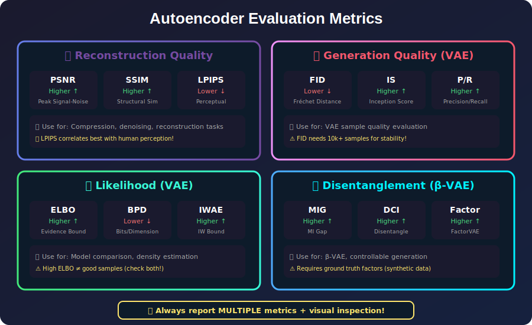
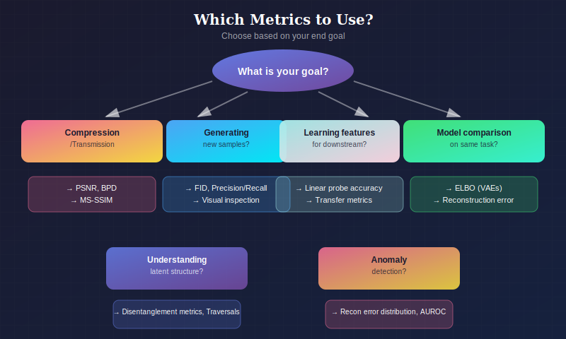

# 📊 Autoencoder Evaluation

*Different metrics for different goals — always report multiple!*

---

## 📖 Introduction

> **TL;DR:** No single metric tells the whole story. Use reconstruction metrics (PSNR, SSIM), generative metrics (FID), likelihood metrics (ELBO), and always do visual inspection!

Evaluating autoencoders requires assessing multiple aspects: reconstruction quality, latent space properties, and for VAEs, the quality of the generative model. This guide covers metrics, methods, and best practices for comprehensive autoencoder evaluation.

---

## When and Why to Use Each Metric

### Metric Selection by Use Case

| Your Goal | Primary Metrics | Why These Metrics |
|-----------|-----------------|-------------------|
| **Image Compression** | PSNR, MS-SSIM, BPD | Balance of fidelity and compression rate |
| **Generative Quality** | FID, IS, Precision/Recall | Measures sample realism and diversity |
| **Anomaly Detection** | Reconstruction Error (MSE/MAE) | Anomalies have high error |
| **Representation Learning** | Linear Probe Accuracy, Transfer Performance | Quality of learned features |
| **Disentanglement** | MIG, DCI, β-VAE metric | Independence of latent factors |
| **Perceptual Quality** | LPIPS, Human Evaluation | Alignment with human perception |
| **Likelihood Modeling** | ELBO, BPD, IWAE bound | Probabilistic model quality |

### Which Metrics for Which Autoencoder

| Autoencoder Type | Key Metrics to Report | What to Monitor |
|------------------|----------------------|-----------------|
| **Vanilla AE** | MSE, PSNR, SSIM | Reconstruction quality only |
| **Sparse AE** | Sparsity level, MSE, Feature interpretability | % active units per input |
| **Denoising AE** | PSNR (noisy→clean), Linear probe | Denoising quality, feature robustness |
| **VAE** | ELBO, Recon NLL, KL, FID | All components + generation |
| **β-VAE** | All VAE metrics + MIG, DCI | Disentanglement vs reconstruction trade-off |
| **Hierarchical VAE** | BPD, FID, KL per level | Information allocation across hierarchy |

### Common Pitfalls by Metric

| Metric | Pitfall | How to Avoid |
|--------|---------|--------------|
| **PSNR/MSE** | Doesn't match perception | Complement with SSIM, LPIPS |
| **ELBO** | High ELBO ≠ good samples | Always check FID/samples too |
| **FID** | Needs 10k+ samples for stability | Use KID for small sample sizes |
| **IS (Inception Score)** | Only measures class distribution | Not suitable for single-class data |
| **Disentanglement Metrics** | Require ground truth factors | Only valid on synthetic datasets |

### Decision: Which Metrics to Use

*Choose metrics based on your evaluation goal*

### Recommended Evaluation Protocol

1. **Always report multiple metrics** (no single metric tells the whole story)
2. **Visual inspection** is irreplaceable—look at samples!
3. **Report on held-out test set** (not training or validation)
4. **Multiple random seeds** with mean ± std
5. **Disentanglement metrics** only on datasets with known factors

---

## 📊 Representation Comparison

| Representation | Pros | Cons |
|----------------|------|------|
| **MSE/L2** | Simple, differentiable | Blurry, ignores structure |
| **SSIM** | Perceptual quality | Not fully differentiable |
| **LPIPS** | Human-aligned perception | Requires pretrained net |
| **FID** | Distribution comparison | Needs many samples |
| **Reconstruction Error** | Direct measure | Doesn't capture generation |

---

## 1. Reconstruction Metrics

### 1.1 Pixel-Level Metrics

#### Mean Squared Error (MSE)

$$\text{MSE} = \frac{1}{N \cdot D}\sum_{i=1}^{N}\sum_{j=1}^{D}(x_i^{(j)} - \hat{x}_i^{(j)})^2$$

**Interpretation:** Average squared pixel difference.

**Range:** [0, ∞), lower is better.

**Limitation:** Doesn't capture perceptual quality.

#### Peak Signal-to-Noise Ratio (PSNR)

$$\text{PSNR} = 10 \cdot \log_{10}\left(\frac{MAX^2}{\text{MSE}}\right)$$

where $MAX$ is maximum pixel value (255 for 8-bit images).

**Interpretation:** Log-scale measure of reconstruction quality.

**Typical values:**
- < 20 dB: Poor
- 20-30 dB: Acceptable
- 30-40 dB: Good
- > 40 dB: Excellent

#### Mean Absolute Error (MAE / L1)

$$\text{MAE} = \frac{1}{N \cdot D}\sum_{i=1}^{N}\sum_{j=1}^{D}|x_i^{(j)} - \hat{x}_i^{(j)}|$$

**More robust** to outliers than MSE.

### 1.2 Structural Similarity (SSIM)

$$\text{SSIM}(x, \hat{x}) = \frac{(2\mu_x\mu_{\hat{x}} + c_1)(2\sigma_{x\hat{x}} + c_2)}{(\mu_x^2 + \mu_{\hat{x}}^2 + c_1)(\sigma_x^2 + \sigma_{\hat{x}}^2 + c_2)}$$

**Components:**
- Luminance: $(2\mu_x\mu_{\hat{x}} + c_1)/(\mu_x^2 + \mu_{\hat{x}}^2 + c_1)$
- Contrast: $(2\sigma_x\sigma_{\hat{x}} + c_2)/(\sigma_x^2 + \sigma_{\hat{x}}^2 + c_2)$
- Structure: $(\sigma_{x\hat{x}} + c_3)/(\sigma_x\sigma_{\hat{x}} + c_3)$

**Range:** [-1, 1], higher is better (typically [0, 1] for images).

**Multi-Scale SSIM (MS-SSIM):** Computed at multiple resolutions, better correlates with perception.

### 1.3 Perceptual Metrics

#### Learned Perceptual Image Patch Similarity (LPIPS)

$$\text{LPIPS}(x, \hat{x}) = \sum_l \frac{1}{H_l W_l}\sum_{h,w}\|w_l \odot (\phi_l(x)_{hw} - \phi_l(\hat{x})_{hw})\|_2^2$$

where $\phi_l$ are features from pretrained network (VGG, AlexNet).

**Range:** [0, ∞), lower is better.

**Better correlates** with human perception than pixel metrics.

---

## 2. Likelihood-Based Evaluation (VAE)

### 2.1 Evidence Lower Bound (ELBO)

$$\mathcal{L} = \mathbb{E}_{q_\phi(z|x)}[\log p_\theta(x|z)] - D_{KL}(q_\phi(z|x) \| p(z))$$

**Report:** Negative ELBO or ELBO per dimension.

**Units:** Nats (base e) or bits (base 2).

**Conversion:** $\text{bits} = \text{nats} / \ln(2)$

### 2.2 Importance Weighted Bound

Tighter estimate of log-likelihood:

$$\log p(x) \approx \log \frac{1}{K}\sum_{k=1}^{K} \frac{p_\theta(x, z_k)}{q_\phi(z_k|x)}$$

where $z_k \sim q_\phi(z|x)$.

**As $K \to \infty$:** Converges to true $\log p(x)$.

**Practical:** Use $K = 500$ or $K = 5000$ for evaluation.

### 2.3 Bits Per Dimension (BPD)

$$\text{BPD} = -\frac{\log_2 p(x)}{D}$$

where $D$ is data dimensionality.

**For images:** $D = H \times W \times C$

**Comparison:** Lower BPD = better compression = better model.

### 2.4 Reconstruction Negative Log-Likelihood

$$-\mathbb{E}_{q(z|x)}[\log p(x|z)]$$

Measures how well decoder reconstructs given encoded latent.

---

## 3. Latent Space Evaluation

### 3.1 Latent Space Structure

#### Aggregate Posterior vs. Prior

Compute aggregate posterior:
$$q(z) = \frac{1}{N}\sum_{i=1}^{N} q_\phi(z|x_i)$$

**Compare to prior $p(z)$:**
- Visually (2D projections)
- KL divergence
- Maximum Mean Discrepancy (MMD)

#### Per-Dimension Statistics

For each dimension $j$:
- Mean: $\bar{\mu}_j = \frac{1}{N}\sum_i \mu_{ij}$
- Variance: $\bar{\sigma}^2_j = \frac{1}{N}\sum_i \sigma^2_{ij}$
- KL: $D_{KL,j}$

**Inactive dimensions:** $D_{KL,j} \approx 0$ indicates unused dimension.

### 3.2 Interpolation Quality

**Linear interpolation:**
$$z_\lambda = (1-\lambda)z_1 + \lambda z_2, \quad \lambda \in [0, 1]$$

**Spherical interpolation (slerp):**
$$z_\lambda = \frac{\sin((1-\lambda)\theta)}{\sin\theta}z_1 + \frac{\sin(\lambda\theta)}{\sin\theta}z_2$$

where $\theta = \arccos(z_1 \cdot z_2 / \|z_1\|\|z_2\|)$.

**Evaluation:** Visual smoothness of decoded interpolations.

### 3.3 Reconstruction from Prior Samples

1. Sample $z \sim p(z)$
2. Decode $\hat{x} = g_\theta(z)$
3. Encode $z' = f_\phi(\hat{x})$
4. Compare $z$ and $z'$

**Good latent space:** $z' \approx z$ (round-trip consistency).

---

## 4. Generative Quality (VAE)

### 4.1 Fréchet Inception Distance (FID)

$$\text{FID} = \|\mu_r - \mu_g\|^2 + \text{Tr}(\Sigma_r + \Sigma_g - 2(\Sigma_r\Sigma_g)^{1/2})$$

where $(\mu_r, \Sigma_r)$ and $(\mu_g, \Sigma_g)$ are statistics of real and generated features (from Inception network).

**Range:** [0, ∞), lower is better.

**Typical values:**
- < 10: Excellent
- 10-50: Good
- 50-100: Acceptable
- > 100: Poor

**Note:** VAEs typically have higher FID than GANs due to blurriness.

### 4.2 Inception Score (IS)

$$\text{IS} = \exp\left(\mathbb{E}_x[D_{KL}(p(y|x) \| p(y))]\right)$$

**Measures:**
- Sharpness: $p(y|x)$ should be peaked
- Diversity: $p(y) = \mathbb{E}[p(y|x)]$ should be uniform

**Range:** [1, 1000] for ImageNet, higher is better.

**Limitation:** Only measures class distribution, not intra-class quality.

### 4.3 Precision and Recall

**Precision:** Fraction of generated samples that lie in real data manifold.

**Recall:** Fraction of real data manifold covered by generated samples.

Computed using k-nearest neighbors in feature space.

### 4.4 Kernel Inception Distance (KID)

$$\text{KID} = \text{MMD}^2(P_r, P_g)$$

using polynomial kernel on Inception features.

**Advantage over FID:** Unbiased estimator, works with fewer samples.

---

## 5. Disentanglement Metrics (β-VAE)

### 5.1 β-VAE Metric

1. Generate pairs with one factor varying
2. Compute absolute difference of latents
3. Classify which factor varied based on argmax dimension
4. Report accuracy

### 5.2 Factor VAE Metric

1. For each factor, fix it and vary others
2. Normalize latent variances  
3. Predict factor using lowest variance dimension
4. Report accuracy

### 5.3 Mutual Information Gap (MIG)

$$\text{MIG} = \frac{1}{K}\sum_k \frac{I(z_{j_k^{(1)}}; v_k) - I(z_{j_k^{(2)}}; v_k)}{H(v_k)}$$

where $j_k^{(1)}, j_k^{(2)}$ are top two dimensions for factor $k$.

### 5.4 DCI Metrics

- **Disentanglement:** How well each code predicts only one factor
- **Completeness:** How well each factor is captured by one code
- **Informativeness:** Predictive power of codes for factors

---

## 6. Downstream Task Evaluation

### 6.1 Linear Probe

1. Train autoencoder on unlabeled data
2. Freeze encoder
3. Train linear classifier on encoded features
4. Report classification accuracy

**Measures:** Quality of learned representations.

### 6.2 Semi-Supervised Learning

1. Train VAE on all data (labeled + unlabeled)
2. Fine-tune on small labeled subset
3. Compare to supervised baseline

### 6.3 Transfer Learning

1. Train on source domain
2. Evaluate on target domain (zero-shot or fine-tuned)

---

## 7. Computational Metrics

### 7.1 Model Size

- Number of parameters
- Memory footprint (activation memory during forward pass)

### 7.2 Inference Speed

- Encoding time
- Decoding time
- Samples per second

### 7.3 Training Efficiency

- Time to convergence
- GPU hours required
- Sample efficiency (performance vs. training data)

---

## 8. Evaluation Protocol

### 8.1 Dataset Splits

- **Training:** Model fitting
- **Validation:** Hyperparameter selection
- **Test:** Final evaluation (use only once!)

### 8.2 Reproducibility

- Fix random seeds
- Report mean ± std over multiple runs
- Document all hyperparameters

### 8.3 Fair Comparison

- Same data preprocessing
- Same evaluation protocol
- Report confidence intervals

### 8.4 Comprehensive Reporting

| Metric | Train | Val | Test |
|--------|-------|-----|------|
| ELBO | -85.2 | -87.1 | -87.3 |
| Recon MSE | 0.012 | 0.015 | 0.016 |
| KL | 12.3 | 12.8 | 12.9 |
| FID | — | 45.2 | 46.1 |
| SSIM | 0.92 | 0.91 | 0.90 |

---

## 9. Common Pitfalls

### 9.1 ELBO vs. Sample Quality

High ELBO doesn't guarantee good samples!
- Blurry reconstructions can have good likelihood
- Always evaluate both

### 9.2 Overfitting to Metrics

- FID can be gamed
- Multiple metrics provide fuller picture

### 9.3 Comparing Across Datasets

- Metrics are dataset-specific
- Don't compare FID on CIFAR to FID on ImageNet

### 9.4 Small Sample Evaluation

- FID requires many samples (>10k recommended)
- Use KID for smaller sample sizes

---

## Key Metrics Summary

| Aspect | Metric | Range | Better |
|--------|--------|-------|--------|
| Reconstruction | PSNR | [0, ∞) | Higher |
| Reconstruction | SSIM | [-1, 1] | Higher |
| Reconstruction | LPIPS | [0, ∞) | Lower |
| Likelihood | ELBO | (-∞, 0] | Higher (closer to 0) |
| Likelihood | BPD | [0, ∞) | Lower |
| Generation | FID | [0, ∞) | Lower |
| Generation | IS | [1, 1000] | Higher |
| Disentanglement | MIG | [0, 1] | Higher |

---

## References

### Perceptual Metrics
1. **Wang, Z., et al.** (2004). "Image Quality Assessment: From Error Visibility to Structural Similarity." *IEEE TIP*.
2. **Zhang, R., et al.** (2018). "The Unreasonable Effectiveness of Deep Features as a Perceptual Metric." *CVPR*. [arXiv:1801.03924](https://arxiv.org/abs/1801.03924)

### Generative Metrics
3. **Heusel, M., et al.** (2017). "GANs Trained by a Two Time-Scale Update Rule Converge to a Local Nash Equilibrium." *NeurIPS*. [arXiv:1706.08500](https://arxiv.org/abs/1706.08500)
4. **Salimans, T., et al.** (2016). "Improved Techniques for Training GANs." *NeurIPS*. [arXiv:1606.03498](https://arxiv.org/abs/1606.03498)
5. **Kynkäänniemi, T., et al.** (2019). "Improved Precision and Recall Metric for Assessing Generative Models." *NeurIPS*. [arXiv:1904.06991](https://arxiv.org/abs/1904.06991)

### Disentanglement Metrics
6. **Locatello, F., et al.** (2019). "Challenging Common Assumptions in the Unsupervised Learning of Disentangled Representations." *ICML*.

---

## Exercises

1. **Compute** PSNR, SSIM, and LPIPS for your autoencoder reconstructions.

2. **Implement** the importance-weighted log-likelihood estimator with K=1000.

3. **Plot** the aggregate posterior vs. prior using t-SNE.

4. **Compare** FID scores with different numbers of samples (1k, 10k, 50k).

5. **Create** a comprehensive evaluation table for your trained model.

---

**[← Variational Autoencoder](../04_variational_autoencoder/)** | **[Back to Autoencoders →](../)**

