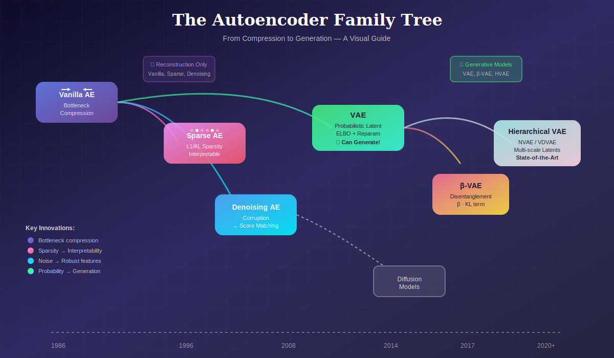
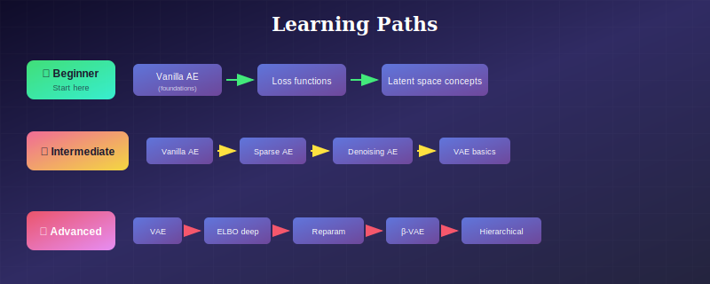
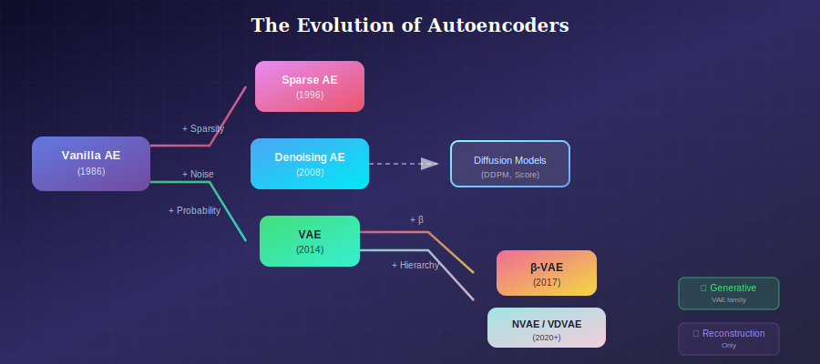

# 🧠 Autoencoders: From Compression to Generation

<div align="center">



*A comprehensive guide to understanding autoencoders and their variants*

[](#)
[](#)
[](#)

</div>

---

## 📖 What You'll Learn

This repository provides a **deep dive** into autoencoder architectures—from the foundational vanilla autoencoder to state-of-the-art hierarchical VAEs. Each section includes:

- 📐 **Rigorous mathematical foundations**
- 🎨 **Beautiful SVG visualizations**
- 💡 **When and why to use each variant**
- 🔬 **Research references and papers**
- ✏️ **Hands-on exercises**

---

## 🗂️ Repository Structure

```
01_autoencoders/
│
├── 📁 01_vanilla_autoencoder/     # Foundation: encode-decode architecture
│   ├── README.md
│   └── images/
│
├── 📁 02_sparse_autoencoder/      # Interpretable features via sparsity
│   ├── README.md
│   └── images/
│
├── 📁 03_denoising_autoencoder/   # Robust features + diffusion connection
│   ├── README.md
│   └── images/
│
├── 📁 04_variational_autoencoder/ # Probabilistic generation
│   ├── README.md
│   ├── images/
│   ├── 📁 01_elbo_and_kl/         # ELBO derivations
│   ├── 📁 02_reparameterization_trick/
│   ├── 📁 03_beta_vae/            # Disentanglement
│   └── 📁 04_hierarchical_vae/    # NVAE, VDVAE
│
└── 📁 05_autoencoder_evaluation/  # Metrics and evaluation
    ├── README.md
    └── images/
```

---

## 🎯 Quick Guide: Which Autoencoder Should You Use?

<table>
<tr>
<th>Your Goal</th>
<th>Best Choice</th>
<th>Why</th>
</tr>
<tr>
<td>🗜️ <b>Compression / Dimensionality Reduction</b></td>
<td><a href="./01_vanilla_autoencoder/">Vanilla AE</a></td>
<td>Simple, fast, effective for reconstruction</td>
</tr>
<tr>
<td>🔍 <b>Interpretable Features / LLM Analysis</b></td>
<td><a href="./02_sparse_autoencoder/">Sparse AE</a></td>
<td>Each neuron = distinct concept</td>
</tr>
<tr>
<td>🔊 <b>Noisy Data / Self-supervised Pretraining</b></td>
<td><a href="./03_denoising_autoencoder/">Denoising AE</a></td>
<td>Robust features, BERT-style training</td>
</tr>
<tr>
<td>🎨 <b>Generate New Samples</b></td>
<td><a href="./04_variational_autoencoder/">VAE</a></td>
<td>Probabilistic, smooth latent space</td>
</tr>
<tr>
<td>🎛️ <b>Control Specific Attributes</b></td>
<td><a href="./04_variational_autoencoder/03_beta_vae/">β-VAE</a></td>
<td>Disentangled = controllable</td>
</tr>
<tr>
<td>🏆 <b>State-of-the-art Generation</b></td>
<td><a href="./04_variational_autoencoder/04_hierarchical_vae/">Hierarchical VAE</a></td>
<td>NVAE/VDVAE quality</td>
</tr>
</table>

---

## 📚 Learning Path

<div align="center">



*Choose your path based on your experience level*

</div>

---

## 🔬 The Big Picture

### From Reconstruction to Generation

| Model | Can Generate? | Key Innovation |
|-------|--------------|----------------|
| **Vanilla AE** | ❌ | Bottleneck compression |
| **Sparse AE** | ❌ | Sparsity → interpretability |
| **Denoising AE** | ❌ (but → Diffusion) | Corruption → robustness |
| **VAE** | ✅ | Probabilistic latent + ELBO |
| **β-VAE** | ✅ | Disentanglement via β |
| **HVAE** | ✅ | Multi-scale hierarchy |

### The Evolution

<div align="center">



*From compression to generation — the evolution of autoencoders*

</div>

---

## 🧮 Core Mathematics Preview

### The Autoencoder Objective

$$\mathcal{L}_{AE} = \mathbb{E}_{x \sim p_{data}} \left[ \| x - g_\theta(f_\phi(x)) \|^2 \right]$$

### The VAE Objective (ELBO)

$$\mathcal{L}_{VAE} = \underbrace{\mathbb{E}_{q_\phi(z|x)}[\log p_\theta(x|z)]}_{\text{Reconstruction}} - \underbrace{D_{KL}(q_\phi(z|x) \| p(z))}_{\text{Regularization}}$$

### The Reparameterization Trick

$$z = \mu_\phi(x) + \sigma_\phi(x) \odot \epsilon, \quad \epsilon \sim \mathcal{N}(0, I)$$

---

## 🏭 Industry Applications

| Industry | Application | Autoencoder Type |
|----------|-------------|------------------|
| 🏥 **Healthcare** | Medical image denoising | Denoising AE |
| 💊 **Pharma** | Drug molecule generation | VAE |
| 🎮 **Gaming** | Texture/level generation | VAE, HVAE |
| 🔐 **Security** | Anomaly detection | Vanilla AE |
| 🤖 **AI Research** | LLM interpretability | Sparse AE |
| 📸 **Photography** | Image compression | Vanilla AE |

---

## 📖 Key References

### Foundational Papers

1. **Rumelhart et al.** (1986) - *Learning representations by back-propagating errors*
2. **Kingma & Welling** (2014) - *Auto-Encoding Variational Bayes* (VAE)
3. **Higgins et al.** (2017) - *β-VAE: Learning Basic Visual Concepts*
4. **Vahdat & Kautz** (2020) - *NVAE: A Deep Hierarchical VAE*

### Recent Developments

5. **Cunningham et al.** (2023) - *Sparse Autoencoders for LLM Interpretability*
6. **Child** (2021) - *Very Deep VAEs Generalize Autoregressive Models*

---

## 🚀 Getting Started

### Prerequisites

- Linear algebra fundamentals
- Probability theory basics
- Neural network understanding
- Python + PyTorch (for exercises)

### Recommended Order

1. **Start here →** [Vanilla Autoencoder](./01_vanilla_autoencoder/)
2. **Then explore variants based on your goals**
3. **Deep dive into VAE theory** for generative modeling
4. **Practice with exercises** in each section

---

## 🤝 Contributing

Found an error? Have a suggestion? Contributions are welcome!

- 📝 Fix typos or clarify explanations
- 🎨 Improve visualizations
- 📚 Add references
- ✏️ Contribute exercises

---

## 📜 License

This educational content is provided for learning purposes.

---

<div align="center">

**Happy Learning! 🎓**

*Understanding autoencoders is the gateway to modern generative AI*

</div>

