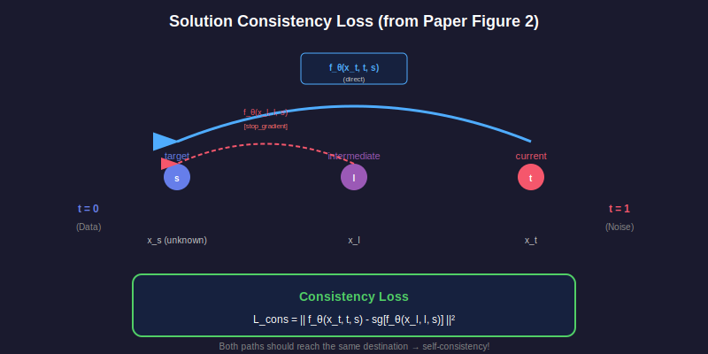

# 📖 Chapter 4: Training Objectives

<div align="center">

*Two complementary losses that make one-step generation possible*

</div>

---

## 🎯 The Training Recipe

SoFlow uses **two losses** working together:

```
L_total = L_FM + λ · L_cons
```


---

## 1️⃣ Flow Matching Loss (L_FM)

### Purpose
> *"Learn to predict clean data from noisy input"*

### Formula
```
L_FM = 𝔼[‖f_θ(x_t, t, 0) - x₀‖²]
```

### Intuition
```
x_t (noisy) ──────→ f_θ(x_t, t, 0) ≈ x₀ (clean)
                           ↓
                    Compare with ground truth!
```

### Code
```python
def flow_matching_loss(model, x_0, x_1, t):
    # Create noisy sample
    x_t = (1 - t) * x_0 + t * x_1
    
    # Predict clean data (s=0)
    s = torch.zeros_like(t)
    x_0_pred = model(x_t, t, s)
    
    # MSE loss
    return F.mse_loss(x_0_pred, x_0)
```

---

## 2️⃣ Consistency Loss (L_cons)

### Purpose
> *"Ensure predictions are self-consistent across the trajectory"*

### The Idea

If our solution function is correct:
```
Direct path:   f(x_t, t, s)
Indirect path: f(x_l, l, s)  where x_l = f(x_t, t, l)

Both should give the SAME result!
```


### Formula
```
L_cons = 𝔼[‖f_θ(x_t, t, s) - sg[f_θ(x_l, l, s)]‖²]
```

> ⚠️ **sg** = stop gradient (target is fixed)

### Code
```python
def consistency_loss(model, x_0, x_1, t, l, s):
    x_t = (1 - t) * x_0 + t * x_1
    x_l = (1 - l) * x_0 + l * x_1
    
    # Direct prediction
    pred_direct = model(x_t, t, s)
    
    # Indirect prediction (stop gradient!)
    with torch.no_grad():
        pred_indirect = model(x_l, l, s)
    
    return F.mse_loss(pred_direct, pred_indirect)
```

---

## 🛑 Why Stop Gradient?

<table>
<tr>
<td width="50%">

### ❌ Without Stop Gradient
- Both predictions push toward each other
- Could collapse to trivial solution
- Unstable training

</td>
<td width="50%">

### ✅ With Stop Gradient
- Target is fixed
- Model learns to match it
- Stable, like EMA targets

</td>
</tr>
</table>

---

## 📊 The Consistency Loss Diagram



> 💡 This is Figure 2 from the original paper!

---

## 📈 Training Schedule

### The Problem
Early in training, the model is bad → consistency targets are noisy.

### The Solution
Start easy, gradually increase difficulty:


```python
# Schedule function
r = max(0.1, 1.0 - step / total_steps)
l = r * t  # l starts close to t, ends close to 0
```

| Training | `r` value | Difficulty |
|:--------:|:---------:|:----------:|
| Start | ~1.0 | Easy (l ≈ t) |
| Middle | ~0.5 | Medium |
| End | ~0.1 | Hard (l ≈ 0) |

---

## 🔗 Putting It Together

```python
def train_step(model, x_0, y, step, total_steps):
    x_1 = torch.randn_like(x_0)
    t = torch.rand(B) * 0.95 + 0.05
    
    # === Flow Matching Loss ===
    x_t = (1 - t) * x_0 + t * x_1
    s = torch.zeros(B)
    x_0_pred = model(x_t, t, s, y)
    loss_fm = F.mse_loss(x_0_pred, x_0)
    
    # === Consistency Loss ===
    r = max(0.1, 1.0 - step / total_steps)
    l = r * t
    x_l = (1 - l) * x_0 + l * x_1
    
    with torch.no_grad():
        x_0_target = model(x_l, l, s, y)
    
    loss_cons = F.mse_loss(x_0_pred, x_0_target)
    
    # === Combined ===
    return loss_fm + 0.1 * loss_cons
```

---

## 🤔 Why Two Losses?

| Loss | Alone | Problem |
|:----:|:-----:|:-------:|
| **FM Only** | ✅ Learns denoising | ❌ No trajectory consistency |
| **Cons Only** | ✅ Self-consistent | ❌ No ground truth signal |
| **Combined** | ✅ Both! | ✅ Perfect! |

---

## 🔑 Key Takeaways

<table>
<tr>
<td>

### 📚 Summary
- **L_FM**: Supervised denoising
- **L_cons**: Self-consistency
- **Schedule**: Easy → Hard

</td>
<td>

### 💪 Benefits
- Stable training
- No JVP needed!
- One-step generation

</td>
</tr>
</table>

---

## 📚 What's Next?

Want the mathematical guarantees?

<div align="center">

**[← Chapter 3: Solution Function](../03-solution-function/README.md)** | **[Chapter 5: Proofs →](../05-proofs/README.md)**

</div>

---

<div align="center">

*Chapter 4 of 9 • [Back to Index](../README.md)*

</div>
