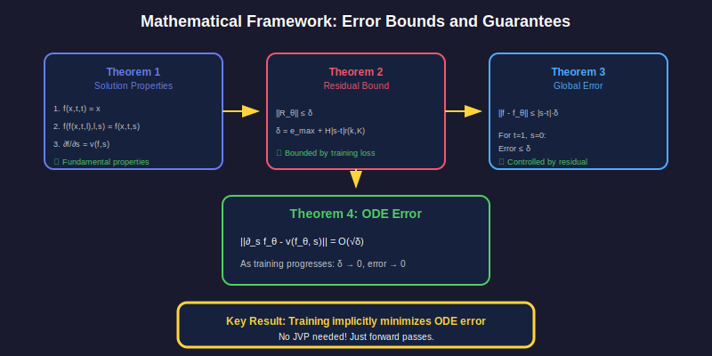

# 📖 Chapter 5: Mathematical Proofs

<div align="center">

*Rigorous guarantees for why SoFlow works*

</div>

---

## 🎓 Overview

This chapter covers the **theoretical foundations** of SoFlow:



---

## 📜 Theorem 1: Solution Properties

### Statement

A valid solution function `f(x_t, t, s)` satisfies:

| Property | Formula | Meaning |
|:--------:|:-------:|:-------:|
| **Identity** | `f(x_t, t, t) = x_t` | No movement when s=t |
| **Composition** | `f(f(x_t,t,l), l, s) = f(x_t,t,s)` | Paths compose |
| **ODE** | `∂f/∂s = v(f, s)` | Derivative = velocity |

### Proof Sketch (Identity)

```
f(x_t, t, t) = x_t + ∫[t→t] v(...) dτ
             = x_t + 0
             = x_t  ∎
```

> 💡 The integral over zero range is zero!

---

## 📜 Theorem 2: Residual Bound

### Definition

The **residual** measures how much our model deviates from the true solution:

```
R_θ(x_t, t, s) = "deviation from true solution"
```

### Bound

If training loss is bounded by `e_max`:

```
‖R_θ‖ ≤ δ = e_max + H|s-t|r(k, K)
```

| Symbol | Meaning |
|:------:|:-------:|
| `e_max` | Max training error |
| `H` | Lipschitz constant |
| `r(k,K)` | Schedule function |

---

## 📜 Theorem 3: Global Error

### The Main Result

```
┌─────────────────────────────────────────────┐
│  ‖f - f_θ‖ ≤ |s - t| · δ                   │
└─────────────────────────────────────────────┘
```

### What This Means

For one-step generation (`t=1, s=0`):

```
Error ≤ 1 · δ = δ
```

> 📉 As training progresses, `δ → 0`, so error → 0!

---

## 📜 Theorem 4: ODE Error

### Statement

Training **implicitly minimizes** the ODE error:

```
‖∂_s f_θ - v(f_θ, s)‖ = O(√δ)
```

### Interpretation

- We never explicitly compute ODE error
- But our losses minimize it automatically!
- This is why the solution function works

---

## 🚫 Why No JVP?

### The JVP Problem

Other methods (Consistency, MeanFlow) need:

```python
# Jacobian-Vector Product (SLOW!)
jvp = ∂v(x,t)/∂x · direction
```

**Problems:**
- 😫 Expensive backprop through model
- 😫 Poorly optimized in PyTorch
- 😫 High memory usage

### SoFlow's Approach

```python
# Just two forward passes (FAST!)
pred1 = model(x_t, t, s)
with torch.no_grad():
    pred2 = model(x_l, l, s)
loss = mse(pred1, pred2)
```

> 🚀 **2-3× faster** than JVP methods!

---

## 📊 Theoretical Guarantees Summary

| Property | Guarantee |
|:--------:|:---------:|
| **Global Error** | `≤ |s-t| · δ` |
| **ODE Error** | `O(√δ)` |
| **Convergence** | `δ → 0` as training progresses |
| **Computation** | No JVP required! |

---

## 🔑 Key Takeaways

<table>
<tr>
<td>

### 📚 The Math
- Solution function has 3 properties
- Error is bounded by residual
- ODE error minimized implicitly

</td>
<td>

### 💪 The Payoff
- Theoretical guarantees
- Convergence proof
- JVP-free = faster training

</td>
</tr>
</table>

---

## 📚 What's Next?

How does Classifier-Free Guidance work in SoFlow?

<div align="center">

**[← Chapter 4: Training](../04-training/README.md)** | **[Chapter 6: CFG →](../06-cfg/README.md)**

</div>

---

<div align="center">

*Chapter 5 of 9 • [Back to Index](../README.md)*

</div>
