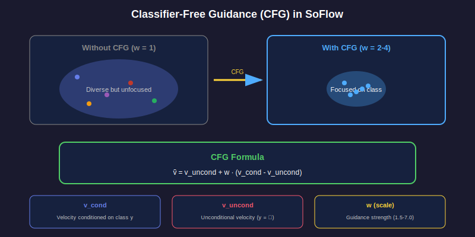

# 📖 Chapter 6: Classifier-Free Guidance

<div align="center">

*How SoFlow enables CFG without expensive JVP computation*

</div>

---

## 🎨 What is CFG?

**Classifier-Free Guidance** improves generation quality by amplifying class-conditional signals:



### The Formula

```
ṽ = v_uncond + w · (v_cond - v_uncond)
```

| Symbol | Meaning |
|:------:|:-------:|
| `v_cond` | Velocity with class info |
| `v_uncond` | Velocity without class |
| `w` | Guidance scale (1.5-7.0) |

> 💡 Higher `w` = stronger class alignment, but less diversity

---

## 😫 The Problem with One-Step Models

### Standard Consistency Models

```python
# Consistency Model
image = model(noise)  # No velocity, no CFG!
```

❌ **Problem**: No access to velocity → Can't apply CFG naturally

### MeanFlow's Solution

```python
# MeanFlow - uses JVP
velocity = compute_jvp(model, x, t)  # 😫 Expensive!
```

❌ **Problem**: JVP is slow and memory-hungry

---

## ✨ SoFlow's Solution

### Velocity Extraction

We can **extract velocity** from the solution function:

```python
def get_velocity(model, x_t, t, y, eps=1e-4):
    s = t - eps
    f_out = model(x_t, t, s, y)
    velocity = (f_out - x_t) / (-eps)
    return velocity
```

> 🔑 **Key Insight**: The derivative of solution gives velocity!

### CFG with Extracted Velocities

```python
def cfg_velocity(model, x_t, t, y, cfg_scale):
    # Get conditional velocity
    v_cond = get_velocity(model, x_t, t, y)
    
    # Get unconditional velocity
    v_uncond = get_velocity(model, x_t, t, y=None)
    
    # Apply CFG
    v_cfg = v_uncond + cfg_scale * (v_cond - v_uncond)
    return v_cfg
```

---

## 🎯 CFG for One-Step Sampling

For final generation, apply CFG directly to outputs:

```python
def sample_with_cfg(model, noise, y, cfg_scale=2.0):
    t = torch.ones(B)   # Start time
    s = torch.zeros(B)  # Target time
    
    # Conditional prediction
    f_cond = model(noise, t, s, y)
    
    # Unconditional prediction
    f_uncond = model(noise, t, s, y=None)
    
    # CFG combination
    return f_uncond + cfg_scale * (f_cond - f_uncond)
```

---

## 📊 CFG Scale Effects

| Scale | Quality | Diversity | Class Match |
|:-----:|:-------:|:---------:|:-----------:|
| 1.0 | ⭐⭐⭐ | ⭐⭐⭐⭐⭐ | ⭐⭐ |
| 1.5 | ⭐⭐⭐⭐ | ⭐⭐⭐⭐ | ⭐⭐⭐ |
| 2.0 | ⭐⭐⭐⭐⭐ | ⭐⭐⭐ | ⭐⭐⭐⭐ |
| 4.0 | ⭐⭐⭐⭐ | ⭐⭐ | ⭐⭐⭐⭐⭐ |
| 7.0 | ⭐⭐⭐ | ⭐ | ⭐⭐⭐⭐⭐ |

> 💡 **Sweet spot**: CFG scale 2.0-4.0

---

## 🆚 Method Comparison

| Method | CFG? | How? | Cost |
|:------:|:----:|:----:|:----:|
| Consistency | ⚠️ | Post-hoc | Medium |
| Distillation | ✅ | Teacher | High |
| MeanFlow | ✅ | JVP | **High** |
| **SoFlow** | ✅ | Velocity extraction | **Low!** |

---

## 🔑 Key Takeaways

<table>
<tr>
<td>

### 📚 What We Learned
- CFG amplifies class signals
- Solution → Velocity via derivative
- No JVP needed!

</td>
<td>

### 🎉 Benefits
- Natural CFG integration
- Training-time CFG
- Test-time CFG
- Fast computation

</td>
</tr>
</table>

---

## 📚 What's Next?

Let's look at the model architecture!

<div align="center">

**[← Chapter 5: Proofs](../05-proofs/README.md)** | **[Chapter 7: Architecture →](../07-architecture/README.md)**

</div>

---

<div align="center">

*Chapter 6 of 9 • [Back to Index](../README.md)*

</div>
