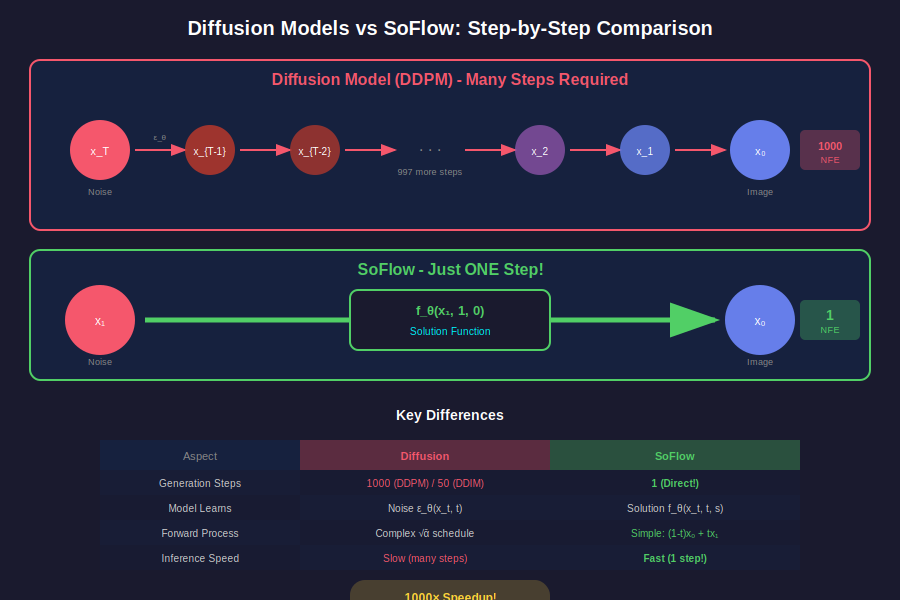

# 📖 Chapter 9: SoFlow vs Diffusion Models

<div align="center">

*The ultimate step-by-step comparison*

</div>

---

## 🎬 The Big Picture



---

## 🔄 Step 1: Forward Process

### Diffusion (DDPM)

```
q(x_t | x₀) = N(x_t; √ᾱ_t · x₀, (1 - ᾱ_t) · I)
```

- 😫 Complex variance schedule
- 😫 Discrete timesteps (T=1000)
- 😫 Many hyperparameters

```python
# Diffusion forward (complex)
def forward(x_0, t, alpha_bar):
    noise = torch.randn_like(x_0)
    x_t = sqrt(alpha_bar[t]) * x_0 + sqrt(1-alpha_bar[t]) * noise
    return x_t
```

### SoFlow (Flow Matching)

```
x_t = (1 - t) · x₀ + t · x₁
```

- ✅ Simple linear interpolation
- ✅ Continuous time
- ✅ No schedule needed

```python
# SoFlow forward (simple!)
def forward(x_0, t):
    x_1 = torch.randn_like(x_0)
    x_t = (1 - t) * x_0 + t * x_1
    return x_t
```

---

## 🎓 Step 2: What the Model Learns

| | Diffusion | SoFlow |
|:--:|:--------:|:------:|
| **Learns** | Noise `ε` | Solution `f(x,t,s)` |
| **Output** | Added noise | Target state |
| **Loss** | `‖ε_θ - ε‖²` | `‖f_θ - x₀‖² + L_cons` |

---

## 🚀 Step 3: Generation

This is where it gets interesting!


### DDPM: 1000 Steps 😫

```python
def ddpm_sample(model, T=1000):
    x = torch.randn(shape)
    for t in range(T, 0, -1):  # 1000 iterations!
        eps = model(x, t)
        x = denoise_step(x, eps, t)
    return x
```

### DDIM: 50 Steps 😕

```python
def ddim_sample(model, steps=50):
    x = torch.randn(shape)
    for i in range(steps):  # Still 50 iterations
        eps = model(x, t)
        x = ddim_step(x, eps, t)
    return x
```

### SoFlow: 1 Step! 🚀

```python
def soflow_sample(model):
    x = torch.randn(shape)
    return model(x, t=1, s=0)  # ONE step!
```

---

## ⚡ Speed Comparison

| Method | Steps | Relative Time |
|:------:|:-----:|:-------------:|
| DDPM | 1000 | 🐌🐌🐌🐌🐌 |
| DDIM | 50 | 🐌🐌🐌 |
| **SoFlow** | 1 | 🚀 |

> 🏆 **SoFlow is 1000× faster than DDPM!**

---

## 🎨 Step 4: CFG Support

### Both Support CFG!

**Diffusion:**
```python
eps = eps_uncond + w * (eps_cond - eps_uncond)
```

**SoFlow:**
```python
out = f_uncond + w * (f_cond - f_uncond)
```

| | Diffusion | SoFlow |
|:--:|:--------:|:------:|
| **CFG** | ✅ Each step | ✅ Final output |
| **Cost** | Medium | Low |

---

## 📊 Quality Comparison

| Metric | DDPM (1000) | DDIM (50) | SoFlow (1) |
|:------:|:-----------:|:---------:|:----------:|
| **FID** | ~2.5 | ~3.0 | **2.96** |
| **Speed** | Very Slow | Slow | **Fast!** |
| **Memory** | High | Medium | **Low** |

> 💡 SoFlow matches multi-step quality in ONE step!

---

## 🧠 Summary Table

| Aspect | Diffusion | SoFlow |
|:------:|:---------:|:------:|
| **Forward** | Complex schedule | Simple interpolation |
| **Learns** | Noise | Solution |
| **Steps** | 50-1000 | **1** |
| **Speed** | Slow | **Fast** |
| **CFG** | ✅ | ✅ |
| **Quality** | Excellent | Excellent |

---

## 🎯 When to Use What?

### Use Diffusion When:
- Absolute best quality needed
- Inference time doesn't matter
- Simple training preferred

### Use SoFlow When:
- Real-time generation needed
- Training from scratch
- Limited compute budget

---

## 🔑 Final Takeaways

<table>
<tr>
<td>

### 📚 Summary
- Diffusion: Many steps, proven quality
- SoFlow: One step, same quality!
- Key: Solution function vs velocity

</td>
<td>

### 🏆 Bottom Line
SoFlow gives you **diffusion-quality results** at **1000× the speed**.

</td>
</tr>
</table>

---

## 🎉 Congratulations!

You've completed the SoFlow documentation!

<div align="center">

**[← Chapter 8: Comparisons](../08-comparison/README.md)** | **[🏠 Back to Index](../README.md)**

</div>

---

<div align="center">

*Chapter 9 of 9 • [Back to Index](../README.md)*

---

**Thank you for reading!** 🙏

*Made with ❤️ for the ML community*

</div>
