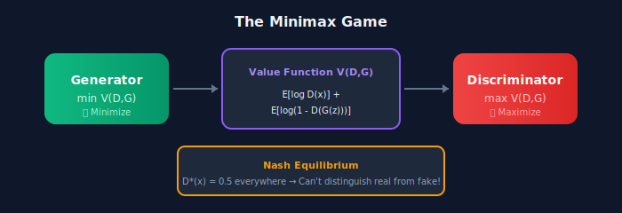
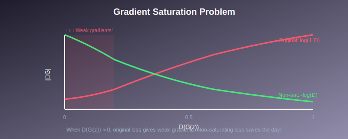
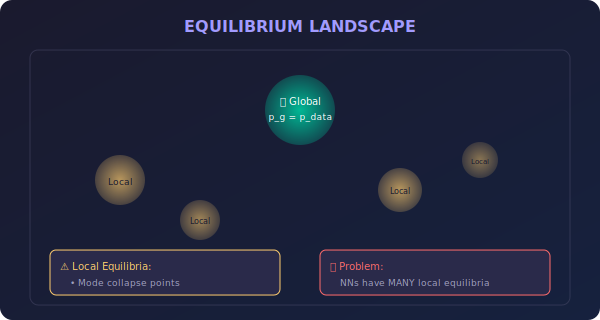

# 🎯 The Minimax Objective in GANs

*Deep dive into the game-theoretic heart of adversarial learning*

---

## 🎯 Where & Why Use Minimax Understanding?

### 🌍 Real-World Applications

| Application | How Minimax Helps |
|-------------|-------------------|
| **GAN Debugging** | Diagnose why training fails or oscillates |
| **Loss Function Design** | Create custom objectives for specific tasks |
| **Adversarial Robustness** | Understand attack-defense dynamics |
| **Game AI** | Design competitive multi-agent systems |
| **Security Research** | Model attacker-defender scenarios |
| **Economic Modeling** | Analyze competitive market dynamics |

### 💡 Why Master This Concept?

> *"The minimax formulation is not just math—it's the soul of GANs. Master it, and you control the game."*

1. **Foundation of All GAN Variants** — Every GAN modifies this objective
2. **Training Dynamics Understanding** — Know why training succeeds or fails
3. **Research Foundation** — Read papers with deep comprehension
4. **Custom Loss Design** — Create new objectives for your needs
5. **Interview Essential** — Top companies test this knowledge

---

## 📖 Introduction

The minimax formulation lies at the heart of GANs, framing generative modeling as a two-player game. This document provides a rigorous analysis of the minimax objective, its game-theoretic foundations, and the mathematical properties that determine GAN behavior.

---

## 📊 Representation Comparison

| Representation | Pros | Cons |
|----------------|------|------|
| **Original Minimax** | Theoretically elegant | Vanishing gradients |
| **Non-Saturating** | Better G gradients | Different equilibrium |
| **Heuristic (-log D)** | Practical, stable | Theoretically unsound |
| **Least Squares** | Stable gradients | Different distance |
| **Wasserstein** | Meaningful loss curve | Lipschitz constraint |

---

## 1. Game Theory Foundation

### 1.1 Two-Player Zero-Sum Games

In a **zero-sum game**, one player's gain is exactly the other's loss:

$$V(D, G) = -V(G, D)$$

The GAN objective is a zero-sum game where:
- **D** tries to **maximize** \( V(D, G) \)
- **G** tries to **minimize** \( V(D, G) \)

### 1.2 Nash Equilibrium

A **Nash equilibrium** \( (D^*, G^*) \) satisfies:

$$V(D^*, G^*) \geq V(D, G^*) \quad \forall D$$
$$V(D^*, G^*) \leq V(D^*, G) \quad \forall G$$

> 💡 **Key Insight:** Neither player can improve by unilaterally changing strategy.

### 1.3 Minimax Theorem (von Neumann)

**Theorem:** For convex-concave \( V \):

$$\boxed{\max_D \min_G V(D, G) = \min_G \max_D V(D, G)}$$

**Implication:** The order of optimization doesn't matter at equilibrium.

> ⚠️ **Problem for GANs:** \( V \) is not convex-concave in neural network parameters!

---

## 2. Detailed Objective Analysis

### 2.1 The GAN Value Function

$$V(D, G) = \mathbb{E}_{x \sim p_{data}}[\log D(x)] + \mathbb{E}_{z \sim p_z}[\log(1 - D(G(z)))]$$

**Equivalent form (in terms of densities):**

$$V(D, G) = \int_x p_{data}(x) \log D(x) \, dx + \int_x p_g(x) \log(1 - D(x)) \, dx$$

where \( p_g \) is the induced distribution from \( G \).

### 2.2 Discriminator's Perspective

**Optimal Bayes classifier:**

$$D^*(x) = P(\text{real} | x) = \frac{p_{data}(x)}{p_{data}(x) + p_g(x)}$$

<b>📐 Complete Derivation of Optimal Discriminator $D^*$</b>

**Goal:** For fixed $G$, find $D$ that maximizes $V(D, G)$.

**Step 1: Write the objective in integral form**

$$V(D, G) = \int_x p_{data}(x) \log D(x) \, dx + \int_x p_g(x) \log(1 - D(x)) \, dx$$

**Step 2: Combine integrals**

$$V(D, G) = \int_x \left[p_{data}(x) \log D(x) + p_g(x) \log(1 - D(x))\right] dx$$

**Step 3: Pointwise optimization**

For each $x$, maximize the integrand:
$$h(D) = p_{data}(x) \log D + p_g(x) \log(1 - D)$$

where $D = D(x) \in [0, 1]$.

**Step 4: Find the critical point**

$$\frac{dh}{dD} = \frac{p_{data}(x)}{D} - \frac{p_g(x)}{1-D} = 0$$

$$p_{data}(x)(1-D) = p_g(x) D$$

$$p_{data}(x) - p_{data}(x)D = p_g(x) D$$

$$p_{data}(x) = D(p_{data}(x) + p_g(x))$$

$$\boxed{D^*(x) = \frac{p_{data}(x)}{p_{data}(x) + p_g(x)}}$$

**Step 5: Verify it's a maximum**

$$\frac{d^2h}{dD^2} = -\frac{p_{data}(x)}{D^2} - \frac{p_g(x)}{(1-D)^2} < 0$$

So $D^*$ is indeed a maximum. $\quad\blacksquare$

### 2.3 Generator's Perspective

For fixed optimal \( D^* \), \( G \) minimizes:

$$C(G) = V(D^*, G) = \mathbb{E}_{p_{data}}\left[\log \frac{p_{data}}{p_{data} + p_g}\right] + \mathbb{E}_{p_g}\left[\log \frac{p_g}{p_{data} + p_g}\right]$$

**Rewriting in terms of JS divergence:**

$$\boxed{C(G) = -\log 4 + 2 \cdot D_{JS}(p_{data} \| p_g)}$$

<b>📐 Complete Derivation: $C(G) = -\log 4 + 2 \cdot D_{JS}$</b>

**Goal:** Show that when $D = D^*$, the generator objective equals the JS divergence.

**Step 1: Substitute $D^*$ into the value function**

$$C(G) = V(D^*, G) = \mathbb{E}_{x \sim p_{data}}\left[\log D^*(x)\right] + \mathbb{E}_{x \sim p_g}\left[\log(1 - D^*(x))\right]$$

Using $D^*(x) = \frac{p_{data}(x)}{p_{data}(x) + p_g(x)}$:

$$C(G) = \mathbb{E}_{p_{data}}\left[\log \frac{p_{data}(x)}{p_{data}(x) + p_g(x)}\right] + \mathbb{E}_{p_g}\left[\log \frac{p_g(x)}{p_{data}(x) + p_g(x)}\right]$$

**Step 2: Introduce the mixture distribution**

Define $m(x) = \frac{1}{2}(p_{data}(x) + p_g(x))$.

Rewrite each term by multiplying and dividing by 2:

$$\log \frac{p_{data}(x)}{p_{data}(x) + p_g(x)} = \log \frac{p_{data}(x)}{2m(x)} = \log \frac{p_{data}(x)}{m(x)} - \log 2$$

$$\log \frac{p_g(x)}{p_{data}(x) + p_g(x)} = \log \frac{p_g(x)}{2m(x)} = \log \frac{p_g(x)}{m(x)} - \log 2$$

**Step 3: Substitute back**

$$C(G) = \mathbb{E}_{p_{data}}\left[\log \frac{p_{data}}{m} - \log 2\right] + \mathbb{E}_{p_g}\left[\log \frac{p_g}{m} - \log 2\right]$$

$$= \mathbb{E}_{p_{data}}\left[\log \frac{p_{data}}{m}\right] + \mathbb{E}_{p_g}\left[\log \frac{p_g}{m}\right] - 2\log 2$$

**Step 4: Recognize the KL divergences**

$$= D_{KL}(p_{data} \| m) + D_{KL}(p_g \| m) - \log 4$$

**Step 5: Use the definition of Jensen-Shannon divergence**

The Jensen-Shannon divergence is defined as:

$$D_{JS}(p \| q) = \frac{1}{2}D_{KL}(p \| m) + \frac{1}{2}D_{KL}(q \| m)$$

where $m = \frac{1}{2}(p + q)$.

Therefore:
$$D_{KL}(p_{data} \| m) + D_{KL}(p_g \| m) = 2 \cdot D_{JS}(p_{data} \| p_g)$$

**Step 6: Final result**

$$\boxed{C(G) = -\log 4 + 2 \cdot D_{JS}(p_{data} \| p_g)}$$

$\quad\blacksquare$

**Properties of Jensen-Shannon Divergence:**

| Property | Value/Note |
|----------|------------|
| **Minimum** | $D_{JS} = 0$ when $p_{data} = p_g$ |
| **Maximum** | $D_{JS} = \log 2$ when supports disjoint |
| **Symmetric** | $D_{JS}(p \| q) = D_{JS}(q \| p)$ |
| **Bounded** | $0 \leq D_{JS} \leq \log 2$ |
| **At optimum** | $C(G^*) = -\log 4$, $D_{JS} = 0$ |

> 💡 **G minimizes Jensen-Shannon divergence** between real and generated distributions!

---

## 3. Gradient Analysis

### 3.1 Discriminator Gradients

$$\nabla_{\theta_D} V = \mathbb{E}_{p_{data}}\left[\frac{\nabla_{\theta_D} D(x)}{D(x)}\right] - \mathbb{E}_{p_g}\left[\frac{\nabla_{\theta_D} D(x)}{1 - D(x)}\right]$$

The discriminator receives gradients from both real and fake samples.

### 3.2 Generator Gradients (Original)

$$\nabla_{\theta_G} V = \mathbb{E}_{z}\left[\frac{-\nabla_{\theta_G} D(G(z))}{1 - D(G(z))}\right]$$

**Problem:** When \( D(G(z)) \approx 0 \) (discriminator confident):
- \( 1 - D(G(z)) \approx 1 \)
- Gradient magnitude is small → **vanishing gradients!**

### 3.3 Generator Gradients (Non-Saturating)

Alternative objective for G: \( \max \mathbb{E}_z[\log D(G(z))] \)

$$\nabla_{\theta_G} \mathbb{E}[\log D(G(z))] = \mathbb{E}_z\left[\frac{\nabla_{\theta_G} D(G(z))}{D(G(z))}\right]$$

**When \( D(G(z)) \approx 0 \):** Large gradients! Better signal early in training.

### 3.4 Comparing Gradient Behaviors

| \( D(G(z)) \) | Original \( \nabla_G \) | Non-Saturating \( \nabla_G \) |
|:-------------:|:-----------------------:|:-----------------------------:|
| **0.01** | \( \propto 1/0.99 \approx 1 \) | \( \propto 1/0.01 = 100 \) 🔥 |
| **0.5** | \( \propto 1/0.5 = 2 \) | \( \propto 1/0.5 = 2 \) |
| **0.99** | \( \propto 1/0.01 = 100 \) | \( \propto 1/0.99 \approx 1 \) |

> 🎯 **Non-saturating provides stronger gradients when G is performing poorly!**

---

## 4. Equilibrium Analysis

### 4.1 Global Equilibrium

At the global Nash equilibrium:
- \( p_g = p_{data} \) (generator matches real distribution)
- \( D^*(x) = 0.5 \) for all \( x \) (can't distinguish)
- \( V(D^*, G^*) = -\log 4 \)

### 4.2 Local Equilibria

**Saddle points:** Gradient descent-ascent can get stuck.

### 4.3 Convergence Difficulties

**Simultaneous gradient descent:**

$$\theta_D \leftarrow \theta_D + \eta \nabla_{\theta_D} V$$
$$\theta_G \leftarrow \theta_G - \eta \nabla_{\theta_G} V$$

Even for simple games, this can fail to converge!

**Example:** \( V(x, y) = xy \)
- Optimal: \( (0, 0) \)
- Gradient descent: rotates around origin, doesn't converge! 🔄

---

## 5. What Does the Generator Actually Minimize?

### 5.1 Original Objective

When \( D = D^*_G \):

$$\min_G D_{JS}(p_{data} \| p_g)$$

### 5.2 Non-Saturating Objective

When \( D = D^*_G \), the non-saturating objective:

$$\max_G \mathbb{E}_{p_g}[\log D^*_G(x)] = \mathbb{E}_{p_g}\left[\log \frac{p_{data}(x)}{p_{data}(x) + p_g(x)}\right]$$

This is related to **reverse KL divergence** \( D_{KL}(p_g \| p_{data}) \), which is **mode-seeking**.

### 5.3 Implications

| Objective | Divergence | Behavior | Consequence |
|-----------|------------|----------|-------------|
| **Original** | JS | Balanced mode coverage | Good diversity |
| **Non-saturating** | Related to reverse KL | Mode-seeking | May cause mode collapse! |

> ⚠️ **Mode-seeking can lead to mode collapse!**

---

## 6. Alternative Formulations

### 6.1 Least Squares GAN (LSGAN)

$$\min_D \mathbb{E}_{p_{data}}[(D(x) - 1)^2] + \mathbb{E}_{p_g}[(D(x))^2]$$
$$\min_G \mathbb{E}_{p_g}[(D(x) - 1)^2]$$

> Minimizes **Pearson χ² divergence**.

### 6.2 Wasserstein GAN

$$\min_G \max_{D \in \text{1-Lip}} \mathbb{E}_{p_{data}}[D(x)] - \mathbb{E}_{p_g}[D(x)]$$

> Minimizes **Wasserstein-1 distance**.

### 6.3 Hinge Loss

$$\max_D \mathbb{E}_{p_{data}}[\min(0, -1 + D(x))] + \mathbb{E}_{p_g}[\min(0, -1 - D(x))]$$
$$\min_G -\mathbb{E}_{p_g}[D(x)]$$

---

## 7. Mathematical Properties

### 7.1 Non-Convexity

The GAN objective is **non-convex** in both \( \theta_G \) and \( \theta_D \).

**Implications:**
- ❌ Multiple local equilibria
- ❌ No convergence guarantees
- ❌ Sensitive to initialization

### 7.2 Jacobian at Equilibrium

At equilibrium, the Jacobian of the gradient field:

$$J = \begin{bmatrix} \frac{\partial^2 V}{\partial \theta_D^2} & \frac{\partial^2 V}{\partial \theta_D \partial \theta_G} \\ -\frac{\partial^2 V}{\partial \theta_G \partial \theta_D} & -\frac{\partial^2 V}{\partial \theta_G^2} \end{bmatrix}$$

**Eigenvalues determine stability:**
- ✅ All negative real parts: stable
- ❌ Any positive real parts: unstable
- ⚠️ Purely imaginary: oscillation

### 7.3 Mode Connectivity

Different training runs may find different modes of the generator.

> **Implication:** Results can vary significantly across runs.

---

## 📊 Key Equations Summary

| Concept | Formula |
|---------|---------|
| **Minimax** | \( \min_G \max_D V(D, G) \) |
| **Value function** | \( \mathbb{E}[\log D(x)] + \mathbb{E}[\log(1-D(G(z)))] \) |
| **Optimal D** | \( D^* = p_{data}/(p_{data} + p_g) \) |
| **At equilibrium** | \( D^* = 0.5 \), \( V^* = -\log 4 \) |

---

## 📚 References

1. **Goodfellow, I., et al.** (2014). "Generative Adversarial Networks." *NeurIPS*.
2. **Mescheder, L., Geiger, A., & Nowozin, S.** (2018). "Which Training Methods for GANs do actually Converge?" *ICML*. [arXiv:1801.04406](https://arxiv.org/abs/1801.04406)
3. **Arjovsky, M., & Bottou, L.** (2017). "Towards Principled Methods for Training Generative Adversarial Networks." *ICLR*. [arXiv:1701.04862](https://arxiv.org/abs/1701.04862)

---

## ✏️ Exercises

1. **Prove** that simultaneous gradient descent on \( V(x,y) = xy \) produces circular motion.

2. **Derive** what divergence the non-saturating objective minimizes.

3. **Analyze** the Jacobian eigenvalues for a simple 1D GAN.

4. **Compare** JS, KL, and reverse KL divergences on mixture of Gaussians.

5. **Implement** visualizations of the discriminator decision boundary during training.

---

**[← Back to GAN Basics](../README.md)** | **[Next: Training Instability →](../02_training_instability/)**

