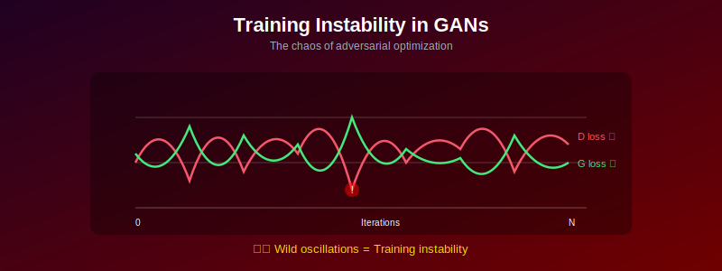
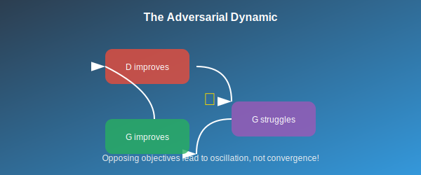
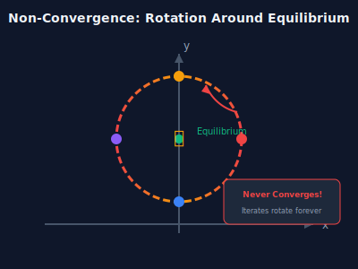
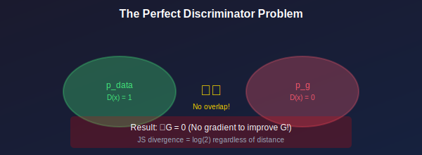
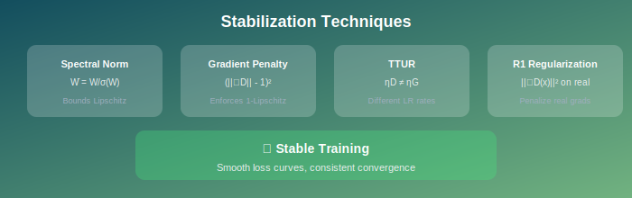
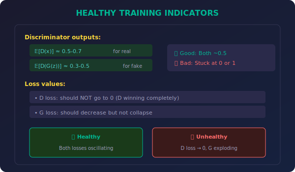

# ⚡ Training Instability in GANs

*Understanding and conquering the chaos of adversarial training*

---

## 🎯 Where & Why Understand Training Instability?

### 🌍 Real-World Applications

| Scenario | Why This Matters |
|----------|------------------|
| **Production ML Systems** | Ensure reliable, reproducible GAN training |
| **Research & Development** | Debug failed experiments efficiently |
| **Model Deployment** | Achieve consistent quality in deployed models |
| **Resource Optimization** | Avoid wasted compute on unstable training |
| **Architecture Design** | Build inherently stable GAN variants |
| **Hyperparameter Tuning** | Know which knobs to turn when training fails |

### 💡 Why Master This Topic?

> *"A GAN that doesn't train is just two neural networks staring at each other."*

1. **Save Time & Resources** — Quickly diagnose and fix training failures
2. **Better Research** — Understand why experiments succeed or fail
3. **Production Readiness** — Build GANs that work reliably
4. **Deep Understanding** — Know the theoretical reasons behind instability
5. **Practical Skills** — Learn proven techniques for stable training

---

## 📖 Introduction

GAN training is notoriously difficult and unstable. Unlike standard supervised learning, GANs involve two competing networks with non-convex objectives, leading to various failure modes. Understanding these instabilities is crucial for successful GAN training.

---

## 📊 Representation Comparison

| Representation | Pros | Cons |
|----------------|------|------|
| **Simultaneous SGD** | Simple | Oscillation, non-convergence |
| **Alternating SGD** | Reduces oscillation | Still unstable |
| **TTUR (2 timescales)** | D reaches optimum | Hyperparameter sensitive |
| **Gradient Penalty** | Enforces Lipschitz | Expensive per step |
| **Spectral Norm** | Cheap, effective | May limit capacity |

---

## 1. Sources of Instability

### 1.1 The Adversarial Dynamic

**Fundamental problem:** Two networks optimizing opposing objectives.

$$\theta_D \leftarrow \theta_D + \eta \nabla_{\theta_D} V(D, G)$$
$$\theta_G \leftarrow \theta_G - \eta \nabla_{\theta_G} V(D, G)$$

> ⚠️ This is **NOT** gradient descent on a single objective!

### 1.2 Non-Convergence Example

**Example:** Simple bilinear game \( V(x, y) = xy \)

Gradient updates:
$$x_{t+1} = x_t + \eta y_t$$
$$y_{t+1} = y_t - \eta x_t$$

**Solution:** \( (x_t, y_t) = r(\cos(\omega t + \phi), \sin(\omega t + \phi)) \)

> 🔄 The iterates rotate around the equilibrium, **never converging!**

### 1.3 Vanishing Gradients

When D is too good:
$$D(G(z)) \approx 0 \quad \forall z$$

| Loss Type | Gradient | Problem |
|-----------|----------|---------|
| Original G loss | \( \log(1 - D(G(z))) \approx \log(1) = 0 \) | Nearly zero |
| Gradient | \( \frac{-1}{1 - D(G(z))} \approx -1 \) | Too small |

> **Result:** Generator receives weak learning signal.

### 1.4 Exploding Gradients

When training is imbalanced:
- Discriminator weights grow unbounded
- Gradient magnitudes explode
- Training becomes numerically unstable

---

## 2. The Discriminator Problem

### 2.1 Perfect Discriminator

**Theorem (Arjovsky & Bottou, 2017):** If \( p_{data} \) and \( p_g \) have disjoint supports, then there exists a discriminator \( D^* \) with:

$$D^*(x) = 1 \quad \forall x \in \text{supp}(p_{data})$$
$$D^*(x) = 0 \quad \forall x \in \text{supp}(p_g)$$

**Consequence:** 
- \( V(D^*, G) = 0 \) (saturated)
- \( \nabla_{\theta_G} V = 0 \) (**no gradient!**)

### 2.2 Why Disjoint Supports?

**High-dimensional spaces:** Two distributions on manifolds generically have measure-zero intersection.

If \( p_{data} \) is supported on a \( d \)-dimensional manifold in \( \mathbb{R}^D \) (with \( d < D \)), and similarly for \( p_g \), they likely don't overlap.

### 2.3 JS Divergence Discontinuity

For disjoint distributions:
$$D_{JS}(p_{data} \| p_g) = \log 2$$

regardless of how "close" the distributions are!

> ❌ **No gradient signal** to move \( p_g \) toward \( p_{data} \).

---

## 3. Oscillation and Non-Convergence

### 3.1 Local Instability Analysis

Near an equilibrium \( (D^*, G^*) \), linearize:

$$\begin{bmatrix} \Delta\theta_D \\ \Delta\theta_G \end{bmatrix}_{t+1} = (I + \eta J) \begin{bmatrix} \Delta\theta_D \\ \Delta\theta_G \end{bmatrix}_t$$

where \( J \) is the Jacobian:

$$J = \begin{bmatrix} H_{DD} & H_{DG} \\ -H_{GD} & -H_{GG} \end{bmatrix}$$

### 3.2 Eigenvalue Analysis

**Stability requires:** All eigenvalues of \( (I + \eta J) \) have magnitude < 1.

**For zero-sum games:** \( J \) typically has imaginary eigenvalues.
- Leads to oscillation
- Learning rate must be very small for stability

### 3.3 Example: Linear GAN

$$V(\theta_D, \theta_G) = \theta_D \cdot \theta_G$$

Jacobian:
$$J = \begin{bmatrix} 0 & 1 \\ -1 & 0 \end{bmatrix}$$

Eigenvalues: \( \pm i \) (purely imaginary)

\( (I + \eta J) \) has eigenvalues \( 1 \pm i\eta \) with magnitude \( \sqrt{1 + \eta^2} > 1 \)

> **Result:** Always unstable! Iterates spiral outward. 🌀

---

## 4. Mitigation Strategies

### 4.1 Architecture Choices

**Spectral Normalization:**
$$\bar{W} = W / \sigma(W)$$

where \( \sigma(W) \) is the largest singular value.

**Effect:** Bounds discriminator Lipschitz constant.

**Careful Normalization:**
- ❌ Avoid batch norm in discriminator (can cause instability)
- ✅ Use layer norm or instance norm
- ✅ Or no normalization at all

### 4.2 Training Techniques

| Technique | Description | Effect |
|-----------|-------------|--------|
| **LR Scheduling** | Smaller LR for D than G | Balance training |
| **TTUR** | Two Time-Scale Update Rule | Proven convergence |
| **Gradient Clipping** | \( g \leftarrow g \cdot \min(1, \frac{c}{\|g\|}) \) | Prevent explosion |
| **D:G Ratio** | Train D for k steps, G for 1 | Better D training |

### 4.3 Regularization

**Gradient Penalty (WGAN-GP):**
$$\mathcal{L}_{GP} = \lambda \mathbb{E}_{\hat{x}}\left[(\|\nabla_{\hat{x}} D(\hat{x})\|_2 - 1)^2\right]$$

where \( \hat{x} = \epsilon x + (1-\epsilon)G(z) \), \( \epsilon \sim U[0,1] \).

**R1 Regularization:**
$$\mathcal{L}_{R1} = \frac{\gamma}{2}\mathbb{E}_{x \sim p_{data}}\left[\|\nabla_x D(x)\|^2\right]$$

Only penalize gradients on real data.

### 4.4 Alternative Objectives

| Method | Benefit |
|--------|---------|
| **WGAN** | Provides gradients even with disjoint supports |
| **LSGAN** | More stable gradients, no saturation |
| **Hinge Loss** | Bounded discriminator outputs |

### 4.5 Optimization Algorithms

**Adam with β₁ = 0.5:**
- Lower momentum reduces oscillation
- Standard choice for GANs

**Extra-Gradient Methods:**
$$\tilde{\theta} = \theta - \eta \nabla V(\theta)$$
$$\theta_{new} = \theta - \eta \nabla V(\tilde{\theta})$$

Can provably converge for bilinear games.

---

## 5. Monitoring Training

### 5.1 Metrics to Track

### 5.2 Warning Signs

| Symptom | Likely Cause | Solution |
|---------|--------------|----------|
| \( D(x) \approx 1 \), \( D(G(z)) \approx 0 \) | D too strong | Weaken D, train G more |
| D loss → 0 | D has won | Reduce D capacity |
| G loss oscillating wildly | Training unstable | Lower LR, add regularization |
| Generated samples collapse | Mode collapse | See mode collapse section |
| NaN losses | Exploding gradients | Gradient clipping, lower LR |

### 5.3 Visualization

**During training:**
- 📸 Sample generated images periodically
- 📈 Plot latent space interpolations
- 🎯 Visualize discriminator decision boundary

---

## 6. Theoretical Understanding

### 6.1 Convergence Results

**Theorem (Mescheder et al., 2018):** Standard GAN training with gradient descent-ascent does **not converge** in general, even for absolutely continuous \( p_{data} \).

**Conditions for convergence:**
- ✅ Regularization (gradient penalties)
- ✅ Instance noise
- ✅ Proper architecture constraints

### 6.2 Instance Noise

Add noise to discriminator inputs:
$$\tilde{x} = x + \epsilon, \quad \epsilon \sim \mathcal{N}(0, \sigma^2 I)$$

**Effect:** 
- Makes distributions "overlap"
- Prevents perfect discriminator
- Can be annealed during training

---

## 📊 Key Takeaways

| Issue | Solution |
|-------|----------|
| **Vanishing gradients** | Non-saturating loss, WGAN |
| **Oscillation** | TTUR, gradient penalties, lower lr |
| **Exploding gradients** | Spectral norm, gradient clipping |
| **D too strong** | Train G more, weaker D |
| **Non-convergence** | Regularization, better objectives |

---

## 📚 References

1. **Arjovsky, M., & Bottou, L.** (2017). "Towards Principled Methods for Training Generative Adversarial Networks." *ICLR*. [arXiv:1701.04862](https://arxiv.org/abs/1701.04862)
2. **Mescheder, L., Geiger, A., & Nowozin, S.** (2018). "Which Training Methods for GANs do actually Converge?" *ICML*. [arXiv:1801.04406](https://arxiv.org/abs/1801.04406)
3. **Miyato, T., et al.** (2018). "Spectral Normalization for Generative Adversarial Networks." *ICLR*. [arXiv:1802.05957](https://arxiv.org/abs/1802.05957)
4. **Roth, K., et al.** (2017). "Stabilizing Training of Generative Adversarial Networks through Regularization." *NeurIPS*. [arXiv:1705.09367](https://arxiv.org/abs/1705.09367)

---

## ✏️ Exercises

1. **Implement** training curves visualization for \( D(x) \) and \( D(G(z)) \) during training.

2. **Compare** training stability with and without spectral normalization.

3. **Experiment** with different learning rate ratios for D and G.

4. **Implement** gradient penalty and compare to standard GAN training.

5. **Visualize** the discriminator loss landscape near convergence.

---

**[← Back to Minimax Objective](../01_minimax_objective/)** | **[Next: Mode Collapse →](../03_mode_collapse/)**

