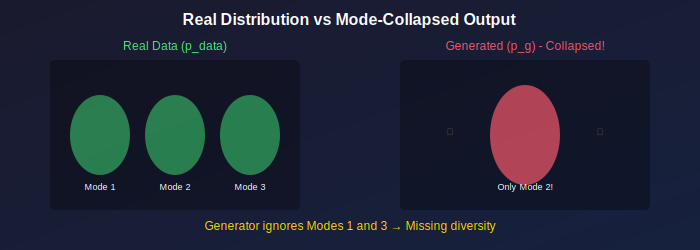
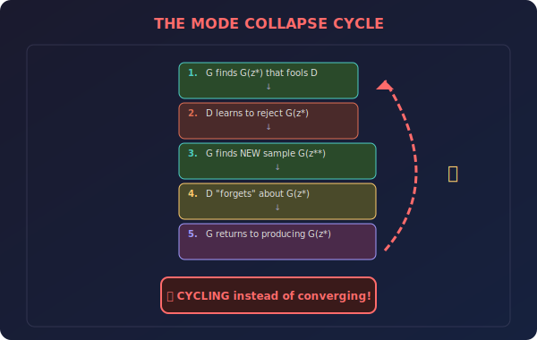
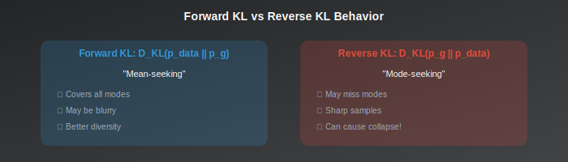
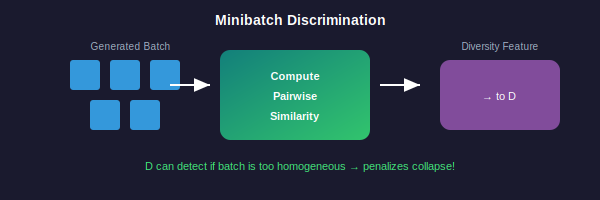

# 🔄 Mode Collapse in GANs

*When generators forget to be creative*

---

## 🎯 Where & Why Understand Mode Collapse?

### 🌍 Real-World Impact

| Scenario | How Mode Collapse Hurts |
|----------|-------------------------|
| **Image Generation** | All faces look the same, no diversity |
| **Data Augmentation** | Generated data doesn't cover edge cases |
| **Drug Discovery** | Missing potentially valuable molecular structures |
| **Game Asset Generation** | Repetitive, boring content |
| **Art Generation** | AI becomes "one-trick pony" |
| **Simulation** | Missing critical scenarios for testing |

### 💡 Why Master This Topic?

> *"A GAN with mode collapse is like a chef who only knows how to make one dish—technically skilled, but utterly useless for variety."*

1. **Quality Assurance** — Detect when your GAN is failing silently
2. **Better Models** — Know techniques that prevent collapse
3. **Evaluation Skills** — Choose metrics that reveal collapse
4. **Debug Expertise** — Fix broken training runs
5. **Research Depth** — Understand a core GAN limitation

---

## 📖 Introduction

Mode collapse is one of the most common failure modes in GAN training, where the generator learns to produce only a limited variety of outputs, ignoring large portions of the data distribution. Understanding its causes and solutions is essential for training diverse, high-quality generative models.

---

## 📊 Representation Comparison

| Representation | Pros | Cons |
|----------------|------|------|
| **Minibatch Discrimination** | Detects collapse directly | Extra computation |
| **Unrolled GAN** | Anticipates D updates | K× more expensive |
| **Feature Matching** | Targets statistics | May not cover modes |
| **Mode Regularization** | Explicit diversity | Hyperparameter tuning |
| **VEEGAN** | Reconstructor network | Architecture change |

---

## 1. What is Mode Collapse?

### 1.1 Definition

**Mode collapse** occurs when the generator maps many different latent codes to the same or very similar outputs:

$$G(z_1) \approx G(z_2) \approx \cdots \approx G(z_k)$$

for distinct \( z_1, z_2, \ldots, z_k \).

### 1.2 Types of Mode Collapse

| Type | Description | Severity |
|------|-------------|----------|
| **Complete Collapse** | Generator produces essentially one sample | 🔴 Critical |
| **Partial Collapse** | Generator covers some modes but misses others | 🟡 Moderate |
| **Intra-class Collapse** | Within a class, only one variant is learned | 🟠 Subtle |

### 1.3 Why It's a Problem

- ❌ **Lack of diversity:** Generated samples are repetitive
- ❌ **Missing modes:** Important variations not represented
- ❌ **Useless latent space:** \( z \) doesn't control variation
- ❌ **Poor coverage:** \( p_g \) doesn't match \( p_{data} \)

---

## 2. Causes of Mode Collapse

### 2.1 The Optimization Perspective

### 2.2 The Divergence Perspective

**Reverse KL vs. Forward KL:**

The non-saturating GAN objective relates to reverse KL:
$$D_{KL}(p_g \| p_{data})$$

**Reverse KL is mode-seeking:**
- ❌ Heavily penalizes \( p_g(x) > 0 \) where \( p_{data}(x) \approx 0 \)
- ✅ Doesn't penalize \( p_g(x) = 0 \) where \( p_{data}(x) > 0 \)

> **Result:** G prefers to cover **few modes perfectly** rather than **all modes imperfectly**.

### 2.3 Mathematical Analysis

For a mixture distribution:
$$p_{data}(x) = \sum_{k=1}^{K} \pi_k p_k(x)$$

**Mode-seeking (reverse KL):** \( p_g \) might concentrate on the largest \( \pi_k \)

**Mean-seeking (forward KL):** \( p_g \) would try to cover all modes

### 2.4 Discriminator Issues

| D State | Effect on G |
|---------|-------------|
| **Too weak** | Can't distinguish between modes → All modes look equally good |
| **Too strong** | Rejects everything equally → G has no signal about which modes are good |

---

## 3. Detecting Mode Collapse

### 3.1 Visual Inspection

- 👀 Generate many samples, look for repetition
- 🔍 Interpolate in latent space, check for variation
- 📊 Generate class-conditional samples, check diversity

### 3.2 Quantitative Metrics

**Inception Score breakdown:**
- Low \( H(y) \) (marginal entropy) indicates collapse
- Should see uniform distribution over classes

**Number of modes captured:**
$$\text{Coverage} = \frac{\#\text{modes with samples}}{\#\text{total modes}}$$

**Nearest neighbor diversity:**
$$\text{Diversity} = \mathbb{E}_{z_1, z_2}[\|G(z_1) - G(z_2)\|]$$

### 3.3 Latent Space Analysis

**Mapping entropy:** For each output region, count how many \( z \) values map there.

**Collapsed:** Many \( z \) → same output region

---

## 4. Solutions

### 4.1 Minibatch Discrimination

**Idea:** Let discriminator see statistics of entire minibatch.

**Implementation:**
1. Compute pairwise similarities in minibatch
2. Concatenate similarity features to discriminator input
3. D can detect if batch is too homogeneous

$$f(x_i)_b = \sum_{j \neq i} \exp(-\|T(x_i) - T(x_j)\|)$$

### 4.2 Unrolled GANs

**Idea:** Generator optimizes against **future** discriminator.

Instead of:
$$\nabla_{\theta_G} V(D_{\theta_D}, G_{\theta_G})$$

Use:
$$\nabla_{\theta_G} V(D_{\theta_D^{(k)}}, G_{\theta_G})$$

where \( \theta_D^{(k)} \) is discriminator after \( k \) update steps.

> **Effect:** Generator can't exploit momentary discriminator weaknesses.

### 4.3 Mode Regularization

**Mode-seeking regularization:**
$$\mathcal{L}_{MS} = -\frac{\|G(z_1) - G(z_2)\|}{\|z_1 - z_2\|}$$

Encourages diverse outputs for diverse inputs.

**MSGAN:**
$$\mathcal{L}_G = \mathcal{L}_{GAN} + \lambda_{MS} \mathcal{L}_{MS}$$

### 4.4 Feature Matching

**Idea:** Match statistics between real and generated features.

$$\mathcal{L}_{FM} = \|\mathbb{E}_{x \sim p_{data}}[f(x)] - \mathbb{E}_{z \sim p_z}[f(G(z))]\|^2$$

where \( f \) extracts features from intermediate discriminator layers.

> **Effect:** Generator targets overall statistics, not just fooling D.

### 4.5 Multiple Generators/Discriminators

| Method | Description |
|--------|-------------|
| **MAD-GAN** | Multiple generators, each covering different modes |
| **GMAN** | Multiple discriminators, harder to fool all |

$$\mathcal{L}_G = \max_i \mathcal{L}_{D_i}$$

### 4.6 Better Objectives

| Method | Property | Effect |
|--------|----------|--------|
| **WGAN** | Based on Wasserstein distance | Mean-seeking behavior |
| **Unbiased GAN** | Corrected gradients | Reduces mode-seeking bias |

### 4.7 Spectral Normalization

**Effect on mode collapse:**
- Prevents discriminator from becoming too confident
- Smoother discriminator landscape
- Helps generator explore

### 4.8 Progressive Growing

Start with low resolution, add layers:
$$4 \times 4 \rightarrow 8 \times 8 \rightarrow \cdots \rightarrow 1024 \times 1024$$

**Effect:** 
- Learn coarse structure first (major modes)
- Add details later (intra-mode variation)

---

## 5. Theoretical Analysis

### 5.1 Mode Collapse as Local Optimum

**Observation:** Mode collapse can be a **local Nash equilibrium**.

If G produces samples from one mode perfectly:
- D can only assign 0.5 to those samples
- G has no incentive to change (locally)
- But globally, this is suboptimal!

### 5.2 The Missing Mode Gradient

**Why doesn't G learn missing modes?**

For a mode \( x^* \) not produced by G:
- \( D(x^*) = 1 \) (correctly classified as real)
- But G never produces anything near \( x^* \)
- So gradient doesn't point toward \( x^* \)

> 💡 **The discriminator only provides gradients for samples G actually produces.**

### 5.3 Entropy of Generator

Define generator entropy:
$$H(G) = -\int p_g(x) \log p_g(x) dx$$

**Mode collapse:** \( H(G) \) is low (concentrated distribution)

**Ideal:** \( H(G) \approx H(p_{data}) \)

---

## 6. Practical Guidelines

### 6.1 Architecture

- ✅ Use batch/layer normalization in generator
- ✅ LeakyReLU in discriminator
- ❌ Avoid bottlenecks that force mode collapse

### 6.2 Training

- ✅ Monitor diversity during training
- ✅ Use feature matching or minibatch discrimination
- ✅ Consider Wasserstein objective

### 6.3 Hyperparameters

- Higher latent dimension can help
- Larger batch sizes provide more diversity signal
- Balance D and G training carefully

### 6.4 Evaluation

- Report diversity metrics alongside quality
- Generate many samples and inspect
- Test interpolation smoothness

---

## 📊 Key Concepts Summary

| Concept | Description |
|---------|-------------|
| **Mode collapse** | G produces limited variety |
| **Mode-seeking** | Reverse KL prefers few modes |
| **Minibatch discrimination** | D sees batch statistics |
| **Feature matching** | Match feature statistics |
| **Unrolled GAN** | G optimizes vs future D |

---

## 📚 References

1. **Goodfellow, I.** (2016). "NIPS 2016 Tutorial: Generative Adversarial Networks." [arXiv:1701.00160](https://arxiv.org/abs/1701.00160)
2. **Salimans, T., et al.** (2016). "Improved Techniques for Training GANs." *NeurIPS*. [arXiv:1606.03498](https://arxiv.org/abs/1606.03498)
3. **Metz, L., et al.** (2017). "Unrolled Generative Adversarial Networks." *ICLR*. [arXiv:1611.02163](https://arxiv.org/abs/1611.02163)
4. **Srivastava, A., et al.** (2017). "VEEGAN: Reducing Mode Collapse in GANs using Implicit Variational Learning." *NeurIPS*. [arXiv:1705.07761](https://arxiv.org/abs/1705.07761)
5. **Mao, Q., et al.** (2019). "Mode Seeking Generative Adversarial Networks for Diverse Image Synthesis." *CVPR*. [arXiv:1903.05628](https://arxiv.org/abs/1903.05628)

---

## ✏️ Exercises

1. **Train** a GAN on a mixture of Gaussians and visualize mode collapse.

2. **Implement** minibatch discrimination and compare diversity.

3. **Compare** mode coverage between standard GAN and WGAN.

4. **Visualize** the generator's output distribution during training.

5. **Implement** mode-seeking regularization and measure its effect.

---

**[← Back to Training Instability](../02_training_instability/)** | **[Back to GAN Basics →](../README.md)**

