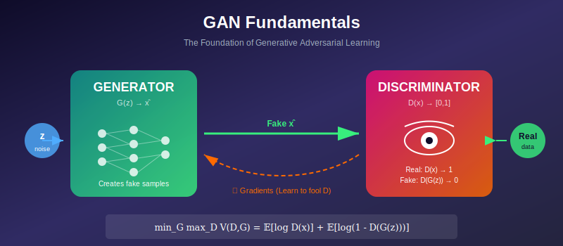
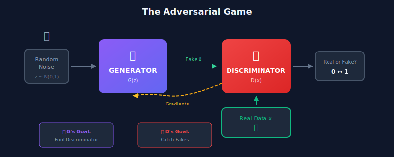
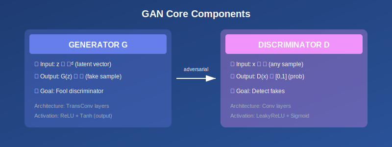
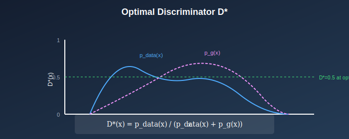
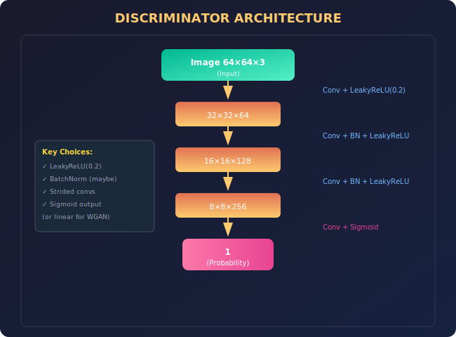

# 🎓 Generative Adversarial Networks: Fundamentals

<div align="center">



*Master the core concepts behind the adversarial learning revolution*

</div>

---

## 🎯 Where & Why Use GAN Basics?

### 🌍 Where Are These Concepts Applied?

| Domain | Application | Why GANs? |
|--------|-------------|-----------|
| **Computer Vision** | Image generation, enhancement | Create photorealistic images from noise |
| **Healthcare** | Medical image synthesis | Augment rare disease datasets |
| **Gaming** | Procedural content generation | Generate game assets, textures |
| **Art & Design** | Creative tools | AI-assisted artwork creation |
| **Security** | Adversarial testing | Evaluate ML system robustness |
| **Fashion** | Virtual try-on | Generate realistic clothing fits |
| **Automotive** | Synthetic training data | Generate driving scenarios |

### 💡 Why Learn GAN Fundamentals?

> *"You cannot build skyscrapers on sand. Understanding GAN fundamentals is the bedrock of generative AI mastery."*

1. **Foundation for All Advanced GANs** — Every variant (StyleGAN, CycleGAN, etc.) builds on these principles
2. **Debug Training Issues** — Understanding the minimax game helps diagnose problems
3. **Design Better Architectures** — Know what makes generators and discriminators work
4. **Research Literacy** — Read and understand GAN papers in the literature
5. **Interview Preparation** — Core concepts frequently asked in ML interviews

---

## 📖 Introduction

Generative Adversarial Networks (GANs), introduced by Goodfellow et al. in 2014, revolutionized generative modeling through a novel adversarial training paradigm. Two networks—a **Generator** and a **Discriminator**—are trained simultaneously in a competitive game, resulting in the generator learning to produce realistic samples.

<div align="center">



</div>

---

## 📊 Representation Comparison

| Representation | Pros | Cons |
|----------------|------|------|
| **Original GAN** | Sharp samples, implicit density | Training instability, mode collapse |
| **DCGAN** | Stable architecture guidelines | Limited resolution |
| **WGAN** | Smooth gradients, meaningful loss | Slow (weight clipping) |
| **WGAN-GP** | Better than clipping | Expensive gradient penalty |
| **StyleGAN** | SOTA quality, controllable | Complex, high compute |

---

## 1. The GAN Framework

### 1.1 Core Components

<div align="center">



</div>

#### **Generator \( G: \mathcal{Z} \rightarrow \mathcal{X} \)**

- Takes random noise \( z \sim p_z(z) \) (typically \( \mathcal{N}(0, I) \) or \( \text{Uniform}(-1, 1) \))
- Outputs fake samples \( G(z) \in \mathcal{X} \)
- **Goal:** Produce samples indistinguishable from real data

#### **Discriminator \( D: \mathcal{X} \rightarrow [0, 1] \)**

- Takes samples from data space \( \mathcal{X} \)
- Outputs probability that input is real
- **Goal:** Distinguish real samples from fake samples

### 1.2 The Adversarial Game

**Minimax Objective:**

$$\min_G \max_D V(D, G) = \mathbb{E}_{x \sim p_{data}(x)}[\log D(x)] + \mathbb{E}_{z \sim p_z(z)}[\log(1 - D(G(z)))]$$

<div align="center">

| Player | Strategy | Objective |
|--------|----------|-----------|
| **Discriminator D** | Maximize \( V(D,G) \) | Correctly classify real (high \( D(x) \)) and fake (low \( D(G(z)) \)) |
| **Generator G** | Minimize \( V(D,G) \) | Fool D (high \( D(G(z)) \), making \( \log(1-D(G(z))) \) low) |

</div>

### 1.3 The Value Function Breakdown

$$V(D, G) = \underbrace{\mathbb{E}_{x \sim p_{data}}[\log D(x)]}_{\text{Real samples: D wants this HIGH}} + \underbrace{\mathbb{E}_{z \sim p_z}[\log(1 - D(G(z)))]}_{\text{Fake samples: D wants this HIGH, G wants LOW}}$$

> 💡 **Key Insight:** For fixed G, this is the negative cross-entropy loss for binary classification!

---

## 2. Theoretical Analysis

### 2.1 Optimal Discriminator

<div align="center">



</div>

**Theorem:** For fixed generator \( G \), the optimal discriminator is:

$$\boxed{D^*_G(x) = \frac{p_{data}(x)}{p_{data}(x) + p_g(x)}}$$

where \( p_g \) is the distribution of generated samples.

<details>
<summary><b>📐 Click to see the full proof</b></summary>

**Proof:**

Starting with the value function:
$$V(D, G) = \int_x p_{data}(x) \log D(x) + p_g(x) \log(1 - D(x)) \, dx$$

For each \( x \), we maximize:
$$f(D) = a \log D + b \log(1 - D)$$

where \( a = p_{data}(x) \), \( b = p_g(x) \).

Taking the derivative:
$$\frac{df}{dD} = \frac{a}{D} - \frac{b}{1-D} = 0$$

Solving for \( D^* \):
$$\frac{a}{D^*} = \frac{b}{1-D^*}$$
$$a(1-D^*) = bD^*$$
$$a = D^*(a + b)$$

$$D^* = \frac{a}{a+b} = \frac{p_{data}(x)}{p_{data}(x) + p_g(x)} \quad \blacksquare$$

</details>

### 2.2 Global Optimum

**Theorem:** The global minimum of \( C(G) = \max_D V(D, G) \) is achieved **if and only if** \( p_g = p_{data} \), and the minimum value is \( -\log 4 \).

<details>
<summary><b>📐 Click to see the full proof</b></summary>

**Proof:**

Substituting \( D^*_G \):

$$C(G) = \mathbb{E}_{x \sim p_{data}}\left[\log \frac{p_{data}(x)}{p_{data}(x) + p_g(x)}\right] + \mathbb{E}_{x \sim p_g}\left[\log \frac{p_g(x)}{p_{data}(x) + p_g(x)}\right]$$

Let \( m(x) = \frac{1}{2}(p_{data}(x) + p_g(x)) \). Then:

$$C(G) = \mathbb{E}_{p_{data}}\left[\log \frac{p_{data}}{2m}\right] + \mathbb{E}_{p_g}\left[\log \frac{p_g}{2m}\right]$$

$$= -\log 4 + D_{KL}(p_{data} \| m) + D_{KL}(p_g \| m)$$

$$= -\log 4 + 2 \cdot D_{JS}(p_{data} \| p_g)$$

Since \( D_{JS} \geq 0 \) with equality iff \( p_{data} = p_g \):

$$C(G) \geq -\log 4$$

with equality iff \( p_g = p_{data} \). \( \quad \blacksquare \)

</details>

### 2.3 Jensen-Shannon Divergence

$$D_{JS}(P \| Q) = \frac{1}{2}D_{KL}(P \| M) + \frac{1}{2}D_{KL}(Q \| M)$$

where \( M = \frac{1}{2}(P + Q) \).

<div align="center">

| Property | Value/Description |
|----------|-------------------|
| **Symmetric** | \( D_{JS}(P \| Q) = D_{JS}(Q \| P) \) ✓ |
| **Bounded** | \( 0 \leq D_{JS} \leq \log 2 \) |
| **Metric** | \( \sqrt{D_{JS}} \) is a valid metric |
| **Zero When** | \( P = Q \) exactly |

</div>

---

## 3. Training Algorithm

### 3.1 Standard Training Procedure

```python
# GAN Training Algorithm
for epoch in range(num_epochs):
    for batch in dataloader:
        
        # ═══════════════════════════════════════════
        # STEP 1: Train Discriminator (k steps)
        # ═══════════════════════════════════════════
        for _ in range(k):
            # Sample minibatch of m noise samples
            z = sample_noise(m)
            
            # Sample minibatch of m real samples
            x_real = batch
            
            # Update D by ascending its stochastic gradient
            d_loss = -mean(log(D(x_real)) + log(1 - D(G(z))))
            d_loss.backward()
            optimizer_D.step()
        
        # ═══════════════════════════════════════════
        # STEP 2: Train Generator
        # ═══════════════════════════════════════════
        z = sample_noise(m)
        
        # Update G by descending its stochastic gradient
        g_loss = mean(log(1 - D(G(z))))  # Original
        # g_loss = -mean(log(D(G(z))))   # Non-saturating (preferred)
        g_loss.backward()
        optimizer_G.step()
```

### 3.2 Alternative Generator Objective

> ⚠️ **Problem:** \( \log(1 - D(G(z))) \) saturates when D is confident (early in training).

**Solution:** Instead of minimizing \( \log(1 - D(G(z))) \), maximize \( \log D(G(z)) \):

$$\max_G \mathbb{E}_{z \sim p_z}[\log D(G(z))]$$

<div align="center">

| Aspect | Original | Non-Saturating |
|--------|----------|----------------|
| **Objective** | \( \min_G \mathbb{E}[\log(1-D(G(z)))] \) | \( \max_G \mathbb{E}[\log D(G(z))] \) |
| **Early Training** | Weak gradients 😟 | Strong gradients 😊 |
| **Fixed Point** | Same | Same |
| **Gradient When D(G(z))≈0** | \( \approx 1 \) | \( \approx 100 \) |

</div>

### 3.3 Loss Function Summary

| Network | Loss Component | Original | Non-Saturating |
|---------|----------------|----------|----------------|
| **D** (real) | Classify real as real | \( -\log D(x) \) | \( -\log D(x) \) |
| **D** (fake) | Classify fake as fake | \( -\log(1-D(G(z))) \) | \( -\log(1-D(G(z))) \) |
| **G** | Fool discriminator | \( \log(1-D(G(z))) \) | \( -\log D(G(z)) \) |

---

## 4. Understanding GANs as Divergence Minimization

### 4.1 f-GAN Framework

GANs can minimize various f-divergences by choosing appropriate loss functions.

**f-divergence:**
$$D_f(P \| Q) = \int q(x) f\left(\frac{p(x)}{q(x)}\right) dx$$

<div align="center">

| Divergence | \( f(t) \) | GAN Variant |
|------------|------------|-------------|
| **KL** | \( t \log t \) | — |
| **Reverse KL** | \( -\log t \) | — |
| **Jensen-Shannon** | \( -(t+1)\log\frac{t+1}{2} + t\log t \) | **Original GAN** |
| **Total Variation** | \( \frac{1}{2}|t-1| \) | — |
| **Pearson χ²** | \( (t-1)^2 \) | **LSGAN** |

</div>

### 4.2 Integral Probability Metrics

Alternative to f-divergences:

$$d_\mathcal{F}(P, Q) = \sup_{f \in \mathcal{F}} \left|\mathbb{E}_{x \sim P}[f(x)] - \mathbb{E}_{x \sim Q}[f(x)]\right|$$

> 💡 **Wasserstein distance** is an IPM where \( \mathcal{F} \) = 1-Lipschitz functions.

---

## 5. Network Architectures

### 5.1 Generator Architecture

<div align="center">


</div>

**Key Design Choices:**
- ✅ Latent dimension: 100-512
- ✅ Use batch normalization (except output)
- ✅ ReLU activation (LeakyReLU in some variants)
- ✅ Tanh output (for [-1, 1] normalized images)

### 5.2 Discriminator Architecture

<div align="center">



</div>

**Key Design Choices:**
- ✅ LeakyReLU activation (slope ~0.2)
- ✅ Batch normalization (controversial, sometimes removed)
- ✅ Strided convolutions for downsampling (no pooling)
- ✅ Sigmoid output (or linear for Wasserstein)

---

## 6. Practical Training Tips

### 6.1 Hyperparameters

<div align="center">

| Parameter | Recommended Value | Notes |
|-----------|-------------------|-------|
| **Learning Rate** | 0.0002 | For both G and D |
| **Adam β₁** | 0.5 | Lower than default 0.9 |
| **Adam β₂** | 0.999 | Standard |
| **Batch Size** | 32-128 | Larger batches stabilize training |
| **Latent Dim** | 100-512 | Depends on complexity |

</div>

### 6.2 Normalization Techniques

| Technique | Use Case | Pros | Cons |
|-----------|----------|------|------|
| **Batch Norm** | Generator | Helps training | May cause mode collapse in D |
| **Spectral Norm** | Discriminator | Stabilizes training | Slightly slower |
| **Layer Norm** | Both | Independent of batch | May reduce quality |
| **Instance Norm** | Style transfer | Good for textures | Not for all tasks |

### 6.3 Label Smoothing

Instead of hard labels 0 and 1:
- **Real labels:** 0.9 (or uniform [0.7, 1.0])
- **Fake labels:** 0.1 (or uniform [0.0, 0.3])

> 💡 Prevents discriminator from becoming too confident.

### 6.4 Adding Noise

- **Input noise:** Add Gaussian noise to discriminator inputs
- **Label noise:** Randomly flip labels (e.g., 5% of the time)

---

## 7. 📚 Subtopics

This section continues with detailed coverage of:

<div align="center">

| Topic | Description | Link |
|-------|-------------|------|
| 🎯 **Minimax Objective** | Deep dive into game theory | [→ Explore](./01_minimax_objective/) |
| ⚡ **Training Instability** | Understanding and mitigating instabilities | [→ Explore](./02_training_instability/) |
| 🔄 **Mode Collapse** | Causes and solutions | [→ Explore](./03_mode_collapse/) |

</div>

---

## 📊 Key Equations Summary

<div align="center">

| Concept | Formula |
|---------|---------|
| **Minimax Objective** | \( \min_G \max_D \mathbb{E}[\log D(x)] + \mathbb{E}[\log(1-D(G(z)))] \) |
| **Optimal Discriminator** | \( D^*(x) = \frac{p_{data}(x)}{p_{data}(x) + p_g(x)} \) |
| **JS at Optimum** | \( C(G) = -\log 4 + 2 D_{JS}(p_{data} \| p_g) \) |
| **Non-saturating G** | \( \max_G \mathbb{E}[\log D(G(z))] \) |

</div>

---

## 📚 References

### Original Paper
1. **Goodfellow, I., et al.** (2014). "Generative Adversarial Networks." *NeurIPS*. [arXiv:1406.2661](https://arxiv.org/abs/1406.2661)

### Theory
2. **Goodfellow, I.** (2016). "NIPS 2016 Tutorial: Generative Adversarial Networks." [arXiv:1701.00160](https://arxiv.org/abs/1701.00160)
3. **Nowozin, S., Cseke, B., & Tomioka, R.** (2016). "f-GAN: Training Generative Neural Samplers using Variational Divergence Minimization." *NeurIPS*. [arXiv:1606.00709](https://arxiv.org/abs/1606.00709)

### Practical Guides
4. **Salimans, T., et al.** (2016). "Improved Techniques for Training GANs." *NeurIPS*. [arXiv:1606.03498](https://arxiv.org/abs/1606.03498)
5. **Lucic, M., et al.** (2018). "Are GANs Created Equal? A Large-Scale Study." *NeurIPS*. [arXiv:1711.10337](https://arxiv.org/abs/1711.10337)

---

## ✏️ Exercises

1. **Derive** the optimal discriminator \( D^*_G(x) \) and verify it equals 0.5 when \( p_g = p_{data} \).

2. **Show** that the GAN objective minimizes Jensen-Shannon divergence at optimality.

3. **Implement** a simple GAN for MNIST and visualize training dynamics.

4. **Compare** original vs. non-saturating generator loss—plot gradient magnitudes.

5. **Experiment** with different D:G training ratios (1:1, 5:1, etc.).

---

<div align="center">

**[← Back to Main](../README.md)** | **[Next: Minimax Objective →](./01_minimax_objective/)**

</div>
