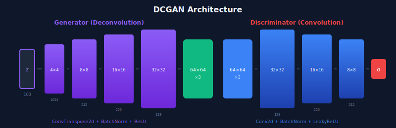
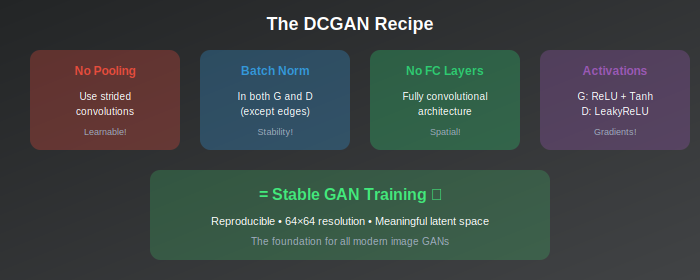
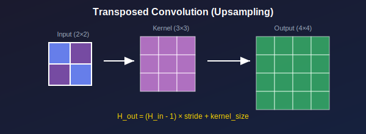
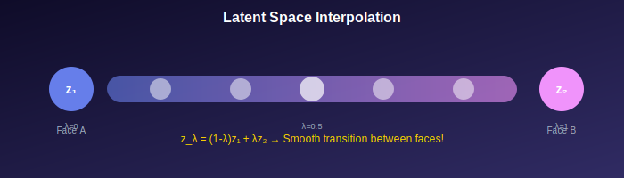

# 🏗️ Deep Convolutional GAN (DCGAN)

<div align="center">



*The architectural blueprint that made image GANs practical*

</div>

---

## 🎯 Where & Why Use DCGAN?

### 🌍 Real-World Applications

| Domain | Application | Why DCGAN? |
|--------|-------------|------------|
| **Art & Design** | Generate textures, patterns, artwork | Stable training, good quality |
| **Gaming** | Procedural asset generation | Fast, consistent results |
| **Fashion** | Generate clothing designs | Handles visual patterns well |
| **Architecture** | Floor plans, facade generation | Good at structured images |
| **Data Augmentation** | Expand training datasets | Reliable baseline |
| **Education** | Learn GAN principles | Clear, reproducible |

### 💡 Why Master DCGAN?

> *"DCGAN is like learning to walk before you run. Every serious GAN practitioner starts here."*

1. **Industry Standard** — Foundational architecture for most image GANs
2. **Proven Recipes** — Well-documented hyperparameters that work
3. **Learning Foundation** — Understand convolutions in generative models
4. **Research Baseline** — Compare new methods against DCGAN
5. **Production Ready** — Stable enough for real applications

---

## 📖 Introduction

DCGAN (Radford et al., 2016) established the foundational architecture guidelines for training stable convolutional GANs. Before DCGAN, training GANs on images was notoriously difficult. The architectural choices proposed in DCGAN became the template for most subsequent GAN architectures.

---

## 📊 Representation Comparison

| Representation | Pros | Cons |
|----------------|------|------|
| **Strided Conv** | Learnable downsampling | May lose information |
| **Transposed Conv** | Learnable upsampling | Checkerboard artifacts |
| **BatchNorm** | Stabilizes training | Mode collapse risk in D |
| **LeakyReLU** | No dead neurons | Slight computation cost |
| **Tanh Output** | Bounded [-1,1] | Gradient saturation |

---

## 1. Key Architectural Guidelines

### 1.1 The DCGAN Recipe

<div align="center">



</div>

The paper identified architectural choices that lead to stable training:

| Guideline | Generator | Discriminator |
|-----------|-----------|---------------|
| **No Pooling** | Use transposed convolutions | Use strided convolutions |
| **Batch Normalization** | ✅ (except output) | ✅ (except input) |
| **No Fully Connected** | Remove hidden FC layers | Remove hidden FC layers |
| **Activation** | ReLU (Tanh output) | LeakyReLU |

### 1.2 Generator Architecture

<div align="center">


</div>

---

## 2. Mathematical Details

### 2.1 Transposed Convolution

<div align="center">



</div>

**Forward convolution:**
$$y = Wx$$

where \( W \) is the convolution matrix (sparse, Toeplitz structure).

**Transposed convolution:**
$$y = W^T x$$

**Effect:** Upsamples the feature map.

**Output size:**
$$H_{out} = (H_{in} - 1) \times s - 2p + k + \text{output\_padding}$$

### 2.2 Strided Convolution

**Output size:**
$$H_{out} = \left\lfloor \frac{H_{in} + 2p - k}{s} \right\rfloor + 1$$

For \( k=4 \), \( s=2 \), \( p=1 \):
$$H_{out} = \left\lfloor \frac{H_{in}}{2} \right\rfloor$$

### 2.3 Why No Pooling?

| Pooling | Strided Convolutions |
|---------|---------------------|
| ❌ Loses spatial information | ✅ Preserves spatial relationships |
| ❌ Not learnable | ✅ Learnable downsampling |
| ❌ Can cause checkerboard artifacts | ✅ Network learns optimal extraction |

---

## 3. Training Details

### 3.1 Hyperparameters

<div align="center">

| Parameter | Value | Notes |
|-----------|-------|-------|
| **Learning rate** | 0.0002 | For both G and D |
| **Optimizer** | Adam | Standard choice |
| **β₁** | 0.5 | Lower than default (0.9) |
| **β₂** | 0.999 | Standard |
| **Batch size** | 128 | Larger batches help |
| **Latent dim** | 100 | Standard size |
| **LeakyReLU slope** | 0.2 | In discriminator |

</div>

### 3.2 Weight Initialization

All weights from \( \mathcal{N}(0, 0.02) \).

### 3.3 Input Normalization

Images scaled to \( [-1, 1] \) to match Tanh output range.

### 3.4 Training Loop

```python
for epoch in range(num_epochs):
    for real_images in dataloader:
        
        # ══════════════════════════════════════════════
        # Train Discriminator
        # ══════════════════════════════════════════════
        z = torch.randn(batch_size, latent_dim, 1, 1)
        fake_images = generator(z)
        
        # Real images → should be classified as 1
        d_loss_real = criterion(discriminator(real_images), ones)
        
        # Fake images → should be classified as 0
        d_loss_fake = criterion(discriminator(fake_images.detach()), zeros)
        
        d_loss = d_loss_real + d_loss_fake
        d_optimizer.zero_grad()
        d_loss.backward()
        d_optimizer.step()
        
        # ══════════════════════════════════════════════
        # Train Generator
        # ══════════════════════════════════════════════
        z = torch.randn(batch_size, latent_dim, 1, 1)
        fake_images = generator(z)
        
        # Generator wants D to classify fakes as real (1)
        g_loss = criterion(discriminator(fake_images), ones)
        
        g_optimizer.zero_grad()
        g_loss.backward()
        g_optimizer.step()
```

---

## 4. Why These Choices Work

### 4.1 Batch Normalization

**Benefits:**
- ✅ Stabilizes training
- ✅ Prevents mode collapse
- ✅ Normalizes layer inputs

**Why skip in first/last layers?**
- Generator output: want full dynamic range (Tanh)
- Discriminator input: preserve input statistics

### 4.2 LeakyReLU in Discriminator

$$\text{LeakyReLU}(x) = \begin{cases} x & \text{if } x > 0 \\ \alpha x & \text{if } x \leq 0 \end{cases}$$

**Why not ReLU?**
- ❌ ReLU can cause dead neurons (gradient = 0 for negative inputs)
- ✅ LeakyReLU: gradient always flows (\( \alpha = 0.2 \) standard)

### 4.3 Tanh Output

**Range:** \( [-1, 1] \)

**Matches:** Normalized image range

**Advantage:** Never saturates as much as sigmoid

---

## 5. Latent Space Properties

### 5.1 Walking in Latent Space

<div align="center">



</div>

Linear interpolation between \( z_1 \) and \( z_2 \):
$$z_\lambda = (1-\lambda)z_1 + \lambda z_2$$

**Observation:** Smooth semantic transitions in generated images!

### 5.2 Vector Arithmetic

**Famous result:**
$$z_{\text{smiling woman}} - z_{\text{neutral woman}} + z_{\text{neutral man}} \approx z_{\text{smiling man}}$$

> 💡 Latent space captures semantic attributes!

### 5.3 Feature Visualization

Learned filters show interpretable patterns:
- **Early layers:** Edges, colors
- **Middle layers:** Textures, parts
- **Deep layers:** Objects, scenes

---

## 6. Code Implementation

### 6.1 Generator Module

```python
class Generator(nn.Module):
    def __init__(self, latent_dim=100, channels=3, features=64):
        super().__init__()
        self.main = nn.Sequential(
            # Input: latent_dim x 1 x 1
            nn.ConvTranspose2d(latent_dim, features*16, 4, 1, 0, bias=False),
            nn.BatchNorm2d(features*16),
            nn.ReLU(True),
            # State: (features*16) x 4 x 4
            
            nn.ConvTranspose2d(features*16, features*8, 4, 2, 1, bias=False),
            nn.BatchNorm2d(features*8),
            nn.ReLU(True),
            # State: (features*8) x 8 x 8
            
            nn.ConvTranspose2d(features*8, features*4, 4, 2, 1, bias=False),
            nn.BatchNorm2d(features*4),
            nn.ReLU(True),
            # State: (features*4) x 16 x 16
            
            nn.ConvTranspose2d(features*4, features*2, 4, 2, 1, bias=False),
            nn.BatchNorm2d(features*2),
            nn.ReLU(True),
            # State: (features*2) x 32 x 32
            
            nn.ConvTranspose2d(features*2, channels, 4, 2, 1, bias=False),
            nn.Tanh()
            # Output: channels x 64 x 64
        )
    
    def forward(self, z):
        return self.main(z)
```

### 6.2 Discriminator Module

```python
class Discriminator(nn.Module):
    def __init__(self, channels=3, features=64):
        super().__init__()
        self.main = nn.Sequential(
            # Input: channels x 64 x 64
            nn.Conv2d(channels, features, 4, 2, 1, bias=False),
            nn.LeakyReLU(0.2, inplace=True),
            # State: features x 32 x 32
            
            nn.Conv2d(features, features*2, 4, 2, 1, bias=False),
            nn.BatchNorm2d(features*2),
            nn.LeakyReLU(0.2, inplace=True),
            # State: (features*2) x 16 x 16
            
            nn.Conv2d(features*2, features*4, 4, 2, 1, bias=False),
            nn.BatchNorm2d(features*4),
            nn.LeakyReLU(0.2, inplace=True),
            # State: (features*4) x 8 x 8
            
            nn.Conv2d(features*4, features*8, 4, 2, 1, bias=False),
            nn.BatchNorm2d(features*8),
            nn.LeakyReLU(0.2, inplace=True),
            # State: (features*8) x 4 x 4
            
            nn.Conv2d(features*8, 1, 4, 1, 0, bias=False),
            nn.Sigmoid()
            # Output: 1 x 1 x 1
        )
    
    def forward(self, x):
        return self.main(x).view(-1)
```

---

## 7. Comparison with Previous Work

### Before DCGAN

| Issue | Description |
|-------|-------------|
| ❌ Training instability | Frequent training failures |
| ❌ Mode collapse | Limited output diversity |
| ❌ Poor quality | Blurry, noisy images |
| ❌ Limited resolution | Mostly 32×32 |

### DCGAN Achievements

| Achievement | Description |
|-------------|-------------|
| ✅ Stable 64×64 training | Consistent, reproducible |
| ✅ Meaningful latent space | Smooth interpolations |
| ✅ Interpretable features | Visualizable filters |
| ✅ Clear guidelines | Reproducible architecture |

---

## 📊 Key Contributions Summary

<div align="center">

| Contribution | Impact |
|--------------|--------|
| **Strided convolutions** | Learnable up/downsampling |
| **Batch normalization** | Training stability |
| **No fully connected layers** | Better spatial features |
| **Activation choices** | Proper gradient flow |
| **Architecture template** | Basis for future work |

</div>

---

## 📚 References

1. **Radford, A., Metz, L., & Chintala, S.** (2016). "Unsupervised Representation Learning with Deep Convolutional Generative Adversarial Networks." *ICLR*. [arXiv:1511.06434](https://arxiv.org/abs/1511.06434)

### Follow-up Work
2. **Salimans, T., et al.** (2016). "Improved Techniques for Training GANs." *NeurIPS*.
3. **Miyato, T., et al.** (2018). "Spectral Normalization for Generative Adversarial Networks." *ICLR*.

---

## ✏️ Exercises

1. **Implement** DCGAN from scratch and train on CIFAR-10.

2. **Visualize** learned discriminator filters at each layer.

3. **Perform** latent space arithmetic (e.g., glasses on/off).

4. **Compare** transposed convolution vs. resize+convolution for artifacts.

5. **Experiment** with removing batch normalization and document the effects.

---

<div align="center">

**[← Back to Main](../README.md)** | **[Next: Conditional GAN →](../03_conditional_gan/)**

</div>
