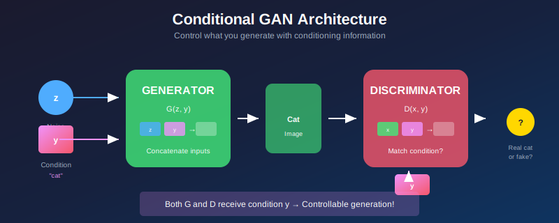
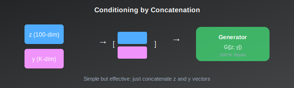

# 🎯 Conditional GANs (cGAN)

<div align="center">



*Taking control of what GANs generate*

</div>

---

## 🎯 Where & Why Use Conditional GANs?

### 🌍 Real-World Applications

| Domain | Application | Why cGAN? |
|--------|-------------|-----------|
| **Text-to-Image** | Generate images from descriptions | Control output with text |
| **Image Segmentation** | Semantic to realistic images | Pixel-level conditioning |
| **Face Generation** | Generate faces with specific attributes | Age, gender, expression control |
| **Medical Imaging** | Generate scans with pathology conditions | Conditional on diagnosis |
| **Fashion** | Generate outfits by style/color | Category-specific design |
| **Data Augmentation** | Class-balanced synthetic data | Generate specific classes |

### 💡 Why Master cGAN?

> *"A GAN that can't be controlled is just rolling dice. Conditional GANs let you load them."*

1. **Controllable Generation** — Generate exactly what you need
2. **Practical Applications** — Most real-world GANs are conditional
3. **Foundation for Advanced Models** — BigGAN, DALL-E build on this
4. **Better Training** — Conditioning often stabilizes training
5. **Research Essential** — Core concept in generative modeling

---

## 📖 Introduction

Conditional GANs (Mirza & Osindero, 2014) extend the GAN framework to generate samples conditioned on additional information, such as class labels, text descriptions, or other images. This enables controllable generation and forms the foundation for many practical applications.

---

## 📊 Representation Comparison

| Representation | Pros | Cons |
|----------------|------|------|
| **Concatenation** | Simple, flexible | May be ignored |
| **Class Embedding** | Learnable representation | Discrete labels only |
| **Projection D** | Theoretically sound | Specific to classification |
| **Cross-Attention** | Rich conditioning | Expensive |
| **AdaIN** | Style-like conditioning | Architecture change |

---

## 1. Formulation

### 1.1 Conditional Generation

<div align="center">

| Standard GAN | Conditional GAN |
|--------------|-----------------|
| \( G: \mathcal{Z} \rightarrow \mathcal{X} \) | \( G: \mathcal{Z} \times \mathcal{Y} \rightarrow \mathcal{X} \) |
| Random → Image | Random + Condition → Image |

</div>

where \( \mathcal{Y} \) is the space of conditioning information.

### 1.2 Objective

$$\min_G \max_D V(D, G) = \mathbb{E}_{x, y \sim p_{data}}[\log D(x|y)] + \mathbb{E}_{z \sim p_z, y \sim p_y}[\log(1 - D(G(z|y)|y))]$$

> 💡 **Key change:** Both G and D receive conditioning information \( y \).

### 1.3 Conditioning Types

<div align="center">

| Type | \( y \) | Application | Example |
|------|---------|-------------|---------|
| **Class label** | One-hot vector | Class-conditional | "Generate a cat" |
| **Text** | Embedding | Text-to-image | "A red bird flying" |
| **Image** | Encoded features | Image-to-image | Sketch → Photo |
| **Attributes** | Vector | Attribute manipulation | Add glasses |

</div>

---

## 2. Architecture Approaches

### 2.1 Concatenation

<div align="center">



</div>

**Simplest approach:** Concatenate \( y \) to inputs.

**Generator:** \( G([z; y]) = \text{image} \)

**Discriminator:** \( D([x; y]) = \text{score} \)

For images, \( y \) can be:
- Tiled to spatial dimensions
- Projected to match feature dimensions

### 2.2 Projection Discriminator (Miyato & Koyama, 2018)

Instead of concatenation:

$$D(x, y) = \sigma(f(x)^T V y + \psi(f(x)))$$

where:
- \( f(x) \): features from \( x \)
- \( V \): embedding matrix for \( y \)
- \( \psi \): unconditional score function

> ✅ **Advantage:** Better gradient flow, more stable.

### 2.3 Class Conditional BatchNorm (CBN)

Modulate BatchNorm parameters by class:

$$\text{CBN}(x, y) = \gamma_y \frac{x - \mu}{\sigma} + \beta_y$$

where \( \gamma_y, \beta_y \) are class-dependent.

> 💡 **Used in:** BigGAN, class-conditional generation

---

## 3. Class-Conditional Generation

### 3.1 Generator Architecture

```
z ∈ ℝ¹²⁸ (latent)
y ∈ {0, 1}^K (one-hot class)
    ↓
[z; embed(y)] → FC → Reshape
    ↓ CBN-TransConv blocks
Generated image conditioned on class y
```

### 3.2 Discriminator Architecture

```
Image
    ↓ Conv blocks
Features f(x)
    ↓
Inner product: f(x)ᵀ V y    ← Class conditioning
    + Unconditional: ψ(f(x))
    ↓
Score D(x, y)
```

---

## 4. Text-Conditional Generation

### 4.1 Text Embedding Pipeline

```
"A red bird with black wings"
    ↓ Text Encoder (LSTM, Transformer, CLIP)
t ∈ ℝᵈ (text embedding)
    ↓
[z; t] → Generator → Image matching description
```

### 4.2 StackGAN Architecture

**Stage 1:** Generate low-resolution (64×64)
$$I_1 = G_1(z, t)$$

**Stage 2:** Refine to high-resolution (256×256)
$$I_2 = G_2(I_1, t)$$

### 4.3 AttnGAN

Add attention between text words and image regions:

$$\text{Attention}(Q=\text{image}, K=V=\text{words})$$

> Different words influence different image regions!

---

## 5. Theoretical Analysis

### 5.1 Optimal Discriminator

For fixed \( G \):
$$D^*(x|y) = \frac{p_{data}(x|y)}{p_{data}(x|y) + p_g(x|y)}$$

### 5.2 What Generator Learns

At optimum, \( G \) minimizes:
$$D_{JS}(p_{data}(x|y) \| p_g(x|y))$$

**for each** \( y \).

### 5.3 Mode Coverage per Class

Conditional GAN should cover modes **within each class**:
- Real: all variations of "cat"
- Generated: all variations of "cat"

> 💡 Easier than unconditional (don't need to cover all classes at once).

---

## 6. BigGAN: Large-Scale cGAN

### 6.1 Key Innovations

| Innovation | Description |
|------------|-------------|
| **Large batch sizes** | 2048 (class diversity) |
| **Truncation trick** | Sample z from truncated normal |
| **Class-conditional BN** | At every layer |
| **Spectral normalization** | In both G and D |
| **Orthogonal regularization** | On generator weights |

### 6.2 Truncation Trick

$$z \sim \mathcal{N}(0, I) \cap \{z: |z_i| < \tau\}$$

| Lower τ | Higher Quality | Lower Diversity |
|---------|----------------|-----------------|
| Higher τ | Lower Quality | Higher Diversity |

### 6.3 Results

State-of-the-art class-conditional ImageNet generation:
- **FID:** ~7 (unprecedented at the time)
- **Resolution:** 512×512
- **Classes:** 1000

---

## 📊 Key Equations Summary

<div align="center">

| Concept | Formula |
|---------|---------|
| **cGAN objective** | \( \mathbb{E}[\log D(x|y)] + \mathbb{E}[\log(1-D(G(z,y)|y))] \) |
| **Projection D** | \( D(x,y) = \sigma(f(x)^T Vy + \psi(f(x))) \) |
| **CBN** | \( \gamma_y \frac{x-\mu}{\sigma} + \beta_y \) |
| **Truncation** | \( z \sim \mathcal{N}(0,I), |z_i| < \tau \) |

</div>

---

## 📚 References

1. **Mirza, M., & Osindero, S.** (2014). "Conditional Generative Adversarial Nets." [arXiv:1411.1784](https://arxiv.org/abs/1411.1784)
2. **Miyato, T., & Koyama, M.** (2018). "cGANs with Projection Discriminator." *ICLR*. [arXiv:1802.05637](https://arxiv.org/abs/1802.05637)
3. **Brock, A., Donahue, J., & Simonyan, K.** (2019). "Large Scale GAN Training for High Fidelity Natural Image Synthesis." *ICLR*. [arXiv:1809.11096](https://arxiv.org/abs/1809.11096)

---

## ✏️ Exercises

1. **Implement** a conditional GAN for MNIST digit generation.

2. **Compare** concatenation vs projection discriminator.

3. **Experiment** with the truncation trick.

4. **Train** an AC-GAN and analyze class prediction accuracy.

5. **Generate** samples for all classes and compute per-class FID.

---

<div align="center">

**[← Back to DCGAN](../02_dcgan/)** | **[Next: WGAN →](../04_wgan/)**

</div>
