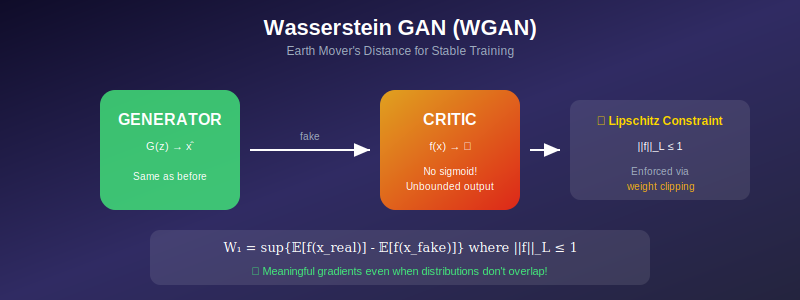

# 📏 Wasserstein GAN (WGAN)

<div align="center">



*Moving earth, not just bits—a revolutionary approach to GAN training*

</div>

---

## 🎯 Where & Why Use WGAN?

### 🌍 Real-World Applications

| Scenario | Why WGAN? |
|----------|-----------|
| **Unstable Training** | When standard GAN fails to converge |
| **Mode Collapse Issues** | Better mode coverage than JS-based GANs |
| **Meaningful Loss Curves** | Loss actually correlates with quality |
| **Research Baselines** | Stable foundation for experiments |
| **High-Quality Generation** | Foundation for WGAN-GP, used in production |
| **Disjoint Distributions** | Works when real/fake don't overlap |

### 💡 Why Master WGAN?

> *"WGAN replaced a fundamentally broken objective with one that actually makes sense mathematically."*

1. **Theoretical Soundness** — Based on optimal transport theory
2. **Better Training Signals** — Meaningful gradients everywhere
3. **Mode Coverage** — Mean-seeking instead of mode-seeking
4. **Loss Interpretation** — Track training progress via loss
5. **Foundation Knowledge** — Basis for WGAN-GP, SN-GAN, etc.

---

## 📖 Introduction

Wasserstein GAN (Arjovsky et al., 2017) addresses fundamental issues with the original GAN objective by replacing the Jensen-Shannon divergence with the Wasserstein distance. This provides meaningful gradients even when the distributions don't overlap, leading to more stable training and better mode coverage.

---

## 📊 Representation Comparison

| Representation | Pros | Cons |
|----------------|------|------|
| **Weight Clipping** | Simple Lipschitz constraint | Capacity reduction |
| **Gradient Penalty** | Better Lipschitz | Per-sample gradient |
| **Spectral Norm** | Efficient, effective | May limit expressiveness |
| **Orthogonal Reg** | Preserves gradients | Extra constraint |
| **Lipschitz Networks** | By construction | Architecture constraints |

---

## 1. Motivation: Problems with JS Divergence

### 1.1 The Manifold Problem

<div align="center">


</div>

**Key observation:** Real data lies on a low-dimensional manifold in high-dimensional space.

If \( p_{data} \) is supported on manifold \( \mathcal{M}_1 \) and \( p_g \) on \( \mathcal{M}_2 \):
- Generically, \( \mathcal{M}_1 \cap \mathcal{M}_2 = \emptyset \)
- **The supports don't overlap!**

### 1.2 JS Divergence Failure

**Theorem:** For distributions with disjoint supports:
$$D_{JS}(p_{data} \| p_g) = \log 2$$

regardless of how "close" the distributions are!

> ❌ **No gradient signal** to move \( p_g \) toward \( p_{data} \).

### 1.3 Illustrative Example

Let \( p_{data} = \delta_0 \) (point mass at 0) and \( p_g = \delta_\theta \) (point mass at θ).

**JS Divergence:**
$$D_{JS} = \begin{cases} \log 2 & \text{if } \theta \neq 0 \\ 0 & \text{if } \theta = 0 \end{cases}$$

**Gradient:** \( \nabla_\theta D_{JS} = 0 \) for \( \theta \neq 0 \)

> 🚫 **No learning signal!**

---

## 2. Wasserstein Distance

### 2.1 Definition (Earth Mover's Distance)

$$W_1(p_{data}, p_g) = \inf_{\gamma \in \Pi(p_{data}, p_g)} \mathbb{E}_{(x, y) \sim \gamma}[\|x - y\|]$$

where \( \Pi(p_{data}, p_g) \) is the set of all joint distributions with marginals \( p_{data} \) and \( p_g \).

> 💡 **Intuition:** Minimum "work" to transform one distribution into another.

### 2.2 Kantorovich-Rubinstein Duality

**Theorem:**
$$\boxed{W_1(p_{data}, p_g) = \sup_{\|f\|_L \leq 1} \left[\mathbb{E}_{x \sim p_{data}}[f(x)] - \mathbb{E}_{x \sim p_g}[f(x)]\right]}$$

where \( \|f\|_L \leq 1 \) means \( f \) is 1-Lipschitz:
$$|f(x) - f(y)| \leq \|x - y\| \quad \forall x, y$$

### 2.3 Why Wasserstein is Better

**For the point mass example:**
$$W_1(\delta_0, \delta_\theta) = |\theta|$$

**Gradient:** \( \nabla_\theta W_1 = \text{sign}(\theta) \)

> ✅ **Learning signal everywhere!**

### 2.4 Comparison of Divergences

<div align="center">

| Property | JS | KL | Wasserstein |
|----------|:--:|:--:|:-----------:|
| **Symmetric** | ✅ | ❌ | ✅ |
| **Metric** | ❌ | ❌ | ✅ |
| **Bounded** | ✅ | ❌ | ❌ |
| **Gradients for disjoint support** | ❌ | ❌ | ✅ |

</div>

---

## 3. WGAN Formulation

### 3.1 Objective

$$\min_G \max_{f: \|f\|_L \leq 1} \mathbb{E}_{x \sim p_{data}}[f(x)] - \mathbb{E}_{z \sim p_z}[f(G(z))]$$

The function \( f \) (called **critic**) replaces the discriminator.

### 3.2 Key Differences from Standard GAN

<div align="center">

| Aspect | Standard GAN | WGAN |
|--------|:------------:|:----:|
| **D output** | Probability [0,1] | Unbounded score |
| **Final activation** | Sigmoid | None (linear) |
| **Objective** | Cross-entropy | Wasserstein |
| **Name** | Discriminator | **Critic** |

</div>

### 3.3 Lipschitz Constraint

**The hard part:** Enforcing \( \|f\|_L \leq 1 \)

**Original WGAN approach:** Weight clipping
$$w \leftarrow \text{clip}(w, -c, c)$$

after each update, for small \( c \) (e.g., 0.01).

---

## 4. Training Algorithm

### 4.1 WGAN Training Loop

```python
for iteration in range(num_iterations):
    
    # ═══════════════════════════════════════════════════════
    # Train Critic (more iterations than generator!)
    # ═══════════════════════════════════════════════════════
    for _ in range(n_critic):  # n_critic = 5 typically
        x_real = sample_real_data(batch_size)
        z = sample_noise(batch_size)
        x_fake = generator(z)
        
        # Critic wants: high scores for real, low for fake
        critic_loss = -(critic(x_real).mean() - critic(x_fake).mean())
        
        critic_optimizer.zero_grad()
        critic_loss.backward()
        critic_optimizer.step()
        
        # 🔑 KEY: Clip weights to enforce Lipschitz
        for p in critic.parameters():
            p.data.clamp_(-clip_value, clip_value)
    
    # ═══════════════════════════════════════════════════════
    # Train Generator
    # ═══════════════════════════════════════════════════════
    z = sample_noise(batch_size)
    x_fake = generator(z)
    
    # Generator wants: high critic scores for fakes
    gen_loss = -critic(x_fake).mean()
    
    gen_optimizer.zero_grad()
    gen_loss.backward()
    gen_optimizer.step()
```

### 4.2 Hyperparameters

<div align="center">

| Parameter | Typical Value | Notes |
|-----------|:-------------:|-------|
| **n_critic** | 5 | Train critic more |
| **c (clip value)** | 0.01 | Small value |
| **Learning rate** | 0.00005 | Lower than DCGAN |
| **Optimizer** | RMSprop | Not Adam! |
| **No momentum** | β₁ = 0 | Momentum destabilizes |

</div>

### 4.3 Why RMSprop?

Adam with momentum can cause instability with weight clipping.
RMSprop is more stable for WGAN.

---

## 5. Weight Clipping: Problems

### 5.1 Capacity Limitation

Clipping to \( [-c, c] \) limits function expressiveness:
- Can only approximate simple functions
- Critic may be too weak

### 5.2 Pathological Behavior

| \( c \) too large | \( c \) too small |
|-------------------|-------------------|
| Exploding gradients | Vanishing gradients |
| Training instability | Slow learning |

> ⚠️ **Optimal \( c \) depends on problem—hard to tune.**

### 5.3 Weight Distribution Problem

Weight clipping pushes weights toward \( \pm c \):
- Bimodal distribution
- Most weights at extremes
- Not using full capacity

> 💡 **Solution:** Use gradient penalty (WGAN-GP) instead!

---

## 6. Improvements over Original GAN

### 6.1 Training Stability

**Key observation:** WGAN loss correlates with sample quality!

Unlike original GAN where:
- D loss saturates
- G loss is uninformative

### 6.2 Mode Coverage

WGAN covers more modes due to mean-seeking behavior.

### 6.3 No Need for Careful Balancing

Original GAN requires balancing D and G training.
WGAN: can train critic to convergence (with caveats).

---

## 📊 Key Equations Summary

<div align="center">

| Concept | Formula |
|---------|---------|
| **Wasserstein-1** | \( W_1 = \inf_\gamma \mathbb{E}[\|x-y\|] \) |
| **Dual form** | \( W_1 = \sup_{\|f\|_L \leq 1} \mathbb{E}[f(x)] - \mathbb{E}[f(G(z))] \) |
| **Critic loss** | \( \mathbb{E}[f(x)] - \mathbb{E}[f(G(z))] \) (maximize) |
| **Generator loss** | \( -\mathbb{E}[f(G(z))] \) (minimize) |

</div>

---

## 📚 References

1. **Arjovsky, M., Chintala, S., & Bottou, L.** (2017). "Wasserstein Generative Adversarial Networks." *ICML*. [arXiv:1701.07875](https://arxiv.org/abs/1701.07875)
2. **Arjovsky, M., & Bottou, L.** (2017). "Towards Principled Methods for Training Generative Adversarial Networks." *ICLR*. [arXiv:1701.04862](https://arxiv.org/abs/1701.04862)
3. **Villani, C.** (2008). *Optimal Transport: Old and New*. Springer.

---

## ✏️ Exercises

1. **Prove** that \( W_1(\delta_0, \delta_\theta) = |\theta| \) using the primal definition.

2. **Implement** WGAN with weight clipping and compare to standard GAN.

3. **Visualize** the weight distribution of the critic during training.

4. **Experiment** with different clipping values \( c \).

5. **Show** that the WGAN loss correlates with FID score.

---

<div align="center">

**[← Back to Conditional GAN](../03_conditional_gan/)** | **[Next: WGAN-GP →](../05_wgan_gp/)**

</div>
