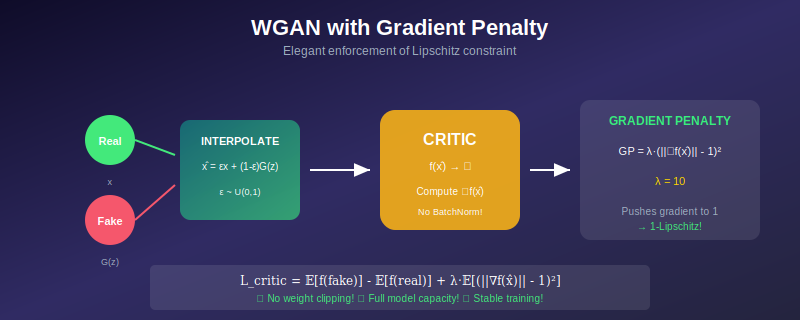
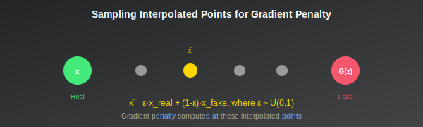

# ⚡ WGAN with Gradient Penalty (WGAN-GP)

<div align="center">



*The elegant solution to Lipschitz constraints*

</div>

---

## 🎯 Where & Why Use WGAN-GP?

### 🌍 Real-World Applications

| Scenario | Why WGAN-GP? |
|----------|--------------|
| **Production GANs** | Gold standard for stability |
| **High-Resolution Generation** | Scales to large images |
| **Research Baselines** | Reliable comparison point |
| **Any Image GAN** | Default choice for new projects |
| **Limited Tuning Time** | Works out-of-the-box |
| **Quality Requirements** | Consistent high-quality results |

### 💡 Why Master WGAN-GP?

> *"If you only learn one GAN training method, make it WGAN-GP. It just works."*

1. **Industry Standard** — Used in production systems worldwide
2. **Reliable Stability** — Consistent convergence
3. **No Hyperparameter Hell** — λ=10 works almost everywhere
4. **Better Than Clipping** — Full model capacity
5. **Theoretical Elegance** — Principled Lipschitz enforcement

---

## 📖 Introduction

WGAN-GP (Gulrajani et al., 2017) improves upon the original WGAN by replacing weight clipping with a gradient penalty. This enforces the Lipschitz constraint more effectively, leading to better training stability, faster convergence, and higher quality samples.

---

## 📊 Representation Comparison

| Representation | Pros | Cons |
|----------------|------|------|
| **One-sided GP** | Original, effective | Can be violated |
| **Two-sided GP** | Stricter constraint | Harder optimization |
| **Zero-centered GP** | Better convergence | Different behavior |
| **Dragan** | Real samples only | Less coverage |
| **Adaptive GP** | Scales with training | More hyperparameters |

---

## 1. Problems with Weight Clipping

### 1.1 Capacity Underuse

Weight clipping forces weights into \( [-c, c] \), limiting the critic's expressiveness:
- ❌ Can't represent complex functions
- ❌ Wastes model capacity
- ❌ Leads to simple, nearly linear critics

### 1.2 Exploding and Vanishing Gradients

| \( c \) too large | \( c \) too small |
|-------------------|-------------------|
| Weights become large | Network too constrained |
| Gradients explode | Gradients vanish |

> Finding optimal \( c \) is difficult and problem-dependent.

### 1.3 Biased Function Class

Weight clipping prefers functions with weights at \( \pm c \):
- Not a natural parameterization
- Biases learned functions
- Inefficient use of parameters

---

## 2. Gradient Penalty Approach

### 2.1 Key Insight

A differentiable function \( f \) is 1-Lipschitz if and only if:
$$\|\nabla_x f(x)\| \leq 1 \quad \forall x$$

> 💡 **Idea:** Penalize the gradient norm, don't clip weights!

### 2.2 The Gradient Penalty

$$\boxed{\mathcal{L}_{GP} = \lambda \mathbb{E}_{\hat{x} \sim p_{\hat{x}}}\left[(\|\nabla_{\hat{x}} f(\hat{x})\|_2 - 1)^2\right]}$$

**Key choices:**
- Penalize deviation from 1 (not just > 1)
- Sample \( \hat{x} \) from specific distribution
- \( \lambda \) controls penalty strength

### 2.3 Where to Sample \( \hat{x} \)?

<div align="center">



</div>

**Optimal critic property:** Gradient norm = 1 along straight lines between paired points.

**Sampling strategy:**
$$\hat{x} = \epsilon x_{real} + (1 - \epsilon) x_{fake}$$

where:
- \( x_{real} \sim p_{data} \)
- \( x_{fake} = G(z) \), \( z \sim p_z \)
- \( \epsilon \sim \text{Uniform}(0, 1) \)

---

## 3. Full WGAN-GP Objective

### 3.1 Critic Objective

$$\mathcal{L}_{critic} = \underbrace{\mathbb{E}_{z}[f(G(z))]}_{\text{fake score}} - \underbrace{\mathbb{E}_{x}[f(x)]}_{\text{real score}} + \underbrace{\lambda \mathbb{E}_{\hat{x}}[(\|\nabla_{\hat{x}} f(\hat{x})\|_2 - 1)^2]}_{\text{gradient penalty}}$$

### 3.2 Generator Objective

$$\mathcal{L}_G = -\mathbb{E}_{z}[f(G(z))]$$

Same as original WGAN.

### 3.3 Hyperparameters

<div align="center">

| Parameter | Recommended Value | Notes |
|-----------|:-----------------:|-------|
| **λ (GP coefficient)** | 10 | Almost universal |
| **n_critic** | 5 | Critic iterations per G |
| **Learning rate** | 0.0001 | For Adam |
| **β₁, β₂** | 0.0, 0.9 | Lower β₁ than usual |

</div>

---

## 4. Implementation

### 4.1 Gradient Penalty Computation

```python
def gradient_penalty(critic, real, fake, device):
    batch_size = real.size(0)
    
    # Random interpolation coefficient
    epsilon = torch.rand(batch_size, 1, 1, 1, device=device)
    
    # Interpolated samples
    interpolated = epsilon * real + (1 - epsilon) * fake
    interpolated.requires_grad_(True)
    
    # Critic output on interpolated
    critic_interpolated = critic(interpolated)
    
    # Compute gradients w.r.t. interpolated
    gradients = torch.autograd.grad(
        outputs=critic_interpolated,
        inputs=interpolated,
        grad_outputs=torch.ones_like(critic_interpolated),
        create_graph=True,  # For second-order gradients
        retain_graph=True
    )[0]
    
    # Gradient norm
    gradients = gradients.view(batch_size, -1)
    gradient_norm = gradients.norm(2, dim=1)
    
    # Penalty: (||grad|| - 1)^2
    penalty = ((gradient_norm - 1) ** 2).mean()
    
    return penalty
```

### 4.2 Training Loop

```python
lambda_gp = 10
n_critic = 5

for iteration in range(num_iterations):
    
    # ═══════════════════════════════════════════════
    # Train Critic
    # ═══════════════════════════════════════════════
    for _ in range(n_critic):
        real = next(data_iter)
        z = torch.randn(batch_size, latent_dim, 1, 1)
        fake = generator(z)
        
        critic_real = critic(real)
        critic_fake = critic(fake.detach())
        gp = gradient_penalty(critic, real, fake, device)
        
        # WGAN-GP critic loss
        critic_loss = critic_fake.mean() - critic_real.mean() + lambda_gp * gp
        
        critic_optimizer.zero_grad()
        critic_loss.backward()
        critic_optimizer.step()
        # ⚠️ NO weight clipping!
    
    # ═══════════════════════════════════════════════
    # Train Generator
    # ═══════════════════════════════════════════════
    z = torch.randn(batch_size, latent_dim, 1, 1)
    fake = generator(z)
    gen_loss = -critic(fake).mean()
    
    generator_optimizer.zero_grad()
    gen_loss.backward()
    generator_optimizer.step()
```

### 4.3 Important: No Batch Normalization in Critic

**Reason:** Batch norm creates dependencies between samples in a batch, which can interfere with the per-sample gradient penalty computation.

**Alternatives:**
- ✅ Layer normalization
- ✅ Instance normalization
- ✅ No normalization

---

## 5. Theoretical Justification

### 5.1 Why Penalize Toward 1?

**Theorem:** The optimal critic in WGAN has gradient norm exactly 1 almost everywhere under the optimal transport plan.

Penalizing \( (\|\nabla f\| - 1)^2 \) encourages:
- \( \|\nabla f\| = 1 \) (1-Lipschitz)
- Maximum gradient (using full capacity)

### 5.2 One-Sided vs Two-Sided Penalty

| Two-sided (standard) | One-sided |
|----------------------|-----------|
| \( (\|\nabla f\| - 1)^2 \) | \( \max(0, \|\nabla f\| - 1)^2 \) |
| Works better in practice | Less stable |

---

## 6. Advantages over Weight Clipping

<div align="center">

| Aspect | Weight Clipping | Gradient Penalty |
|--------|:---------------:|:----------------:|
| **Model capacity** | Limited | Full |
| **Hyperparameter sensitivity** | High (c value) | Low (λ=10 usually) |
| **Optimizer** | RMSprop only | Adam works! |
| **Convergence speed** | Slow | Fast |
| **Sample quality** | Medium | High |

</div>

---

## 7. Common Issues

### 7.1 Gradient Penalty Too Strong

**Symptom:** Critic loss doesn't decrease
**Solution:** Reduce λ

### 7.2 Gradient Penalty Too Weak

**Symptom:** Unstable training, loss diverges
**Solution:** Increase λ

### 7.3 Memory Issues

Gradient penalty requires second-order gradients:
- `create_graph=True` builds computation graph
- Higher memory usage than standard GAN
- Consider gradient checkpointing for large models

---

## 📊 Key Equations Summary

<div align="center">

| Concept | Formula |
|---------|---------|
| **Gradient Penalty** | \( \lambda \mathbb{E}[(\|\nabla_{\hat{x}} f(\hat{x})\|_2 - 1)^2] \) |
| **Interpolation** | \( \hat{x} = \epsilon x_{real} + (1-\epsilon)G(z) \) |
| **Critic Loss** | \( \mathbb{E}[f(G(z))] - \mathbb{E}[f(x)] + \lambda \cdot GP \) |
| **Generator Loss** | \( -\mathbb{E}[f(G(z))] \) |

</div>

---

## 📚 References

1. **Gulrajani, I., Ahmed, F., Arjovsky, M., Dumoulin, V., & Courville, A.** (2017). "Improved Training of Wasserstein GANs." *NeurIPS*. [arXiv:1704.00028](https://arxiv.org/abs/1704.00028)

---

## ✏️ Exercises

1. **Implement** WGAN-GP and compare to weight clipping.

2. **Visualize** gradient norms at interpolated points.

3. **Experiment** with different λ values (1, 10, 100).

4. **Compare** layer norm vs no normalization in critic.

5. **Profile** memory usage compared to standard GAN.

---

<div align="center">

**[← Back to WGAN](../04_wgan/)** | **[Next: LSGAN →](../06_lsgan/)**

</div>
