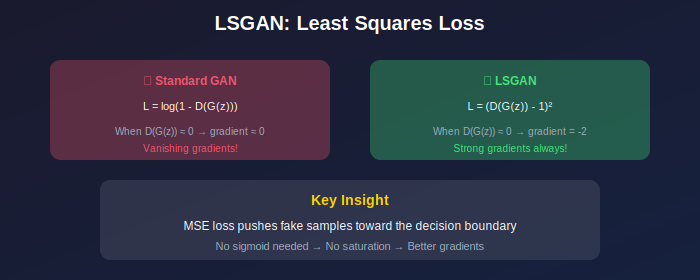
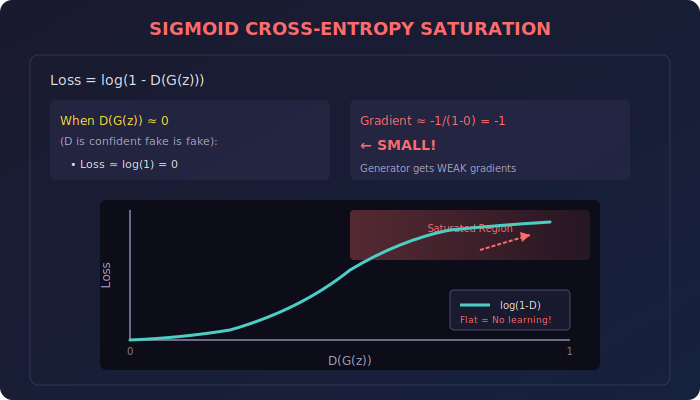
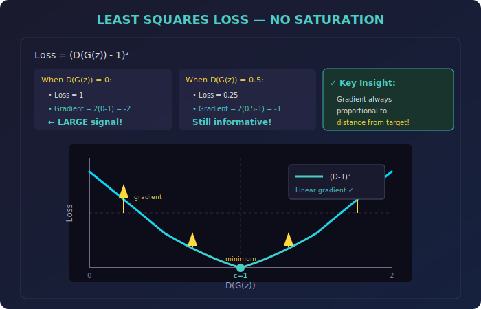
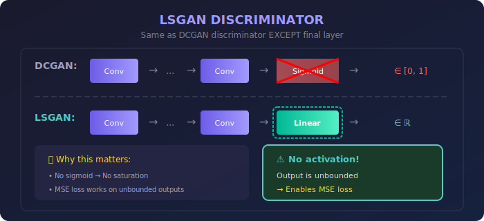
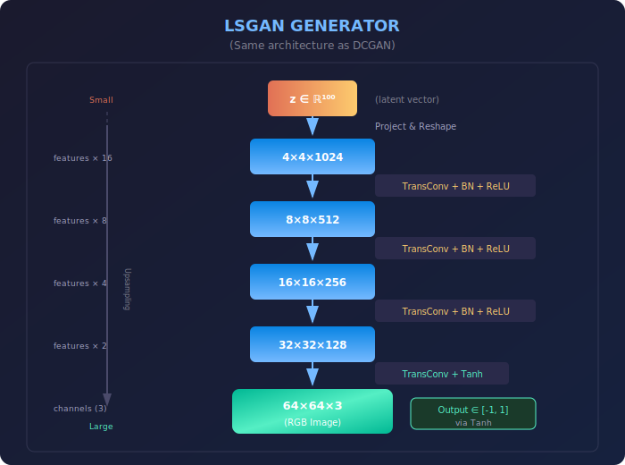

# 📐 Least Squares GAN (LSGAN)

<div align="center">



### *Simple change, big impact—MSE loss for stable training*

[](https://arxiv.org/abs/1611.04076)
[](#)
[](#)

</div>

---

## 🌟 The Big Idea

What if you could fix GAN training instability by changing just **one line of code**?

That's exactly what LSGAN does. By replacing the cross-entropy loss with a simple **mean squared error (MSE)**, we eliminate vanishing gradients and get more stable training—with virtually no implementation overhead.

<div align="center">

| 🎯 **Quick Facts** |  |
|:---|:---|
| **Core Innovation** | Replace BCE loss with MSE loss |
| **Key Benefit** | No gradient saturation |
| **Complexity** | Same as standard GAN |
| **Quality** | Better than standard GAN, comparable to WGAN |

</div>

---

## 📊 Representation Comparison

| Representation | Pros | Cons |
|----------------|------|------|
| **BCE Loss (Standard)** | Simple, probabilistic | Vanishing gradients |
| **Least Squares** | Smooth gradients, stable | Different divergence |
| **Hinge Loss** | Used in BigGAN | Less smooth |
| **Wasserstein** | Meaningful metric | Lipschitz constraint |
| **Relativistic** | Compares real vs fake | More complex |

---

## 🤔 The Problem: Why Standard GANs Struggle

Before diving into LSGAN, let's understand the fundamental issue it solves.

### The Vanishing Gradient Trap

In standard GANs, the generator tries to fool the discriminator by minimizing:

$$\mathcal{L}_G = \log(1 - D(G(z)))$$

Here's the catch: when the discriminator becomes confident that a generated image is fake (i.e., \(D(G(z)) \approx 0\)), the gradient becomes tiny:

$$\text{Gradient} \approx \frac{-1}{1-0} = -1 \quad \leftarrow \text{Very small!}$$

The generator receives almost no learning signal for its worst samples—exactly when it needs guidance the most!

<div align="center">



*The sigmoid function saturates, causing weak gradients for poorly generated samples*

</div>

> 💡 **The Irony:** The generator gets the weakest feedback for its worst outputs, making it hard to improve.

---

## ✨ The LSGAN Solution

LSGAN's fix is elegantly simple: use **least squares loss** instead of cross-entropy.

$$\mathcal{L}_G = (D(G(z)) - 1)^2$$

Now the gradient is:

$$\text{Gradient} = 2(D(G(z)) - 1)$$

When \(D(G(z)) = 0\) (discriminator thinks it's definitely fake):
- **Gradient = -2** → Strong learning signal! 🔥

When \(D(G(z)) = 0.5\) (discriminator is uncertain):
- **Gradient = -1** → Still informative!

<div align="center">



*The parabolic loss function provides consistent gradients everywhere*

</div>

### Why This Works

The key insight: **gradient magnitude is proportional to error magnitude**.

| D(G(z)) Value | Standard GAN | LSGAN |
|:-------------:|:------------:|:-----:|
| **0.0** (worst fake) | ~-1.0 | **~-2.0** 🔥 |
| **0.1** | ~-1.1 | ~-1.8 |
| **0.5** | ~-2.0 | ~-1.0 |
| **0.9** | ~-10.0 | ~-0.2 |

> 🎯 **LSGAN provides stronger gradients precisely when samples are clearly identified as fake!**

---

## 🎨 An Extra Benefit: Better Sample Quality

LSGAN doesn't just stabilize training—it also improves image quality.

### The Decision Boundary Effect

Standard GAN only cares whether samples cross the decision boundary. Once a fake is classified as "real enough," there's no incentive to improve further.

LSGAN is different: it **penalizes samples based on their distance from the target**, even if they're already correctly classified.

<div align="center">

| Sample Position | Standard GAN | LSGAN |
|-----------------|:------------:|:-----:|
| Far from boundary (correct side) | ✅ No penalty | ⚠️ Still penalized |
| Near boundary | ✅ Low penalty | ✅ Low penalty |
| Wrong side | ❌ Penalized | ❌ Penalized |

</div>

**Result:** LSGAN continuously pushes generated samples closer to the real data distribution, even after they "pass" the discriminator's test.

---

## 📐 Mathematical Formulation

### The Complete Objectives

**Discriminator Loss:**

$$\mathcal{L}_D = \frac{1}{2}\mathbb{E}_{x \sim p_{data}}[(D(x) - b)^2] + \frac{1}{2}\mathbb{E}_{z \sim p_z}[(D(G(z)) - a)^2]$$

**Generator Loss:**

$$\mathcal{L}_G = \frac{1}{2}\mathbb{E}_{z \sim p_z}[(D(G(z)) - c)^2]$$

Where:
- **a** = target label for fake samples (typically 0)
- **b** = target label for real samples (typically 1)  
- **c** = what generator wants discriminator to output for fakes (typically 1)

### Standard Configuration: a=0, b=1, c=1

This gives us the most common formulation:

```
D tries to output 1 for real, 0 for fake
G tries to make D output 1 for fake
```

$$\mathcal{L}_D = \frac{1}{2}\mathbb{E}[(D(x) - 1)^2] + \frac{1}{2}\mathbb{E}[D(G(z))^2]$$

$$\mathcal{L}_G = \frac{1}{2}\mathbb{E}[(D(G(z)) - 1)^2]$$

<details>
<summary><b>🔬 Deep Dive: What Divergence Does LSGAN Minimize?</b></summary>

<br>

When the label conditions \(b - c = 1\) and \(b - a = 2\) are satisfied, LSGAN minimizes the **Pearson χ² divergence**:

$$\chi^2_{Pearson}(p_{data} + p_g \| 2p_g)$$

**Proof sketch:**

The optimal discriminator is:

$$D^*(x) = \frac{b \cdot p_{data}(x) + a \cdot p_g(x)}{p_{data}(x) + p_g(x)}$$

For a=0, b=1, this simplifies to:

$$D^*(x) = \frac{p_{data}(x)}{p_{data}(x) + p_g(x)}$$

Substituting into the generator loss and simplifying leads to the Pearson χ² divergence form.

</details>

---

## 🏗️ Architecture Changes

The architectural change is minimal—just **remove the sigmoid from the discriminator's final layer**.

<div align="center">



*The only change: no activation function on the discriminator's output*

</div>

### Why No Sigmoid?

1. **MSE loss expects unbounded outputs** — sigmoid squashes to [0,1], conflicting with quadratic loss properties
2. **Better gradient flow** — no additional saturation from sigmoid
3. **Simpler computation** — one less operation per forward pass

### Generator Architecture

The generator remains **identical to DCGAN**—no changes needed!

<div align="center">



*Standard transposed convolution architecture, unchanged from DCGAN*

</div>

---

## 💻 Implementation

### The Loss Functions (Just 10 Lines!)

```python
import torch

def lsgan_discriminator_loss(real_output, fake_output, a=0.0, b=1.0):
    """LSGAN discriminator loss."""
    real_loss = torch.mean((real_output - b) ** 2)
    fake_loss = torch.mean((fake_output - a) ** 2)
    return 0.5 * (real_loss + fake_loss)

def lsgan_generator_loss(fake_output, c=1.0):
    """LSGAN generator loss."""
    return 0.5 * torch.mean((fake_output - c) ** 2)
```

That's it! The entire LSGAN innovation in 10 lines of code.

### Complete Model Definition

```python
import torch.nn as nn

class LSGANGenerator(nn.Module):
    """LSGAN Generator - identical to DCGAN"""
    
    def __init__(self, latent_dim=100, channels=3, features=64):
        super().__init__()
        self.main = nn.Sequential(
            # 1x1 → 4x4
            nn.ConvTranspose2d(latent_dim, features*16, 4, 1, 0, bias=False),
            nn.BatchNorm2d(features*16),
            nn.ReLU(True),
            
            # 4x4 → 8x8
            nn.ConvTranspose2d(features*16, features*8, 4, 2, 1, bias=False),
            nn.BatchNorm2d(features*8),
            nn.ReLU(True),
            
            # 8x8 → 16x16
            nn.ConvTranspose2d(features*8, features*4, 4, 2, 1, bias=False),
            nn.BatchNorm2d(features*4),
            nn.ReLU(True),
            
            # 16x16 → 32x32
            nn.ConvTranspose2d(features*4, features*2, 4, 2, 1, bias=False),
            nn.BatchNorm2d(features*2),
            nn.ReLU(True),
            
            # 32x32 → 64x64
            nn.ConvTranspose2d(features*2, channels, 4, 2, 1, bias=False),
            nn.Tanh()
        )
    
    def forward(self, z):
        return self.main(z)


class LSGANDiscriminator(nn.Module):
    """LSGAN Discriminator - NO SIGMOID at the end!"""
    
    def __init__(self, channels=3, features=64):
        super().__init__()
        self.main = nn.Sequential(
            # 64x64 → 32x32
            nn.Conv2d(channels, features, 4, 2, 1, bias=False),
            nn.LeakyReLU(0.2, inplace=True),
            
            # 32x32 → 16x16
            nn.Conv2d(features, features*2, 4, 2, 1, bias=False),
            nn.BatchNorm2d(features*2),
            nn.LeakyReLU(0.2, inplace=True),
            
            # 16x16 → 8x8
            nn.Conv2d(features*2, features*4, 4, 2, 1, bias=False),
            nn.BatchNorm2d(features*4),
            nn.LeakyReLU(0.2, inplace=True),
            
            # 8x8 → 4x4
            nn.Conv2d(features*4, features*8, 4, 2, 1, bias=False),
            nn.BatchNorm2d(features*8),
            nn.LeakyReLU(0.2, inplace=True),
            
            # 4x4 → 1x1 (NO SIGMOID!)
            nn.Conv2d(features*8, 1, 4, 1, 0, bias=False),
        )
    
    def forward(self, x):
        return self.main(x).view(-1)
```

### Training Loop

```python
import torch.optim as optim

def train_lsgan(generator, discriminator, dataloader, epochs=100, device='cuda'):
    """Complete LSGAN training loop."""
    
    g_opt = optim.Adam(generator.parameters(), lr=0.0002, betas=(0.5, 0.999))
    d_opt = optim.Adam(discriminator.parameters(), lr=0.0002, betas=(0.5, 0.999))
    
    for epoch in range(epochs):
        for real_images, _ in dataloader:
            batch_size = real_images.size(0)
            real_images = real_images.to(device)
            
            # ═══════════════════════════════════════════════
            # Train Discriminator
            # ═══════════════════════════════════════════════
            d_opt.zero_grad()
            
            real_output = discriminator(real_images)
            
            noise = torch.randn(batch_size, 100, 1, 1, device=device)
            fake_images = generator(noise)
            fake_output = discriminator(fake_images.detach())
            
            d_loss = lsgan_discriminator_loss(real_output, fake_output)
            d_loss.backward()
            d_opt.step()
            
            # ═══════════════════════════════════════════════
            # Train Generator
            # ═══════════════════════════════════════════════
            g_opt.zero_grad()
            
            noise = torch.randn(batch_size, 100, 1, 1, device=device)
            fake_images = generator(noise)
            fake_output = discriminator(fake_images)
            
            g_loss = lsgan_generator_loss(fake_output)
            g_loss.backward()
            g_opt.step()
```

---

## ⚙️ Hyperparameters

LSGAN uses the same hyperparameters as DCGAN—no special tuning required!

| Parameter | Recommended Value | Notes |
|-----------|:-----------------:|-------|
| Learning rate | **0.0002** | Same as DCGAN |
| Adam β₁ | **0.5** | Lower momentum helps |
| Adam β₂ | **0.999** | Standard |
| Batch size | **64-128** | Larger = more stable |
| Latent dim | **100** | Standard choice |

### 💡 Pro Tip: Label Smoothing

For even more stability, try soft labels:

```python
real_label = 0.9   # Instead of 1.0
fake_label = 0.1   # Instead of 0.0
```

---

## 🔄 Comparison with Other Methods

### How Does LSGAN Stack Up?

| Aspect | Standard GAN | LSGAN | WGAN |
|--------|:------------:|:-----:|:----:|
| Gradient saturation | ❌ Yes | ✅ No | ✅ No |
| Mode collapse | ⚠️ Common | ⚠️ Less common | ✅ Rare |
| Training stability | ❌ Unstable | ✅ Stable | ✅ Very stable |
| Implementation | ✅ Simple | ✅ Simple | ⚠️ Medium |
| Hyperparameter sensitivity | ❌ High | ✅ Low | ✅ Low |

### When Should You Use LSGAN?

<div align="center">

| Your Situation | Recommendation |
|:---------------|:---------------|
| 🚀 Quick prototype | **Use LSGAN** |
| 🔬 Maximum stability needed | Use WGAN-GP |
| 💻 Limited compute | **Use LSGAN** (no GP overhead) |
| 📚 Learning GANs | **Use LSGAN** (easiest to understand) |
| 🖼️ Image-to-image translation | **Use LSGAN** (pix2pix default) |

</div>

---

## 🔧 Troubleshooting

### Common Issues and Fixes

<details>
<summary><b>🚨 Training diverges</b></summary>

```python
# Try these fixes:

# 1. Lower learning rate
lr = 0.0001  # Instead of 0.0002

# 2. Add spectral normalization
from torch.nn.utils import spectral_norm
self.conv = spectral_norm(nn.Conv2d(...))

# 3. Gradient clipping
torch.nn.utils.clip_grad_norm_(discriminator.parameters(), max_norm=1.0)
```

</details>

<details>
<summary><b>🔁 Mode collapse occurs</b></summary>

LSGAN is more resistant to mode collapse than standard GAN, but if it happens:

```python
# Solutions:
# 1. Use minibatch discrimination
# 2. Add feature matching loss
# 3. Increase batch size
# 4. Try unrolled GAN training
```

</details>

<details>
<summary><b>📊 Discriminator outputs extreme values</b></summary>

```python
# Add spectral normalization to all conv layers
from torch.nn.utils import spectral_norm

nn.Sequential(
    spectral_norm(nn.Conv2d(3, 64, 4, 2, 1)),
    nn.LeakyReLU(0.2),
    # ... etc
)
```

</details>

---

## 🚀 Extensions

### Conditional LSGAN

Add class conditioning for controlled generation:

```python
def conditional_lsgan_loss(real_out, fake_out, real_labels, fake_labels):
    """Class-conditional LSGAN loss"""
    real_loss = torch.mean((real_out - 1) ** 2)
    fake_loss = torch.mean(fake_out ** 2)
    return 0.5 * (real_loss + fake_loss)
```

### LSGAN for Image-to-Image Translation

LSGAN is the default loss for pix2pix and CycleGAN:

```python
# pix2pix with LSGAN
d_loss = lsgan_discriminator_loss(D(real_A, real_B), D(real_A, fake_B))
g_loss = lsgan_generator_loss(D(real_A, fake_B)) + 100 * L1_loss(fake_B, real_B)
```

---

## 📊 Quick Reference

<div align="center">

| Formula | Expression |
|---------|------------|
| **D Loss** | \(\frac{1}{2}\mathbb{E}[(D(x)-1)^2] + \frac{1}{2}\mathbb{E}[D(G(z))^2]\) |
| **G Loss** | \(\frac{1}{2}\mathbb{E}[(D(G(z))-1)^2]\) |
| **Optimal D** | \(D^*(x) = \frac{p_{data}(x)}{p_{data}(x) + p_g(x)}\) |
| **Minimized Divergence** | Pearson χ² |

</div>

---

## 📚 References

1. **Mao, X., Li, Q., Xie, H., Lau, R.Y.K., Wang, Z., & Smolley, S.P.** (2017). [Least Squares Generative Adversarial Networks](https://arxiv.org/abs/1611.04076). *ICCV*.

2. **Radford, A., Metz, L., & Chintala, S.** (2016). Unsupervised Representation Learning with DCGANs. *ICLR*.

3. **Isola, P., et al.** (2017). Image-to-Image Translation with Conditional Adversarial Networks. *CVPR*. *(Uses LSGAN loss)*

4. **Zhu, J.-Y., et al.** (2017). Unpaired Image-to-Image Translation. *ICCV*. *(CycleGAN uses LSGAN)*

---

## ✏️ Exercises

1. **Implement** LSGAN and compare training curves with standard GAN on MNIST

2. **Visualize** gradient magnitudes at different \(D(G(z))\) values for both methods

3. **Experiment** with different label values (a, b, c) and document their effects

4. **Implement** LSGAN for image-to-image translation (simplified pix2pix)

5. **Analyze** mode collapse behavior compared to standard GAN on a mixture of Gaussians

---

<div align="center">

**[← Previous: WGAN-GP](../05_wgan_gp/)** • **[Next: CycleGAN →](../07_cyclegan/)**

---

*LSGAN: Proof that sometimes the simplest fix is the best fix* 🎯

</div>
