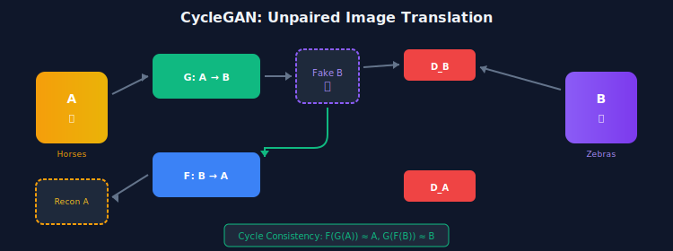
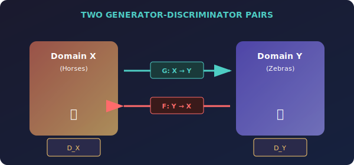
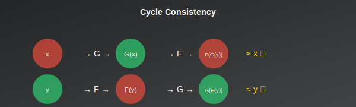

# 🔄 CycleGAN: Unpaired Image-to-Image Translation

*Horses to zebras, summer to winter—without paired data*

---

## 🎯 Where & Why Use CycleGAN?

### 🌍 Real-World Applications

| Domain | Application | Example |
|--------|-------------|---------|
| **Art & Style** | Photo to painting | Photo → Monet style |
| **Season Transfer** | Weather/time changes | Summer → Winter |
| **Object Transfiguration** | Category changes | Horse → Zebra |
| **Domain Adaptation** | Synthetic to real | Sim → Real |
| **Photo Enhancement** | Restoration | Old photo → Restored |
| **Medical Imaging** | Modality transfer | CT → MRI |

### 💡 Why Master CycleGAN?

> *"CycleGAN solves the impossible: learning translations without being told what matches what."*

1. **No Paired Data Needed** — Use unpaired image collections
2. **Bidirectional** — Learn both directions simultaneously
3. **Preserves Content** — Cycle consistency maintains structure
4. **Versatile** — Works for many translation tasks
5. **Foundation** — Basis for UNIT, MUNIT, CUT

---

## 📖 Introduction

CycleGAN (Zhu et al., 2017) enables image-to-image translation without paired training examples. By using cycle consistency loss, it learns to translate between domains using only unpaired collections of images.

---

## 📊 Representation Comparison

| Representation | Pros | Cons |
|----------------|------|------|
| **Cycle Consistency** | Enables unpaired | May preserve too much |
| **Identity Loss** | Color preservation | Extra forward pass |
| **PatchGAN** | Local discriminator | May miss global structure |
| **Instance Norm** | Style invariance | Loses some content |
| **ResNet Generator** | Skip connections | Fixed resolution |

---

## 1. Problem Setting

### 1.1 Paired vs Unpaired Translation

| Paired (pix2pix) | Unpaired (CycleGAN) |
|------------------|---------------------|
| Need (x, y) pairs | Only need {x} and {y} sets |
| Sketch + matching photo | Horse images + zebra images |
| Hard to obtain | Easy to collect! |

### 1.2 The Challenge

Without pairs, infinitely many mappings \( G: X \to Y \) could match distributions.

> **Solution:** Cycle consistency constraint!

---

## 2. Architecture

### 2.1 Two Generator-Discriminator Pairs

- **Generator G:** X → Y (horse → zebra)
- **Generator F:** Y → X (zebra → horse)
- **Discriminator D_X:** Distinguishes real x from F(y)
- **Discriminator D_Y:** Distinguishes real y from G(x)

---

## 3. Loss Functions

### 3.1 Adversarial Loss

**For G: X → Y:**
$$\mathcal{L}_{GAN}(G, D_Y) = \mathbb{E}_y[\log D_Y(y)] + \mathbb{E}_x[\log(1 - D_Y(G(x)))]$$

### 3.2 Cycle Consistency Loss ⭐

**Key innovation:** If we translate x → y → x', we should recover x' ≈ x.

$$\mathcal{L}_{cyc}(G, F) = \mathbb{E}_x[\|F(G(x)) - x\|_1] + \mathbb{E}_y[\|G(F(y)) - y\|_1]$$

### 3.3 Identity Loss (Optional)

$$\mathcal{L}_{identity} = \mathbb{E}_y[\|G(y) - y\|_1] + \mathbb{E}_x[\|F(x) - x\|_1]$$

Preserve color/content when input is already in target domain.

### 3.4 Full Objective

$$\mathcal{L} = \mathcal{L}_{GAN}(G, D_Y) + \mathcal{L}_{GAN}(F, D_X) + \lambda_{cyc}\mathcal{L}_{cyc} + \lambda_{id}\mathcal{L}_{identity}$$

**Typical values:** λ_cyc = 10, λ_id = 5

---

## 4. Why Cycle Consistency Works

- **Without cycle consistency:** G might collapse all inputs to similar outputs
- **With cycle consistency:** G must preserve enough information for F to reconstruct
- **Information preservation:** The mapping must be approximately bijective

---

## 5. Limitations

| Limitation | Description |
|------------|-------------|
| **Geometric changes** | Can't handle shape changes (dog → cat) |
| **Texture bias** | Changes textures rather than geometry |
| **Training instability** | Sensitive to hyperparameters |

---

## 📊 Key Equations Summary

| Concept | Formula |
|---------|---------|
| **Cycle consistency** | \( \|F(G(x)) - x\|_1 + \|G(F(y)) - y\|_1 \) |
| **Identity** | \( \|G(y) - y\|_1 + \|F(x) - x\|_1 \) |
| **Full loss** | \( \mathcal{L}_{GAN} + \lambda_{cyc}\mathcal{L}_{cyc} + \lambda_{id}\mathcal{L}_{id} \) |

---

## 📚 References

1. **Zhu, J.-Y., et al.** (2017). "Unpaired Image-to-Image Translation using Cycle-Consistent Adversarial Networks." *ICCV*. [arXiv:1703.10593](https://arxiv.org/abs/1703.10593)

---

## ✏️ Exercises

1. **Implement** CycleGAN for a simple domain pair.
2. **Ablate** the cycle consistency loss.
3. **Visualize** intermediate results: x, G(x), F(G(x)).

---

**[← Back to LSGAN](../06_lsgan/)** | **[Next: StyleGAN →](../08_stylegan/)**

