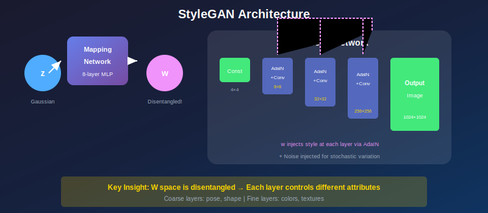

# 🎭 StyleGAN: A Style-Based Generator Architecture

*The art of controlling every aspect of generation*

---

## 🎯 Where & Why Use StyleGAN?

### 🌍 Real-World Applications

| Domain | Application | Why StyleGAN? |
|--------|-------------|---------------|
| **Face Generation** | Photorealistic faces | State-of-the-art quality |
| **Art & NFTs** | AI art generation | Controllable style |
| **Fashion** | Virtual models | Attribute manipulation |
| **Game Development** | Character generation | Fine-grained control |
| **Face Editing** | Photo manipulation | Disentangled attributes |
| **Research** | Understanding representations | Interpretable latent space |

### 💡 Why Master StyleGAN?

> *"StyleGAN didn't just improve image quality—it gave us the keys to control every aspect of generation."*

1. **State-of-the-Art Quality** — Best face generation results
2. **Controllable Generation** — Separate style at each scale
3. **Disentangled Latent Space** — Meaningful manipulations
4. **Style Mixing** — Combine attributes from different images
5. **Research Standard** — Foundation for editing and inversion

---

## 📖 Introduction

StyleGAN (Karras et al., 2019) revolutionized image generation with a novel generator architecture based on style transfer principles. By separating high-level attributes from stochastic variation, StyleGAN enables unprecedented control over generated images.

---

## 📊 Representation Comparison

| Representation | Pros | Cons |
|----------------|------|------|
| **Mapping Network** | Disentangled W space | Extra computation |
| **AdaIN** | Style injection | Removes content info |
| **Noise Injection** | Stochastic details | May add artifacts |
| **Progressive Growing** | High resolution | Complex training |
| **Path Length Reg** | Smooth latent space | Slower training |

---

## 1. Architecture Overview

### 1.1 Key Innovation: Mapping Network + Synthesis Network

| Traditional | StyleGAN |
|-------------|----------|
| z → G(z) → image | z → f(z)=w → Synthesis(w) → image |

### 1.2 Components

1. **Mapping Network f:** Z → W
   - 8-layer MLP
   - Maps latent z to intermediate latent w
   
2. **Synthesis Network:**
   - Generates image from constant input
   - Modulated by w at each layer
   - Stochastic noise injected at each resolution

### 1.3 Why Separate Mapping Network?

**Z space:** Must follow fixed prior (Gaussian)

**W space:** 
- ✅ Learned, data-dependent distribution
- ✅ More disentangled
- ✅ Better for interpolation and manipulation

---

## 2. Adaptive Instance Normalization (AdaIN)

### 2.1 Style Injection Mechanism

$$\text{AdaIN}(x_i, y) = y_{s,i} \frac{x_i - \mu(x_i)}{\sigma(x_i)} + y_{b,i}$$

where:
- \( x_i \): feature map at channel i
- \( y_s, y_b \): learned affine transforms from w

### 2.2 Per-Layer Styles

| Layers | Resolution | Controls |
|--------|------------|----------|
| **Coarse** | 4×4 - 8×8 | Pose, face shape |
| **Middle** | 16×16 - 32×32 | Facial features, hair style |
| **Fine** | 64×64 - 1024×1024 | Colors, textures |

---

## 3. Stochastic Variation

### 3.1 Noise Injection

At each layer, add scaled noise:
$$x' = x + B \cdot n$$

where:
- n: spatial noise map, per-pixel Gaussian
- B: learned per-channel scaling factor

### 3.2 What Noise Controls

- **High-resolution noise:** Hair strands, pores, background texture
- **Low-resolution noise:** Hair curl patterns, skin tone variations

### 3.3 Separation from Style

**Style (from w):** Global, deterministic attributes
**Noise:** Local, stochastic variation

> Same w with different noise → same person, different "instance"

---

## 4. Style Mixing

### 4.1 Mixing Regularization

During training, use different w vectors for different layers:
$$w_1 \text{ for coarse}, \quad w_2 \text{ for fine}$$

### 4.2 Effect

- Prevents layers from becoming correlated
- Enables mix-and-match at inference
- Improves disentanglement

---

## 5. The W and W+ Spaces

| Space | Description | Use Case |
|-------|-------------|----------|
| **W** | Same w for all layers: w ∈ ℝ⁵¹² | Sampling, interpolation |
| **W+** | Different w per layer: w⁺ ∈ ℝᴸˣ⁵¹² | GAN inversion, fine editing |

---

## 6. StyleGAN2/3 Improvements

### StyleGAN2
- Weight demodulation instead of AdaIN
- No blob artifacts
- Path length regularization

### StyleGAN3
- Alias-free generation
- Texture sticking fixed
- Translation/rotation equivariance

---

## 📊 Key Innovations Summary

| Innovation | Effect |
|------------|--------|
| **Mapping network** | Disentangled W space |
| **AdaIN/Modulation** | Style injection at each scale |
| **Noise injection** | Stochastic variation |
| **Style mixing** | Prevents feature entanglement |
| **Progressive growing** | Stable high-res training |

---

## 📚 References

1. **Karras, T., Laine, S., & Aila, T.** (2019). "A Style-Based Generator Architecture for GANs." *CVPR*. [arXiv:1812.04948](https://arxiv.org/abs/1812.04948)
2. **Karras, T., et al.** (2020). "Analyzing and Improving the Image Quality of StyleGAN." *CVPR*. [arXiv:1912.04958](https://arxiv.org/abs/1912.04958)

---

## ✏️ Exercises

1. **Implement** the mapping network and compare Z vs W interpolation.
2. **Visualize** the effect of noise at different resolutions.
3. **Perform** style mixing between two generated faces.
4. **Find** interpretable directions in W using PCA.

---

**[← Back to CycleGAN](../07_cyclegan/)** | **[Next: GAN Evaluation →](../09_gan_evaluation/)**

