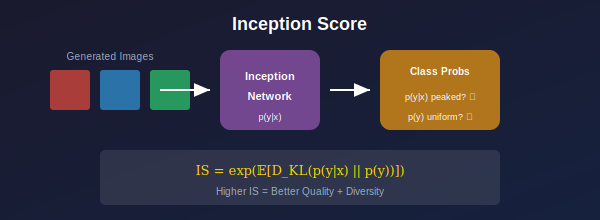

# 🎯 Inception Score (IS)

*The original GAN quality metric*

---

## 🎯 Where & Why Use Inception Score?

### 🌍 Real-World Applications

| Scenario | Why IS? |
|----------|---------|
| **Quick Evaluation** | Fast to compute during training |
| **Class-Conditional GANs** | Measures class diversity |
| **ImageNet Models** | Ideal for 1000-class generation |
| **Research Baselines** | Historical comparison |

### 💡 Why Understand IS?

> *"Understanding IS helps you understand what it misses—and why we need FID."*

1. **Historical Context** — First widely-used metric
2. **Understand Limitations** — Know when not to use it
3. **Quick Feedback** — Fast evaluation during training
4. **Research Papers** — Still reported in many works

---

## 📖 Definition

### Formula

$$\text{IS} = \exp\left(\mathbb{E}_{x \sim p_g}[D_{KL}(p(y|x) \| p(y))]\right)$$

where:
- \( p(y|x) \): class distribution for image x (from Inception)
- \( p(y) = \mathbb{E}_x[p(y|x)] \): marginal class distribution

### Intuition

**\( p(y|x) \) should be peaked:** Each image should clearly belong to one class (quality)

**\( p(y) \) should be uniform:** Generated images should cover all classes (diversity)

High KL divergence = peaked conditionals, uniform marginal = **high IS**

---

## 📊 Representation Comparison

| Representation | Pros | Cons |
|----------------|------|------|
| **Standard IS** | Simple, interpretable | ImageNet bias |
| **Modified IS** | Split computation | Still no real data |
| **Class-conditional IS** | Per-class quality | Needs labels |
| **Sliding Window** | Detects mode drop | More computation |
| **Log IS** | Stable values | Less intuitive |

---

## Mathematical Analysis

### Decomposition

$$\mathbb{E}_x[D_{KL}(p(y|x) \| p(y))] = H(y) - H(y|x)$$

**High IS requires:**
- High \( H(y) \): diverse classes
- Low \( H(y|x) \): confident predictions

### Range

- **Minimum:** IS = 1 (all identical or random noise)
- **Maximum:** IS = 1000 (ImageNet has 1000 classes)
- **Real ImageNet:** ~250
- **Good GANs:** 50-200

---

## Limitations

| Limitation | Description |
|------------|-------------|
| ❌ **Mode Collapse Blind Spot** | Can miss mode collapse within classes |
| ❌ **Ignores Intra-Class Diversity** | Only measures class diversity |
| ❌ **Dataset Bias** | Trained on ImageNet only |
| ❌ **No Reference** | Doesn't compare to real data |

---

## 📊 Key Equations

| Concept | Formula |
|---------|---------|
| **IS** | \( \exp(\mathbb{E}_x[D_{KL}(p(y|x) \| p(y))]) \) |
| **Alternative** | \( \exp(H(y) - H(y|x)) \) |
| **Range** | [1, num_classes] |

---

## 📚 References

1. **Salimans, T., et al.** (2016). "Improved Techniques for Training GANs." *NeurIPS*. [arXiv:1606.03498](https://arxiv.org/abs/1606.03498)

---

**[← Back to GAN Evaluation](../README.md)** | **[Next: FID →](../02_fid/)**

