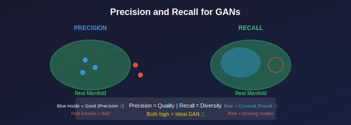

# ⚖️ Precision and Recall for GANs

*Separating quality from diversity*

---

## 🎯 Where & Why Use Precision & Recall?

### 🌍 Real-World Applications

| Scenario | Why P&R? |
|----------|----------|
| **Diagnosing Mode Collapse** | Low recall = missing modes |
| **Quality vs Diversity Tradeoff** | Understand what's failing |
| **Truncation Analysis** | Track tradeoff as τ changes |
| **Model Debugging** | Pinpoint specific issues |

### 💡 Why Master P&R?

> *"FID tells you something is wrong. Precision & Recall tell you what."*

1. **Interpretable** — Clear quality vs diversity split
2. **Diagnostic** — Reveals failure modes
3. **Complementary** — Use with FID for full picture
4. **Actionable** — Know what to fix

---

## 📖 Definition

### Precision

**What fraction of generated samples are realistic?**

$$P = \frac{|\mathcal{M}_g \cap \mathcal{M}_r|}{|\mathcal{M}_g|}$$

> High precision = generated samples look real

### Recall

**What fraction of real data is covered by generated samples?**

$$R = \frac{|\mathcal{M}_r \cap \mathcal{M}_g|}{|\mathcal{M}_r|}$$

> High recall = generator covers all modes

---

## 📊 Representation Comparison

| Representation | Pros | Cons |
|----------------|------|------|
| **P&R (kNN)** | Simple manifold estimate | Sensitive to k |
| **Improved P&R** | Better manifold | More computation |
| **Density & Coverage** | Continuous values | Hyperparameter sensitive |
| **Realism Score** | Per-sample quality | Expensive |
| **α-Precision** | Smooth trade-off | Less interpretable |

---

## Interpretation

| Precision | Recall | Interpretation |
|:---------:|:------:|----------------|
| **High** | **High** | 🎯 Ideal generator |
| **High** | Low | ⚠️ Mode collapse (few realistic modes) |
| Low | **High** | ⚠️ Low quality but diverse |
| Low | Low | ❌ Poor model |

---

## Truncation Effect

**Truncation trick (BigGAN, StyleGAN):**
- ↑ Precision (higher quality)
- ↓ Recall (less diversity)

Can plot precision-recall curve by varying truncation!

---

## 📊 Key Equations

| Concept | Formula |
|---------|---------|
| **Precision** | Fraction of fakes in real manifold |
| **Recall** | Fraction of real manifold covered |
| **Ideal** | Both close to 1.0 |

---

## 📚 References

1. **Kynkäänniemi, T., et al.** (2019). "Improved Precision and Recall Metric." *NeurIPS*. [arXiv:1904.06991](https://arxiv.org/abs/1904.06991)

---

**[← Back to FID](../02_fid/)** | **[Main Index →](../../README.md)**

