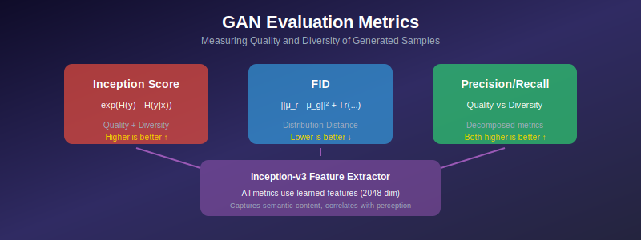
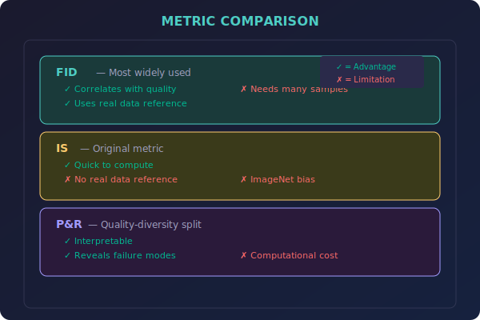

# 📊 GAN Evaluation Methods

*Measuring the unmeasurable: How to evaluate generative models*

---

## 🎯 Where & Why Use GAN Evaluation?

### 🌍 Real-World Applications

| Scenario | Why Evaluation Matters |
|----------|------------------------|
| **Model Selection** | Choose the best model for deployment |
| **Hyperparameter Tuning** | Compare different configurations |
| **Research** | Benchmark new methods fairly |
| **Quality Assurance** | Ensure production standards |
| **Training Monitoring** | Track progress during training |
| **Failure Detection** | Identify mode collapse, artifacts |

### 💡 Why Master Evaluation?

> *"A GAN without proper evaluation is like driving blindfolded—you might be going somewhere, but you don't know where."*

1. **Model Comparison** — Objectively compare different GANs
2. **Progress Tracking** — Know when training improves
3. **Quality vs Diversity** — Understand the tradeoffs
4. **Research Validity** — Publish reliable results
5. **Production Readiness** — Ensure deployment standards

---

## 📖 Introduction

Evaluating generative models is challenging because we need to assess both sample quality and diversity. This section covers the main metrics used to evaluate GANs, their mathematical foundations, and practical considerations.

---

## 📊 Representation Comparison

| Representation | Pros | Cons |
|----------------|------|------|
| **Inception Score** | Simple, fast | Ignores real data |
| **FID** | Compares to real data | Gaussian assumption |
| **Precision/Recall** | Separate quality/diversity | Needs manifold estimate |
| **LPIPS** | Perceptual distance | Pairwise only |
| **KID** | Unbiased, no Gaussian | Higher variance |

---

## 1. The Evaluation Challenge

### 1.1 What to Measure?

| Aspect | Question | Metric |
|--------|----------|--------|
| **Quality** | Are individual samples realistic? | IS, FID |
| **Diversity** | Does the model capture all modes? | Recall |
| **Coverage** | Does the model cover the full distribution? | FID, Recall |
| **Fidelity** | How close to real data? | Precision |

### 1.2 No Single Perfect Metric

Each metric captures different aspects:
- High quality + low diversity = mode collapse
- High diversity + low quality = blurry/noisy samples

> 💡 **Best practice:** Report multiple metrics.

---

## 2. Main Metrics Overview

| Metric | Measures | Range | Better |
|--------|----------|-------|--------|
| **IS** | Quality + diversity | [1, 1000] | Higher ↑ |
| **FID** | Distribution match | [0, ∞) | Lower ↓ |
| **KID** | Distribution match | [0, ∞) | Lower ↓ |
| **Precision** | Quality | [0, 1] | Higher ↑ |
| **Recall** | Diversity | [0, 1] | Higher ↑ |

---

## 3. Detailed Coverage

See subdirectories for detailed treatment:

| Topic | Description | Link |
|-------|-------------|------|
| 🎯 **Inception Score** | Quality via classifier confidence | [→ Explore](./01_inception_score/) |
| 📏 **FID** | Distribution distance in feature space | [→ Explore](./02_fid/) |
| ⚖️ **Precision & Recall** | Quality-diversity decomposition | [→ Explore](./03_precision_recall/) |

---

## 4. Practical Guidelines

### 4.1 Sample Size

| Metric | Minimum | Recommended |
|--------|---------|-------------|
| **IS** | 5,000 | 50,000 |
| **FID** | 10,000 | 50,000 |
| **KID** | 1,000 | 10,000 |

### 4.2 Common Mistakes

❌ Comparing metrics across different datasets
❌ Using too few samples
❌ Different preprocessing for real vs fake
❌ Cherry-picking best scores

### 4.3 Best Practices

✅ Fix random seeds for reproducibility
✅ Report computation details
✅ Use standard implementations
✅ Report multiple metrics

---

## 📊 Quick Comparison

---

## 📚 References

1. **Borji, A.** (2019). "Pros and Cons of GAN Evaluation Measures." *CVIU*. [arXiv:1802.03446](https://arxiv.org/abs/1802.03446)
2. **Theis, L., et al.** (2016). "A note on the evaluation of generative models." *ICLR*. [arXiv:1511.01844](https://arxiv.org/abs/1511.01844)

---

**[← Back to StyleGAN](../08_stylegan/)** | **[Main Index →](../README.md)**

