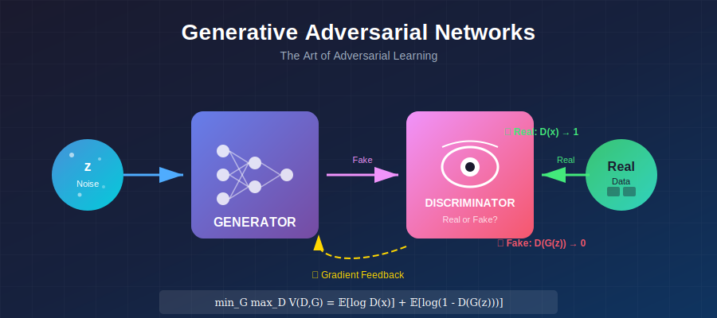
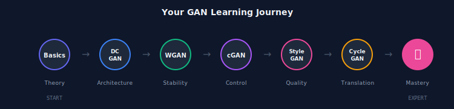
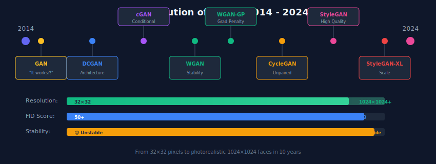

# ⚔️ Generative Adversarial Networks

<div align="center">



<br/>

### 🎭 *The Art of the Adversarial Game* 🎭

<br/>

[](#)
[](#)
[](#)

---

*"The forger and the detective. Locked in eternal battle. Until both become masters."*

</div>

---

## 🎬 The Setup

> **The year is 2014.** Ian Goodfellow is at a bar in Montreal with friends, debating generative models. An idea strikes: what if you trained two networks *against* each other?
>
> **One network creates. One network judges. They fight. They improve. They achieve greatness.**

That conversation launched a revolution.

<div align="center">


</div>

---

## 💡 The Core Philosophy

<table>
<tr>
<td width="50%" style="vertical-align: top">

### 🎨 The Generator's Goal
*"Create images so realistic that the Discriminator can't tell they're fake."*

- Takes random noise as input
- Learns to produce realistic images
- Never sees real data directly
- Only learns through D's feedback

</td>
<td width="50%" style="vertical-align: top">

### 🔍 The Discriminator's Goal
*"Become an expert at distinguishing real from fake."*

- Sees both real and generated images
- Outputs probability of "real"
- Provides gradient signal to G
- Gets better as G improves

</td>
</tr>
</table>

<div align="center">

### The Mathematical Duel

$$\boxed{\min_G \max_D \; \underbrace{\mathbb{E}_{x \sim p_{data}}[\log D(x)]}_{\text{D wants this high}} + \underbrace{\mathbb{E}_{z \sim p_z}[\log(1 - D(G(z)))]}_{\text{G wants this low}}}$$

</div>

---

## 🌟 Why GANs Were Revolutionary

> *Before GANs, we had blurry images and unrealistic samples. Then everything changed.*

<table>
<tr>
<th width="25%">Era</th>
<th width="35%">What Came Before</th>
<th width="40%">What GANs Brought</th>
</tr>
<tr>
<td>

### 📊 Quality

</td>
<td>

Blurry VAE samples
Obvious artifacts
"Looks generated"

</td>
<td>

**Sharp, crisp images**
Photorealistic faces
"Wait, this is fake?"

</td>
</tr>
<tr>
<td>

### 🧠 Learning

</td>
<td>

Pixel-wise losses
MSE = blurry average
Hand-crafted features

</td>
<td>

**Learned perceptual loss**
Adversarial = sharp
Network-learned features

</td>
</tr>
<tr>
<td>

### 🔬 Research

</td>
<td>

Incremental improvements
Same old frameworks
Plateauing quality

</td>
<td>

**Explosion of variants**
New training dynamics
Rapid progress

</td>
</tr>
</table>

---

## 📚 Your GAN Journey

<div align="center">



</div>

### The Complete Curriculum

<table>
<tr>
<th width="5%">#</th>
<th width="18%">Topic</th>
<th width="32%">What You'll Master</th>
<th width="45%">The Hook</th>
</tr>
<tr>
<td align="center">📚</td>
<td><b><a href="./01_gan_basics/">GAN Basics</a></b></td>
<td>Minimax objective, training dynamics, failure modes</td>
<td><em>"Understand the game before you play it."</em></td>
</tr>
<tr>
<td align="center">🏗️</td>
<td><b><a href="./02_dcgan/">DCGAN</a></b></td>
<td>Convolutional architecture, batch norm, strided convolutions</td>
<td><em>"The architectural blueprint that everyone followed."</em></td>
</tr>
<tr>
<td align="center">🎯</td>
<td><b><a href="./03_conditional_gan/">Conditional GAN</a></b></td>
<td>Label conditioning, controlled generation</td>
<td><em>"Don't just generate something. Generate what I asked for."</em></td>
</tr>
<tr>
<td align="center">📏</td>
<td><b><a href="./04_wgan/">WGAN</a></b></td>
<td>Wasserstein distance, Earth Mover's Distance, critics</td>
<td><em>"The loss function that actually makes sense."</em></td>
</tr>
<tr>
<td align="center">⚡</td>
<td><b><a href="./05_wgan_gp/">WGAN-GP</a></b></td>
<td>Gradient penalty, stable training at scale</td>
<td><em>"Lipschitz constraint, done right."</em></td>
</tr>
<tr>
<td align="center">📐</td>
<td><b><a href="./06_lsgan/">LSGAN</a></b></td>
<td>Least squares objective, smooth gradients</td>
<td><em>"Sometimes the simplest fix works best."</em></td>
</tr>
<tr>
<td align="center">🔄</td>
<td><b><a href="./07_cyclegan/">CycleGAN</a></b></td>
<td>Unpaired translation, cycle consistency</td>
<td><em>"Turn horses into zebras. No paired data needed."</em></td>
</tr>
<tr>
<td align="center">🎭</td>
<td><b><a href="./08_stylegan/">StyleGAN</a></b></td>
<td>Style injection, progressive growing, disentanglement</td>
<td><em>"The generator architecture that broke the internet."</em></td>
</tr>
<tr>
<td align="center">📊</td>
<td><b><a href="./09_gan_evaluation/">Evaluation</a></b></td>
<td>FID, IS, precision/recall, mode coverage</td>
<td><em>"How do you prove your GAN is actually good?"</em></td>
</tr>
</table>

---

## ⚠️ The Dark Side: Why GANs Are Hard

> *With great power comes great training instability.*

<table>
<tr>
<td width="33%" align="center">

### 💀 Mode Collapse

<br/>

**The Problem:**
Generator finds one output that fools D, and just keeps producing it.

**The Symptom:**
Same face, over and over.

**The Fix:**
WGAN, minibatch discrimination, unrolled GANs

</td>
<td width="33%" align="center">

### 📉 Vanishing Gradients

<br/>

**The Problem:**
D becomes too good. G gets no learning signal.

**The Symptom:**
G loss = constant, images don't improve.

**The Fix:**
Feature matching, one-sided label smoothing

</td>
<td width="33%" align="center">

### 🎢 Training Instability

<br/>

**The Problem:**
D and G oscillate. Never converge.

**The Symptom:**
Metrics bounce around randomly.

**The Fix:**
Spectral normalization, progressive training, careful hyperparameters

</td>
</tr>
</table>

<div align="center">

> 💭 *"Training a GAN is like teaching two students who are trying to outsmart each other.*
> *The teacher (you) must carefully balance the game."*

</div>

---

## 🧮 The Mathematical Evolution

### The Original GAN Objective

$$\min_G \max_D \; V(D, G) = \mathbb{E}_{x}[\log D(x)] + \mathbb{E}_{z}[\log(1 - D(G(z)))]$$

**At optimal D**, the generator minimizes:

$$2 \cdot D_{JS}(p_{data} \| p_g) - \log 4$$

<div align="center">

> 🔑 **Key Insight:** GANs minimize the Jensen-Shannon divergence between real and generated distributions!

</div>

### The WGAN Revolution

Replace JS divergence with Wasserstein distance:

$$W(p_{data}, p_g) = \inf_{\gamma \in \Pi} \mathbb{E}_{(x,y) \sim \gamma}[\|x - y\|]$$

**WGAN Objective:**

$$\min_G \max_{D \in \mathcal{D}} \; \mathbb{E}_{x}[D(x)] - \mathbb{E}_{z}[D(G(z))]$$

where $\mathcal{D}$ = 1-Lipschitz functions (enforced via gradient penalty in WGAN-GP).

---

## 🎨 GAN Variants at a Glance

<table>
<tr>
<th>Variant</th>
<th>Loss Innovation</th>
<th>Architecture Innovation</th>
<th>Best For</th>
</tr>
<tr>
<td><b>Vanilla GAN</b></td>
<td>Cross-entropy</td>
<td>MLP (original)</td>
<td>Understanding basics</td>
</tr>
<tr>
<td><b>DCGAN</b></td>
<td>—</td>
<td>Convolutions + BatchNorm + ReLU</td>
<td>Image generation</td>
</tr>
<tr>
<td><b>cGAN</b></td>
<td>Conditional loss</td>
<td>Label embedding</td>
<td>Controlled generation</td>
</tr>
<tr>
<td><b>WGAN</b></td>
<td>Wasserstein distance</td>
<td>—</td>
<td>Training stability</td>
</tr>
<tr>
<td><b>WGAN-GP</b></td>
<td>Gradient penalty</td>
<td>—</td>
<td>Large-scale training</td>
</tr>
<tr>
<td><b>LSGAN</b></td>
<td>Least squares</td>
<td>—</td>
<td>Stable gradients</td>
</tr>
<tr>
<td><b>CycleGAN</b></td>
<td>Cycle consistency</td>
<td>Dual generators</td>
<td>Unpaired translation</td>
</tr>
<tr>
<td><b>StyleGAN</b></td>
<td>—</td>
<td>Mapping network + AdaIN</td>
<td>High-quality faces</td>
</tr>
<tr>
<td><b>BigGAN</b></td>
<td>Hinge loss + truncation</td>
<td>Massive scale + class embedding</td>
<td>ImageNet generation</td>
</tr>
</table>

---

## 🏆 The GAN Timeline

<div align="center">



</div>

---

## 🔧 Quick Start: Your First GAN

```python
import torch
import torch.nn as nn

class Generator(nn.Module):
    """
    The Artist: Transforms random noise into images.
    """
    def __init__(self, latent_dim=100, img_dim=784):
        super().__init__()
        self.model = nn.Sequential(
            # Expand noise to rich representation
            nn.Linear(latent_dim, 256),
            nn.LeakyReLU(0.2),
            nn.BatchNorm1d(256),
            
            # Build up to image dimensions
            nn.Linear(256, 512),
            nn.LeakyReLU(0.2),
            nn.BatchNorm1d(512),
            
            nn.Linear(512, 1024),
            nn.LeakyReLU(0.2),
            nn.BatchNorm1d(1024),
            
            # Output layer: image pixels in [-1, 1]
            nn.Linear(1024, img_dim),
            nn.Tanh()
        )
    
    def forward(self, z):
        return self.model(z)


class Discriminator(nn.Module):
    """
    The Critic: Judges if images are real or fake.
    """
    def __init__(self, img_dim=784):
        super().__init__()
        self.model = nn.Sequential(
            # Compress image to decision
            nn.Linear(img_dim, 512),
            nn.LeakyReLU(0.2),
            nn.Dropout(0.3),
            
            nn.Linear(512, 256),
            nn.LeakyReLU(0.2),
            nn.Dropout(0.3),
            
            # Binary decision: real (1) or fake (0)
            nn.Linear(256, 1),
            nn.Sigmoid()
        )
    
    def forward(self, x):
        return self.model(x)


# The adversarial dance
def train_step(G, D, real_images, optimizer_G, optimizer_D, criterion):
    batch_size = real_images.size(0)
    
    # Labels
    real_labels = torch.ones(batch_size, 1)
    fake_labels = torch.zeros(batch_size, 1)
    
    # ═══════════════════════════════════════════════
    # Train Discriminator: Maximize log(D(x)) + log(1 - D(G(z)))
    # ═══════════════════════════════════════════════
    optimizer_D.zero_grad()
    
    # Real images
    real_outputs = D(real_images)
    d_loss_real = criterion(real_outputs, real_labels)
    
    # Fake images
    z = torch.randn(batch_size, 100)
    fake_images = G(z)
    fake_outputs = D(fake_images.detach())  # Don't backprop to G
    d_loss_fake = criterion(fake_outputs, fake_labels)
    
    d_loss = d_loss_real + d_loss_fake
    d_loss.backward()
    optimizer_D.step()
    
    # ═══════════════════════════════════════════════
    # Train Generator: Maximize log(D(G(z)))
    # ═══════════════════════════════════════════════
    optimizer_G.zero_grad()
    
    fake_outputs = D(fake_images)  # Now D is fixed, backprop to G
    g_loss = criterion(fake_outputs, real_labels)  # Want D to say "real"
    
    g_loss.backward()
    optimizer_G.step()
    
    return d_loss.item(), g_loss.item()
```

---

## 📚 The Sacred Texts

<table>
<tr>
<th width="55%">Paper</th>
<th width="45%">Why It Matters</th>
</tr>
<tr>
<td>

**Goodfellow et al.** (2014)
*"Generative Adversarial Nets"*
[NeurIPS](https://arxiv.org/abs/1406.2661)

</td>
<td>

📖 **The Genesis**
Where it all started.

</td>
</tr>
<tr>
<td>

**Radford et al.** (2016)
*"Unsupervised Representation Learning with DCGANs"*
[ICLR](https://arxiv.org/abs/1511.06434)

</td>
<td>

🏗️ **The Blueprint**
Architecture guidelines everyone follows.

</td>
</tr>
<tr>
<td>

**Arjovsky et al.** (2017)
*"Wasserstein GAN"*
[ICML](https://arxiv.org/abs/1701.07875)

</td>
<td>

📏 **The Stability Fix**
Finally, meaningful loss values!

</td>
</tr>
<tr>
<td>

**Karras et al.** (2019)
*"A Style-Based Generator Architecture"*
[CVPR](https://arxiv.org/abs/1812.04948)

</td>
<td>

🎭 **The Masterpiece**
Photorealistic faces.

</td>
</tr>
<tr>
<td>

**Brock et al.** (2019)
*"Large Scale GAN Training"*
[ICLR](https://arxiv.org/abs/1809.11096)

</td>
<td>

📈 **The Scale-Up**
512×512 on ImageNet.

</td>
</tr>
</table>

---

## ✏️ Exercises: Prove Your Understanding

<details>
<summary><b>🟢 Exercise 1:</b> Train a GAN on MNIST</summary>

**Task:** Implement the basic GAN above and train on MNIST.

**Checkpoints:**
1. Visualize generated samples every 100 epochs
2. Plot D and G loss curves
3. Try to spot mode collapse

**Success Criteria:** Generate all 10 digits with reasonable quality.

</details>

<details>
<summary><b>🟡 Exercise 2:</b> Diagnose training problems</summary>

**Task:** Intentionally break your GAN in these ways and observe:
1. D learns too fast (increase D's learning rate 10×)
2. G learns too fast (decrease D's learning rate 10×)
3. No BatchNorm in G

**Document:** What do the losses look like? What do samples look like?

</details>

<details>
<summary><b>🟡 Exercise 3:</b> Implement WGAN-GP</summary>

**Task:** Convert your GAN to WGAN-GP:
1. Remove sigmoid from D (now a critic)
2. Use Wasserstein loss
3. Add gradient penalty (λ=10)

**Compare:** Training stability, loss curves, sample quality.

</details>

<details>
<summary><b>🔴 Exercise 4:</b> Prove the optimal discriminator</summary>

**Task:** Show mathematically that for fixed G:

$$D^*(x) = \frac{p_{data}(x)}{p_{data}(x) + p_g(x)}$$

**Hint:** Take the functional derivative of V(D, G) with respect to D(x).

</details>

<details>
<summary><b>🔴 Exercise 5:</b> Implement conditional GAN</summary>

**Task:** Make your GAN conditional on MNIST class labels:
1. Embed labels and concatenate to noise
2. Embed labels and concatenate to images for D
3. Train with supervised labels

**Test:** Generate specific digits on demand.

</details>

---

<div align="center">

## ⚔️ Enter the Arena

<br/>

**Start with the fundamentals →** [GAN Basics](./01_gan_basics/)

*Understand the minimax game before you play it*

<br/>

---

<br/>

> *"The discriminator sees all. The generator learns all. Together, they create.*"
> 
> *— The Way of the GAN*

<br/>

**Made with ⚔️ for the Deep Learning Community**

</div>
