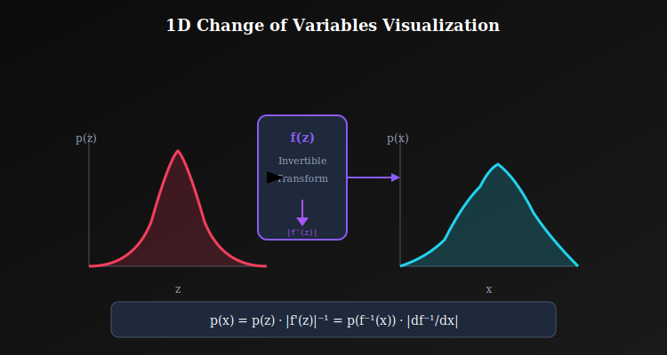
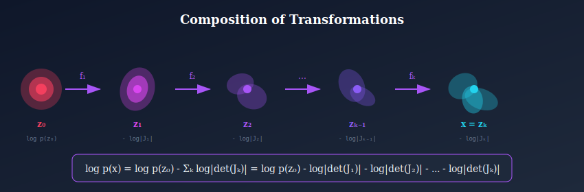

# 📐 Change of Variables Formula

<div align="center">


*The mathematical foundation that enables normalizing flows to transform probability distributions*

</div>

---

## 📖 Introduction

The **change of variables formula** is the mathematical cornerstone of normalizing flows. It describes how probability density transforms under invertible mappings, enabling exact likelihood computation in flow models.

This elegant theorem from probability theory tells us precisely how to compute the probability density of transformed random variables.

---

## 🎯 Where and Why Use This?

### 🏭 Real-World Applications

| Domain | Application | Why Change of Variables? |
|--------|-------------|-------------------------|
| **🎨 Image Generation** | Glow, RealNVP | Transform noise → realistic images with exact likelihood |
| **📊 Density Estimation** | Financial modeling | Fit complex distributions to market data |
| **🔬 Scientific Simulation** | Molecular dynamics | Model complex physical distributions |
| **🤖 Variational Inference** | VAE enhancement | Improve posterior approximations |
| **🔊 Audio Synthesis** | WaveGlow | Generate speech waveforms |

### 💡 Why Master This Concept?

1. **Foundation of All Flows**: Every normalizing flow relies on this formula
2. **Debugging Tool**: Understand why likelihood values behave unexpectedly
3. **Architecture Intuition**: Know how transformations affect density
4. **Cross-Domain Application**: Same math applies to physics, statistics, finance

---

## 📊 Representation Comparison

| Representation | Pros | Cons |
|----------------|------|------|
| **Affine** | Linear, cheap Jacobian | Limited expressiveness |
| **Elementwise** | Diagonal Jacobian O(d) | No cross-dimension |
| **Triangular** | O(d) determinant | Ordering matters |
| **Orthogonal** | Volume preserving | Constrained optimization |
| **General** | Most expressive | O(d³) determinant |

---

## 🧮 One-Dimensional Case

### 1.1 Setup

Let \( z \sim p_z(z) \) and \( x = f(z) \) where \( f \) is invertible.

**Question**: What is \( p_x(x) \)?

### 1.2 Derivation

Probability must be **conserved** — the total probability over any region must remain 1:

$$P(a \leq z \leq b) = P(f(a) \leq x \leq f(b))$$

Expanding with integrals:

$$\int_a^b p_z(z) \, dz = \int_{f(a)}^{f(b)} p_x(x) \, dx$$

Substituting \( x = f(z) \), \( dx = f'(z) \, dz \):

$$\int_a^b p_z(z) \, dz = \int_a^b p_x(f(z)) |f'(z)| \, dz$$

Since this holds for any interval:

$$\boxed{p_z(z) = p_x(f(z)) \cdot |f'(z)|}$$

Or equivalently, solving for \( p_x \):

$$\boxed{p_x(x) = p_z(f^{-1}(x)) \cdot \left|\frac{df^{-1}}{dx}\right| = p_z(z) \cdot |f'(z)|^{-1}}$$

<p align="center">
  
</p>

### 1.3 Intuition: Stretching and Compressing

Think of the transformation as **stretching or compressing** a rubber band:

| Scenario | Derivative | Effect on Density |
|----------|------------|-------------------|
| \( \|f'(z)\| > 1 \) | Stretching | Density **decreases** (spread out) |
| \( \|f'(z)\| < 1 \) | Compressing | Density **increases** (concentrated) |
| \( \|f'(z)\| = 1 \) | No change | Density **unchanged** |

> 💡 **Key Insight**: Total probability mass is always conserved — what changes is how densely it's packed.

---

## 🧮 Multivariate Case

### 2.1 Setup

Let \( \mathbf{z} \sim p_z(\mathbf{z}) \) and \( \mathbf{x} = f(\mathbf{z}) \) where \( f: \mathbb{R}^d \to \mathbb{R}^d \) is invertible.

### 2.2 The Jacobian Matrix

The Jacobian captures how \( f \) locally transforms space:

$$J = \frac{\partial f}{\partial \mathbf{z}} = \begin{bmatrix} \frac{\partial f_1}{\partial z_1} & \cdots & \frac{\partial f_1}{\partial z_d} \\ \vdots & \ddots & \vdots \\ \frac{\partial f_d}{\partial z_1} & \cdots & \frac{\partial f_d}{\partial z_d} \end{bmatrix}$$

### 2.3 The Change of Variables Formula

$$\boxed{p_x(\mathbf{x}) = p_z(f^{-1}(\mathbf{x})) \left|\det\left(\frac{\partial f^{-1}}{\partial \mathbf{x}}\right)\right|}$$

Equivalently, using \( \mathbf{z} = f^{-1}(\mathbf{x}) \):

$$\boxed{p_x(\mathbf{x}) = p_z(\mathbf{z}) \left|\det(J)\right|^{-1}}$$

**Log-probability form** (numerically stable):

$$\boxed{\log p_x(\mathbf{x}) = \log p_z(\mathbf{z}) - \log|\det(J)|}$$

---

## 📊 Complete Proofs

### 3.1 Rigorous Proof via Measure Theory

<details>
<summary><b>📐 Full Measure-Theoretic Derivation</b></summary>

**Setup:** Let $(\Omega, \mathcal{F}, P)$ be a probability space.
- $Z: \Omega \to \mathbb{R}^d$ is a random variable with density $p_Z$
- $f: \mathbb{R}^d \to \mathbb{R}^d$ is a $C^1$ diffeomorphism (smooth with smooth inverse)
- $X = f(Z)$

**Goal:** Find the density $p_X$ of $X$.

**Step 1: Pushforward Measure**

The distribution of $X$ is the pushforward of $P_Z$ under $f$:
$$P_X(A) = P_Z(f^{-1}(A)) = \int_{f^{-1}(A)} p_Z(z) \, dz$$

**Step 2: Change of Variables in Integration**

For any measurable set $A \subseteq \mathbb{R}^d$:
$$P_X(A) = \int_{f^{-1}(A)} p_Z(z) \, dz$$

Let $x = f(z)$, so $z = f^{-1}(x)$ and $dz = |\det(J_{f^{-1}}(x))| \, dx$:
$$P_X(A) = \int_A p_Z(f^{-1}(x)) \cdot |\det(J_{f^{-1}}(x))| \, dx$$

**Step 3: Identify the Density**

By the definition of density:
$$P_X(A) = \int_A p_X(x) \, dx$$

Comparing:
$$\boxed{p_X(x) = p_Z(f^{-1}(x)) \cdot |\det(J_{f^{-1}}(x))|}$$

**Step 4: Alternative Form**

Using $J_{f^{-1}}(x) = (J_f(z))^{-1}$ at $z = f^{-1}(x)$:
$$\det(J_{f^{-1}}) = \det(J_f)^{-1}$$

Therefore:
$$\boxed{p_X(x) = p_Z(z) \cdot |\det(J_f(z))|^{-1}}$$

where $z = f^{-1}(x)$. $\quad\blacksquare$

</details>

### 3.2 Proof via Differential Forms (Advanced)

<details>
<summary><b>📐 Differential Forms Approach</b></summary>

**Key Insight:** Probability density is naturally a **differential form**, not a function!

**Setup:** In differential geometry:
- Volume form in $z$-space: $\omega_z = dz_1 \wedge dz_2 \wedge \cdots \wedge dz_d$
- Probability measure: $p_Z(z) \, \omega_z$

**Pullback of Volume Form:**

The pullback of $\omega_x$ under $f$ is:
$$f^*(\omega_x) = f^*(dx_1 \wedge \cdots \wedge dx_d)$$

Using $dx_i = \sum_j \frac{\partial f_i}{\partial z_j} dz_j$:
$$f^*(\omega_x) = \det(J_f) \, \omega_z$$

**Probability Conservation:**

The measure $p_X(x) \, \omega_x$ pulls back to $p_Z(z) \, \omega_z$:
$$p_X(f(z)) \cdot f^*(\omega_x) = p_Z(z) \, \omega_z$$
$$p_X(f(z)) \cdot \det(J_f) \, \omega_z = p_Z(z) \, \omega_z$$

**Result:**
$$p_X(f(z)) = \frac{p_Z(z)}{|\det(J_f)|}$$

This approach generalizes to manifolds! $\quad\blacksquare$

</details>

### 3.3 Volume Elements

Under transformation, infinitesimal volume elements transform as:

$$dV_x = |\det(J)| \cdot dV_z$$

The determinant measures the **factor by which volumes change**.

### 3.4 Probability Conservation (Intuitive Proof)

Total probability must remain 1:

$$\int_{\mathcal{R}_x} p_x(\mathbf{x}) \, dV_x = \int_{\mathcal{R}_z} p_z(\mathbf{z}) \, dV_z$$

Substituting the volume transformation:

$$\int_{\mathcal{R}_z} p_x(f(\mathbf{z})) |\det(J)| \, dV_z = \int_{\mathcal{R}_z} p_z(\mathbf{z}) \, dV_z$$

**Therefore**: \( p_x(f(\mathbf{z})) \cdot |\det(J)| = p_z(\mathbf{z}) \)

### 3.5 Why Absolute Value of Determinant?

<details>
<summary><b>📐 The Sign of the Jacobian</b></summary>

**The Issue:** $\det(J)$ can be negative (orientation-reversing maps).

**Example:** For $f(z) = -z$ in 1D:
- $f'(z) = -1$
- This flips the orientation

**Resolution:** Probability density is always non-negative, so we take $|\det(J)|$.

**Geometric Interpretation:**
- $|\det(J)| > 0$: volume scaling factor
- $\text{sign}(\det(J))$: orientation (preserved or flipped)
- Only the magnitude affects probability

</details>

---

## 🔗 Composition of Transformations

<p align="center">
  
</p>

### 4.1 Chain of Flows

For \( \mathbf{x} = f_K \circ f_{K-1} \circ \cdots \circ f_1(\mathbf{z}_0) \):

$$\log p_x(\mathbf{x}) = \log p_z(\mathbf{z}_0) - \sum_{k=1}^{K} \log|\det(J_k)|$$

where \( J_k = \frac{\partial f_k}{\partial \mathbf{z}_{k-1}} \).

### 4.2 Chain Rule for Determinants

$$\det(J_{\text{total}}) = \prod_{k=1}^{K} \det(J_k)$$

$$\log|\det(J_{\text{total}})| = \sum_{k=1}^{K} \log|\det(J_k)|$$

> 💡 **Why This Matters**: We can compute the total log-determinant as a simple sum, making deep flows tractable!

---

## 📝 Worked Examples

### Example 5.1: Linear Transformation

\( \mathbf{x} = A\mathbf{z} \) where \( A \) is an invertible matrix.

$$J = A, \quad \det(J) = \det(A)$$

$$p_x(\mathbf{x}) = p_z(A^{-1}\mathbf{x}) / |\det(A)|$$

### Example 5.2: Element-wise Transformation

\( x_i = f(z_i) \) independently for each dimension.

$$J = \text{diag}(f'(z_1), \ldots, f'(z_d))$$

$$\det(J) = \prod_i f'(z_i)$$

$$\log|\det(J)| = \sum_i \log|f'(z_i)|$$

### Example 5.3: Affine Coupling (RealNVP)

\( \mathbf{x}_a = \mathbf{z}_a \), \( \mathbf{x}_b = \mathbf{z}_b \odot \exp(s(\mathbf{z}_a)) + t(\mathbf{z}_a) \)

$$J = \begin{bmatrix} I & 0 \\ * & \text{diag}(e^{s(\mathbf{z}_a)}) \end{bmatrix}$$

$$\det(J) = \prod_i e^{s_i} = e^{\sum_i s_i}$$

$$\log|\det(J)| = \sum_i s_i$$

---

## ⚡ Computational Considerations

### 6.1 The Bottleneck

Computing \( \det(J) \) directly: **\( O(d^3) \)** — too expensive for high dimensions!

For a 256×256×3 image (\( d \approx 200,000 \)), this is impossible.

### 6.2 Solution: Structured Jacobians

Design \( f \) so the Jacobian has special structure:

| Structure | Cost | Flow Type |
|-----------|------|-----------|
| **Triangular** | \( O(d) \) | Coupling layers, Autoregressive |
| **Block diagonal** | \( O(d) \) | Multi-scale flows |
| **Rank-1 update** | \( O(d) \) | Planar flows |
| **Diagonal** | \( O(d) \) | Element-wise transforms |

---

## 💻 Implementation

```python
import torch
import torch.nn as nn

def log_prob_transformed(z, log_pz, log_det_jacobian):
    """
    Compute log p(x) using change of variables.
    
    Args:
        z: Latent samples [batch, dim]
        log_pz: Log probability under base distribution [batch]
        log_det_jacobian: Log |det(J)| [batch]
    
    Returns:
        log_px: Log probability in data space [batch]
    """
    return log_pz - log_det_jacobian


class SimpleFlow(nn.Module):
    """Demonstrates change of variables in code."""
    
    def __init__(self, dim):
        super().__init__()
        self.scale = nn.Parameter(torch.zeros(dim))
        self.shift = nn.Parameter(torch.zeros(dim))
    
    def forward(self, z):
        """Forward: z → x"""
        x = z * torch.exp(self.scale) + self.shift
        log_det = self.scale.sum()  # Sum for diagonal Jacobian
        return x, log_det
    
    def inverse(self, x):
        """Inverse: x → z"""
        z = (x - self.shift) * torch.exp(-self.scale)
        log_det = -self.scale.sum()
        return z, log_det
    
    def log_prob(self, x, base_dist):
        """Compute log p(x) using change of variables."""
        z, log_det = self.inverse(x)
        log_pz = base_dist.log_prob(z).sum(dim=-1)
        log_px = log_pz + log_det  # Change of variables!
        return log_px
```

---

## 📝 Key Equations Summary

| Scenario | Formula |
|----------|---------|
| **1D** | \( p_x(x) = p_z(z) / \|f'(z)\| \) |
| **General** | \( \log p_x(x) = \log p_z(z) - \log\|\det J\| \) |
| **Composition** | \( \log p_x = \log p_z - \sum_k \log\|\det J_k\| \) |

---

## 📚 References

1. **Papamakarios, G., et al.** (2021). *"Normalizing Flows for Probabilistic Modeling and Inference."* JMLR.
2. **Rudin, W.** (1976). *"Principles of Mathematical Analysis."* McGraw-Hill. (Chapter 9)

---

## ✏️ Exercises

1. **Derive** the 1D change of variables formula from first principles.

2. **Verify** that for \( x = \sigma(z) \) (sigmoid), \( p_x = p_z \cdot x \cdot (1-x) \).

3. **Show** that affine coupling has triangular Jacobian.

4. **Prove** the chain rule for Jacobian determinants.

5. **Compute** the log-det for a sequence of 3 affine coupling layers.

---

<div align="center">

**[← Back to Flow Fundamentals](../)** | **[Next: Jacobian Determinant →](../02_jacobian_determinant/)**

</div>
