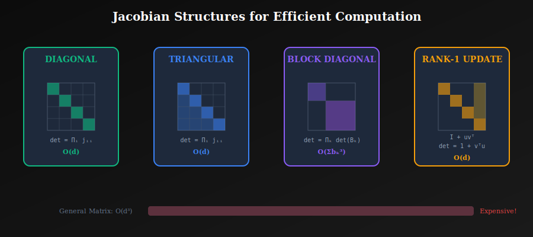

# 📊 The Jacobian Determinant

<div align="center">


*The computational heart of normalizing flows — measuring how transformations stretch and compress space*

</div>

---

## 📖 Introduction

The **Jacobian determinant** measures how an invertible transformation changes volumes in space. It's the crucial factor in the change of variables formula that allows normalizing flows to compute exact likelihoods.

**The Challenge**: Computing determinants naïvely requires \( O(d^3) \) operations — prohibitively expensive for high-dimensional data like images. The art of flow design is creating transformations with **efficiently computable Jacobians**.

---

## 🎯 Where and Why Use This?

### 🏭 Critical Applications

| Context | Why Jacobian Matters |
|---------|---------------------|
| **🎓 Training** | Log-det appears in every likelihood computation |
| **📊 Density Evaluation** | Required to evaluate \( p(x) \) for any data point |
| **🏗️ Architecture Design** | Jacobian structure determines computational cost |
| **🔬 Debugging** | Numerical instability often comes from Jacobian computation |
| **⚡ Scalability** | Efficient Jacobians enable high-dimensional flows |

### 💡 Why Master This Concept?

1. **Bottleneck Awareness**: Know where computational costs come from
2. **Architecture Choice**: Choose the right flow for your problem
3. **Custom Designs**: Create new flow architectures with efficient Jacobians
4. **Numerical Stability**: Understand log-determinant tricks

---

## 📊 Representation Comparison

| Representation | Pros | Cons |
|----------------|------|------|
| **Diagonal Jacobian** | O(d) computation | No cross-dimension |
| **Triangular** | O(d) log-det | Masking required |
| **LU Decomposition** | Efficient inverse | O(d²) storage |
| **QR Decomposition** | Orthogonal component | More expensive |
| **Hutchinson Trace** | Stochastic O(1) | Variance in estimate |

---

## 🧮 The Jacobian Matrix

### 1.1 Definition

For a transformation \( f: \mathbb{R}^d \to \mathbb{R}^d \), the Jacobian is:

$$J = \frac{\partial f}{\partial z} = \begin{bmatrix} \frac{\partial f_1}{\partial z_1} & \frac{\partial f_1}{\partial z_2} & \cdots & \frac{\partial f_1}{\partial z_d} \\ \frac{\partial f_2}{\partial z_1} & \frac{\partial f_2}{\partial z_2} & \cdots & \frac{\partial f_2}{\partial z_d} \\ \vdots & \vdots & \ddots & \vdots \\ \frac{\partial f_d}{\partial z_1} & \frac{\partial f_d}{\partial z_2} & \cdots & \frac{\partial f_d}{\partial z_d} \end{bmatrix}$$

### 1.2 Interpretation

| Element | Meaning |
|---------|---------|
| **Rows** | How each output changes w.r.t. all inputs |
| **Columns** | How all outputs change w.r.t. each input |
| **\( J_{ij} \)** | Sensitivity of output \( i \) to input \( j \) |

---

## 📐 The Determinant

### 2.1 Geometric Meaning

\( |\det(J)| \) = **factor by which \( f \) changes volumes locally**

| Condition | Meaning | Effect on Density |
|-----------|---------|-------------------|
| \( \|\det(J)\| > 1 \) | **Expansion** | Density decreases |
| \( \|\det(J)\| < 1 \) | **Contraction** | Density increases |
| \( \|\det(J)\| = 1 \) | **Volume preserving** | Density unchanged |
| \( \det(J) = 0 \) | **Singular** | Not invertible! |

### 2.2 Sign of Determinant

\( \text{sign}(\det(J)) \) indicates **orientation**:
- **Positive**: Preserves orientation
- **Negative**: Reverses orientation (like a mirror)

For flows, we use \( |\det(J)| \) since we care about volume, not orientation.

---

## ⚠️ The Computational Challenge

### 3.1 General Case Complexity

Computing \( \det(J) \) via LU decomposition: **\( O(d^3) \)**

| Dimension | Cost | Example |
|-----------|------|---------|
| \( d = 100 \) | \( 10^6 \) ops | Small vector |
| \( d = 1000 \) | \( 10^9 \) ops | Small image |
| \( d = 10000 \) | \( 10^{12} \) ops | Medium image |
| \( d = 200000 \) | \( 10^{15} \) ops | 256×256×3 image |

### 3.2 The Training Challenge

For **each training sample**, we need:
1. ✅ Forward pass: compute \( f(z) \)
2. ⚠️ Jacobian: compute all \( d^2 \) partial derivatives
3. ❌ Determinant: \( O(d^3) \) computation

**Solution**: Design \( f \) with structured Jacobians!

---

## ⚡ Special Jacobian Structures

<p align="center">
  
</p>

### 4.1 Diagonal Jacobian

$$J = \text{diag}(j_1, j_2, \ldots, j_d)$$

$$\det(J) = \prod_{i=1}^d j_i$$

$$\log|\det(J)| = \sum_{i=1}^d \log|j_i|$$

**Cost**: \( O(d) \) ✅

**Example**: Element-wise transformations \( f(z)_i = g(z_i) \)

### 4.2 Triangular Jacobian

$$J = \begin{bmatrix} j_{11} & 0 & \cdots & 0 \\ j_{21} & j_{22} & \cdots & 0 \\ \vdots & \vdots & \ddots & \vdots \\ j_{d1} & j_{d2} & \cdots & j_{dd} \end{bmatrix}$$

$$\det(J) = \prod_{i=1}^d j_{ii}$$

**Cost**: \( O(d) \) — only need diagonal elements! ✅

**Examples**: Autoregressive flows, Coupling layers

### 4.3 Block Diagonal

$$J = \begin{bmatrix} J_1 & 0 & \cdots \\ 0 & J_2 & \cdots \\ \vdots & \vdots & \ddots \end{bmatrix}$$

$$\det(J) = \prod_k \det(J_k)$$

**Cost**: \( O(\sum_k b_k^3) \) where \( b_k \) is block size

**Example**: Multi-scale flows, Channel-wise operations

### 4.4 Rank-1 Perturbation

$$J = I + uv^T$$

**Matrix Determinant Lemma**:
$$\det(I + uv^T) = 1 + v^T u$$

**Cost**: \( O(d) \) ✅

**Example**: Planar flows

---

## 💻 Computing Jacobians in Practice

### 5.1 Automatic Differentiation (Slow)

```python
def compute_full_jacobian(f, z):
    """Compute full Jacobian using autodiff - O(d) backward passes!"""
    z.requires_grad_(True)
    y = f(z)
    
    jacobian = []
    for i in range(y.shape[-1]):
        grad = torch.autograd.grad(
            y[..., i].sum(), z, 
            create_graph=True, retain_graph=True
        )[0]
        jacobian.append(grad)
    
    return torch.stack(jacobian, dim=-2)  # [batch, d, d]
```

⚠️ This is \( O(d) \) backward passes — expensive!

### 5.2 Efficient Structured Jacobians

```python
class AffineCoupling(nn.Module):
    """Efficient O(d) log-det computation."""
    
    def forward(self, z):
        z_a, z_b = z.chunk(2, dim=-1)
        
        # s and t can be arbitrarily complex
        s = self.scale_net(z_a)
        t = self.shift_net(z_a)
        
        # Transform
        y_a = z_a
        y_b = z_b * torch.exp(s) + t
        
        # Log-det: just sum of scales!
        log_det = s.sum(dim=-1)
        
        return torch.cat([y_a, y_b], dim=-1), log_det
```

### 5.3 Hutchinson's Trace Estimator

For log-det via trace of log Jacobian:

$$\log|\det(J)| = \text{tr}(\log J)$$

Estimate trace stochastically:
$$\text{tr}(A) = \mathbb{E}_{v \sim \mathcal{N}(0,I)}[v^T A v]$$

```python
def hutchinson_trace_estimator(f, z, num_samples=10):
    """Stochastic trace estimation for continuous flows."""
    trace_est = 0
    for _ in range(num_samples):
        v = torch.randn_like(z)
        # Compute v^T (df/dz) v using vector-Jacobian products
        vjp = torch.autograd.functional.vjp(f, z, v)[1]
        trace_est += (v * vjp).sum(dim=-1)
    return trace_est / num_samples
```

---

## 📊 Log-Determinant vs Determinant

### 6.1 Numerical Stability

Determinants can be astronomically large or tiny:

| Example | Value |
|---------|-------|
| \( d = 100 \), diagonal \( \approx 2 \) | \( \det \approx 2^{100} \approx 10^{30} \) |
| \( d = 100 \), diagonal \( \approx 0.5 \) | \( \det \approx 0.5^{100} \approx 10^{-30} \) |

**Always work with log-determinant**:

$$\log|\det(J)| = \sum_i \log|j_{ii}|$$

### 6.2 Gradient Computation

For training, need \( \nabla_\theta \log|\det(J)| \):

$$\nabla_\theta \log|\det(J)| = \nabla_\theta \sum_i \log|j_{ii}|$$

Sum of gradients — **numerically stable**! ✅

---

## 📈 Flow Architecture Comparison

| Architecture | Jacobian Type | Log-det Cost | Best For |
|--------------|---------------|--------------|----------|
| **Planar flow** | Rank-1 update | \( O(d) \) | Low-dim, VI |
| **Affine coupling** | Triangular | \( O(d) \) | Images, general |
| **Autoregressive** | Triangular | \( O(d) \) | Density estimation |
| **1×1 Conv** | Full (small) | \( O(c^3) \cdot hw \) | Channel mixing |
| **Continuous** | Trace est. | \( O(d) \) per sample | Flexibility |

---

## 💻 Complete Implementation Example

```python
import torch
import torch.nn as nn

class EfficientFlow(nn.Module):
    """Flow with efficient Jacobian computation."""
    
    def __init__(self, dim, num_layers=4):
        super().__init__()
        self.layers = nn.ModuleList([
            AffineCouplingLayer(dim, flip=(i % 2 == 1))
            for i in range(num_layers)
        ])
    
    def forward(self, z):
        """z → x with accumulated log-det."""
        log_det_total = 0
        x = z
        for layer in self.layers:
            x, log_det = layer(x)
            log_det_total = log_det_total + log_det
        return x, log_det_total
    
    def inverse(self, x):
        """x → z (for density evaluation)."""
        log_det_total = 0
        z = x
        for layer in reversed(self.layers):
            z, log_det = layer.inverse(z)
            log_det_total = log_det_total + log_det
        return z, log_det_total
    
    def log_prob(self, x, base_dist):
        """Compute log p(x) efficiently."""
        z, log_det = self.inverse(x)
        log_pz = base_dist.log_prob(z).sum(dim=-1)
        return log_pz + log_det  # Note: + because inverse log-det
```

---

## 📝 Key Equations Summary

| Structure | Determinant Formula | Cost |
|-----------|-------------------|------|
| **Diagonal** | \( \prod_i j_{ii} \) | \( O(d) \) |
| **Triangular** | \( \prod_i j_{ii} \) | \( O(d) \) |
| **Rank-1**: \( I + uv^T \) | \( 1 + v^T u \) | \( O(d) \) |
| **General** | LU decomposition | \( O(d^3) \) |

---

## 📚 References

1. **Papamakarios, G., et al.** (2021). *"Normalizing Flows for Probabilistic Modeling and Inference."* JMLR.
2. **Chen, R. T. Q., et al.** (2018). *"Neural Ordinary Differential Equations."* NeurIPS. [arXiv:1806.07366](https://arxiv.org/abs/1806.07366)

---

## ✏️ Exercises

1. **Verify** that triangular matrices have determinant equal to product of diagonals.

2. **Prove** the matrix determinant lemma: \( \det(I + uv^T) = 1 + v^T u \).

3. **Implement** Hutchinson's trace estimator and verify accuracy.

4. **Compare** computation time: full Jacobian vs structured Jacobian for \( d = 100 \).

5. **Show** that affine coupling layers have triangular Jacobians.

---

<div align="center">

**[← Change of Variables](../01_change_of_variables/)** | **[Next: Invertibility →](../03_invertibility/)**

</div>
