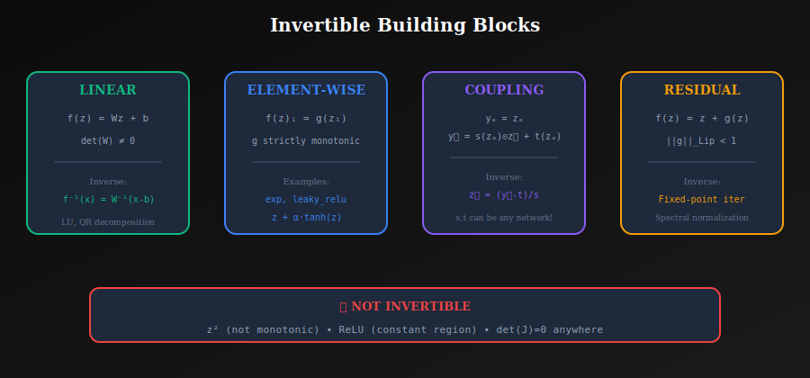

# 🔄 Invertibility in Normalizing Flows

<div align="center">


*The bidirectional constraint that makes normalizing flows both powerful and challenging to design*

</div>

---

## 📖 Introduction

**Invertibility** is a fundamental requirement for normalizing flows. The transformation must be **bijective** (one-to-one and onto) to properly transform probability distributions. This enables both:
- **Sampling**: \( z \to x \) (generate data from noise)
- **Density Evaluation**: \( x \to z \) (compute likelihood of data)

This document covers the theory, practical considerations, and design patterns for building invertible neural networks.

---

## 🎯 Where and Why Use This?

### 🏭 Critical for Flow Operations

| Operation | Requires | Why |
|-----------|----------|-----|
| **Training** | Inverse \( f^{-1} \) | Map data to latent for likelihood |
| **Sampling** | Forward \( f \) | Transform noise to data |
| **Interpolation** | Both | Encode → interpolate → decode |
| **Likelihood** | Inverse + Jacobian | Full change of variables |
| **Compression** | Both | Encode and decode |

### 💡 Why Master This Concept?

1. **Architecture Constraints**: Know what transformations are valid
2. **Stability Issues**: Understand numerical pitfalls
3. **Custom Layers**: Design new invertible operations
4. **Debugging**: Diagnose invertibility failures

---

## 📊 Representation Comparison

| Representation | Pros | Cons |
|----------------|------|------|
| **Analytic Inverse** | Exact, fast | Limited architectures |
| **Fixed-Point Iteration** | General ResNets | May not converge |
| **Newton's Method** | Fast convergence | Requires Jacobian |
| **Autoregressive Inverse** | Always exists | Sequential O(d) |
| **Coupling Inverse** | Parallel, exact | Half dimensions masked |

---

## 🧮 Why Invertibility Matters

### 1.1 For Density Estimation

To compute \( p_x(x) \), we need:

| Step | Operation | Requirement |
|------|-----------|-------------|
| **1** | Compute \( z = f^{-1}(x) \) | ✅ **Requires invertibility!** |
| **2** | Evaluate \( p_z(z) \) | Base distribution |
| **3** | Compute Jacobian | Differentiable transform |

Without invertibility, **step 1 is impossible**.

### 1.2 For Sampling

To generate samples:

| Step | Operation | Direction |
|------|-----------|-----------|
| **1** | Sample \( z \sim p_z(z) \) | From base distribution |
| **2** | Compute \( x = f(z) \) | Forward pass |

Need both directions: \( f \) (sampling) and \( f^{-1} \) (density evaluation).

### 1.3 For Training

Training requires gradients through the inverse:

$$\nabla_\theta \log p_\theta(x) = \nabla_\theta \left[\log p_z(f^{-1}_\theta(x)) - \log|\det J_\theta|\right]$$

Need to compute \( f^{-1} \) and its Jacobian for every training sample.

---

## 📐 Mathematical Requirements

### 2.1 Bijection

A function \( f: \mathbb{R}^d \to \mathbb{R}^d \) is a **bijection** if:

| Property | Definition | Intuition |
|----------|------------|-----------|
| **Injective** (one-to-one) | \( f(z_1) = f(z_2) \Rightarrow z_1 = z_2 \) | No two inputs map to same output |
| **Surjective** (onto) | For every \( x \), exists \( z \) with \( f(z) = x \) | Every output is reachable |

### 2.2 Diffeomorphism

For flows, we need a **diffeomorphism**:
- ✅ Bijective
- ✅ Continuously differentiable
- ✅ Inverse is continuously differentiable

This ensures Jacobian exists and is well-behaved.

### 2.3 Non-Singular Jacobian

$$\det(J) \neq 0 \text{ everywhere}$$

If \( \det(J) = 0 \) at any point, the function is **locally non-invertible** (collapses dimensions).

---

## 🏗️ Invertible Building Blocks

<p align="center">
  
</p>

### 3.1 Linear Transformations

\( f(z) = Wz + b \) is invertible iff \( \det(W) \neq 0 \).

**Inverse**: \( f^{-1}(x) = W^{-1}(x - b) \)

**Parameterization options**:
| Method | Pros | Cons |
|--------|------|------|
| Direct \( W \) | Simple | Hard to ensure invertible |
| LU decomposition | Efficient inverse | More parameters |
| QR decomposition | Orthogonal + scale | Moderate complexity |
| Orthogonal + diag | Volume preserving | Limited expressiveness |

### 3.2 Element-wise Transformations

\( f(z)_i = g(z_i) \) where \( g: \mathbb{R} \to \mathbb{R} \) is **strictly monotonic**.

**Invertible Examples**:
```python
# ✅ Always increasing
g(z) = exp(z)
g(z) = leaky_relu(z, negative_slope=0.01)  
g(z) = z + α * tanh(z)  # if α > -1

# ❌ NOT invertible
g(z) = z²           # Not monotonic
g(z) = relu(z)      # Constant region (0 for z < 0)
g(z) = tanh(z)      # Bounded output (not surjective to ℝ)
```

### 3.3 Coupling Layers

By construction, coupling layers are **always invertible**:

```python
# Forward
y_a = z_a                              # Identity (trivially invertible)
y_b = s(z_a) * z_b + t(z_a)           # Affine given z_a

# Inverse  
z_a = y_a                              # Identity
z_b = (y_b - t(y_a)) / s(y_a)         # Solve for z_b
```

**Key insight**: \( z_a \) passes through unchanged, providing context for inverting \( z_b \).

### 3.4 Autoregressive Transforms

$$x_i = \tau(z_i; \theta_i(x_{1:i-1}))$$

where \( \tau(\cdot; \theta) \) is invertible for any \( \theta \).

**Inverse** (sequential):
$$z_i = \tau^{-1}(x_i; \theta_i(x_{1:i-1}))$$

---

## ⚙️ Ensuring Invertibility

### 4.1 Monotonic Networks

For 1D transforms \( \tau: \mathbb{R} \to \mathbb{R} \):

**Requirement**: \( \tau'(z) > 0 \) for all \( z \)

```python
class MonotonicMLP(nn.Module):
    """Network with guaranteed positive output (for scale)."""
    
    def __init__(self, input_dim, hidden_dim, output_dim):
        super().__init__()
        self.net = nn.Sequential(
            nn.Linear(input_dim, hidden_dim),
            nn.Softplus(),  # Smooth, always positive derivative
            nn.Linear(hidden_dim, hidden_dim),
            nn.Softplus(),
            nn.Linear(hidden_dim, output_dim),
        )
    
    def forward(self, x):
        return self.net(x)
```

### 4.2 Spline Transformations

Monotonic splines are invertible **by construction**:
- Rational quadratic splines
- Piecewise linear splines

**Properties**:
- Specify knot locations and derivatives
- Automatically monotonic if slopes > 0
- **Analytically invertible**

```python
def rational_quadratic_spline(x, widths, heights, derivatives):
    """
    Monotonic spline transformation.
    - widths: bin widths (must be positive)
    - heights: bin heights (must be positive)  
    - derivatives: slopes at knots (must be positive)
    """
    # ... implementation ensures monotonicity
```

### 4.3 Residual Connections with Constraints

\( f(z) = z + g(z) \) is invertible if \( \|g\|_{\text{Lip}} < 1 \).

**Spectral Normalization**: Constrain Lipschitz constant of \( g \).

```python
class InvertibleResidual(nn.Module):
    """Residual block with Lipschitz constraint."""
    
    def __init__(self, dim, lip_const=0.9):
        super().__init__()
        self.net = nn.Sequential(
            spectral_norm(nn.Linear(dim, dim)),
            nn.ReLU(),
            spectral_norm(nn.Linear(dim, dim)),
        )
        self.lip_const = lip_const
    
    def forward(self, z):
        return z + self.lip_const * self.net(z)
    
    def inverse(self, x, num_iter=100):
        """Fixed-point iteration to find z."""
        z = x  # Initial guess
        for _ in range(num_iter):
            z = x - self.lip_const * self.net(z)
        return z
```

---

## 🔧 Computing Inverses

### 5.1 Analytical Inverse (Best)

**Best case**: Closed-form inverse exists.

| Transform | Inverse |
|-----------|---------|
| Affine: \( y = az + b \) | \( z = (y - b) / a \) |
| Coupling | Direct formula |
| Exp: \( y = e^z \) | \( z = \log(y) \) |

### 5.2 Fixed-Point Iteration

For \( f(z) = z + g(z) \) with \( \|g\|_{\text{Lip}} < 1 \):

$$z^{(t+1)} = x - g(z^{(t)})$$

Converges to \( z = f^{-1}(x) \).

**Convergence rate**: Linear, depends on Lipschitz constant.

```python
def fixed_point_inverse(f_residual, x, num_iters=100, tol=1e-6):
    """Invert f(z) = z + g(z) via fixed-point iteration."""
    z = x.clone()
    for i in range(num_iters):
        z_new = x - f_residual(z)
        if (z_new - z).abs().max() < tol:
            break
        z = z_new
    return z
```

### 5.3 Newton's Method

For complex transforms:

$$z^{(t+1)} = z^{(t)} - J^{-1}(f(z^{(t)}) - x)$$

**Issues**:
- Requires Jacobian inverse (expensive)
- May not converge
- Computationally expensive

---

## ⚠️ Common Pitfalls and Solutions

### 6.1 Numerical Instability

**Problem**: Division by small numbers in inverse.

```python
# ❌ Bad: Can divide by zero
def inverse(self, y):
    s = self.compute_scale(y_a)
    z_b = (y_b - t) / s  # s could be ~0!

# ✅ Good: Clamp scale
def inverse(self, y):
    s = self.compute_scale(y_a)
    s = torch.clamp(s, min=1e-5)  # Prevent tiny values
    z_b = (y_b - t) / s
```

### 6.2 Scale Collapse

**Problem**: Scale parameters converge to zero during training.

**Solutions**:
```python
# 1. Initialize scale to 1 (zero in log-space)
self.log_scale = nn.Parameter(torch.zeros(dim))

# 2. Bounded scale (tanh)
s = torch.tanh(s_raw) * scale_bound

# 3. Regularization
loss = nll + lambda_reg * scale.abs().mean()
```

### 6.3 Overflow/Underflow

**Problem**: Very large/small values after many layers.

**Solutions**:
- Batch normalization / ActNorm
- Careful initialization
- Gradient clipping

```python
class ActNorm(nn.Module):
    """Data-dependent initialization for stability."""
    
    def __init__(self, dim):
        super().__init__()
        self.scale = nn.Parameter(torch.ones(dim))
        self.bias = nn.Parameter(torch.zeros(dim))
        self.initialized = False
    
    def initialize(self, x):
        with torch.no_grad():
            self.bias.data = -x.mean(dim=0)
            self.scale.data = 1 / (x.std(dim=0) + 1e-6)
        self.initialized = True
```

---

## ✅ Verifying Invertibility

```python
def verify_invertibility(flow, dim, num_samples=1000, tol=1e-5):
    """Empirically verify flow is invertible."""
    z = torch.randn(num_samples, dim)
    
    # Forward then inverse
    x, _ = flow.forward(z)
    z_reconstructed, _ = flow.inverse(x)
    
    # Check reconstruction error
    error = (z - z_reconstructed).abs().max().item()
    
    print(f"Max reconstruction error: {error:.2e}")
    assert error < tol, f"Invertibility check failed! Error: {error}"
    print("✅ Invertibility verified!")
```

---

## 📝 Key Requirements Summary

| Requirement | Purpose | How to Ensure |
|-------------|---------|---------------|
| **Bijective** | Unique inverse | Design choice |
| **Differentiable** | Jacobian exists | Smooth activations |
| **Non-singular** | det(J) ≠ 0 | Constrain parameters |
| **Efficient inverse** | Fast density eval | Analytical formulas |

---

## 📚 References

1. **Papamakarios, G., et al.** (2021). *"Normalizing Flows for Probabilistic Modeling and Inference."* JMLR.
2. **Behrmann, J., et al.** (2019). *"Invertible Residual Networks."* ICML. [arXiv:1811.00995](https://arxiv.org/abs/1811.00995)
3. **Durkan, C., et al.** (2019). *"Neural Spline Flows."* NeurIPS. [arXiv:1906.04032](https://arxiv.org/abs/1906.04032)

---

## ✏️ Exercises

1. **Prove** that \( f(z) = z + \alpha \tanh(z) \) is invertible for \( \alpha > -1 \).

2. **Implement** fixed-point iteration for inverting a residual flow.

3. **Show** that ReLU-based flows are not invertible.

4. **Design** an invertible layer using only matrix operations.

5. **Verify** invertibility empirically: check \( f^{-1}(f(z)) \approx z \) for random inputs.

---

<div align="center">

**[← Jacobian Determinant](../02_jacobian_determinant/)** | **[Next: Planar & Radial Flows →](../../02_planar_and_radial_flows/)**

</div>
