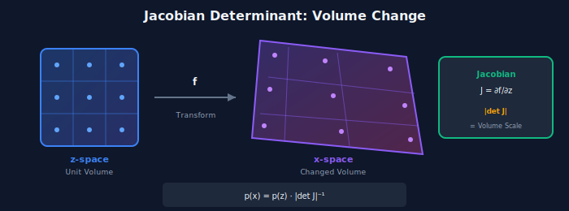
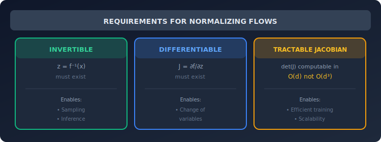
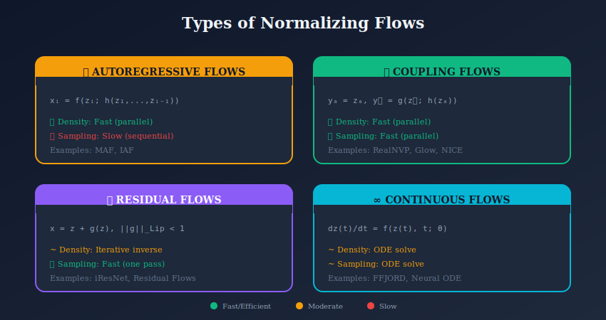

# 🔬 Normalizing Flow Fundamentals

<div align="center">


*Understanding the mathematical bedrock upon which all flow models are built*

</div>

---

## 📖 Introduction

Normalizing flows are a class of generative models that transform a simple base distribution (e.g., Gaussian) into a complex data distribution through a sequence of **invertible transformations**. Unlike VAEs and GANs, flows provide **exact likelihood computation** and **efficient sampling**.

This section covers the three fundamental pillars:
1. **Change of Variables** — How probability density transforms
2. **Jacobian Determinant** — Measuring volume changes
3. **Invertibility** — Ensuring bidirectional mapping

---

## 🎯 Where and Why Use Flow Fundamentals?

### 🏭 Industry Applications

| Domain | Application | Why Flows? |
|--------|-------------|------------|
| **🏥 Healthcare** | Medical image analysis, drug discovery | Exact likelihood for uncertainty quantification |
| **💰 Finance** | Risk modeling, option pricing | Density estimation with tractable inference |
| **🤖 Robotics** | Motion planning, sensor fusion | Invertible inference for real-time processing |
| **🎮 Gaming** | Procedural content generation | Fast sampling for real-time generation |
| **🔬 Science** | Molecular simulations, physics | Modeling complex physical distributions |

### 💡 Why Master These Fundamentals?

1. **Foundation for Advanced Models**: RealNVP, Glow, and Neural Spline Flows all build on these concepts
2. **Debugging Skills**: Understanding the math helps diagnose training issues
3. **Architecture Design**: Knowing constraints enables creative flow designs
4. **Cross-Domain Transfer**: Fundamentals apply to variational inference, density estimation, and more

---

## 📊 Representation Comparison

| Representation | Pros | Cons |
|----------------|------|------|
| **Autoregressive** | Flexible, exact likelihood | Sequential, slow sampling |
| **Coupling** | Parallel, efficient | Less expressive per layer |
| **Residual** | Free-form Jacobian | Approximate determinant |
| **Continuous (ODE)** | Infinite depth | Expensive to train |
| **Discrete (VAE)** | Handles discrete | Approximate inference |

---

## 🧮 Core Mathematical Framework

### 1.1 The Change of Variables Formula

Given an invertible transformation \( f: \mathbb{R}^d \to \mathbb{R}^d \):

If \( z \sim p_z(z) \) and \( x = f(z) \), then:

$$\boxed{p_x(x) = p_z(f^{-1}(x)) \left|\det\left(\frac{\partial f^{-1}}{\partial x}\right)\right|}$$

**Equivalent log-form** (preferred for numerical stability):

$$\boxed{\log p_x(x) = \log p_z(z) - \log\left|\det\left(\frac{\partial f}{\partial z}\right)\right|}$$

### 1.2 Intuitive Understanding

<p align="center">
  
</p>

Think of the transformation as **stretching and compressing** space:

| Scenario | Volume Change | Density Effect |
|----------|---------------|----------------|
| \( \|\det(J)\| > 1 \) | Expansion | Density **decreases** |
| \( \|\det(J)\| < 1 \) | Contraction | Density **increases** |
| \( \|\det(J)\| = 1 \) | Preserved | Density **unchanged** |

> 💡 **Key Insight**: Total probability mass is always conserved—what changes is how it's distributed in space.

### 1.3 Flow Composition

For a sequence of transformations \( f = f_K \circ f_{K-1} \circ \cdots \circ f_1 \):

$$\log p_x(x) = \log p_z(z_0) - \sum_{k=1}^{K} \log\left|\det\left(\frac{\partial f_k}{\partial z_{k-1}}\right)\right|$$

where \( z_0 = z \), \( z_k = f_k(z_{k-1}) \), and \( x = z_K \).

---

## 📋 Requirements for Valid Flows

### The Three Pillars

<p align="center">
  
</p>

### Design Trade-offs

| Aspect | Challenge | Solution |
|--------|-----------|----------|
| **Expressiveness** | Simple Jacobians limit flexibility | Stack many layers |
| **Efficiency** | Full Jacobian is \( O(d^3) \) | Triangular/structured designs |
| **Invertibility** | Must constrain architecture | Coupling layers, residual flows |

---

## 📊 Types of Normalizing Flows

<p align="center">
  
</p>

### Autoregressive Flows

$$x_i = f(z_i; h_i(z_{<i}))$$

Each output depends on all previous inputs → **triangular Jacobian**.

- ✅ Fast density evaluation (parallel)
- ❌ Slow sampling (sequential)
- 📚 Examples: **MAF**, **IAF**

### Coupling Flows

Split input: \( z = [z_a, z_b] \)

$$x_a = z_a, \quad x_b = g(z_b; h(z_a))$$

- ✅ Fast density evaluation
- ✅ Fast sampling
- 📚 Examples: **RealNVP**, **Glow**, **NICE**

### Residual Flows

$$x = z + g(z) \quad \text{with} \quad \|g\|_{\text{Lip}} < 1$$

- ✅ Flexible architecture
- ⚠️ Requires Lipschitz constraints
- 📚 Examples: **iResNet**, **Residual Flows**

### Continuous Flows (Neural ODEs)

$$\frac{dz(t)}{dt} = f(z(t), t; \theta)$$

- ✅ Infinite depth, memory efficient
- ⚠️ Requires ODE solvers
- 📚 Examples: **FFJORD**, **Neural ODE**

---

## 🎓 Training Normalizing Flows

<p align="center">
  
</p>

### Maximum Likelihood Objective

$$\max_\theta \mathbb{E}_{x \sim p_{\text{data}}}\left[\log p_\theta(x)\right]$$

Expanded form:

$$= \max_\theta \mathbb{E}_x\left[\log p_z(f_\theta^{-1}(x)) + \log\left|\det\left(\frac{\partial f_\theta^{-1}}{\partial x}\right)\right|\right]$$

### Training Algorithm

```python
import torch
import torch.nn as nn

def train_step(flow, base_dist, x, optimizer):
    """Single training step for a normalizing flow."""
    
    # Step 1: Inverse pass (x → z)
    z, log_det = flow.inverse(x)
    
    # Step 2: Evaluate base distribution
    log_pz = base_dist.log_prob(z).sum(dim=-1)
    
    # Step 3: Compute log-likelihood
    log_px = log_pz + log_det
    
    # Step 4: Maximize likelihood (minimize negative)
    loss = -log_px.mean()
    
    # Step 5: Update parameters
    optimizer.zero_grad()
    loss.backward()
    optimizer.step()
    
    return loss.item()
```

### Sampling

```python
def sample(flow, base_dist, num_samples):
    """Generate samples from the learned distribution."""
    
    # Sample from base distribution
    z = base_dist.sample((num_samples,))
    
    # Forward pass (z → x)
    x = flow.forward(z)
    
    return x
```

---

## 📈 Comparison with Other Generative Models

### Flows vs VAEs

| Aspect | Normalizing Flow | VAE |
|--------|-----------------|-----|
| **Likelihood** | ✅ Exact | ⚠️ Lower bound (ELBO) |
| **Latent Dimension** | Same as data | Can be lower |
| **Inference** | ✅ Exact | Approximate |
| **Flexibility** | Limited by invertibility | More flexible |
| **Best For** | Exact density estimation | Representation learning |

### Flows vs GANs

| Aspect | Normalizing Flow | GAN |
|--------|-----------------|-----|
| **Likelihood** | ✅ Exact | ❌ Not available |
| **Mode Coverage** | ✅ Good | ⚠️ May miss modes |
| **Sample Quality** | Good | Often better |
| **Training** | ✅ Stable | Can be unstable |
| **Best For** | Density estimation | Image synthesis |

### Flows vs Diffusion

| Aspect | Normalizing Flow | Diffusion Model |
|--------|-----------------|-----------------|
| **Likelihood** | ✅ Exact | ⚠️ Variational bound |
| **Sampling** | ✅ One pass | ❌ Iterative (slow) |
| **Quality** | Good | State-of-the-art |
| **Training** | Stable | Stable |
| **Best For** | Fast inference | Maximum quality |

---

## 🔬 Mathematical Properties

### Universal Approximation

**Theorem**: With sufficient depth and appropriate architecture, normalizing flows can approximate any continuous probability distribution arbitrarily well.

### Topological Constraints

⚠️ **Important Limitation**: Continuous flows **cannot change topology**:
- Cannot transform connected → disconnected sets
- Challenge for multimodal distributions

**Solutions**:
- Dequantization techniques
- Data augmentation
- Many flow layers
- Discrete/hybrid approaches

### Volume Preservation

If \( |\det(J)| = 1 \) (e.g., orthogonal transformations):
- Volume is preserved
- Limited expressiveness
- Used in some specialized flows

---

## 💻 Practical Considerations

### Base Distribution

**Standard choice**: \( p_z = \mathcal{N}(0, I) \)

**Alternatives**:
- Mixture of Gaussians (for multimodality)
- Learned base distribution
- Uniform distribution (for bounded data)

### Numerical Stability

```python
# ❌ Bad: Direct determinant (can overflow/underflow)
det_J = torch.det(jacobian)

# ✅ Good: Log-determinant (numerically stable)
log_det_J = torch.logdet(jacobian)

# ✅ Even better: For triangular matrices
log_det_J = torch.diagonal(jacobian).abs().log().sum()
```

### Expressiveness vs Efficiency Trade-off

| More Layers | More Complex Transforms |
|-------------|------------------------|
| + More expressive | + More expressive per layer |
| - Slower computation | - Slower per layer |
| - Memory intensive | - May be harder to invert |

---

## 📚 Subtopics

| Topic | Description | Link |
|-------|-------------|------|
| **Change of Variables** | Detailed derivation and examples | [📘 Read More](./01_change_of_variables/) |
| **Jacobian Determinant** | Efficient computation strategies | [📘 Read More](./02_jacobian_determinant/) |
| **Invertibility** | Design patterns for invertible networks | [📘 Read More](./03_invertibility/) |

---

## 📝 Key Equations Summary

| Concept | Formula |
|---------|---------|
| **Change of Variables** | \( p_x(x) = p_z(z) \|\det(J)\|^{-1} \) |
| **Log-Likelihood** | \( \log p_x = \log p_z - \log\|\det(J)\| \) |
| **Composed Flow** | \( \log p_x = \log p_z - \sum_k \log\|\det(J_k)\| \) |
| **Training Objective** | \( \max_\theta \mathbb{E}_x[\log p_\theta(x)] \) |

---

## 📚 References

### Tutorials and Surveys
1. **Papamakarios, G., et al.** (2021). *"Normalizing Flows for Probabilistic Modeling and Inference."* JMLR. [arXiv:1912.02762](https://arxiv.org/abs/1912.02762)
2. **Kobyzev, I., Prince, S., & Brubaker, M.** (2020). *"Normalizing Flows: An Introduction and Review."* TPAMI. [arXiv:1908.09257](https://arxiv.org/abs/1908.09257)

### Foundational Papers
3. **Rezende, D., & Mohamed, S.** (2015). *"Variational Inference with Normalizing Flows."* ICML. [arXiv:1505.05770](https://arxiv.org/abs/1505.05770)
4. **Dinh, L., Krueger, D., & Bengio, Y.** (2015). *"NICE: Non-linear Independent Components Estimation."* ICLR Workshop. [arXiv:1410.8516](https://arxiv.org/abs/1410.8516)

---

## ✏️ Exercises

1. **Derive** the change of variables formula for a 2D transformation.

2. **Compute** the Jacobian determinant for an affine transformation \( f(z) = Az + b \).

3. **Implement** a simple flow with affine coupling layers for 2D data.

4. **Show** that composing \( K \) flows gives log-det as sum of individual log-dets.

5. **Compare** exact likelihood from a flow to ELBO from a VAE on the same data.

---

<div align="center">

**[← Back to Normalizing Flows](../)** | **[Next: Change of Variables →](./01_change_of_variables/)**

</div>
