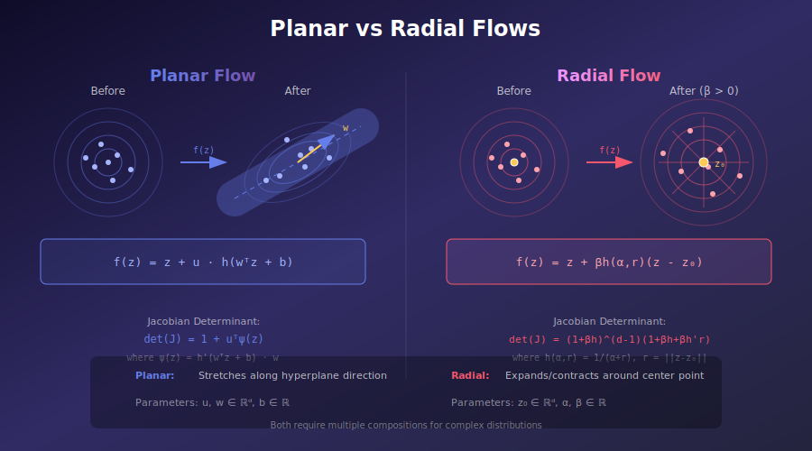
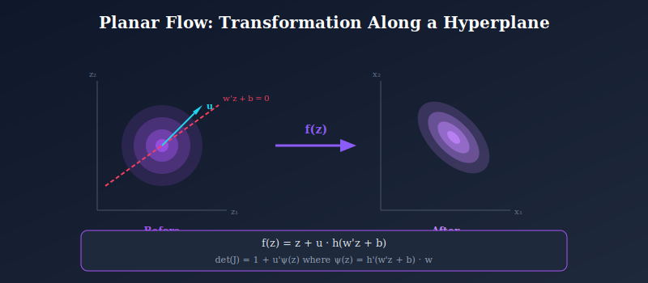
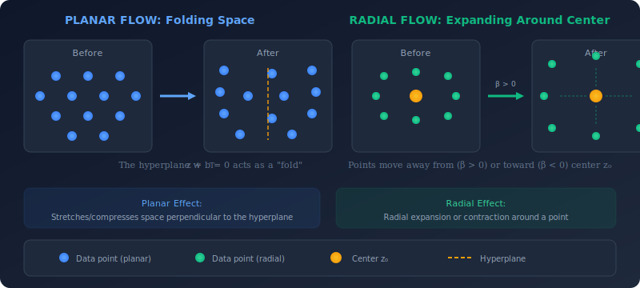

# 🔄 Planar and Radial Flows

<div align="center">


*The simplest flow transformations—building blocks for understanding normalizing flows*

[](#)
[](#)

</div>

---

## 📖 Introduction

**Planar** and **Radial flows** are the foundational flow transformations introduced by Rezende & Mohamed (2015). While not used in production systems, they provide essential intuition for understanding how normalizing flows work.

<p align="center">
  
</p>

---

## 🎯 Where & Why Use Planar/Radial Flows?

<table>
<tr>
<th width="25%">Application</th>
<th width="35%">Why These Flows</th>
<th width="40%">Limitations</th>
</tr>
<tr>
<td><b>📚 Learning</b></td>
<td>Simple math, easy to visualize</td>
<td>Not used in production</td>
</tr>
<tr>
<td><b>🔬 VAE Posterior</b></td>
<td>Improve mean-field approximation</td>
<td>Need many layers for expressiveness</td>
</tr>
<tr>
<td><b>📊 2D Toy Data</b></td>
<td>Perfect for understanding concepts</td>
<td>Don't scale to high dimensions</td>
</tr>
<tr>
<td><b>🧪 Research Prototyping</b></td>
<td>Quick experiments</td>
<td>Better alternatives exist (RealNVP)</td>
</tr>
</table>

### When to Use

✅ **Good for:**
- Learning normalizing flows concepts
- Variational inference with simple posteriors
- Understanding Jacobian determinants

❌ **Not recommended for:**
- High-dimensional image generation
- Complex multimodal distributions
- Production systems

---

## 📊 Representation Comparison

| Representation | Pros | Cons |
|----------------|------|------|
| **Planar Flow** | Simple, interpretable | Limited capacity |
| **Radial Flow** | Radial symmetry | Single mode focus |
| **Sylvester Flow** | More expressive | More parameters |
| **Householder** | Orthogonal, stable | Limited flexibility |
| **Composed Planar** | Stack for power | Still limited |

---

## 📚 Mathematical Framework

<p align="center">
  
</p>

### 1. Planar Flows

**Definition:**

$$f(z) = z + u \cdot h(w^T z + b)$$

where:
- $u, w \in \mathbb{R}^d$: Learnable direction vectors
- $b \in \mathbb{R}$: Learnable bias
- $h$: Smooth nonlinearity (typically $\tanh$)

**Jacobian:**

$$\frac{\partial f}{\partial z} = I + u \cdot h'(w^T z + b) \cdot w^T$$

**Determinant** (via matrix determinant lemma):

$$\det\left(\frac{\partial f}{\partial z}\right) = 1 + u^T \psi(z)$$

where $\psi(z) = h'(w^T z + b) \cdot w$.

**Log-determinant:**

$$\log|\det(J)| = \log|1 + u^T \psi(z)|$$

### 2. Radial Flows

**Definition:**

$$f(z) = z + \beta h(\alpha, r)(z - z_0)$$

where:
- $z_0 \in \mathbb{R}^d$: Center point
- $\alpha > 0$: Smoothness parameter
- $\beta$: Scaling parameter
- $r = \|z - z_0\|$: Distance from center
- $h(\alpha, r) = \frac{1}{\alpha + r}$

**Jacobian Determinant:**

$$\det(J) = \left(1 + \beta h\right)^{d-1} \left(1 + \beta h + \beta h' r\right)$$

where $h' = -\frac{1}{(\alpha + r)^2}$.

---

## 💡 Geometric Intuition

<p align="center">
  
</p>

---

## 🔧 Implementation

### Planar Flow

```python
class PlanarFlow(nn.Module):
    """Planar flow: z + u * tanh(w^T z + b)"""
    
    def __init__(self, dim):
        super().__init__()
        self.u = nn.Parameter(torch.randn(dim) * 0.01)
        self.w = nn.Parameter(torch.randn(dim) * 0.01)
        self.b = nn.Parameter(torch.zeros(1))
    
    def forward(self, z):
        # Ensure invertibility
        u_hat = self._get_u_hat()
        
        # Compute transformation
        linear = z @ self.w + self.b  # [batch_size]
        f_z = z + u_hat * torch.tanh(linear).unsqueeze(-1)
        
        # Compute log determinant
        psi = (1 - torch.tanh(linear)**2).unsqueeze(-1) * self.w
        log_det = torch.log(torch.abs(1 + psi @ u_hat) + 1e-8)
        
        return f_z, log_det
    
    def _get_u_hat(self):
        """Enforce invertibility constraint: u^T w >= -1"""
        wu = self.w @ self.u
        m_wu = -1 + F.softplus(wu)  # m(x) = -1 + log(1 + e^x)
        u_hat = self.u + (m_wu - wu) * self.w / (self.w @ self.w + 1e-8)
        return u_hat


class RadialFlow(nn.Module):
    """Radial flow: z + β * h(α, r) * (z - z₀)"""
    
    def __init__(self, dim):
        super().__init__()
        self.z0 = nn.Parameter(torch.randn(dim) * 0.1)
        self.log_alpha = nn.Parameter(torch.zeros(1))
        self.beta = nn.Parameter(torch.zeros(1))
        self.dim = dim
    
    def forward(self, z):
        alpha = torch.exp(self.log_alpha)
        # Ensure β >= -α for invertibility
        beta = -alpha + F.softplus(self.beta)
        
        diff = z - self.z0
        r = torch.norm(diff, dim=-1, keepdim=True)
        h = 1 / (alpha + r)
        h_prime = -1 / (alpha + r)**2
        
        # Forward transformation
        f_z = z + beta * h * diff
        
        # Log determinant
        log_det = (self.dim - 1) * torch.log(torch.abs(1 + beta * h) + 1e-8)
        log_det = log_det + torch.log(torch.abs(1 + beta * h + beta * h_prime * r) + 1e-8)
        
        return f_z, log_det.squeeze(-1)
```

### Composing Multiple Flows

```python
class FlowSequence(nn.Module):
    """Compose K flow transformations."""
    
    def __init__(self, flows):
        super().__init__()
        self.flows = nn.ModuleList(flows)
    
    def forward(self, z):
        log_det_total = 0
        
        for flow in self.flows:
            z, log_det = flow(z)
            log_det_total = log_det_total + log_det
        
        return z, log_det_total
    
    def log_prob(self, x):
        """Compute log p(x) using change of variables."""
        z = x
        log_det_total = 0
        
        # Run flows in reverse for density estimation
        for flow in reversed(self.flows):
            z, log_det = flow.inverse(z)
            log_det_total = log_det_total + log_det
        
        # Base distribution (standard Gaussian)
        log_pz = -0.5 * (z**2 + np.log(2*np.pi)).sum(dim=-1)
        
        return log_pz + log_det_total


# Example: Stack 10 planar flows
flows = [PlanarFlow(dim=2) for _ in range(10)]
model = FlowSequence(flows)
```

---

## 📊 Training

### Maximum Likelihood

```python
def train_flow(model, dataloader, optimizer, epochs):
    """Train normalizing flow with MLE."""
    
    for epoch in range(epochs):
        total_loss = 0
        
        for x in dataloader:
            optimizer.zero_grad()
            
            # Compute log probability
            log_px = model.log_prob(x)
            
            # Negative log-likelihood
            loss = -log_px.mean()
            
            loss.backward()
            optimizer.step()
            
            total_loss += loss.item()
        
        print(f"Epoch {epoch}: Loss = {total_loss/len(dataloader):.4f}")
```

### For VAE Posterior

```python
class FlowVAE(nn.Module):
    """VAE with flow-based posterior."""
    
    def __init__(self, encoder, decoder, flow):
        super().__init__()
        self.encoder = encoder
        self.decoder = decoder
        self.flow = flow
    
    def forward(self, x):
        # Encode to get base posterior parameters
        mu, log_var = self.encoder(x)
        
        # Sample from base posterior
        std = torch.exp(0.5 * log_var)
        z0 = mu + std * torch.randn_like(std)
        
        # Apply flow transformations
        zK, log_det = self.flow(z0)
        
        # Decode
        x_recon = self.decoder(zK)
        
        # ELBO with flow correction
        recon_loss = F.mse_loss(x_recon, x, reduction='sum')
        kl_loss = -0.5 * (1 + log_var - mu**2 - log_var.exp()).sum()
        flow_correction = -log_det.sum()
        
        elbo = recon_loss + kl_loss + flow_correction
        
        return elbo, x_recon
```

---

## 📈 Expressiveness Analysis

### Single Flow Limitations

| Flow Type | What It Can Do | What It Can't |
|-----------|---------------|---------------|
| **Planar** | Stretch/compress along one direction | Create multiple modes |
| **Radial** | Expand/contract around one point | Create elongated structures |

### With Composition

Number of flows needed for target distributions:

| Distribution | Planar Flows | Radial Flows |
|-------------|--------------|--------------|
| Rotated Gaussian | ~2 | ~3 |
| Bimodal | ~8-10 | ~10-15 |
| Ring | ~15+ | ~8 |
| Complex multimodal | Many (impractical) | Many (impractical) |

---

## 🔬 Key Equations Summary

| Concept | Planar | Radial |
|---------|--------|--------|
| **Transform** | $z + u \cdot h(w^T z + b)$ | $z + \beta h(r)(z - z_0)$ |
| **Log-det** | $\log|1 + u^T \psi|$ | $(d-1)\log|1+\beta h| + \log|1+\beta h+\beta h'r|$ |
| **Parameters** | $u, w \in \mathbb{R}^d$, $b \in \mathbb{R}$ | $z_0 \in \mathbb{R}^d$, $\alpha, \beta \in \mathbb{R}$ |
| **Constraint** | $u^T w \geq -1$ | $\beta \geq -\alpha$ |

---

## 📚 References

1. **Rezende, D. J., & Mohamed, S.** (2015). "Variational Inference with Normalizing Flows." *ICML*. [arXiv:1505.05770](https://arxiv.org/abs/1505.05770)

2. **Kingma, D. P., et al.** (2016). "Improved Variational Inference with Inverse Autoregressive Flow." *NeurIPS*. [arXiv:1606.04934](https://arxiv.org/abs/1606.04934)

---

## ✏️ Exercises

1. **Derive** the Jacobian determinant formula for planar flows using the matrix determinant lemma.

2. **Implement** planar flows and visualize how they transform a 2D Gaussian step by step.

3. **Show** that a single planar flow cannot transform a unimodal distribution into a bimodal one.

4. **Compare** the number of parameters and expressiveness of 10 planar flows vs 1 RealNVP coupling layer.

5. **Prove** the invertibility condition $u^T w \geq -1$ for $h = \tanh$.

---

<div align="center">

**[← Flow Fundamentals](../01_flow_fundamentals/)** | **[Next: Coupling Layers →](../03_coupling_layers/)**

</div>
