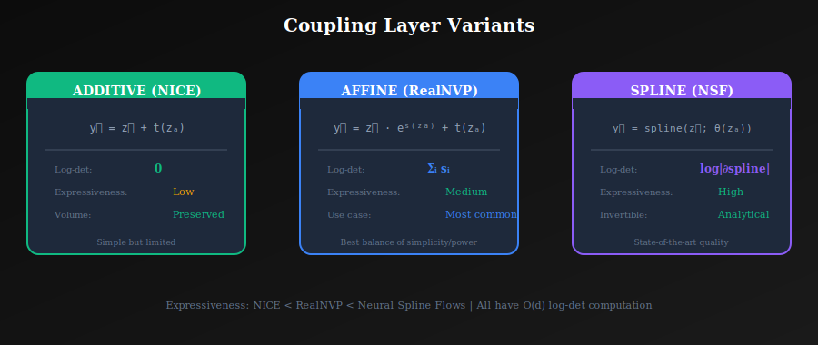
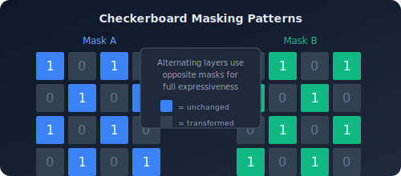
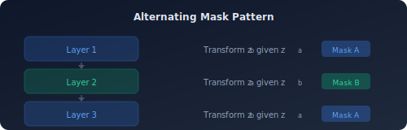
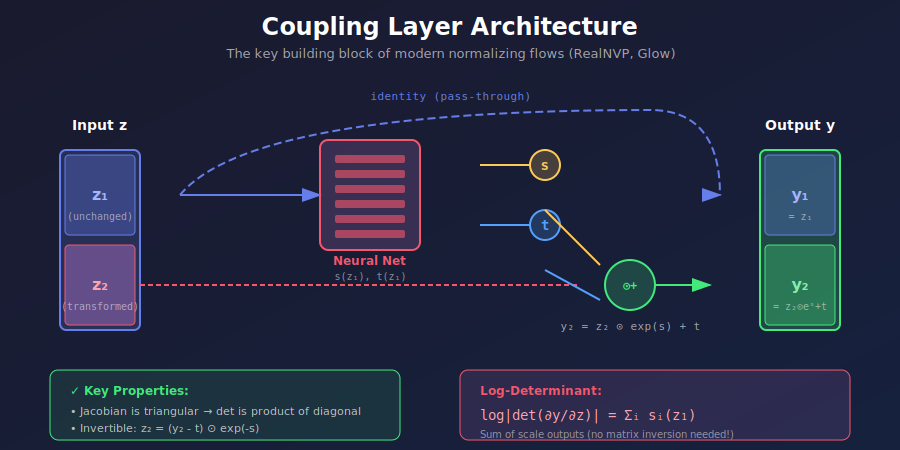

# 🔗 Coupling Layers

<div align="center">


*The elegant building block that made normalizing flows practical for high-dimensional data*

</div>

---

## 📖 Introduction

**Coupling layers** are the foundational building block of modern normalizing flows. They achieve the seemingly impossible: **arbitrarily complex transformations** with **tractable Jacobian determinants** and **analytical inverses**.

The key insight: split the input, keep half unchanged, transform the other half conditioned on the unchanged part.

---

## 🎯 Where and Why Use Coupling Layers?

### 🏭 Applications

| Domain | Application | Why Coupling? |
|--------|-------------|---------------|
| **🎨 Image Generation** | RealNVP, Glow | Scale to megapixel images |
| **🔊 Audio Synthesis** | WaveGlow | Real-time speech generation |
| **🧬 Molecular Modeling** | Boltzmann generators | Sample molecular conformations |
| **📊 Density Estimation** | General purpose | Exact likelihood computation |
| **🤖 Reinforcement Learning** | Policy networks | Tractable action distributions |
| **🔬 Scientific Computing** | Simulation surrogates | Model complex physics |

### 💡 Why Coupling Layers Dominate

| Advantage | Explanation |
|-----------|-------------|
| **O(d) Jacobian** | Triangular structure → product of diagonals |
| **Analytical Inverse** | Direct formula, no iteration needed |
| **Arbitrary Networks** | s(·), t(·) can be any neural network |
| **Parallel Computation** | Both directions are parallel |
| **Scalability** | Works for images, audio, 3D data |

---

## 📊 Representation Comparison

| Representation | Pros | Cons |
|----------------|------|------|
| **Additive** | Simple, stable | Less expressive |
| **Affine** | Scale + shift | May have numerical issues |
| **Spline** | Highly flexible | More computation |
| **Piecewise Linear** | Fast, expressive | Non-smooth |
| **Neural Spline** | SOTA density estimation | Complex implementation |

---

## 🧮 The Coupling Framework

<p align="center">
  
</p>

### 1.1 Basic Principle

Split input \( z = [z_a, z_b] \) into two parts:
- \( z_a \): **unchanged** (or simply transformed)
- \( z_b \): **transformed** conditioned on \( z_a \)

**Forward**:
$$y_a = z_a$$
$$y_b = \tau(z_b; \theta(z_a))$$

where \( \tau \) is an invertible transform and \( \theta(\cdot) \) is a neural network.

### 1.2 Why the Jacobian is Triangular

$$J = \frac{\partial y}{\partial z} = \begin{bmatrix} \frac{\partial y_a}{\partial z_a} & \frac{\partial y_a}{\partial z_b} \\ \frac{\partial y_b}{\partial z_a} & \frac{\partial y_b}{\partial z_b} \end{bmatrix} = \begin{bmatrix} I & 0 \\ * & \frac{\partial \tau}{\partial z_b} \end{bmatrix}$$

**Key insight**: The upper-right block is **zero** because \( y_a \) doesn't depend on \( z_b \)!

### 1.3 Determinant Computation

$$\det(J) = \det(I) \cdot \det\left(\frac{\partial \tau}{\partial z_b}\right) = \det\left(\frac{\partial \tau}{\partial z_b}\right)$$

The complex off-diagonal block \( \frac{\partial y_b}{\partial z_a} \) **doesn't affect the determinant**!

---

## 📊 Coupling Types

### 2.1 Additive Coupling (NICE)

$$y_b = z_b + t(z_a)$$

**Properties**:
- \( \det(J) = 1 \) (volume preserving)
- No log-det computation needed
- Limited expressiveness

```python
class AdditiveCoupling(nn.Module):
    def forward(self, z, mask):
        z_a, z_b = z * mask, z * (1 - mask)
        t = self.net(z_a)
        y_b = z_b + t * (1 - mask)
        return z_a + y_b, 0  # log_det = 0
```

### 2.2 Affine Coupling (RealNVP) ⭐

$$y_b = z_b \odot \exp(s(z_a)) + t(z_a)$$

**Properties**:
- \( \det(J) = \exp(\sum_i s_i) \)
- More expressive than additive
- Most widely used variant

```python
class AffineCoupling(nn.Module):
    def __init__(self, dim, hidden_dim=256):
        super().__init__()
        half_dim = dim // 2
        self.net = nn.Sequential(
            nn.Linear(half_dim, hidden_dim),
            nn.ReLU(),
            nn.Linear(hidden_dim, hidden_dim),
            nn.ReLU(),
            nn.Linear(hidden_dim, dim),  # Output: [s, t]
        )
        # Zero initialization for identity start
        self.net[-1].weight.data.zero_()
        self.net[-1].bias.data.zero_()
    
    def forward(self, z, reverse=False):
        z_a, z_b = z.chunk(2, dim=-1)
        
        st = self.net(z_a)
        s, t = st.chunk(2, dim=-1)
        s = torch.tanh(s) * 2  # Bounded scale
        
        if not reverse:
            y_b = z_b * torch.exp(s) + t
            log_det = s.sum(dim=-1)
            return torch.cat([z_a, y_b], dim=-1), log_det
        else:
            z_b = (z_b - t) * torch.exp(-s)
            return torch.cat([z_a, z_b], dim=-1)
```

### 2.3 Spline Coupling (Neural Spline Flows) ⭐⭐

$$y_b = \text{RationalQuadraticSpline}(z_b; \theta(z_a))$$

**Properties**:
- Highly flexible monotonic transforms
- Exactly invertible (closed form)
- State-of-the-art expressiveness

```python
class SplineCoupling(nn.Module):
    """Rational quadratic spline coupling."""
    
    def __init__(self, dim, num_bins=8):
        super().__init__()
        self.num_bins = num_bins
        # Network outputs: widths, heights, derivatives
        self.net = nn.Sequential(
            nn.Linear(dim // 2, 256),
            nn.ReLU(),
            nn.Linear(256, (dim // 2) * (3 * num_bins - 1))
        )
    
    def forward(self, z, reverse=False):
        z_a, z_b = z.chunk(2, dim=-1)
        
        # Get spline parameters
        params = self.net(z_a)
        widths, heights, derivatives = self._split_params(params)
        
        if not reverse:
            y_b, log_det = rational_quadratic_spline(
                z_b, widths, heights, derivatives
            )
            return torch.cat([z_a, y_b], dim=-1), log_det.sum(-1)
        else:
            z_b = inverse_rational_quadratic_spline(
                z_b, widths, heights, derivatives
            )
            return torch.cat([z_a, z_b], dim=-1)
```

---

## 🎭 Masking Strategies

### 3.1 Channel-wise Masking

Split along channel dimension:
```python
z_a = z[:, :d//2]
z_b = z[:, d//2:]
```

**Pros**: Simple, efficient
**Cons**: Limited interaction between halves

### 3.2 Checkerboard Masking (for Images)

Alternate pixels in checkerboard pattern:

<p align="center">
  
</p>

```python
def checkerboard_mask(height, width, device, reverse=False):
    """Create checkerboard mask for images."""
    y = torch.arange(height, device=device).view(-1, 1)
    x = torch.arange(width, device=device).view(1, -1)
    mask = ((x + y) % 2).float()
    if reverse:
        mask = 1 - mask
    return mask.view(1, 1, height, width)
```

### 3.3 Squeeze + Channel-wise

1. **Squeeze** spatial to channels: \( H \times W \times C \to \frac{H}{2} \times \frac{W}{2} \times 4C \)
2. **Split** channels: first \( 2C \) vs last \( 2C \)

```python
def squeeze(x):
    """H×W×C → H/2×W/2×4C"""
    B, C, H, W = x.shape
    x = x.view(B, C, H//2, 2, W//2, 2)
    x = x.permute(0, 1, 3, 5, 2, 4).contiguous()
    return x.view(B, C*4, H//2, W//2)
```

---

## 🔄 Alternating Masks

Critical insight: **alternate which half is transformed**!

<p align="center">
  
</p>

Without alternation, some dimensions **never interact**:

```python
class Flow(nn.Module):
    def __init__(self, dim, num_layers):
        super().__init__()
        self.layers = nn.ModuleList([
            AffineCoupling(dim, flip=(i % 2 == 1))
            for i in range(num_layers)
        ])
```

---

## 🏗️ Coupling Network Design

### 4.1 Architecture Choices

The network \( \theta(z_a) \) can be **anything**:

| Data Type | Network Architecture |
|-----------|---------------------|
| Vectors | MLPs |
| Images | CNNs, ResNets |
| Sequences | Attention, Transformers |
| Graphs | GNNs |

### 4.2 Output Parameterization

**Scale output** (for affine coupling):
```python
# Option 1: Bounded via tanh
s = torch.tanh(s_raw) * scale_factor

# Option 2: Clamped
s = s_raw.clamp(-5, 5)

# Option 3: Softplus for positive-only
s = F.softplus(s_raw)
```

### 4.3 Initialization

Initialize last layer to **zero** for identity transform at start:

```python
nn.init.zeros_(self.net[-1].weight)
nn.init.zeros_(self.net[-1].bias)
```

This ensures:
- Training starts from stable point
- Initial flow is identity
- Gradients are well-behaved initially

---

## 📈 Expressiveness Analysis

### Single Layer Limitations

A single coupling layer can:
- ✅ Scale along certain dimensions
- ✅ Translate
- ✅ Mild non-linear warping of half the dimensions

A single coupling layer **cannot**:
- ❌ Rotate
- ❌ Permute dimensions
- ❌ Strongly warp unchanged half

### Universal Approximation

**Theorem**: Sufficient depth of alternating coupling layers can approximate **any diffeomorphism**.

**Practical implication**: Need many layers (16-128) for good expressiveness.

### The Importance of Permutation

Between coupling layers, **permute dimensions**:

| Method | Description | Used In |
|--------|-------------|---------|
| Fixed shuffle | Random fixed permutation | RealNVP |
| Reverse | Simply reverse order | NICE |
| 1×1 Conv | Learned linear transform | Glow |

```python
class Permutation(nn.Module):
    def __init__(self, dim):
        super().__init__()
        self.register_buffer('perm', torch.randperm(dim))
        self.register_buffer('inv_perm', torch.argsort(self.perm))
    
    def forward(self, z, reverse=False):
        if not reverse:
            return z[:, self.perm], 0  # log_det = 0
        else:
            return z[:, self.inv_perm]
```

---

## 💻 Complete Implementation

<p align="center">
  
</p>

```python
class CouplingFlow(nn.Module):
    """Complete flow with alternating coupling layers."""
    
    def __init__(self, dim, num_layers=8, hidden_dim=256):
        super().__init__()
        self.dim = dim
        
        layers = []
        for i in range(num_layers):
            # Coupling layer
            layers.append(AffineCoupling(dim, hidden_dim, flip=(i % 2)))
            # Permutation (except last)
            if i < num_layers - 1:
                layers.append(Permutation(dim))
        
        self.layers = nn.ModuleList(layers)
        self.base_dist = torch.distributions.Normal(0, 1)
    
    def forward(self, z):
        """z → x with log|det|"""
        log_det = 0
        x = z
        for layer in self.layers:
            x, ld = layer(x)
            log_det = log_det + ld
        return x, log_det
    
    def inverse(self, x):
        """x → z"""
        z = x
        for layer in reversed(self.layers):
            z = layer.inverse(z)
        return z
    
    def log_prob(self, x):
        """Compute log p(x)"""
        z = self.inverse(x)
        log_pz = self.base_dist.log_prob(z).sum(dim=-1)
        
        # Need forward pass for log_det
        _, log_det = self.forward(z)
        
        return log_pz - log_det
    
    def sample(self, num_samples):
        """Generate samples"""
        z = torch.randn(num_samples, self.dim)
        x, _ = self.forward(z)
        return x
```

---

## 📊 Comparison Table

| Type | Log-det Cost | Expressiveness | Typical Use |
|------|-------------|----------------|-------------|
| **Additive** | O(1) | Low | Historical interest |
| **Affine** | O(d) | Medium | Most common |
| **Spline** | O(d) | High | Best quality |
| **Autoregressive** | O(d) | Very High | Slow sampling OK |

---

## 📝 Key Equations Summary

| Coupling Type | Transform | Log-det |
|--------------|-----------|---------|
| **Additive** | \( y_b = z_b + t \) | \( 0 \) |
| **Affine** | \( y_b = z_b \cdot e^s + t \) | \( \sum_i s_i \) |
| **General** | \( y_b = \tau(z_b; \theta) \) | \( \log\|\det \frac{\partial\tau}{\partial z_b}\| \) |

---

## 📚 References

1. **Dinh, L., et al.** (2015). *"NICE: Non-linear Independent Components Estimation."* [arXiv:1410.8516](https://arxiv.org/abs/1410.8516)
2. **Dinh, L., et al.** (2017). *"Density estimation using Real-NVP."* [arXiv:1605.08803](https://arxiv.org/abs/1605.08803)
3. **Durkan, C., et al.** (2019). *"Neural Spline Flows."* NeurIPS. [arXiv:1906.04032](https://arxiv.org/abs/1906.04032)

---

## ✏️ Exercises

1. **Prove** that the Jacobian of affine coupling is triangular.

2. **Show** that without permutation, certain dimensions never interact.

3. **Implement** checkerboard masking for image flows.

4. **Compare** affine vs spline coupling on 2D density estimation.

5. **Analyze** how many coupling layers are needed to transform a circle to a square.

---

<div align="center">

**[← Planar & Radial Flows](../02_planar_and_radial_flows/)** | **[Next: RealNVP →](../04_realnvp/)**

</div>
