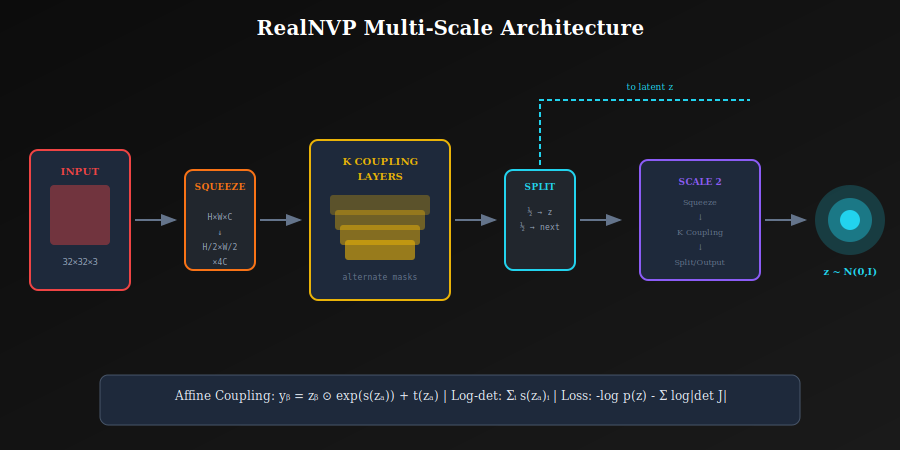
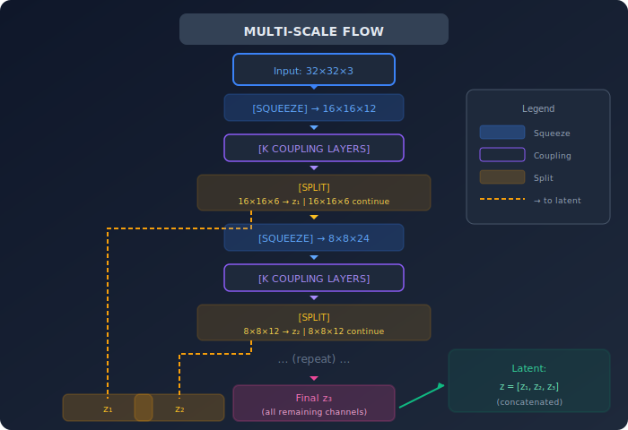

# 🎨 RealNVP

<div align="center">


*The architecture that proved normalizing flows could generate high-quality images*

</div>

---

## 📖 Introduction

**RealNVP** (Real-valued Non-Volume Preserving transformations, Dinh et al., 2017) was a breakthrough architecture demonstrating that normalizing flows could generate realistic images. It introduced:
- **Affine coupling layers** — more expressive than additive
- **Multi-scale architecture** — process different resolutions efficiently
- **Batch normalization** for flows — stable training

RealNVP achieved the first competitive image generation results with normalizing flows.

---

## 🎯 Where and Why Use RealNVP?

### 🏭 Applications

| Domain | Use Case | Why RealNVP? |
|--------|----------|--------------|
| **🎨 Image Generation** | Face synthesis, artistic generation | Exact likelihood + reasonable quality |
| **🔬 Scientific Imaging** | Medical image analysis | Density estimation on images |
| **🔧 Image Compression** | Learned compression | Exact entropy coding |
| **🧬 Biology** | Cell image modeling | Capture biological variability |
| **📊 Anomaly Detection** | Out-of-distribution detection | Likelihood-based detection |

### 💡 Why Choose RealNVP?

| Advantage | Explanation |
|-----------|-------------|
| **Exact Likelihood** | Direct log p(x) computation |
| **Efficient** | O(d) Jacobian, parallel sampling |
| **Multi-scale** | Naturally handles spatial hierarchies |
| **Interpretable** | Clear latent structure |
| **Invertible** | Analytical forward and inverse |

---

## 📊 Representation Comparison

| Representation | Pros | Cons |
|----------------|------|------|
| **Checkerboard Mask** | Spatial locality | Fixed pattern |
| **Channel Mask** | Simple for images | Needs squeeze |
| **Random Mask** | Breaks symmetry | Less interpretable |
| **Learned Mask** | Adaptive | Harder to train |
| **Multi-scale** | Hierarchical | Architecture complexity |

---

## 🧮 Affine Coupling Layers

<p align="center">
  
</p>

### 1.1 The Core Transformation

Split input: \( x = [x_a, x_b] \)

**Forward**:
$$y_a = x_a$$
$$y_b = x_b \odot \exp(s(x_a)) + t(x_a)$$

**Inverse** (analytical!):
$$x_a = y_a$$
$$x_b = (y_b - t(y_a)) \odot \exp(-s(y_a))$$

where \( s \) and \( t \) are arbitrary neural networks.

### 1.2 Jacobian Analysis

$$\frac{\partial y}{\partial x} = \begin{bmatrix} I & 0 \\ \frac{\partial y_b}{\partial x_a} & \text{diag}(\exp(s(x_a))) \end{bmatrix}$$

**Key Properties**:
- Triangular matrix → determinant is product of diagonal
- Complex \( \frac{\partial y_b}{\partial x_a} \) doesn't affect determinant!

### 1.3 Log-Determinant

$$\det\left(\frac{\partial y}{\partial x}\right) = \prod_i \exp(s_i) = \exp\left(\sum_i s_i\right)$$

$$\boxed{\log|\det J| = \sum_i s(x_a)_i}$$

**Complexity**: O(d) — just sum the scale outputs!

### 1.4 Why It Works

The \( s \) and \( t \) networks can be **arbitrarily complex**:
- Deep CNNs
- ResNets
- Any architecture you want

No invertibility constraints on \( s \) and \( t \) — only the overall coupling structure ensures invertibility!

---

## 🏗️ Multi-Scale Architecture

### 2.1 Motivation

Images have hierarchical structure:
- Global patterns (low frequency)
- Local details (high frequency)

Process different scales separately for efficiency.

### 2.2 Architecture Overview

<p align="center">
  
</p>

### 2.3 Squeeze Operation

Reshape spatial dimensions to channels:

$$H \times W \times C \to \frac{H}{2} \times \frac{W}{2} \times 4C$$

```python
def squeeze(x):
    """
    2×2 spatial blocks → 4× channels.
    H×W×C → H/2 × W/2 × 4C
    """
    B, C, H, W = x.shape
    x = x.view(B, C, H//2, 2, W//2, 2)
    x = x.permute(0, 1, 3, 5, 2, 4).contiguous()
    return x.view(B, C*4, H//2, W//2)

def unsqueeze(x):
    """Inverse of squeeze."""
    B, C, H, W = x.shape
    x = x.view(B, C//4, 2, 2, H, W)
    x = x.permute(0, 1, 4, 2, 5, 3).contiguous()
    return x.view(B, C//4, H*2, W*2)
```

### 2.4 Split Operation

Factor out half the channels to latent:
- **First half**: Goes directly to final latent \( z \)
- **Second half**: Continues through more flow layers

```python
def split(x):
    """Split channels in half."""
    C = x.shape[1]
    return x[:, :C//2], x[:, C//2:]
```

**Benefits**:
- Early layers capture coarse features
- Later layers capture fine details
- Memory efficient (early exit for some dimensions)

---

## 🎭 Masking Patterns

### 3.1 Checkerboard Masking

For image data, alternate which pixels are transformed:

```python
def checkerboard_mask(H, W, alternate=False):
    """
    Create checkerboard pattern:
    1 0 1 0     or    0 1 0 1
    0 1 0 1           1 0 1 0
    1 0 1 0           0 1 0 1
    """
    mask = torch.zeros(1, 1, H, W)
    mask[:, :, 0::2, 0::2] = 1
    mask[:, :, 1::2, 1::2] = 1
    if alternate:
        mask = 1 - mask
    return mask
```

### 3.2 Channel-wise Masking

After squeeze, use channel-wise splitting:
- First half of channels → unchanged
- Second half → transformed

```python
def channel_mask(C, alternate=False):
    """Mask first half or second half of channels."""
    mask = torch.zeros(1, C, 1, 1)
    if not alternate:
        mask[:, :C//2] = 1
    else:
        mask[:, C//2:] = 1
    return mask
```

---

## 🔧 Scale and Translation Networks

### 4.1 Architecture

```python
class ResNetBlock(nn.Module):
    """Residual block for coupling networks."""
    
    def __init__(self, channels):
        super().__init__()
        self.conv = nn.Sequential(
            nn.Conv2d(channels, channels, 3, padding=1),
            nn.BatchNorm2d(channels),
            nn.ReLU(),
            nn.Conv2d(channels, channels, 3, padding=1),
            nn.BatchNorm2d(channels),
        )
    
    def forward(self, x):
        return F.relu(x + self.conv(x))


class ScaleTranslateNet(nn.Module):
    """Network to compute s and t for coupling."""
    
    def __init__(self, in_channels, out_channels, hidden_channels=512):
        super().__init__()
        self.net = nn.Sequential(
            nn.Conv2d(in_channels, hidden_channels, 3, padding=1),
            nn.ReLU(),
            ResNetBlock(hidden_channels),
            ResNetBlock(hidden_channels),
            nn.Conv2d(hidden_channels, out_channels * 2, 3, padding=1),
        )
        # Zero initialization for identity at start
        self.net[-1].weight.data.zero_()
        self.net[-1].bias.data.zero_()
    
    def forward(self, x):
        st = self.net(x)
        s, t = st.chunk(2, dim=1)
        s = torch.tanh(s)  # Bounded scale
        return s, t
```

---

## 🎓 Training

### 5.1 Maximum Likelihood Objective

$$\mathcal{L} = -\mathbb{E}_{x \sim p_{\text{data}}}\left[\log p_z(f^{-1}(x)) + \sum_k \log|\det J_k|\right]$$

### 5.2 Dequantization

Images have discrete pixel values {0, 1, ..., 255}. Add uniform noise to make continuous:

$$x' = \frac{x + u}{256}, \quad u \sim \text{Uniform}(0, 1)$$

```python
def dequantize(x):
    """Add uniform noise for dequantization."""
    noise = torch.rand_like(x)
    return (x + noise) / 256.0
```

### 5.3 Training Loop

```python
def train_step(model, x, optimizer):
    """Single training step."""
    # Dequantize
    x = dequantize(x)
    
    # Forward pass (x → z)
    z, log_det = model.inverse_with_log_det(x)
    
    # Log probability under base distribution
    log_pz = -0.5 * (z**2 + np.log(2 * np.pi)).sum(dim=[1,2,3])
    
    # Log probability of x
    log_px = log_pz + log_det
    
    # Negative log-likelihood loss
    loss = -log_px.mean()
    
    # Optimize
    optimizer.zero_grad()
    loss.backward()
    optimizer.step()
    
    # Convert to bits per dimension
    bpd = loss / (np.log(2) * np.prod(x.shape[1:]))
    
    return bpd.item()
```

### 5.4 Training Hyperparameters

| Parameter | Typical Value |
|-----------|---------------|
| Base distribution | \( \mathcal{N}(0, I) \) |
| Coupling layers per scale | 8-12 |
| Hidden channels | 512 |
| Learning rate | 1e-4 |
| Optimizer | Adam |
| Batch size | 32-64 |

---

## 💻 Complete Implementation

```python
class RealNVP(nn.Module):
    """Complete RealNVP architecture."""
    
    def __init__(self, num_scales=3, num_coupling_per_scale=8):
        super().__init__()
        self.num_scales = num_scales
        
        self.flows = nn.ModuleList()
        in_channels = 3  # RGB
        
        for scale in range(num_scales):
            # Squeeze increases channels by 4x
            in_channels *= 4
            
            # Add coupling layers
            for i in range(num_coupling_per_scale):
                self.flows.append(
                    AffineCouplingLayer(
                        in_channels, 
                        mask_type='checkerboard' if scale == 0 else 'channel',
                        alternate=(i % 2 == 1)
                    )
                )
            
            # Split (except last scale)
            if scale < num_scales - 1:
                in_channels //= 2
    
    def forward(self, x):
        """x → z (for sampling, we use inverse)"""
        z_list = []
        log_det_total = 0
        
        for scale in range(self.num_scales):
            # Squeeze
            x = squeeze(x)
            
            # Coupling layers
            for flow in self.flows[scale]:
                x, log_det = flow(x)
                log_det_total += log_det
            
            # Split (except last)
            if scale < self.num_scales - 1:
                z_out, x = split(x)
                z_list.append(z_out)
        
        z_list.append(x)
        return z_list, log_det_total
    
    def inverse(self, z_list):
        """z → x (for generation)"""
        x = z_list[-1]
        
        for scale in reversed(range(self.num_scales)):
            # Unsplit (except last)
            if scale < self.num_scales - 1:
                x = torch.cat([z_list[scale], x], dim=1)
            
            # Inverse coupling layers
            for flow in reversed(self.flows[scale]):
                x = flow.inverse(x)
            
            # Unsqueeze
            x = unsqueeze(x)
        
        return x
    
    def sample(self, num_samples, device):
        """Generate samples."""
        z_list = [torch.randn(num_samples, *shape, device=device) 
                  for shape in self.z_shapes]
        return self.inverse(z_list)
```

---

## 📊 Results

### 6.1 Benchmark Performance

| Dataset | Bits/Dim | Notes |
|---------|----------|-------|
| CIFAR-10 | 3.49 | First competitive flow result |
| ImageNet 32×32 | 4.28 | |
| ImageNet 64×64 | 3.98 | |
| CelebA | — | Good face generation |

### 6.2 Comparison

| Model | CIFAR-10 BPD | Sampling Speed |
|-------|-------------|----------------|
| RealNVP | 3.49 | Fast |
| Glow | 3.35 | Fast |
| Flow++ | 3.08 | Fast |
| PixelCNN | 3.00 | Very Slow |

---

## 📝 Key Equations Summary

| Concept | Formula |
|---------|---------|
| **Coupling forward** | \( y_b = x_b \odot e^{s(x_a)} + t(x_a) \) |
| **Coupling inverse** | \( x_b = (y_b - t(y_a)) \odot e^{-s(y_a)} \) |
| **Log-det** | \( \sum_i s(x_a)_i \) |
| **Loss** | \( -\log p_z(z) - \sum_k \log\|\det J_k\| \) |
| **BPD** | \( -\log_2 p(x) / (H \times W \times C) \) |

---

## 📚 References

1. **Dinh, L., Sohl-Dickstein, J., & Bengio, S.** (2017). *"Density estimation using Real-NVP."* ICLR. [arXiv:1605.08803](https://arxiv.org/abs/1605.08803)
2. **Dinh, L., Krueger, D., & Bengio, Y.** (2015). *"NICE: Non-linear Independent Components Estimation."* ICLR Workshop. [arXiv:1410.8516](https://arxiv.org/abs/1410.8516)

---

## ✏️ Exercises

1. **Implement** a single affine coupling layer and verify invertibility.

2. **Show** that the Jacobian is triangular for coupling layers.

3. **Train** RealNVP on 2D toy data and visualize the learned transformation.

4. **Compare** channel-wise vs checkerboard splitting.

5. **Implement** the multi-scale architecture with squeeze and split.

---

<div align="center">

**[← Coupling Layers](../03_coupling_layers/)** | **[Next: Glow →](../05_glow/)**

</div>
