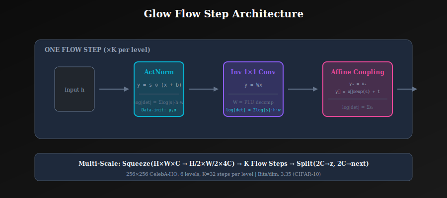
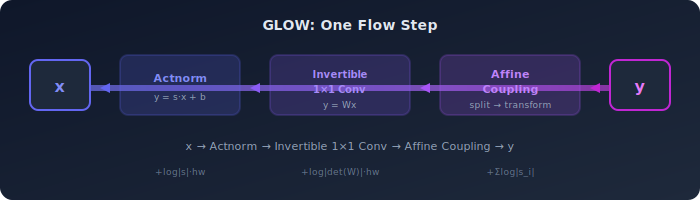
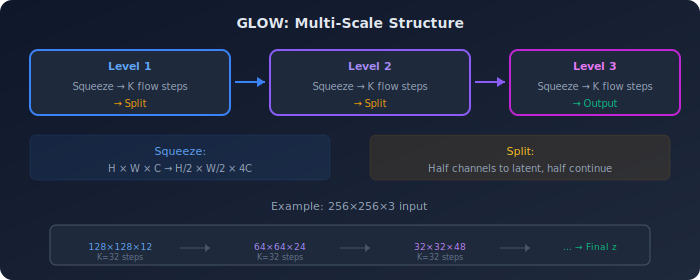
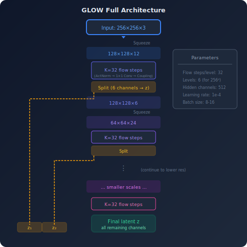

# ✨ Glow: Generative Flow with Invertible 1×1 Convolutions

<div align="center">


*The architecture that achieved photo-realistic face generation with exact likelihood computation*

</div>

---

## 📖 Introduction

Glow (Kingma & Dhariwal, 2018) extended RealNVP with invertible 1×1 convolutions, enabling more flexible channel permutations and achieving state-of-the-art flow-based image generation. It demonstrated high-resolution face synthesis and meaningful latent space manipulation.

---

## 🎯 Where and Why Use Glow?

### 🏭 Applications

| Domain | Use Case | Why Glow? |
|--------|----------|-----------|
| **🎨 Face Generation** | Photo-realistic synthesis | High-quality 256×256 faces |
| **✏️ Image Editing** | Attribute manipulation | Semantic latent directions |
| **🔄 Interpolation** | Smooth transitions | Meaningful latent space |
| **📊 Density Estimation** | Likelihood computation | Exact log p(x) |
| **🧬 Scientific Modeling** | Complex distributions | Invertible by design |

---

## 📊 Representation Comparison

| Representation | Pros | Cons |
|----------------|------|------|
| **1×1 Convolution** | Learnable permutation | O(c³) for c channels |
| **LU Decomposition** | Efficient O(c) | Constrained init |
| **ActNorm** | Data-dependent init | Extra forward pass |
| **Squeeze Operation** | Trades spatial for channel | Fixed operation |
| **Split Operation** | Multi-scale latents | May discard info |

---

## 🔑 Key Innovations

### 🔄 Invertible 1×1 Convolution

Replace fixed permutations with learned channel mixing:

$$y = Wx$$

where $W \in \mathbb{R}^{c \times c}$ is a learnable weight matrix.

**Log-determinant:**
$$\log|\det(W)| \cdot h \cdot w$$

(multiplied by spatial dimensions since same $W$ applied everywhere)

### ⚡ Efficient Determinant Computation

**LU Decomposition:**
$$W = PL(U + \text{diag}(s))$$

where:
- $P$: permutation matrix (fixed)
- $L$: lower triangular (1s on diagonal)
- $U$: upper triangular (0s on diagonal)
- $s$: diagonal elements

$$\log|\det(W)| = \sum_i \log|s_i|$$

### 📊 Actnorm (Activation Normalization)

Learnable per-channel affine transform:
$$y = s \odot x + b$$

Initialize with data-dependent values (like batch norm init).

---

## 🏗️ Architecture

<p align="center">
  
</p>

### 🔁 Flow Step

One step of flow consists of:

<p align="center">
  
</p>

### 📐 Multi-Scale Structure

<p align="center">
  
</p>

### 🎯 Full Architecture

<p align="center">
  
</p>

---

## 🎓 Training

### 📉 Objective

$$\mathcal{L} = -\log p(x) = -\log p_z(z) - \sum_i \log|\det J_i|$$

Sum over all flow steps.

### 📊 Bits per Dimension

$$\text{bpd} = \frac{-\log_2 p(x)}{H \times W \times C}$$

Lower is better.

### ⚙️ Training Details

| Parameter | Value |
|-----------|-------|
| Flow steps per level | 32 |
| Levels | 6 (for 256×256) |
| Hidden channels | 512 |
| Learning rate | 1e-4 |
| Batch size | 8-16 |
| Training time | Days on 8 GPUs |

---

## 📈 Results

### 🎨 Image Quality

- 256×256 CelebA-HQ faces
- First flow model with photo-realistic samples
- Smooth interpolations in latent space

### 📊 Bits per Dimension Comparison

| Dataset | Glow | RealNVP |
|---------|------|---------|
| CIFAR-10 | 3.35 | 3.49 |
| ImageNet 32×32 | 4.09 | 4.28 |
| ImageNet 64×64 | 3.81 | — |

### 🧠 Latent Space Properties

**Linear interpolation:** Smooth transitions between faces

**Attribute manipulation:** Find directions for:
- Smile
- Age
- Glasses
- Hair color

---

## 💻 Implementation Details

### 🔄 Invertible 1×1 Conv

```python
class Invertible1x1Conv(nn.Module):
    def __init__(self, num_channels):
        super().__init__()
        # Initialize with random orthogonal matrix
        W = torch.qr(torch.randn(num_channels, num_channels))[0]
        # LU decomposition
        P, L, U = torch.lu_unpack(*torch.lu(W))
        
        self.register_buffer('P', P)
        self.L = nn.Parameter(L)
        self.U = nn.Parameter(U)
        self.s = nn.Parameter(torch.diag(U))
        
    def forward(self, x, reverse=False):
        # Reconstruct W
        L = torch.tril(self.L, -1) + torch.eye(self.L.size(0))
        U = torch.triu(self.U, 1) + torch.diag(self.s)
        W = self.P @ L @ U
        
        if not reverse:
            y = F.conv2d(x, W.unsqueeze(-1).unsqueeze(-1))
            log_det = torch.sum(torch.log(torch.abs(self.s))) * x.size(2) * x.size(3)
            return y, log_det
        else:
            W_inv = torch.inverse(W)
            return F.conv2d(x, W_inv.unsqueeze(-1).unsqueeze(-1))
```

### 📊 Actnorm

```python
class ActNorm(nn.Module):
    def __init__(self, num_channels):
        super().__init__()
        self.scale = nn.Parameter(torch.ones(1, num_channels, 1, 1))
        self.bias = nn.Parameter(torch.zeros(1, num_channels, 1, 1))
        self.initialized = False
    
    def initialize(self, x):
        with torch.no_grad():
            mean = x.mean(dim=[0, 2, 3], keepdim=True)
            std = x.std(dim=[0, 2, 3], keepdim=True)
            self.bias.data = -mean
            self.scale.data = 1 / (std + 1e-6)
        self.initialized = True
    
    def forward(self, x, reverse=False):
        if not self.initialized:
            self.initialize(x)
        
        if not reverse:
            y = self.scale * (x + self.bias)
            log_det = torch.sum(torch.log(torch.abs(self.scale))) * x.size(2) * x.size(3)
            return y, log_det
        else:
            return x / self.scale - self.bias
```

---

## 🚀 Applications

### 🎨 Image Synthesis

Generate new faces by sampling $z \sim \mathcal{N}(0, I)$.

### ✏️ Attribute Editing

Find attribute direction $\Delta z$ and apply:
$$z' = z + \alpha \Delta z$$

### 🔄 Interpolation

$$z_{interp} = (1-t) z_1 + t z_2$$

Smooth transitions in image space.

---

## 📝 Key Equations Summary

| Concept | Formula |
|---------|---------|
| 1×1 conv | $y = Wx$, $\log|\det| = \sum_i \log|s_i| \cdot hw$ |
| Actnorm | $y = s(x + b)$ |
| Flow step | Actnorm → 1×1 Conv → Coupling |
| BPD | $-\log_2 p(x) / (H \cdot W \cdot C)$ |

---

## 📚 References

1. **Kingma, D. P., & Dhariwal, P.** (2018). "Glow: Generative Flow with Invertible 1×1 Convolutions." *NeurIPS*. [arXiv:1807.03039](https://arxiv.org/abs/1807.03039)

---

## ✏️ Exercises

1. **Implement** the LU-decomposed invertible 1×1 convolution.

2. **Compare** fixed permutation vs learned 1×1 conv in terms of likelihood.

3. **Train** Glow on CelebA and perform attribute manipulation.

4. **Visualize** the latent space structure using PCA.

5. **Compute** bits per dimension and compare with published results.

---

<div align="center">

**[← RealNVP](../04_realnvp/)** | **[Next: Flow Evaluation →](../06_flow_evaluation/)**

</div>
