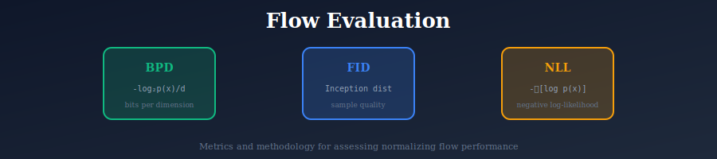
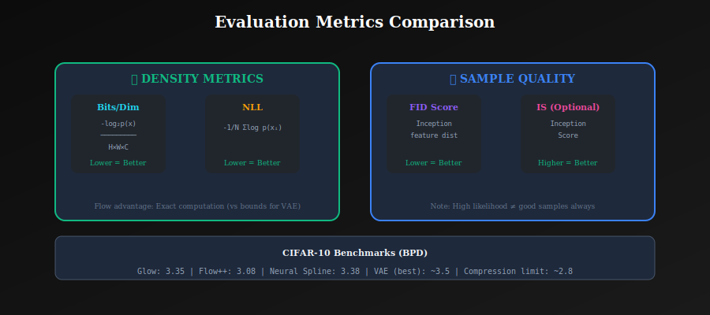

# 📊 Normalizing Flow Evaluation

*Measuring how well your flow models the true data distribution*

---

## 📖 Introduction

Evaluating normalizing flows differs from GANs because flows provide exact likelihoods. This enables direct comparison via log-likelihood, but also presents unique challenges. This document covers evaluation metrics, methodology, and best practices.

---

## 🎯 Where and Why Use Flow Evaluation?

### 🏭 Evaluation Contexts

| Context | Why Evaluation Matters |
|---------|----------------------|
| **🔬 Research** | Compare with baselines fairly |
| **🏭 Production** | Verify model quality |
| **🐛 Debugging** | Diagnose training issues |
| **📊 Benchmarking** | Establish state-of-the-art |
| **🔄 Model Selection** | Choose best hyperparameters |

---

## 📊 Representation Comparison

| Representation | Pros | Cons |
|----------------|------|------|
| **Bits per Dimension** | Interpretable, exact | Sensitive to preprocessing |
| **Log-likelihood** | Direct optimization target | Scale-dependent |
| **ELBO (for VAEs)** | Lower bound | May be loose |
| **FID** | Sample quality | Ignores likelihood |
| **Reconstruction Error** | Visual quality check | Only tests invertibility |

---

## 📈 Likelihood-Based Metrics

  

### 📉 Log-Likelihood

$$\mathcal{L} = \mathbb{E}_{x \sim p_{data}}[\log p_\theta(x)]$$

Estimated as average over test set.

### 📊 Bits per Dimension (BPD)

Normalized log-likelihood for images:

$$\text{BPD} = -\frac{\log_2 p(x)}{d} = -\frac{\log p(x)}{d \cdot \ln 2}$$

where $d = H \times W \times C$ is total dimensions.

**Intuition:** Bits needed to encode each dimension under the model.

**Comparison:**

| Dataset | State-of-Art Flow | VAE |
|---------|------------------|-----|
| CIFAR-10 | 3.09 bpd | ~3.5 bpd |
| ImageNet 32 | 3.81 bpd | ~4.2 bpd |
| ImageNet 64 | 3.52 bpd | — |

### ➖ Negative Log-Likelihood (NLL)

$$\text{NLL} = -\frac{1}{N}\sum_{i=1}^N \log p(x_i)$$

Same as log-likelihood, opposite sign.

---

## 🎲 Dequantization

### ⚠️ The Problem

Images have discrete pixel values {0, 1, ..., 255}.
Continuous models can assign infinite density to discrete points.

### 🎯 Uniform Dequantization

Add uniform noise:
$$\tilde{x} = \frac{x + u}{256}, \quad u \sim \text{Uniform}(0, 1)^d$$

**Corrected likelihood:**
$$\log p(x) \approx \log p(\tilde{x}) + d \log 256$$

### 🔬 Variational Dequantization

Learn dequantization distribution:
$$\log p(x) \geq \mathbb{E}_{u \sim q(u|x)}[\log p(\tilde{x}) - \log q(u|x)]$$

More accurate but more complex.

---

## 🎨 Sample Quality Metrics

### 📏 FID for Flows

Same as GANs: compare Inception features.
- Flows often have higher FID than GANs
- But likelihood can still be good

### 👁️ Perceptual Quality

Visual inspection remains important:
- Sharpness
- Realism
- Diversity

### ⚖️ Trade-off

**Observation:** High likelihood ≠ good samples

Flows may assign high likelihood to:
- Slightly blurry images
- Images with subtle artifacts

---

## 🔍 Density Estimation Quality

### 📐 Calibration

Does the model assign appropriate probabilities?

Test: Sort samples by model probability, check if high-prob samples are actually typical.

### 🚨 Out-of-Distribution Detection

Good flows should:
- Assign low likelihood to OOD data
- Distinguish in-distribution from OOD

**Challenge:** Flows sometimes give higher likelihood to OOD data!

### 📊 Typicality

Typical samples have likelihood close to expected entropy:
$$\log p(x) \approx -H(p_{data})$$

Very high likelihood samples may not be representative.

---

## 🔄 Interpolation Quality

### 🌊 Latent Space Smoothness

Linear interpolation in latent space:
$$z_t = (1-t)z_1 + tz_2, \quad t \in [0, 1]$$

Good flows: smooth, meaningful transitions.

### 🧠 Semantic Organization

Related samples should be close in latent space.
Test with labeled data: same-class samples should cluster.

---

## ⚡ Computational Metrics

### ⏱️ Training Time

- Flows typically slower than GANs per iteration
- But more stable (fewer restarts)

### 🚀 Sampling Speed

| Model Type | Forward | Inverse |
|------------|---------|---------|
| Coupling flows | Fast | Fast |
| Autoregressive | Fast | Slow |
| Continuous flows | Slow | Slow |

### 💾 Memory Usage

Flows are memory-intensive:
- Store all intermediate activations for Jacobian
- Multi-scale architectures help

---

## ✅ Best Practices

### 📝 Reporting

Always report:
- Bits per dimension with dequantization method
- Number of test samples
- Model size (parameters)

### ⚠️ Avoiding Common Pitfalls

❌ Comparing BPD across different dequantization methods
❌ Using training set for evaluation
❌ Not accounting for preprocessing differences

### 📊 Comprehensive Evaluation

Report multiple metrics:
1. BPD (density estimation)
2. FID (sample quality)
3. Interpolation examples (latent structure)
4. OOD likelihood (calibration)

---

## 📝 Key Metrics Summary

| Metric | Measures | Range | Better |
|--------|----------|-------|--------|
| BPD | Density fit | [0, ∞) | Lower |
| NLL | Density fit | [0, ∞) | Lower |
| FID | Sample quality | [0, ∞) | Lower |
| IS | Sample quality/diversity | [1, K] | Higher |

---

## 📚 References

1. **Theis, L., Oord, A., & Bethge, M.** (2016). "A note on the evaluation of generative models." *ICLR*. [arXiv:1511.01844](https://arxiv.org/abs/1511.01844)
2. **Ho, J., et al.** (2019). "Flow++: Improving Flow-Based Generative Models with Variational Dequantization and Architecture Design." *ICML*. [arXiv:1902.00275](https://arxiv.org/abs/1902.00275)
3. **Nalisnick, E., et al.** (2019). "Do Deep Generative Models Know What They Don't Know?" *ICLR*. [arXiv:1810.09136](https://arxiv.org/abs/1810.09136)

---

## ✏️ Exercises

1. **Compute** BPD for a trained flow model on CIFAR-10 test set.

2. **Implement** uniform dequantization and verify likelihood correction.

3. **Test** OOD detection: train on CIFAR-10, evaluate on SVHN.

4. **Compare** FID and BPD rankings—do they correlate?

5. **Visualize** latent interpolations and assess smoothness.

---

**[← Glow](../05_glow/)** | **[Back to Normalizing Flows →](../)**

