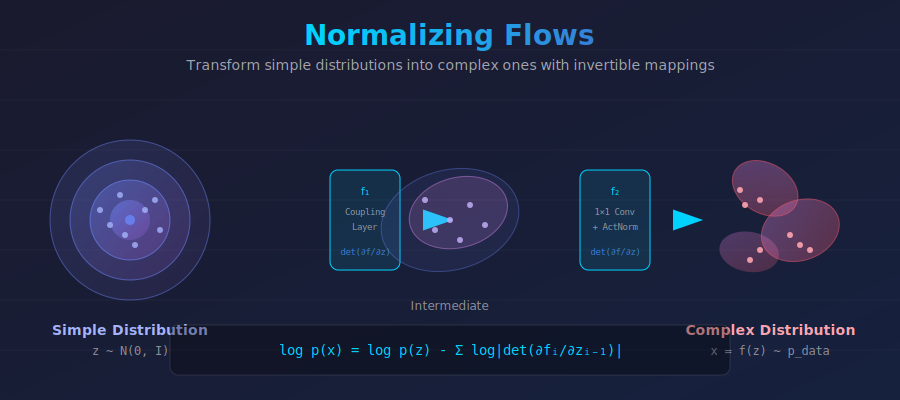
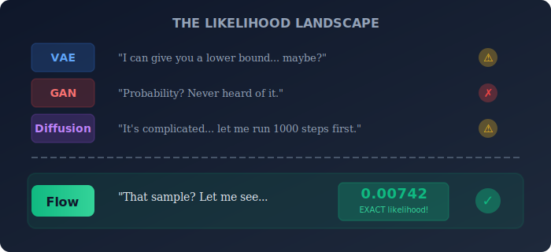
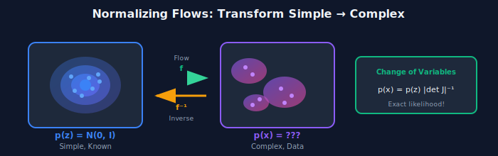
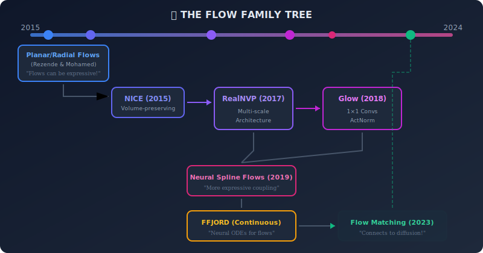

# 🌊 Normalizing Flows

<div align="center">



<br/>

### 🔮 *Exact Probabilities. Invertible Magic.* 🔮

<br/>

[](#)
[](#)
[](#)

---

*"What if you could know the exact probability of every sample?"*

**Normalizing flows make that possible.**

</div>

---

## 🎬 The Probability Problem

> **Here's the challenge:** You have complex data — images, molecules, time series. You want to model their distribution. But there's a catch:
>
> **Most generative models can't tell you the probability of a specific sample.**

<div align="center">



</div>

---

## 💡 The Core Insight

<div align="center">

### 💫 *"Stretch simple noise into complex data. Track every volume change. Compute exact probabilities."* 💫

</div>

<table>
<tr>
<td width="50%" style="vertical-align: top">

### 🎲 Start Simple
*A Gaussian distribution — we know everything about it*

- Easy to sample from
- Easy to compute $p(z)$
- But it looks nothing like our data

</td>
<td width="50%" style="vertical-align: top">

### 🎨 End Complex
*Your data distribution — exactly what we want*

- Complex, multi-modal
- What we want to model
- Connected to the Gaussian through **invertible** transforms

</td>
</tr>
</table>

<div align="center">



</div>

---

## 🧮 The Mathematical Magic

### The Change of Variables Formula

When you transform $z \sim p_z(z)$ through an invertible function $x = f(z)$:

$$\boxed{p_x(x) = p_z(f^{-1}(x)) \cdot \left|\det\left(\frac{\partial f^{-1}}{\partial x}\right)\right|}$$

<div align="center">

> 🎭 **Translation:** "The probability in data space = probability in base space × volume scaling factor"

</div>

### Log-Likelihood (What We Actually Optimize)

$$\log p_x(x) = \underbrace{\log p_z(z)}_{\text{Gaussian, easy!}} - \underbrace{\log\left|\det(J_f)\right|}_{\text{Volume change}}$$

where $J_f = \frac{\partial f}{\partial z}$ is the Jacobian matrix.

---

## 🌍 Where Flows Shine Brightest

> *When you need exact probabilities, accept no substitutes.*

<table>
<tr>
<th width="20%">Domain</th>
<th width="35%">Why Flows Win</th>
<th width="45%">Real Applications</th>
</tr>
<tr>
<td>

### 🔬
**Science**

</td>
<td>

Exact likelihoods enable rigorous uncertainty quantification. No approximations.

</td>
<td>

**Molecular dynamics** • **Protein folding** • **Physics simulations**

*When "approximately correct" isn't good enough*

</td>
</tr>
<tr>
<td>

### 💊
**Drug Discovery**

</td>
<td>

Sample novel molecules AND know their exact probabilities.

</td>
<td>

**Molecule generation** • **Conformer sampling** • **Property optimization**

*Design drugs with confidence*

</td>
</tr>
<tr>
<td>

### 📊
**Anomaly Detection**

</td>
<td>

Exact densities make outlier detection principled.

</td>
<td>

**Fraud detection** • **Medical diagnostics** • **Quality control**

*"This sample has probability 0.00001 — investigate!"*

</td>
</tr>
<tr>
<td>

### 🧠
**Bayesian ML**

</td>
<td>

Better posterior approximation than mean-field variational inference.

</td>
<td>

**Bayesian neural networks** • **Uncertainty estimation**

*Capture complex posterior correlations*

</td>
</tr>
<tr>
<td>

### 🎨
**Generation**

</td>
<td>

Exact sampling without mode collapse.

</td>
<td>

**Image synthesis** • **Audio generation** • **Voice synthesis**

*Generate with mathematical guarantees*

</td>
</tr>
</table>

---

## 📚 Your Flow Journey

<div align="center">



</div>

<table>
<tr>
<th width="5%">#</th>
<th width="20%">Topic</th>
<th width="35%">What You'll Master</th>
<th width="40%">The Hook</th>
</tr>
<tr>
<td align="center">📐</td>
<td><b><a href="./01_flow_fundamentals/">Fundamentals</a></b></td>
<td>Change of variables, Jacobians, invertibility</td>
<td><em>"Why can we compute exact probabilities? The math is beautiful."</em></td>
</tr>
<tr>
<td align="center">🔄</td>
<td><b><a href="./02_planar_and_radial_flows/">Planar & Radial</a></b></td>
<td>Simple flow transformations, composition</td>
<td><em>"Start with flows you can draw on paper."</em></td>
</tr>
<tr>
<td align="center">🔗</td>
<td><b><a href="./03_coupling_layers/">Coupling Layers</a></b></td>
<td>Affine coupling, triangular Jacobians</td>
<td><em>"The trick that made flows practical."</em></td>
</tr>
<tr>
<td align="center">🎨</td>
<td><b><a href="./04_realnvp/">RealNVP</a></b></td>
<td>Real-valued Non-Volume Preserving, multi-scale</td>
<td><em>"The architecture that launched a thousand papers."</em></td>
</tr>
<tr>
<td align="center">✨</td>
<td><b><a href="./05_glow/">Glow</a></b></td>
<td>1×1 convolutions, ActNorm, high-quality images</td>
<td><em>"Generate faces you could mistake for real."</em></td>
</tr>
<tr>
<td align="center">📊</td>
<td><b><a href="./06_flow_evaluation/">Evaluation</a></b></td>
<td>Bits per dimension, sample quality metrics</td>
<td><em>"How good is your flow, really?"</em></td>
</tr>
</table>

---

## 🧮 Deep Dive: The Jacobian Determinant

### Why Jacobians Matter

The Jacobian tells us how volumes change under transformation:

$$J_f = \frac{\partial f}{\partial z} = \begin{pmatrix}
\frac{\partial f_1}{\partial z_1} & \cdots & \frac{\partial f_1}{\partial z_d} \\
\vdots & \ddots & \vdots \\
\frac{\partial f_d}{\partial z_1} & \cdots & \frac{\partial f_d}{\partial z_d}
\end{pmatrix}$$

<div align="center">

> 🎭 If $|\det(J)| = 2$, volumes double. If $|\det(J)| = 0.5$, volumes halve.
>
> Probabilities must adjust inversely!

</div>

### The Challenge: Computing Determinants

For a $d \times d$ matrix, computing the determinant naively is $O(d^3)$.

For images with $d = 256 \times 256 \times 3 = 196,608$ dimensions... that's impossible.

**The Solution:** Design flows with special Jacobian structure!

---

## ⚡ The Coupling Layer Breakthrough

<div align="center">

### The Insight That Changed Everything

</div>

**Split the input:** $z = [z_a, z_b]$

**Transform only half:**
- $x_a = z_a$ (unchanged!)
- $x_b = s(z_a) \odot z_b + t(z_a)$ (scale and translate)

**The Jacobian is triangular!**

$$J = \begin{pmatrix} I & 0 \\ \frac{\partial x_b}{\partial z_a} & \text{diag}(s(z_a)) \end{pmatrix}$$

<div align="center">

> 💡 **Triangular Jacobian = determinant is just the product of diagonal!**
>
> $$\log|\det(J)| = \sum_i \log|s_i(z_a)|$$
>
> **From $O(d^3)$ to $O(d)$ !**

</div>

---

## 📊 How Flows Compare

<table>
<tr>
<th>Feature</th>
<th>Flow 🌊</th>
<th>VAE 🔄</th>
<th>GAN ⚔️</th>
<th>Diffusion 🎲</th>
</tr>
<tr>
<td><b>Likelihood</b></td>
<td style="background-color: #dcfce7">✅ <b>Exact</b></td>
<td>⚠️ Lower bound (ELBO)</td>
<td style="background-color: #fee2e2">❌ None</td>
<td>⚠️ Lower bound</td>
</tr>
<tr>
<td><b>Sampling Speed</b></td>
<td style="background-color: #dcfce7">✅ One pass</td>
<td style="background-color: #dcfce7">✅ One pass</td>
<td style="background-color: #dcfce7">✅ One pass</td>
<td style="background-color: #fee2e2">❌ Many steps</td>
</tr>
<tr>
<td><b>Invertibility</b></td>
<td style="background-color: #dcfce7">✅ <b>By design</b></td>
<td style="background-color: #fee2e2">❌ No</td>
<td style="background-color: #fee2e2">❌ No</td>
<td>⚠️ Approximate</td>
</tr>
<tr>
<td><b>Training Stability</b></td>
<td style="background-color: #dcfce7">✅ Very stable</td>
<td style="background-color: #dcfce7">✅ Stable</td>
<td style="background-color: #fee2e2">❌ Unstable</td>
<td style="background-color: #dcfce7">✅ Stable</td>
</tr>
<tr>
<td><b>Mode Coverage</b></td>
<td style="background-color: #dcfce7">✅ Full</td>
<td>⚠️ May miss modes</td>
<td style="background-color: #fee2e2">❌ Mode collapse</td>
<td style="background-color: #dcfce7">✅ Full</td>
</tr>
<tr>
<td><b>Image Quality</b></td>
<td>⚠️ Good</td>
<td>⚠️ Blurry</td>
<td style="background-color: #dcfce7">✅ Sharp</td>
<td style="background-color: #dcfce7">✅ <b>SOTA</b></td>
</tr>
</table>

---

## 🔧 Training: Clean and Simple

```python
def train_normalizing_flow(flow, data_loader, optimizer, epochs):
    """
    Maximum likelihood training for normalizing flows.
    
    The beauty: we can compute EXACT log-likelihood!
    """
    
    for epoch in range(epochs):
        for x in data_loader:
            optimizer.zero_grad()
            
            # ══════════════════════════════════════════════════
            # The magic: transform data to base space
            # and track the volume change
            # ══════════════════════════════════════════════════
            z, log_det = flow.inverse(x)  # x → z, with log|det J|
            
            # Log probability in base space (Gaussian)
            log_pz = -0.5 * (z ** 2).sum(dim=-1) - 0.5 * d * np.log(2 * np.pi)
            
            # EXACT log probability in data space!
            log_px = log_pz + log_det  # Change of variables
            
            # Maximize likelihood = minimize negative log likelihood
            loss = -log_px.mean()
            
            loss.backward()
            optimizer.step()


@torch.no_grad()
def sample(flow, num_samples):
    """
    Generate samples by transforming Gaussian noise.
    """
    # Sample from base distribution
    z = torch.randn(num_samples, dim)
    
    # Transform to data space
    x = flow.forward(z)
    
    return x
```

---

## 🏆 The Flow Family Tree

<div align="center">



</div>

---

## 💡 Visual Intuition

<div align="center">

### Think of Flows as Space Deformation

</div>

<div align="center">


> 🧠 The transformation is **invertible** — we can always go back!
>
> And because we track volume changes, we always know probabilities.

</div>

---

## 📚 The Essential Papers

<table>
<tr>
<th width="55%">Paper</th>
<th width="45%">Contribution</th>
</tr>
<tr>
<td>

**Rezende & Mohamed** (2015)
*"Variational Inference with Normalizing Flows"*
[ICML](https://arxiv.org/abs/1505.05770)

</td>
<td>

🏆 **The Foundation**
Introduced flows for VI.

</td>
</tr>
<tr>
<td>

**Dinh et al.** (2017)
*"Density Estimation Using Real-NVP"*
[ICLR](https://arxiv.org/abs/1605.08803)

</td>
<td>

🔗 **Coupling Layers**
Made flows scalable.

</td>
</tr>
<tr>
<td>

**Kingma & Dhariwal** (2018)
*"Glow: Generative Flow with Invertible 1×1 Convolutions"*
[NeurIPS](https://arxiv.org/abs/1807.03039)

</td>
<td>

✨ **High-Quality Images**
256×256 faces!

</td>
</tr>
<tr>
<td>

**Papamakarios et al.** (2021)
*"Normalizing Flows for Probabilistic Modeling and Inference"*
[JMLR](https://arxiv.org/abs/1912.02762)

</td>
<td>

📖 **The Survey**
Everything you need to know.

</td>
</tr>
</table>

---

## ✏️ Exercises

<details>
<summary><b>🟢 Exercise 1:</b> 2D Flow Visualization</summary>

**Task:** Implement a planar flow and visualize how it transforms a 2D Gaussian.

**Steps:**
1. Sample from $\mathcal{N}(0, I)$
2. Apply planar flow: $f(z) = z + u \cdot \tanh(w^T z + b)$
3. Plot before and after distributions
4. Verify the density using the change of variables formula

</details>

<details>
<summary><b>🟡 Exercise 2:</b> Coupling Layer Implementation</summary>

**Task:** Build a RealNVP-style affine coupling layer.

**Implement:**
1. Split input into two halves
2. Compute scale $s$ and translation $t$ from first half
3. Transform second half: $x_b = s \odot z_b + t$
4. Compute log determinant: $\sum_i \log|s_i|$

</details>

<details>
<summary><b>🟡 Exercise 3:</b> Train on 2D Datasets</summary>

**Task:** Train a flow on Two Moons or Swiss Roll.

**Evaluate:**
1. Visualize samples
2. Plot the learned density
3. Compute log-likelihood on held-out data

</details>

<details>
<summary><b>🔴 Exercise 4:</b> Prove the Determinant Property</summary>

**Task:** Show that for triangular matrices:

$$\det(T) = \prod_i T_{ii}$$

**Extend:** Why does this make coupling layers efficient?

</details>

---

<div align="center">

## 🌊 Dive Into the Flow

<br/>

**Start with foundations →** [Flow Fundamentals](./01_flow_fundamentals/)

*Master the change of variables formula*

<br/>

---

<br/>

> *"Other models approximate. Flows compute exactly."*
>
> *That's not just a feature — it's a philosophy.*

</div>
