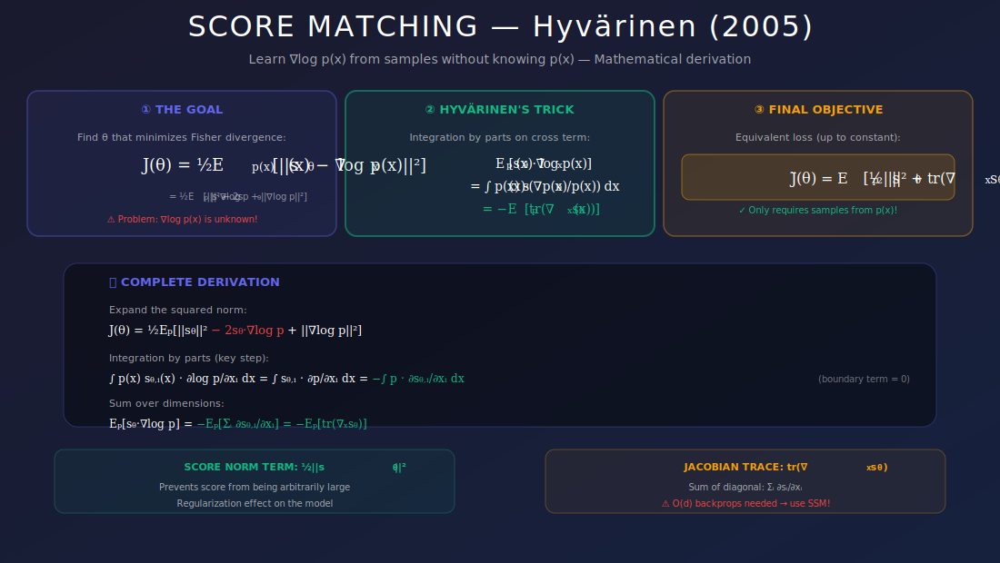
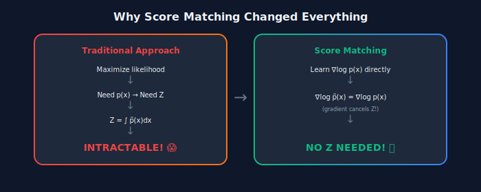
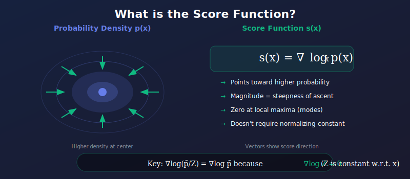

# 📐 Score Matching

<div align="center">



*Learn probability gradients without knowing the true distribution — the foundation of modern generative AI*

[](#references)
[](#)
[](#)

</div>

---

## 🎯 Where & Why Use Score Matching?

<table>
<tr>
<th width="25%">📍 Where</th>
<th width="40%">💡 Why</th>
<th width="35%">🔧 Practical Use Cases</th>
</tr>
<tr>
<td><b>Energy-Based Models</b></td>
<td>Train EBMs without computing intractable partition function Z</td>
<td>Unsupervised feature learning, texture synthesis</td>
</tr>
<tr>
<td><b>Diffusion Model Foundation</b></td>
<td>Score matching is THE theoretical foundation of all diffusion models</td>
<td>DALL-E, Stable Diffusion, Imagen</td>
</tr>
<tr>
<td><b>Density Estimation</b></td>
<td>Estimate complex probability densities from samples alone</td>
<td>Anomaly detection, uncertainty quantification</td>
</tr>
<tr>
<td><b>Unnormalized Models</b></td>
<td>Work with models where p(x) = p̃(x)/Z and Z is intractable</td>
<td>Boltzmann machines, Markov random fields</td>
</tr>
<tr>
<td><b>Bayesian Inference</b></td>
<td>Sample from posterior distributions without normalizing</td>
<td>MCMC initialization, variational inference</td>
</tr>
</table>

### 🌟 The Revolutionary Insight

> **The Problem:** For most interesting probability distributions, we can write down $p(x) = \frac{\tilde{p}(x)}{Z}$ but cannot compute $Z = \int \tilde{p}(x)dx$.
>
> **The Solution:** The score function $\nabla_x \log p(x)$ **completely avoids** the normalization constant!



---

## 📊 Representation Comparison

| Representation | Pros | Cons |
|----------------|------|------|
| **Explicit SM** | Theoretically exact | O(d) Jacobian trace |
| **Denoising SM** | Simple, scalable | Requires noise schedule |
| **Sliced SM** | Avoids full trace | Higher variance |
| **Finite Difference** | No autograd needed | Discretization error |
| **Stein's Identity** | Alternative derivation | Same complexity |

---

## 📚 Introduction

Score matching is a technique for estimating probability distributions by learning the **score function**—the gradient of the log-density. This approach avoids the intractable normalization constant problem and forms the theoretical foundation for score-based generative models and diffusion models.

<div align="center">



</div>

---

## 1. The Score Function

### 1.1 Definition

The **score function** of a distribution $p(x)$ is the gradient of its log-density:

$$\boxed{s(x) = \nabla_x \log p(x)}$$

This vector field points in the direction of steepest increase in probability at each point in space.

### 1.2 Geometric Interpretation

| Property | Description |
|----------|-------------|
| **Direction** | Points toward regions of higher probability |
| **Magnitude** | Proportional to how quickly probability increases |
| **At modes** | Zero (local maxima of density) |
| **Far from data** | Points toward the data manifold |

### 1.3 Key Properties

**Relationship to density:**

$$s(x) = \frac{\nabla_x p(x)}{p(x)}$$

**Integrates to zero:**

$$\mathbb{E}_{p(x)}[s(x)] = \int p(x) \nabla_x \log p(x) dx = \int \nabla_x p(x) dx = 0$$

**For Gaussian $\mathcal{N}(\mu, \Sigma)$:**

$$s(x) = -\Sigma^{-1}(x - \mu)$$

### 1.4 Why Learn the Score?

**Problem:** For unnormalized models $p(x) = \frac{\tilde{p}(x)}{Z}$, computing $Z = \int \tilde{p}(x) dx$ is intractable.

**Solution:** The score doesn't depend on $Z$:

$$\nabla_x \log p(x) = \nabla_x \log \tilde{p}(x) - \underbrace{\nabla_x \log Z}_{=0} = \nabla_x \log \tilde{p}(x)$$

---

## 2. Explicit Score Matching

### 2.1 The Objective

Learn $s_\theta(x) \approx \nabla_x \log p_{data}(x)$ by minimizing:

$$\mathcal{L}_{ESM}(\theta) = \frac{1}{2}\mathbb{E}_{p_{data}}\left[\|s_\theta(x) - \nabla_x \log p_{data}(x)\|^2\right]$$

**Problem:** We don't know $\nabla_x \log p_{data}(x)$!

### 2.2 Hyvärinen's Trick (2005)

**Theorem:** Under mild regularity conditions:

$$\boxed{\mathcal{L}_{ESM}(\theta) = \mathbb{E}_{p_{data}}\left[\frac{1}{2}\|s_\theta(x)\|^2 + \nabla_x \cdot s_\theta(x)\right] + C}$$

where $C$ doesn't depend on $\theta$ and $\nabla_x \cdot s_\theta = \sum_i \frac{\partial s_{\theta,i}}{\partial x_i}$ is the divergence (trace of Jacobian).

### 2.3 Proof

<details>
<summary><b>📖 Click to expand full proof</b></summary>

**Step 1:** Expand the squared difference:

$$\|s_\theta - \nabla \log p\|^2 = \|s_\theta\|^2 - 2s_\theta \cdot \nabla \log p + \|\nabla \log p\|^2$$

**Step 2:** For the cross term, note that $\nabla \log p = \nabla p / p$:

$$\mathbb{E}_p[s_\theta \cdot \nabla \log p] = \int p(x) s_\theta(x) \cdot \frac{\nabla p(x)}{p(x)} dx = \int s_\theta(x) \cdot \nabla p(x) dx$$

**Step 3:** Apply integration by parts (assuming boundary terms vanish):

$$\int s_\theta(x) \cdot \nabla p(x) dx = -\int p(x) \nabla \cdot s_\theta(x) dx = -\mathbb{E}_p[\nabla \cdot s_\theta]$$

**Step 4:** Combine:

$$\mathcal{L}_{ESM} = \frac{1}{2}\mathbb{E}_p\left[\|s_\theta\|^2 + 2\nabla \cdot s_\theta\right] + \frac{1}{2}\mathbb{E}_p[\|\nabla \log p\|^2]$$

The last term is constant w.r.t. $\theta$. $\quad \blacksquare$

</details>

### 2.4 Practical Objective

$$\mathcal{L}_{SM}(\theta) = \mathbb{E}_{p_{data}}\left[\frac{1}{2}\|s_\theta(x)\|^2 + \text{tr}(\nabla_x s_\theta(x))\right]$$

where $\nabla_x s_\theta$ is the Jacobian matrix.

**⚠️ Challenge:** Computing $\text{tr}(\nabla_x s_\theta)$ requires $d$ backpropagation passes for $d$-dimensional data!

---

## 3. Denoising Score Matching

### 3.1 Idea

Instead of matching score of data, match score of **noisy data**.

Add noise: $\tilde{x} = x + \sigma \epsilon$, where $\epsilon \sim \mathcal{N}(0, I)$

The noisy distribution: $q_\sigma(\tilde{x}) = \int p_{data}(x) \mathcal{N}(\tilde{x}; x, \sigma^2 I) dx$

### 3.2 Key Simplification

The conditional score is known analytically:

$$\nabla_{\tilde{x}} \log q(\tilde{x}|x) = \nabla_{\tilde{x}} \log \mathcal{N}(\tilde{x}; x, \sigma^2 I) = -\frac{\tilde{x} - x}{\sigma^2} = -\frac{\epsilon}{\sigma}$$

### 3.3 DSM Objective

$$\boxed{\mathcal{L}_{DSM}(\theta) = \mathbb{E}_{x, \epsilon}\left[\left\|s_\theta(x + \sigma\epsilon) + \frac{\epsilon}{\sigma}\right\|^2\right]}$$

**Equivalently (with noise prediction):**

$$\mathcal{L}_{DSM}(\theta) = \mathbb{E}_{x, \epsilon}\left[\frac{1}{\sigma^2}\left\|\sigma s_\theta(x + \sigma\epsilon) + \epsilon\right\|^2\right]$$

### 3.4 Connection to DDPM

If we define $\epsilon_\theta(\tilde{x}) = -\sigma s_\theta(\tilde{x})$:

$$\mathcal{L}_{DSM} = \mathbb{E}\left[\|\epsilon_\theta(\tilde{x}) - \epsilon\|^2\right]$$

**This is exactly the DDPM loss!** 🎉

---

## 4. Sliced Score Matching

### 4.1 Motivation

Computing $\text{tr}(\nabla_x s_\theta)$ is expensive for high-dimensional data. Can we do better?

### 4.2 Hutchinson's Trace Estimator

**Idea:** Project score to random directions:

$$\text{tr}(A) = \mathbb{E}_{v}[v^T A v]$$

where $v$ is a random vector with $\mathbb{E}[vv^T] = I$.

### 4.3 SSM Objective

$$\mathcal{L}_{SSM}(\theta) = \mathbb{E}_{v \sim p_v}\mathbb{E}_{p_{data}}\left[\frac{1}{2}(v^T s_\theta(x))^2 + v^T \nabla_x s_\theta(x) v\right]$$

### 4.4 Efficient Computation

$v^T \nabla_x s_\theta(x) v$ requires only **one** backpropagation:

1. Compute $v^T s_\theta(x)$ (scalar)
2. Backpropagate to get $\nabla_x (v^T s_\theta(x)) = (\nabla_x s_\theta)^T v$
3. Dot product with $v$: $v^T (\nabla_x s_\theta) v$

---

## 5. Multi-Scale Score Matching (NCSN)

### 5.1 The Challenge

Score matching at a single noise level is problematic:

| Noise Level | Problem |
|-------------|---------|
| **Low $\sigma$** | Data lies on low-dimensional manifold; score undefined in ambient space |
| **High $\sigma$** | Score is well-defined but far from actual data distribution |

### 5.2 Solution: Multiple Noise Levels

Train on multiple noise levels $\{\sigma_i\}_{i=1}^{L}$:

$$\mathcal{L}(\theta) = \sum_{i=1}^{L} \lambda(\sigma_i) \mathbb{E}_{p_{data}} \mathbb{E}_{\tilde{x}}\left[\|s_\theta(\tilde{x}, \sigma_i) + \frac{\epsilon}{\sigma_i}\|^2\right]$$

Typical: geometric sequence $\sigma_1 > \sigma_2 > \cdots > \sigma_L$

### 5.3 Continuous Noise Levels

Use continuous $\sigma \sim p(\sigma)$:

$$\mathcal{L}(\theta) = \mathbb{E}_{\sigma \sim p(\sigma)} \mathbb{E}_{x, \epsilon}\left[\lambda(\sigma)\left\|s_\theta(x + \sigma\epsilon, \sigma) + \frac{\epsilon}{\sigma}\right\|^2\right]$$

This connects to the SDE formulation of diffusion models.

---

## 6. Sampling with Learned Scores

### 6.1 Langevin Dynamics

Given score $s(x) = \nabla_x \log p(x)$, sample via:

$$x_{t+1} = x_t + \frac{\epsilon}{2} s(x_t) + \sqrt{\epsilon} z_t, \quad z_t \sim \mathcal{N}(0, I)$$

As $\epsilon \to 0$ and $t \to \infty$: $x_t \to x \sim p(x)$

### 6.2 Annealed Langevin Dynamics

For multi-scale scores, sample from high to low noise:

```python
def annealed_langevin_dynamics(score_model, sigmas, steps_per_sigma, eps):
    """Sample using annealed Langevin dynamics."""
    x = torch.randn(shape)  # Start from noise
    
    for sigma in sigmas:  # Decreasing noise levels
        alpha = eps * (sigma / sigmas[-1]) ** 2  # Adaptive step size
        
        for _ in range(steps_per_sigma):
            score = score_model(x, sigma)
            noise = torch.randn_like(x)
            x = x + (alpha / 2) * score + math.sqrt(alpha) * noise
    
    return x
```

---

## 📊 Comparison of Score Matching Methods

| Method | Per-Sample Cost | Variance | Pros | Cons |
|--------|-----------------|----------|------|------|
| **Explicit SM** | $O(d)$ backward | 0 | Exact, elegant theory | Expensive for high-d |
| **Denoising SM** | $O(1)$ forward | Low | Simple, scalable | Needs noise schedule |
| **Sliced SM** | $O(1)$ backward | Medium | No noise needed | Higher variance |

---

## 🔑 Key Equations Summary

| Concept | Formula |
|---------|---------|
| **Score** | $s(x) = \nabla_x \log p(x)$ |
| **Hyvärinen's SM** | $\mathcal{L} = \mathbb{E}[\frac{1}{2}\|s_\theta\|^2 + \nabla \cdot s_\theta]$ |
| **DSM** | $\mathcal{L} = \mathbb{E}[\|s_\theta(\tilde{x}) + \epsilon/\sigma\|^2]$ |
| **SSM** | $\mathcal{L} = \mathbb{E}[(v^T s_\theta)^2/2 + v^T\nabla s_\theta v]$ |
| **Langevin** | $x_{t+1} = x_t + \frac{\epsilon}{2}s(x_t) + \sqrt{\epsilon}z$ |

---

## 💻 Implementation

```python
import torch
import torch.nn as nn

class ScoreNetwork(nn.Module):
    """Simple score network for demonstration."""
    
    def __init__(self, dim, hidden_dim=128):
        super().__init__()
        self.net = nn.Sequential(
            nn.Linear(dim + 1, hidden_dim),  # +1 for noise level
            nn.SiLU(),
            nn.Linear(hidden_dim, hidden_dim),
            nn.SiLU(),
            nn.Linear(hidden_dim, dim)
        )
    
    def forward(self, x, sigma):
        sigma = sigma.expand(x.shape[0], 1)
        return self.net(torch.cat([x, sigma], dim=-1))


def dsm_loss(score_model, x, sigma):
    """Denoising Score Matching loss."""
    noise = torch.randn_like(x)
    x_noisy = x + sigma * noise
    
    score = score_model(x_noisy, sigma)
    target = -noise / sigma
    
    return ((score - target) ** 2).sum(dim=-1).mean()


def sliced_score_matching_loss(score_model, x, sigma=None):
    """Sliced Score Matching loss."""
    x.requires_grad_(True)
    
    # Random projection direction
    v = torch.randn_like(x)
    v = v / v.norm(dim=-1, keepdim=True)
    
    score = score_model(x, sigma) if sigma else score_model(x)
    
    # v^T * score
    v_score = (v * score).sum()
    
    # Gradient: ∇_x(v^T s(x))
    grad = torch.autograd.grad(v_score, x, create_graph=True)[0]
    
    # v^T ∇_x s(x) v + 0.5 * (v^T s(x))^2
    trace_term = (grad * v).sum(dim=-1)
    norm_term = 0.5 * (v * score).sum(dim=-1) ** 2
    
    return (trace_term + norm_term).mean()
```

---

## 📚 References

### Foundational Papers

1. **Hyvärinen, A.** (2005). "Estimation of Non-Normalized Statistical Models by Score Matching." *JMLR*. [PDF](http://jmlr.org/papers/v6/hyvarinen05a.html)

2. **Vincent, P.** (2011). "A Connection Between Score Matching and Denoising Autoencoders." *Neural Computation*.

3. **Song, Y., & Ermon, S.** (2019). "Generative Modeling by Estimating Gradients of the Data Distribution." *NeurIPS*. [arXiv:1907.05600](https://arxiv.org/abs/1907.05600)

4. **Song, Y., Garg, S., Shi, J., & Ermon, S.** (2020). "Sliced Score Matching: A Scalable Approach to Density and Score Estimation." *UAI*. [arXiv:1905.07088](https://arxiv.org/abs/1905.07088)

---

## ✏️ Exercises

1. **Derive** the score function for a mixture of Gaussians $p(x) = \sum_k \pi_k \mathcal{N}(x; \mu_k, \Sigma_k)$.

2. **Prove** Hyvärinen's identity using integration by parts in 1D.

3. **Implement** denoising score matching for 2D toy data and visualize the learned score field.

4. **Compare** explicit vs. sliced score matching computationally on MNIST.

5. **Show** that the DSM objective is equivalent to the explicit SM objective (as $\sigma \to 0$).

---

<div align="center">

**[← Back to Overview](../README.md)** | **[Next: Denoising Score Matching →](../02_denoising_score_matching/README.md)**

*Score matching: turning an intractable problem into a simple regression task*

</div>
