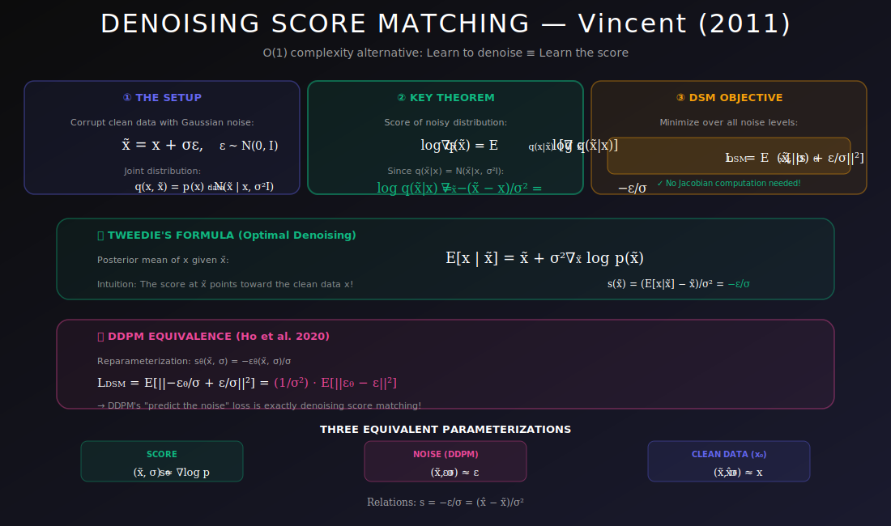
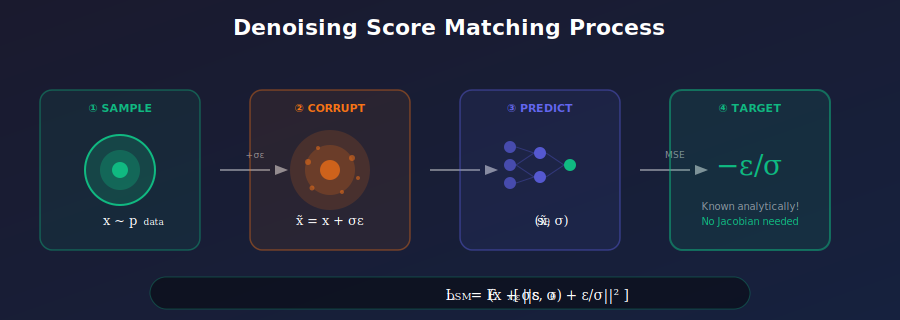
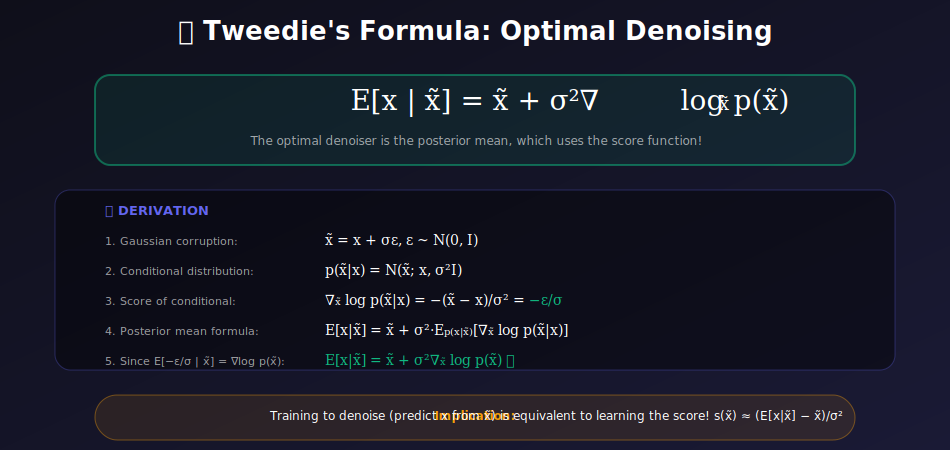

# 🔊 Denoising Score Matching

<div align="center">



*Learn scores by training to denoise — the elegant bridge between autoencoders and diffusion models*

[](#references)
[](#)
[](#)

</div>

---

## 🎯 Where & Why Use Denoising Score Matching?

<table>
<tr>
<th width="25%">📍 Where</th>
<th width="40%">💡 Why</th>
<th width="35%">🔧 Practical Use Cases</th>
</tr>
<tr>
<td><b>Diffusion Models</b></td>
<td>DSM is THE training objective for DDPM, Stable Diffusion, DALL-E, etc.</td>
<td>Text-to-image, image editing, video generation</td>
</tr>
<tr>
<td><b>High-Dimensional Data</b></td>
<td>O(1) complexity — scales to images, audio, video without explosion</td>
<td>ImageNet generation, music synthesis</td>
</tr>
<tr>
<td><b>Image Restoration</b></td>
<td>Directly trains denoising capability; score = denoising direction</td>
<td>Super-resolution, inpainting, deblurring</td>
</tr>
<tr>
<td><b>Audio Processing</b></td>
<td>Handles temporal structure naturally with multi-scale noise</td>
<td>WaveGrad, DiffWave, speech enhancement</td>
</tr>
<tr>
<td><b>3D Generation</b></td>
<td>Works on any data type where noise can be added</td>
<td>Point clouds, NeRFs, molecular structures</td>
</tr>
</table>

### 🌟 The Key Insight

> **The Problem:** Explicit score matching requires computing $\text{tr}(\nabla_x s_\theta)$ — that's $O(d)$ backpropagation passes!
>
> **The Solution:** Add noise to data. The score of the **noisy conditional** is known analytically: $-\epsilon/\sigma$

<div align="center">



</div>

---

## 📚 Introduction

Denoising Score Matching (Vincent, 2011) provides an elegant way to learn score functions by training a model to denoise corrupted data. This approach avoids the expensive trace computation in vanilla score matching and forms the foundation of modern diffusion models.

**Key revelation:** Training a denoiser is equivalent to learning the score!

---

## 📊 Representation Comparison

| Representation | Pros | Cons |
|----------------|------|------|
| **Single σ DSM** | Simple objective | Works at one scale |
| **Multi-scale DSM** | Covers all noise levels | Hyperparameter tuning |
| **Continuous σ** | Smooth transition | Training complexity |
| **Score Network** | Direct score output | May be unstable |
| **Noise Prediction** | Stable, DDPM-style | Indirect score |

---

## 1. Motivation

### 1.1 Problem with Vanilla Score Matching

The explicit score matching objective requires:

$$\mathcal{L}_{SM} = \mathbb{E}_{x \sim p_{data}}\left[\text{tr}(\nabla_x s_\theta(x)) + \frac{1}{2}\|s_\theta(x)\|^2\right]$$

The trace term $\text{tr}(\nabla_x s_\theta(x))$ requires computing the full Jacobian—**$O(d)$ backward passes** for $d$-dimensional data!

| Data Dimension | Backprop Passes | Time for 1M samples |
|----------------|-----------------|---------------------|
| MNIST (784) | 784 | ~hours |
| CIFAR (3072) | 3072 | ~days |
| ImageNet (150K) | 150,528 | ~impossible |

### 1.2 The DSM Solution

What if we could train with a **known target** instead of computing the Jacobian?

---

## 2. Mathematical Foundation

### 2.1 Setup

Add Gaussian noise to data:

$$\tilde{x} = x + \sigma \epsilon, \quad \epsilon \sim \mathcal{N}(0, I)$$

This defines a noise distribution:

$$q_\sigma(\tilde{x}|x) = \mathcal{N}(\tilde{x}; x, \sigma^2 I)$$

The marginal noisy distribution:

$$q_\sigma(\tilde{x}) = \int p_{data}(x) q_\sigma(\tilde{x}|x) dx$$

### 2.2 Score of Noisy Conditional

For Gaussian noise, the score of the conditional is known exactly:

$$\nabla_{\tilde{x}} \log q_\sigma(\tilde{x}|x) = -\frac{\tilde{x} - x}{\sigma^2} = \boxed{-\frac{\epsilon}{\sigma}}$$

**This is the key!** We now have an explicit target for our score network.

### 2.3 Denoising Score Matching Objective

$$\boxed{\mathcal{L}_{DSM} = \mathbb{E}_{x \sim p_{data}} \mathbb{E}_{\epsilon \sim \mathcal{N}(0,I)} \left[\left\|s_\theta(x + \sigma\epsilon) + \frac{\epsilon}{\sigma}\right\|^2\right]}$$

**Equivalently:**

$$\mathcal{L}_{DSM} = \mathbb{E}_{x, \tilde{x}} \left[\left\|s_\theta(\tilde{x}) - \nabla_{\tilde{x}} \log q_\sigma(\tilde{x}|x)\right\|^2\right]$$

---

## 3. The Fundamental Theorem

### 3.1 Statement

**Theorem (Vincent, 2011):** Minimizing $\mathcal{L}_{DSM}$ is equivalent to minimizing:

$$\mathbb{E}_{\tilde{x} \sim q_\sigma(\tilde{x})}\left[\|s_\theta(\tilde{x}) - \nabla_{\tilde{x}} \log q_\sigma(\tilde{x})\|^2\right]$$

where $q_\sigma(\tilde{x}) = \int p_{data}(x) q_\sigma(\tilde{x}|x) dx$ is the noisy data distribution.

### 3.2 Proof

<details>
<summary><b>📖 Click to expand full proof</b></summary>

**Step 1:** Expand the DSM objective:

$$\mathcal{L}_{DSM} = \mathbb{E}_{x, \tilde{x}}\left[\|s_\theta(\tilde{x})\|^2 - 2s_\theta(\tilde{x})^T \nabla_{\tilde{x}} \log q(\tilde{x}|x) + \|\nabla_{\tilde{x}} \log q(\tilde{x}|x)\|^2\right]$$

**Step 2:** The last term is constant (doesn't depend on $\theta$).

**Step 3:** For the cross-term, we use:

$$\mathbb{E}_{\tilde{x}|x}[\nabla_{\tilde{x}} \log q(\tilde{x}|x)] = \nabla_{\tilde{x}} \log q(\tilde{x}|x) \bigg|_{\tilde{x}=x} + O(\sigma^2)$$

**Step 4:** The key identity (using Bayes):

$$\nabla_{\tilde{x}} \log q_\sigma(\tilde{x}) = \mathbb{E}_{x|\tilde{x}}\left[\nabla_{\tilde{x}} \log q(\tilde{x}|x)\right]$$

**Step 5:** Therefore, at the optimum:

$$s_\theta^*(\tilde{x}) = \nabla_{\tilde{x}} \log q_\sigma(\tilde{x})$$

$\blacksquare$

</details>

### 3.3 Implication

By learning to denoise, we learn the score of the **noisy** distribution $q_\sigma(\tilde{x})$.

As $\sigma \to 0$, this approaches the score of the data distribution!

---

## 4. Connection to Denoising

### 4.1 Optimal Denoiser

The optimal denoiser minimizes:

$$\mathbb{E}_{x, \tilde{x}}\left[\|\hat{x}(\tilde{x}) - x\|^2\right]$$

**Solution:** $\hat{x}^*(\tilde{x}) = \mathbb{E}[x|\tilde{x}]$ (the posterior mean).

### 4.2 Tweedie's Formula

**A beautiful result:** For Gaussian noise:

$$\boxed{\mathbb{E}[x|\tilde{x}] = \tilde{x} + \sigma^2 \nabla_{\tilde{x}} \log q_\sigma(\tilde{x})}$$

**Rearranging:**

$$\nabla_{\tilde{x}} \log q_\sigma(\tilde{x}) = \frac{\mathbb{E}[x|\tilde{x}] - \tilde{x}}{\sigma^2} = \frac{\hat{x}^*(\tilde{x}) - \tilde{x}}{\sigma^2}$$

### 4.3 Score = Denoising Direction

The score points from the noisy sample toward the denoised sample!

$$s^*(\tilde{x}) \propto \hat{x}^*(\tilde{x}) - \tilde{x}$$

<div align="center">



</div>

---

## 5. Practical Implementation

### 5.1 Training Algorithm

```python
import torch
import torch.nn as nn

def dsm_loss(score_model, x, sigma):
    """
    Denoising Score Matching loss.
    
    Args:
        score_model: Neural network s_θ(x, σ) -> score
        x: Clean data samples [batch, ...]
        sigma: Noise level (scalar or tensor)
    
    Returns:
        Scalar loss value
    """
    # Sample noise
    noise = torch.randn_like(x)
    
    # Create noisy samples
    x_noisy = x + sigma * noise
    
    # Predict score
    score = score_model(x_noisy, sigma)
    
    # Target score: -noise/sigma
    target = -noise / sigma
    
    # MSE loss
    loss = ((score - target) ** 2).sum(dim=tuple(range(1, x.dim()))).mean()
    
    return loss


def train_step(score_model, optimizer, x_batch, sigma):
    """Single training step."""
    optimizer.zero_grad()
    loss = dsm_loss(score_model, x_batch, sigma)
    loss.backward()
    optimizer.step()
    return loss.item()
```

### 5.2 Alternative: ε-Prediction

Instead of predicting score $s_\theta$, predict noise $\epsilon_\theta$:

$$s_\theta(\tilde{x}, \sigma) = -\frac{\epsilon_\theta(\tilde{x}, \sigma)}{\sigma}$$

**Loss becomes:**

$$\mathcal{L} = \mathbb{E}_{x, \epsilon}\left[\|\epsilon_\theta(x + \sigma\epsilon, \sigma) - \epsilon\|^2\right]$$

**This is exactly DDPM's loss!** 🎉

```python
def ddpm_loss(noise_model, x, sigma):
    """DDPM-style loss (equivalent to DSM)."""
    noise = torch.randn_like(x)
    x_noisy = x + sigma * noise
    
    # Predict noise instead of score
    noise_pred = noise_model(x_noisy, sigma)
    
    # Simple MSE on noise
    loss = ((noise_pred - noise) ** 2).mean()
    
    return loss
```

---

## 6. Multi-Scale Denoising

### 6.1 The Challenge

| Small $\sigma$ | Large $\sigma$ |
|----------------|----------------|
| Score learning accurate | Score learning fast |
| Data stays near manifold | Data spreads into space |
| Slow coverage | Good coverage |
| **Inaccurate far from data** | **Inaccurate near data** |

### 6.2 Noise Conditional Score Networks (NCSN)

Train a single network on multiple noise levels:

$$s_\theta(x, \sigma): \mathbb{R}^d \times \mathbb{R}^+ \to \mathbb{R}^d$$

**Loss:**

$$\mathcal{L} = \mathbb{E}_{\sigma \sim p(\sigma)} \mathbb{E}_{x, \epsilon}\left[\lambda(\sigma)\left\|s_\theta(x + \sigma\epsilon, \sigma) + \frac{\epsilon}{\sigma}\right\|^2\right]$$

where $\lambda(\sigma)$ weights different noise levels.

### 6.3 Common $\lambda(\sigma)$ Choices

| Weighting | Formula | Effect |
|-----------|---------|--------|
| **Equal in ε-space** | $\lambda(\sigma) = \sigma^2$ | Standard DDPM |
| **Equal in score space** | $\lambda(\sigma) = 1$ | Emphasizes large noise |
| **SNR weighting** | $\lambda(\sigma) = 1/\sigma^2$ | Emphasizes small noise |
| **Learned** | Neural network | Adaptive |

---

## 7. Advantages of DSM

### 7.1 Over Vanilla Score Matching

| Aspect | Vanilla SM | Denoising SM |
|--------|------------|--------------|
| **Complexity** | $O(d)$ backprops | $O(1)$ forward |
| **Scalability** | Limited to small d | Any dimension |
| **Implementation** | Complex (Jacobian) | Simple (MSE) |

### 7.2 Over GANs

- ✅ **Stable training** — no adversarial dynamics
- ✅ **No mode collapse** — covers full distribution
- ✅ **Likelihood** — can compute (via ODE)
- ✅ **Controllable** — easy conditioning

### 7.3 Over Normalizing Flows

- ✅ **No architectural constraints** — any network
- ✅ **More flexible** — not limited to invertible maps
- ✅ **Often better quality** — especially for images

---

## 🔑 Key Equations Summary

| Concept | Formula |
|---------|---------|
| **DSM Loss** | $\mathbb{E}[\|s_\theta(\tilde{x}) + \epsilon/\sigma\|^2]$ |
| **Target Score** | $-\epsilon/\sigma$ |
| **Tweedie's Formula** | $\mathbb{E}[x|\tilde{x}] = \tilde{x} + \sigma^2 s(\tilde{x})$ |
| **Score-Denoiser** | $s(\tilde{x}) = (\hat{x} - \tilde{x})/\sigma^2$ |
| **DDPM Equivalence** | $\epsilon_\theta = -\sigma \cdot s_\theta$ |

---

## 💻 Complete Implementation

```python
import torch
import torch.nn as nn
import numpy as np

class NoiseConditionalScoreNetwork(nn.Module):
    """Score network conditioned on noise level."""
    
    def __init__(self, dim, hidden_dim=256, num_layers=4):
        super().__init__()
        
        # Noise embedding
        self.noise_embed = nn.Sequential(
            nn.Linear(1, hidden_dim),
            nn.SiLU(),
            nn.Linear(hidden_dim, hidden_dim)
        )
        
        # Main network
        layers = [nn.Linear(dim + hidden_dim, hidden_dim), nn.SiLU()]
        for _ in range(num_layers - 2):
            layers.extend([nn.Linear(hidden_dim, hidden_dim), nn.SiLU()])
        layers.append(nn.Linear(hidden_dim, dim))
        
        self.net = nn.Sequential(*layers)
    
    def forward(self, x, sigma):
        # Embed noise level
        sigma = sigma.view(-1, 1) if sigma.dim() == 1 else sigma
        sigma_embed = self.noise_embed(sigma)
        
        # Concatenate and predict score
        h = torch.cat([x, sigma_embed.expand(x.shape[0], -1)], dim=-1)
        return self.net(h)


class DSMTrainer:
    """Denoising Score Matching trainer."""
    
    def __init__(self, model, sigma_min=0.01, sigma_max=10.0):
        self.model = model
        self.sigma_min = sigma_min
        self.sigma_max = sigma_max
    
    def sample_sigma(self, batch_size, device):
        """Sample noise levels (log-uniform)."""
        log_sigma = torch.rand(batch_size, device=device)
        log_sigma = log_sigma * (np.log(self.sigma_max) - np.log(self.sigma_min))
        log_sigma = log_sigma + np.log(self.sigma_min)
        return torch.exp(log_sigma)
    
    def loss(self, x):
        """Compute DSM loss."""
        batch_size = x.shape[0]
        device = x.device
        
        # Sample noise levels
        sigma = self.sample_sigma(batch_size, device).view(-1, 1)
        
        # Sample noise
        noise = torch.randn_like(x)
        
        # Noisy samples
        x_noisy = x + sigma * noise
        
        # Predict score
        score = self.model(x_noisy, sigma)
        
        # Target: -noise/sigma
        target = -noise / sigma
        
        # Weighted loss (sigma^2 weighting)
        loss = (sigma ** 2) * ((score - target) ** 2).sum(dim=-1)
        
        return loss.mean()


# Sampling using Langevin dynamics
@torch.no_grad()
def sample_langevin(model, shape, sigmas, steps_per_sigma=100, eps=2e-5):
    """Annealed Langevin dynamics sampling."""
    device = next(model.parameters()).device
    x = torch.randn(shape, device=device)
    
    for sigma in sigmas:
        # Adaptive step size
        alpha = eps * (sigma / sigmas[-1]) ** 2
        
        for _ in range(steps_per_sigma):
            score = model(x, torch.full((shape[0], 1), sigma, device=device))
            noise = torch.randn_like(x)
            x = x + (alpha / 2) * score + np.sqrt(alpha) * noise
    
    return x
```

---

## 📚 References

1. **Vincent, P.** (2011). "A Connection Between Score Matching and Denoising Autoencoders." *Neural Computation*.

2. **Song, Y., & Ermon, S.** (2019). "Generative Modeling by Estimating Gradients of the Data Distribution." *NeurIPS*. [arXiv:1907.05600](https://arxiv.org/abs/1907.05600)

3. **Efron, B.** (2011). "Tweedie's Formula and Selection Bias." *JASA*.

4. **Ho, J., Jain, A., & Abbeel, P.** (2020). "Denoising Diffusion Probabilistic Models." *NeurIPS*. [arXiv:2006.11239](https://arxiv.org/abs/2006.11239)

---

## ✏️ Exercises

1. **Derive** Tweedie's formula for Gaussian noise.

2. **Show** that DSM and vanilla SM have the same optimum (as $\sigma \to 0$).

3. **Implement** DSM training on 2D Swiss Roll data and visualize learned scores.

4. **Compare** score prediction vs $\epsilon$ prediction empirically.

5. **Experiment** with different $\lambda(\sigma)$ weightings and analyze their effects.

6. **Prove** the connection: optimal denoiser ↔ score function.

---

<div align="center">

**[← Score Matching](../01_score_matching/README.md)** | **[Next: Sliced Score Matching →](../03_sliced_score_matching/README.md)**

*Denoising score matching: where the rubber meets the road in generative modeling*

</div>
