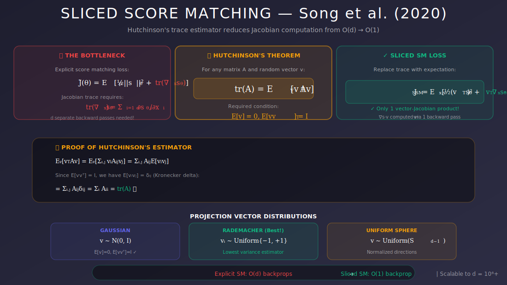

# 🎯 Sliced Score Matching

<div align="center">



*Random projections turn O(d) into O(1) — scalable score estimation for any dimension*

[](#references)
[](#)
[](#)

</div>

---

## 🎯 Where & Why Use Sliced Score Matching?

<table>
<tr>
<th width="25%">📍 Where</th>
<th width="40%">💡 Why</th>
<th width="35%">🔧 Practical Use Cases</th>
</tr>
<tr>
<td><b>When DSM Isn't Suitable</b></td>
<td>No noise injection needed — learn true score directly</td>
<td>When noise perturbation alters data semantics</td>
</tr>
<tr>
<td><b>High-Dimensional Density</b></td>
<td>O(1) computation regardless of data dimension</td>
<td>Large-scale point cloud modeling</td>
</tr>
<tr>
<td><b>Energy-Based Models</b></td>
<td>Train EBMs without MCMC sampling during training</td>
<td>Implicit density models, contrastive learning</td>
</tr>
<tr>
<td><b>Hybrid Methods</b></td>
<td>Can combine with denoising for best of both worlds</td>
<td>Multi-scale score networks</td>
</tr>
<tr>
<td><b>Theoretical Analysis</b></td>
<td>Unbiased estimator with known variance properties</td>
<td>Research, ablation studies</td>
</tr>
</table>

### 🌟 The Key Insight

> **The Problem:** Computing $\text{tr}(\nabla_x s_\theta)$ requires $d$ backpropagation passes for $d$-dimensional data.
>
> **The Solution:** Use random projections! $\text{tr}(A) = \mathbb{E}_v[v^T A v]$ — estimate the trace with just ONE backprop!

---

## 📊 Representation Comparison

| Representation | Pros | Cons |
|----------------|------|------|
| **Gaussian Projections** | Unbiased, smooth | Slightly higher variance |
| **Rademacher Projections** | Lower variance | Discrete |
| **Single Projection** | Fastest (O(1)) | Highest variance |
| **Multiple Projections** | Lower variance | More computation |
| **Variance Reduction** | Best accuracy | Complex implementation |

---

## 📚 Introduction

Sliced Score Matching (Song et al., 2020) provides a scalable alternative to vanilla score matching. Instead of computing the full Jacobian trace, it projects the score onto random directions, reducing computational cost from $O(d)$ to $O(1)$ gradient computations per sample.

---

## 1. Motivation

### 1.1 Vanilla Score Matching Recap

$$\mathcal{L}_{SM} = \mathbb{E}_{x}\left[\text{tr}(\nabla_x s_\theta(x)) + \frac{1}{2}\|s_\theta(x)\|^2\right]$$

The trace term requires $d$ backward passes (one per dimension).

### 1.2 The Computational Burden

| Data Type | Dimension | Backprops per Sample | For 1M samples |
|-----------|-----------|---------------------|----------------|
| Toy 2D | 2 | 2 | 2M |
| MNIST | 784 | 784 | 784M |
| CIFAR-10 | 3,072 | 3,072 | 3B |
| ImageNet | 150,528 | 150,528 | 150T |

**This is clearly impractical!**

### 1.3 The SSM Insight

Instead of computing the full trace, estimate it via random projections:

$$\text{tr}(A) = \mathbb{E}_{v \sim p(v)}[v^T A v]$$

where $v$ has $\mathbb{E}[vv^T] = I$ (e.g., Rademacher or Gaussian).

---

## 2. Mathematical Foundation

### 2.1 Hutchinson's Trace Estimator

**Theorem (Hutchinson, 1989):** For any matrix $A$ and random vector $v$ with $\mathbb{E}[v] = 0$, $\mathbb{E}[vv^T] = I$:

$$\boxed{\text{tr}(A) = \mathbb{E}_v[v^T A v]}$$

<details>
<summary><b>📖 Click to expand proof</b></summary>

Using the cyclic property of trace:

$$\mathbb{E}[v^T A v] = \mathbb{E}[\text{tr}(v^T A v)] = \mathbb{E}[\text{tr}(A vv^T)] = \text{tr}(A \mathbb{E}[vv^T]) = \text{tr}(A \cdot I) = \text{tr}(A)$$

$\blacksquare$

</details>

### 2.2 Sliced Score Matching Objective

Applying Hutchinson's estimator to the score matching objective:

$$\boxed{\mathcal{L}_{SSM} = \mathbb{E}_{x \sim p_{data}} \mathbb{E}_{v \sim p(v)}\left[v^T \nabla_x s_\theta(x) v + \frac{1}{2}(v^T s_\theta(x))^2\right]}$$

### 2.3 The Computational Trick

Note that $v^T \nabla_x s_\theta(x) v = \nabla_x(v^T s_\theta(x)) \cdot v$ when $v$ is fixed.

Using automatic differentiation:

$$v^T \nabla_x s_\theta(x) v = \nabla_x[v^T s_\theta(x)]^T v$$

**This requires only ONE backward pass regardless of dimension!** 🎉

---

## 3. Projection Distributions

### 3.1 Gaussian Projections

$$v \sim \mathcal{N}(0, I)$$

| Pros | Cons |
|------|------|
| Unbiased trace estimator | Higher variance |
| Smooth gradients | More memory |
| Well-studied | |

### 3.2 Rademacher Projections

$$v_i \sim \text{Uniform}\{-1, +1\}$$

| Pros | Cons |
|------|------|
| Unbiased trace estimator | Discrete (less smooth) |
| **Lower variance** | |
| Fast to sample | |
| **Commonly used in practice** | |

### 3.3 Variance Comparison

For a matrix $A$:

| Distribution | Variance Formula |
|--------------|------------------|
| Gaussian | $\text{Var}[v^T A v] = 2\|A\|_F^2 + (\text{tr}(A))^2$ |
| Rademacher | $\text{Var}[v^T A v] = 2\sum_{i \neq j} A_{ij}^2$ |

**Rademacher has lower variance when diagonal elements dominate** — which is often the case for Jacobians of score networks!

---

## 4. Algorithm

### 4.1 Single Projection Implementation

```python
import torch

def sliced_score_matching_loss(score_model, x, num_projections=1):
    """
    Sliced Score Matching loss.
    
    Args:
        score_model: Neural network outputting score
        x: Data samples [batch, dim]
        num_projections: Number of random projections (default: 1)
    
    Returns:
        Scalar loss value
    """
    batch_size = x.shape[0]
    total_loss = 0
    
    for _ in range(num_projections):
        # Sample random projection direction (Rademacher)
        v = torch.randint(0, 2, x.shape, device=x.device).float() * 2 - 1
        # Or Gaussian: v = torch.randn_like(x)
        
        x.requires_grad_(True)
        
        # Compute score
        score = score_model(x)
        
        # Compute v^T * score (scalar per sample)
        v_score = (v * score).sum(dim=-1)
        
        # Compute gradient: ∇_x(v^T s(x)) - this is the key!
        grad_v_score = torch.autograd.grad(
            v_score.sum(),  # Sum over batch for single backward
            x, 
            create_graph=True
        )[0]
        
        # v^T ∇_x s(x) v = (∇_x(v^T s(x)))^T v
        trace_term = (grad_v_score * v).sum(dim=-1)
        
        # ||v^T s(x)||^2 / 2
        norm_term = 0.5 * v_score ** 2
        
        loss = (trace_term + norm_term).mean()
        total_loss += loss
    
    return total_loss / num_projections
```

### 4.2 Multiple Projections for Variance Reduction

Using $k$ projections reduces variance by factor of $k$:

$$\text{Var}[\bar{L}_k] = \frac{\text{Var}[L]}{k}$$

**Trade-off:** More projections = lower variance but higher compute.

```python
def ssm_loss_multi_proj(score_model, x, num_projections=4):
    """SSM with multiple projections for lower variance."""
    losses = []
    
    x.requires_grad_(True)
    score = score_model(x)
    
    for _ in range(num_projections):
        v = torch.randint(0, 2, x.shape, device=x.device).float() * 2 - 1
        
        v_score = (v * score).sum(dim=-1)
        
        grad_v_score = torch.autograd.grad(
            v_score.sum(), x, 
            create_graph=True, retain_graph=True
        )[0]
        
        trace_term = (grad_v_score * v).sum(dim=-1)
        norm_term = 0.5 * v_score ** 2
        
        losses.append((trace_term + norm_term).mean())
    
    return sum(losses) / len(losses)
```

---

## 5. Comparison with Other Methods

| Method | Per-Sample Cost | Variance | Bias | Noise Required |
|--------|-----------------|----------|------|----------------|
| **Explicit SM** | $O(d)$ backward | 0 | 0 | No |
| **Denoising SM** | $O(1)$ forward | Low | None* | **Yes** |
| **Sliced SM** | $O(1)$ backward | Medium | 0 | **No** |

*DSM is unbiased for the noisy distribution.

---

## 6. Practical Considerations

### 6.1 When to Use SSM

**✅ Advantages:**
- No noise injection needed
- Learns true score (not noisy score)
- Single projection often sufficient for training
- Theoretically elegant

**❌ Disadvantages:**
- Higher variance than DSM
- May need more iterations to converge
- Gradient computation still required

### 6.2 Combining with Denoising

Can combine SSM with multiple noise levels for best of both worlds:

$$\mathcal{L} = \mathbb{E}_\sigma \mathbb{E}_x \mathbb{E}_v\left[\mathcal{L}_{SSM}(s_\theta, x + \sigma\epsilon, v)\right]$$

### 6.3 Number of Projections

| Projections | Use Case | Notes |
|-------------|----------|-------|
| $k = 1$ | Training | Often sufficient |
| $k = 4-10$ | Evaluation | Lower variance |
| $k > 10$ | Rarely needed | Diminishing returns |

---

## 7. Variance Reduction Techniques

### 7.1 Control Variates

Subtract a baseline with known expectation:

$$\hat{L} = v^T J v - c(v^T v - d)$$

where $c$ is chosen to minimize variance.

### 7.2 Antithetic Sampling

Use both $v$ and $-v$:

$$\hat{L} = \frac{1}{2}(f(v) + f(-v))$$

Reduces variance when $f$ is approximately linear.

```python
def ssm_antithetic(score_model, x):
    """SSM with antithetic sampling for variance reduction."""
    x.requires_grad_(True)
    score = score_model(x)
    
    v = torch.randint(0, 2, x.shape, device=x.device).float() * 2 - 1
    
    # Compute for +v
    v_score_pos = (v * score).sum(dim=-1)
    grad_pos = torch.autograd.grad(v_score_pos.sum(), x, create_graph=True, retain_graph=True)[0]
    loss_pos = (grad_pos * v).sum(dim=-1) + 0.5 * v_score_pos ** 2
    
    # Compute for -v (trace term has opposite sign, norm is same)
    v_score_neg = (-v * score).sum(dim=-1)  # = -v_score_pos
    grad_neg = torch.autograd.grad(v_score_neg.sum(), x, create_graph=True)[0]  # = -grad_pos
    loss_neg = (grad_neg * (-v)).sum(dim=-1) + 0.5 * v_score_neg ** 2
    
    return 0.5 * (loss_pos + loss_neg).mean()
```

### 7.3 Quasi-Random Sequences

Use low-discrepancy sequences instead of random:
- Halton sequences
- Sobol sequences

Better coverage of projection space → lower variance.

---

## 🔑 Key Equations Summary

| Concept | Formula |
|---------|---------|
| **Trace Estimator** | $\text{tr}(A) = \mathbb{E}_v[v^T A v]$ |
| **SSM Loss** | $\mathbb{E}_{x,v}[v^T \nabla_x s_\theta v + \frac{1}{2}(v^T s_\theta)^2]$ |
| **Gradient Trick** | $v^T J v = v^T \nabla_x(v^T s)$ |
| **Variance (Rademacher)** | $2\sum_{i \neq j} J_{ij}^2$ |

---

## 💻 Complete Implementation

```python
import torch
import torch.nn as nn
import numpy as np

class SlicedScoreMatching:
    """Complete SSM training framework."""
    
    def __init__(self, score_model, projection_type='rademacher'):
        self.model = score_model
        self.projection_type = projection_type
    
    def sample_projection(self, shape, device):
        """Sample random projection vector."""
        if self.projection_type == 'rademacher':
            return torch.randint(0, 2, shape, device=device).float() * 2 - 1
        elif self.projection_type == 'gaussian':
            v = torch.randn(shape, device=device)
            return v / v.norm(dim=-1, keepdim=True)
        else:
            raise ValueError(f"Unknown projection type: {self.projection_type}")
    
    def loss(self, x, num_projections=1):
        """Compute SSM loss."""
        x = x.requires_grad_(True)
        score = self.model(x)
        
        total_loss = 0
        
        for _ in range(num_projections):
            v = self.sample_projection(x.shape, x.device)
            
            # v^T s(x)
            v_score = (v * score).sum(dim=-1)
            
            # ∇_x (v^T s(x))
            grad_v_score = torch.autograd.grad(
                v_score.sum(), x,
                create_graph=True, retain_graph=True
            )[0]
            
            # v^T ∇s v + 0.5 * (v^T s)^2
            trace_estimate = (grad_v_score * v).sum(dim=-1)
            norm_term = 0.5 * v_score ** 2
            
            total_loss += (trace_estimate + norm_term).mean()
        
        return total_loss / num_projections
    
    def train_step(self, optimizer, x, num_projections=1):
        """Single training step."""
        optimizer.zero_grad()
        loss = self.loss(x, num_projections)
        loss.backward()
        optimizer.step()
        return loss.item()


# Simple score network
class ScoreNet(nn.Module):
    def __init__(self, dim, hidden=128):
        super().__init__()
        self.net = nn.Sequential(
            nn.Linear(dim, hidden),
            nn.SiLU(),
            nn.Linear(hidden, hidden),
            nn.SiLU(),
            nn.Linear(hidden, dim)
        )
    
    def forward(self, x):
        return self.net(x)


# Example usage
if __name__ == "__main__":
    # Create toy data (2D Gaussian mixture)
    def sample_data(n):
        means = torch.tensor([[2., 2.], [-2., -2.]])
        idx = torch.randint(0, 2, (n,))
        return means[idx] + 0.3 * torch.randn(n, 2)
    
    # Initialize
    model = ScoreNet(dim=2)
    ssm = SlicedScoreMatching(model, projection_type='rademacher')
    optimizer = torch.optim.Adam(model.parameters(), lr=1e-3)
    
    # Train
    for step in range(1000):
        x = sample_data(256)
        loss = ssm.train_step(optimizer, x, num_projections=2)
        
        if step % 100 == 0:
            print(f"Step {step}: loss = {loss:.4f}")
```

---

## 📚 References

1. **Song, Y., Garg, S., Shi, J., & Ermon, S.** (2020). "Sliced Score Matching: A Scalable Approach to Density and Score Estimation." *UAI*. [arXiv:1905.07088](https://arxiv.org/abs/1905.07088)

2. **Hutchinson, M. F.** (1989). "A Stochastic Estimator of the Trace of the Influence Matrix for Laplacian Smoothing Splines." *Communications in Statistics*.

3. **Avron, H., & Toledo, S.** (2011). "Randomized algorithms for estimating the trace of an implicit symmetric positive semi-definite matrix." *JACM*.

---

## ✏️ Exercises

1. **Prove** Hutchinson's trace estimator for Rademacher vectors.

2. **Implement** SSM and compare variance with Gaussian vs Rademacher projections.

3. **Show** empirically that 1 projection is often sufficient for training.

4. **Compare** SSM vs DSM training curves on 2D toy data.

5. **Derive** the optimal control variate coefficient for variance reduction.

6. **Implement** antithetic sampling and measure variance reduction.

---

<div align="center">

**[← Denoising Score Matching](../02_denoising_score_matching/README.md)** | **[Next: Langevin Dynamics →](../04_langevin_dynamics/README.md)**

*Sliced score matching: when you need exact scores at scale*

</div>
