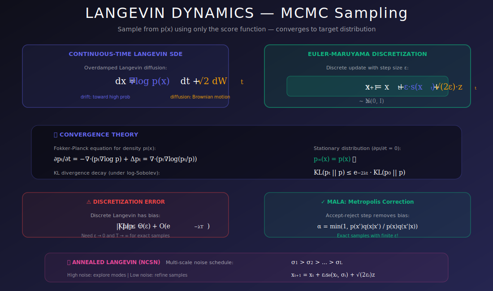
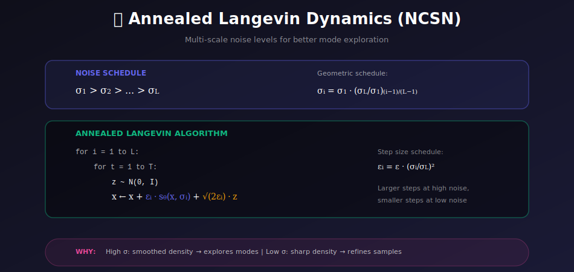

# 🚶 Langevin Dynamics for Sampling

<div align="center">



*Sample from any distribution using only its score — the key that unlocks generation*

[](#)
[](#)
[](#)

</div>

---

## 🎯 Where & Why Use Langevin Dynamics?

<table>
<tr>
<th width="25%">📍 Where</th>
<th width="40%">💡 Why</th>
<th width="35%">🔧 Practical Use Cases</th>
</tr>
<tr>
<td><b>Diffusion Model Sampling</b></td>
<td>Reverse-time SDE is essentially Langevin with time-varying score</td>
<td>DDPM, NCSN, Score SDE image generation</td>
</tr>
<tr>
<td><b>Bayesian Posterior Sampling</b></td>
<td>Sample from p(θ|data) without computing normalization</td>
<td>Bayesian neural networks, uncertainty quantification</td>
</tr>
<tr>
<td><b>Energy-Based Models</b></td>
<td>Generate samples from learned energy function</td>
<td>Implicit generative models, contrastive learning</td>
</tr>
<tr>
<td><b>Molecular Dynamics</b></td>
<td>Sample molecular configurations from Boltzmann distribution</td>
<td>Drug discovery, protein folding</td>
</tr>
<tr>
<td><b>Optimization</b></td>
<td>Escape local minima via noise injection</td>
<td>Stochastic gradient Langevin dynamics (SGLD)</td>
</tr>
</table>

### 🌟 The Key Insight

> **The Problem:** We have a score function $s(x) = \nabla_x \log p(x)$ but need actual samples from $p(x)$.
>
> **The Solution:** Langevin dynamics converts the score into a sampling algorithm — follow the score + add noise → converge to the target!

---

## 📊 Representation Comparison

| Representation | Pros | Cons |
|----------------|------|------|
| **ULA (Unadjusted)** | Simple, fast | Asymptotic bias |
| **MALA (Metropolis)** | Unbiased | Rejection overhead |
| **Annealed Langevin** | Multi-scale sampling | Hyperparameter tuning |
| **Predictor-Corrector** | Combines ODE+Langevin | Two steps per iteration |
| **SDE Solver** | Continuous time | Discretization choice |

---

## 📚 Introduction

Langevin dynamics provides a principled way to sample from a probability distribution using only its score function. This is the key that connects score-based models to generative modeling: once we learn the score, we can generate samples via Langevin MCMC.

---

## 1. Physical Motivation

### 1.1 Overdamped Langevin Equation

From statistical physics, a particle in a potential $U(x)$ at temperature $T$ follows:

$$dx = -\nabla U(x) dt + \sqrt{2T} \, dW_t$$

where $dW_t$ is Brownian motion (random walk).

### 1.2 Connection to Probability

For distribution $p(x) \propto \exp(-U(x))$ at unit temperature:

$$\nabla \log p(x) = -\nabla U(x)$$

So Langevin dynamics becomes:

$$\boxed{dx = \nabla_x \log p(x) \, dt + \sqrt{2} \, dW_t}$$

**At equilibrium, $x$ is distributed according to $p(x)$!**

### 1.3 Physical Intuition

| Component | Physical Meaning | Effect |
|-----------|-----------------|--------|
| $\nabla \log p(x)$ | Force toward low energy | Pulls toward high probability |
| $\sqrt{2} \, dW_t$ | Thermal fluctuations | Enables exploration |

---

## 2. Discrete Langevin Dynamics

### 2.1 Euler-Maruyama Discretization

$$\boxed{x_{t+1} = x_t + \epsilon \nabla_x \log p(x_t) + \sqrt{2\epsilon} \, z_t}$$

where $z_t \sim \mathcal{N}(0, I)$ and $\epsilon$ is the step size.

### 2.2 Equivalently (with our notation):

$$x_{t+1} = x_t + \frac{\epsilon}{2} s(x_t) + \sqrt{\epsilon} \, z_t$$

where $s(x) = \nabla_x \log p(x)$ is the score.

### 2.3 Unadjusted Langevin Algorithm (ULA)

```python
def langevin_sampling(score_fn, x_init, num_steps, step_size):
    """
    Sample using Langevin dynamics.
    
    Args:
        score_fn: Function computing ∇log p(x)
        x_init: Initial sample (often random noise)
        num_steps: Number of Langevin steps
        step_size: Step size ε
    
    Returns:
        Sample approximately from p(x)
    """
    x = x_init.clone()
    
    for t in range(num_steps):
        noise = torch.randn_like(x)
        score = score_fn(x)
        x = x + (step_size / 2) * score + np.sqrt(step_size) * noise
    
    return x
```

### 2.4 Step Size Considerations

| Step Size | Effect |
|-----------|--------|
| **Too large** | Unstable, may diverge |
| **Too small** | Slow mixing, many iterations needed |
| **Optimal** | Balance between bias and efficiency |

**Rule of thumb:** $\epsilon \propto 1/L$ where $L$ is Lipschitz constant of score.

---

## 3. Theoretical Properties

### 3.1 Stationary Distribution

**Theorem:** Under mild conditions, as $t \to \infty$:

$$x_t \xrightarrow{d} p(x)$$

The distribution of iterates converges to the target.

### 3.2 Discretization Error

For step size $\epsilon$, the stationary distribution $\tilde{p}$ differs from $p$:

$$D_{TV}(p, \tilde{p}) = O(\epsilon)$$

**To get exact samples:** Use Metropolis-Hastings correction (MALA).

### 3.3 Mixing Time

Time to reach approximate equilibrium:

$$\tau_{mix} = O\left(\frac{d}{\epsilon \cdot \lambda_{min}}\right)$$

where $\lambda_{min}$ is the smallest eigenvalue of the Hessian (curvature).

**Translation:** Sharper peaks = slower mixing.

---

## 4. Annealed Langevin Dynamics

<div align="center">



</div>

### 4.1 The Problem with Vanilla Langevin

For multimodal distributions or data on low-dimensional manifolds:
- **Slow mixing** between modes (may take exponential time!)
- **Score estimation inaccurate** far from data

### 4.2 Solution: Noise Annealing

Use a sequence of noise levels $\sigma_1 > \sigma_2 > \cdots > \sigma_L$:

1. Start with noisy distribution $q_{\sigma_1}$ (modes connected)
2. Run Langevin dynamics to mix
3. Move to less noisy $q_{\sigma_2}$
4. Repeat until $q_{\sigma_L} \approx p_{data}$

### 4.3 Algorithm

```python
def annealed_langevin_dynamics(score_model, x_init, sigmas, 
                                steps_per_sigma, base_step_size):
    """
    Annealed Langevin dynamics for NCSN.
    
    Args:
        score_model: Network s_θ(x, σ) predicting score at noise level σ
        x_init: Initial sample (random noise)
        sigmas: Decreasing noise levels [σ₁, σ₂, ..., σₗ]
        steps_per_sigma: Langevin steps per noise level
        base_step_size: Base step size (adjusted per sigma)
    
    Returns:
        Final sample (approximately from p_data)
    """
    x = x_init.clone()
    
    for sigma in sigmas:  # From high to low noise
        # Adaptive step size: smaller for smaller sigma
        alpha = base_step_size * (sigma / sigmas[-1]) ** 2
        
        for _ in range(steps_per_sigma):
            noise = torch.randn_like(x)
            score = score_model(x, sigma)
            
            # Langevin update
            x = x + (alpha / 2) * score + np.sqrt(alpha) * noise
    
    return x
```

### 4.4 Why Annealing Helps

| Noise Level | Distribution Property | Benefit |
|-------------|----------------------|---------|
| **High σ** | Spread out, modes connected | Easy mixing between modes |
| **Medium σ** | Intermediate | Transition |
| **Low σ** | Sharp, near data | Accurate final samples |

---

## 5. Metropolis-Adjusted Langevin (MALA)

### 5.1 The Bias Problem

ULA has discretization bias — the stationary distribution is NOT exactly $p(x)$.

### 5.2 Adding Metropolis-Hastings Correction

**Proposal:** $x' = x + \epsilon \nabla \log p(x) + \sqrt{2\epsilon} \, z$

**Accept with probability:**

$$\alpha = \min\left(1, \frac{p(x') q(x|x')}{p(x) q(x'|x)}\right)$$

where $q(x'|x) = \mathcal{N}(x'; x + \epsilon \nabla \log p(x), 2\epsilon I)$.

### 5.3 Acceptance Probability

$$\log \alpha = \log p(x') - \log p(x) - \frac{\|x - x' - \epsilon \nabla \log p(x')\|^2}{4\epsilon} + \frac{\|x' - x - \epsilon \nabla \log p(x)\|^2}{4\epsilon}$$

### 5.4 MALA Implementation

```python
def mala_step(score_fn, log_prob_fn, x, step_size):
    """Single MALA step with accept/reject."""
    # Propose
    noise = torch.randn_like(x)
    x_mean = x + step_size * score_fn(x)
    x_proposal = x_mean + np.sqrt(2 * step_size) * noise
    
    # Compute acceptance probability
    log_p_x = log_prob_fn(x)
    log_p_xp = log_prob_fn(x_proposal)
    
    # Forward proposal: q(x'|x)
    log_q_forward = -torch.sum((x_proposal - x_mean)**2) / (4 * step_size)
    
    # Backward proposal: q(x|x')
    xp_mean = x_proposal + step_size * score_fn(x_proposal)
    log_q_backward = -torch.sum((x - xp_mean)**2) / (4 * step_size)
    
    # Acceptance ratio
    log_alpha = log_p_xp - log_p_x + log_q_backward - log_q_forward
    
    # Accept/reject
    if torch.log(torch.rand(1)) < log_alpha:
        return x_proposal, True
    else:
        return x, False
```

### 5.5 ULA vs MALA

| Property | ULA | MALA |
|----------|-----|------|
| **Bias** | $O(\epsilon)$ | 0 (exact) |
| **Cost per step** | 1 score eval | 2 score evals |
| **Rejection** | None | Yes (can be high) |
| **Practical** | Often sufficient | When exact samples needed |

---

## 6. Practical Considerations

### 6.1 Initialization

| Strategy | Pros | Cons |
|----------|------|------|
| **Random Gaussian** | Simple | May start far from data |
| **Prior samples** | Relevant region | May miss modes |
| **Annealed** | Best coverage | More complex |

### 6.2 Step Size Scheduling

| Schedule | Formula | Use Case |
|----------|---------|----------|
| **Constant** | $\epsilon_t = \epsilon$ | Simple baseline |
| **Polynomial decay** | $\epsilon_t = \epsilon_0 / t^\gamma$ | Convergence guarantee |
| **Proportional to σ** | $\epsilon_t = c \sigma_t^2$ | NCSN/diffusion |

### 6.3 Convergence Diagnostics

- Track sample statistics (mean, variance)
- Monitor acceptance rate (MALA): target ~57%
- Visual inspection of samples
- Effective sample size

---

## 7. Connection to Diffusion Models

### 7.1 Reverse SDE is Langevin!

Diffusion model sampling can be viewed as:

$$dx = [f(x,t) - g(t)^2 \nabla_x \log p_t(x)] dt + g(t) d\bar{W}_t$$

This is essentially Langevin dynamics with **time-varying score**!

### 7.2 Probability Flow ODE

Deterministic alternative (same marginals):

$$dx = \left[f(x,t) - \frac{1}{2}g(t)^2 \nabla_x \log p_t(x)\right] dt$$

No noise injection — pure gradient flow.

---

## 🔑 Key Equations Summary

| Concept | Formula |
|---------|---------|
| **Continuous Langevin** | $dx = \nabla \log p(x) \, dt + \sqrt{2} \, dW_t$ |
| **Discrete Langevin** | $x_{t+1} = x_t + \frac{\epsilon}{2}s(x_t) + \sqrt{\epsilon} \, z_t$ |
| **MALA Acceptance** | $\alpha = \min(1, \frac{p(x')q(x|x')}{p(x)q(x'|x)})$ |
| **Annealed Step Size** | $\alpha = \epsilon \cdot (\sigma / \sigma_L)^2$ |

---

## 💻 Complete Implementation

```python
import torch
import torch.nn as nn
import numpy as np
from tqdm import tqdm

class LangevinSampler:
    """Complete Langevin sampling framework."""
    
    def __init__(self, score_model, device='cuda'):
        self.model = score_model
        self.device = device
    
    @torch.no_grad()
    def sample_ula(self, shape, num_steps, step_size, return_trajectory=False):
        """Unadjusted Langevin Algorithm."""
        x = torch.randn(shape, device=self.device)
        trajectory = [x.clone()] if return_trajectory else None
        
        for _ in tqdm(range(num_steps), desc="ULA Sampling"):
            noise = torch.randn_like(x)
            score = self.model(x)
            x = x + (step_size / 2) * score + np.sqrt(step_size) * noise
            
            if return_trajectory:
                trajectory.append(x.clone())
        
        return (x, trajectory) if return_trajectory else x
    
    @torch.no_grad()
    def sample_annealed(self, shape, sigmas, steps_per_sigma, base_eps):
        """Annealed Langevin Dynamics."""
        x = torch.randn(shape, device=self.device)
        
        for sigma in tqdm(sigmas, desc="Annealed Langevin"):
            # Adaptive step size
            eps = base_eps * (sigma / sigmas[-1]) ** 2
            sigma_tensor = torch.full((shape[0], 1), sigma, device=self.device)
            
            for _ in range(steps_per_sigma):
                noise = torch.randn_like(x)
                score = self.model(x, sigma_tensor)
                x = x + (eps / 2) * score + np.sqrt(eps) * noise
        
        return x
    
    @torch.no_grad()
    def sample_predictor_corrector(self, shape, sigmas, predictor_steps=1, 
                                    corrector_steps=1, snr=0.1):
        """Predictor-Corrector sampling (Song et al., 2021)."""
        x = torch.randn(shape, device=self.device) * sigmas[0]
        
        for i, sigma in enumerate(tqdm(sigmas[:-1], desc="PC Sampling")):
            sigma_next = sigmas[i + 1]
            sigma_t = torch.full((shape[0], 1), sigma, device=self.device)
            
            # Predictor: move to next noise level
            for _ in range(predictor_steps):
                score = self.model(x, sigma_t)
                x = x + (sigma ** 2 - sigma_next ** 2) * score
                x = x + np.sqrt(sigma ** 2 - sigma_next ** 2) * torch.randn_like(x)
            
            # Corrector: Langevin steps at current noise level
            sigma_next_t = torch.full((shape[0], 1), sigma_next, device=self.device)
            for _ in range(corrector_steps):
                score = self.model(x, sigma_next_t)
                eps = 2 * (snr * sigma_next) ** 2
                x = x + eps * score + np.sqrt(2 * eps) * torch.randn_like(x)
        
        return x


# Example noise schedule
def get_sigmas(sigma_max=80, sigma_min=0.01, num_levels=100):
    """Geometric noise schedule."""
    return torch.exp(
        torch.linspace(np.log(sigma_max), np.log(sigma_min), num_levels)
    )
```

---

## 📚 References

1. **Roberts, G. O., & Tweedie, R. L.** (1996). "Exponential Convergence of Langevin Distributions and Their Discrete Approximations." *Bernoulli*.

2. **Song, Y., & Ermon, S.** (2019). "Generative Modeling by Estimating Gradients of the Data Distribution." *NeurIPS*.

3. **Welling, M., & Teh, Y. W.** (2011). "Bayesian Learning via Stochastic Gradient Langevin Dynamics." *ICML*.

4. **Song, Y., et al.** (2021). "Score-Based Generative Modeling through Stochastic Differential Equations." *ICLR*.

---

## ✏️ Exercises

1. **Implement** Langevin dynamics for a 2D Gaussian mixture and visualize the trajectory.

2. **Show** mathematically that Langevin dynamics leaves $p(x)$ invariant.

3. **Compare** ULA vs MALA in terms of samples per second to convergence.

4. **Implement** annealed Langevin dynamics and visualize intermediate samples.

5. **Derive** the acceptance probability for MALA from detailed balance.

6. **Experiment** with different step size schedules and measure convergence.

---

<div align="center">

**[← Sliced Score Matching](../03_sliced_score_matching/README.md)** | **[Next: SDE Formulation →](../05_sde_formulation/README.md)**

*Langevin dynamics: where physics meets machine learning*

</div>
