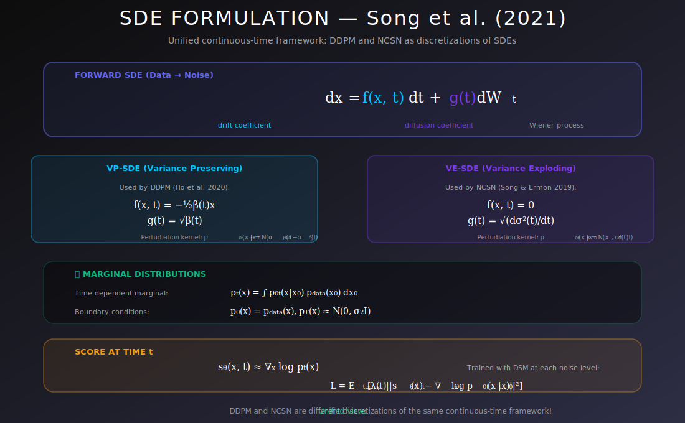

# 📈 Stochastic Differential Equation Formulation

<div align="center">



*The unified continuous-time framework — where diffusion models truly live*

[](#references)
[](#)
[](#)

</div>

---

## 🎯 Where & Why Use the SDE Formulation?

<table>
<tr>
<th width="25%">📍 Where</th>
<th width="40%">💡 Why</th>
<th width="35%">🔧 Practical Use Cases</th>
</tr>
<tr>
<td><b>Modern Diffusion Models</b></td>
<td>Unified view of DDPM, NCSN, and score-based models</td>
<td>Stable Diffusion, DALL-E 2, Imagen</td>
</tr>
<tr>
<td><b>Flexible Sampling</b></td>
<td>Any ODE/SDE solver can be used; adaptive stepping</td>
<td>Faster inference with fewer steps</td>
</tr>
<tr>
<td><b>Theoretical Analysis</b></td>
<td>Rich mathematical tools from stochastic calculus</td>
<td>Convergence proofs, error bounds</td>
</tr>
<tr>
<td><b>New Model Design</b></td>
<td>Design new SDEs with desired properties</td>
<td>Custom noise schedules, manifold diffusion</td>
</tr>
<tr>
<td><b>Exact Likelihood</b></td>
<td>Probability flow ODE enables exact log-likelihood</td>
<td>Model comparison, density estimation</td>
</tr>
</table>

### 🌟 The Key Insight

> **The Problem:** Discrete-step models (DDPM, NCSN) seem like different approaches.
>
> **The Solution:** They're all discretizations of the same continuous-time SDE framework!

---

## 📊 Representation Comparison

| Representation | Pros | Cons |
|----------------|------|------|
| **VP SDE** | DDPM connection, bounded variance | Complex schedule |
| **VE SDE** | SMLD connection, simple | Unbounded variance |
| **Sub-VP** | Better likelihood | Less studied |
| **Critically Damped** | Optimal transport | More complex |
| **Flow Matching** | Straight paths | Different training |

---

## 📚 Introduction

The SDE formulation (Song et al., 2021) provides a unified continuous-time framework for score-based generative models and diffusion models. It connects discrete denoising steps to continuous stochastic processes, enabling new theoretical insights and practical improvements.

---

## 1. Forward SDE: Data → Noise

### 1.1 General Form

The forward (noising) process is described by:

$$\boxed{dx = f(x, t) \, dt + g(t) \, dW_t}$$

where:
- $f(x, t)$: **Drift coefficient** (deterministic force)
- $g(t)$: **Diffusion coefficient** (noise scale)
- $W_t$: Standard Brownian motion (random walk)

### 1.2 Intuition

| Component | Role | Effect on Distribution |
|-----------|------|----------------------|
| **Drift $f$** | Deterministic pull | Moves mean of distribution |
| **Diffusion $g$** | Random noise | Spreads distribution |

Over time: $p_0 = p_{data} \longrightarrow p_T \approx p_{prior}$ (usually Gaussian)

### 1.3 The Marginal Distribution

At any time $t$, we have a distribution $p_t(x)$ over data states. The SDE defines how this distribution evolves continuously.

---

## 2. Common SDE Types

### 2.1 Variance Preserving SDE (VP-SDE)

$$\boxed{dx = -\frac{1}{2}\beta(t) x \, dt + \sqrt{\beta(t)} \, dW_t}$$

**Properties:**
- Drift pulls toward origin ($f(x,t) = -\frac{1}{2}\beta(t)x$)
- Variance stays bounded
- **Corresponds to DDPM** (Ho et al., 2020)

**Marginal distribution:**

$$p_{0t}(x(t)|x(0)) = \mathcal{N}(x(t); \sqrt{\bar{\alpha}(t)} x(0), (1-\bar{\alpha}(t))I)$$

where $\bar{\alpha}(t) = \exp\left(-\int_0^t \beta(s) \, ds\right)$.

### 2.2 Variance Exploding SDE (VE-SDE)

$$\boxed{dx = \sqrt{\frac{d[\sigma^2(t)]}{dt}} \, dW_t}$$

**Properties:**
- No drift ($f(x,t) = 0$)
- Variance increases over time
- **Corresponds to NCSN** (Song & Ermon, 2019)

**Marginal distribution:**

$$p_{0t}(x(t)|x(0)) = \mathcal{N}(x(t); x(0), [\sigma^2(t) - \sigma^2(0)]I)$$

### 2.3 Comparison

| Property | VP-SDE (DDPM) | VE-SDE (NCSN) |
|----------|---------------|---------------|
| **Drift** | $-\frac{1}{2}\beta(t)x$ | 0 |
| **Diffusion** | $\sqrt{\beta(t)}$ | $\sqrt{d\sigma^2/dt}$ |
| **Final variance** | Bounded (~1) | Unbounded (explodes) |
| **Mean at t=T** | 0 | Original x |

---

## 3. Mathematical Framework

### 3.1 Fokker-Planck Equation

The probability density $p_t(x)$ evolves according to:

$$\boxed{\frac{\partial p_t}{\partial t} = -\nabla \cdot (f \cdot p_t) + \frac{g^2}{2} \nabla^2 p_t}$$

This PDE governs how the distribution changes over time.

<details>
<summary><b>📐 Complete Derivation of Fokker-Planck from SDE</b></summary>

**Goal:** Derive how $p_t(x)$ evolves given SDE $dx = f(x,t)dt + g(t)dW_t$

**Step 1: Start with Itô's Lemma**

For any test function $\phi(x)$, Itô's lemma gives:
$$d\phi(x_t) = \nabla\phi \cdot dx + \frac{1}{2}\text{tr}(\nabla^2\phi \cdot (dx)(dx)^T)$$

Using $(dW_t)^2 = dt$ (Itô isometry):
$$d\phi(x_t) = \nabla\phi \cdot f \, dt + \nabla\phi \cdot g \, dW_t + \frac{g^2}{2}\nabla^2\phi \, dt$$

**Step 2: Take Expectation**

$$\frac{d}{dt}\mathbb{E}[\phi(x_t)] = \mathbb{E}\left[f \cdot \nabla\phi + \frac{g^2}{2}\nabla^2\phi\right]$$

The stochastic term vanishes: $\mathbb{E}[dW_t] = 0$.

**Step 3: Write in terms of density**

$$\frac{d}{dt}\int \phi(x) p_t(x) dx = \int \left[f \cdot \nabla\phi + \frac{g^2}{2}\nabla^2\phi\right] p_t(x) dx$$

**Step 4: Integration by parts**

For the drift term:
$$\int f \cdot \nabla\phi \, p_t \, dx = -\int \phi \, \nabla \cdot (f p_t) \, dx$$

For the diffusion term:
$$\int \frac{g^2}{2}\nabla^2\phi \, p_t \, dx = \int \phi \, \frac{g^2}{2}\nabla^2 p_t \, dx$$

**Step 5: Combine (valid for all $\phi$)**

$$\int \phi \, \frac{\partial p_t}{\partial t} dx = \int \phi \left[-\nabla \cdot (f p_t) + \frac{g^2}{2}\nabla^2 p_t\right] dx$$

Since this holds for all test functions $\phi$:
$$\frac{\partial p_t}{\partial t} = -\nabla \cdot (f p_t) + \frac{g^2}{2}\nabla^2 p_t \quad \blacksquare$$

</details>

**Physical Interpretation:**

| Term | Name | Effect |
|------|------|--------|
| $-\nabla \cdot (f p_t)$ | Advection/Transport | Moves probability mass along drift |
| $\frac{g^2}{2}\nabla^2 p_t$ | Diffusion | Spreads probability (smoothing) |

### 3.2 Reverse-Time SDE (Anderson's Theorem)

**Theorem (Anderson, 1982):** The time-reversal of the forward SDE is:

$$\boxed{dx = \left[f(x,t) - g(t)^2 \nabla_x \log p_t(x)\right] dt + g(t) d\bar{W}_t}$$

where $d\bar{W}_t$ is a reverse-time Brownian motion.

<details>
<summary><b>📐 Complete Derivation of Reverse-Time SDE</b></summary>

**Setup:** Consider the forward SDE from $t=0$ to $t=T$:
$$dx = f(x,t)dt + g(t)dW_t$$

We want the SDE that runs from $t=T$ to $t=0$ with the same path distribution.

**Step 1: Time reversal of Brownian motion**

Let $\tau = T - t$ (reversed time). The reversed process $\tilde{x}_\tau = x_{T-\tau}$.

Key fact: If $W_t$ is forward Brownian motion, then $\bar{W}_\tau = W_T - W_{T-\tau}$ is also Brownian motion (in reversed time).

**Step 2: Joint density factorization**

The joint density of the path can be written two ways:
- Forward: $p(x_0) \prod_{t} p(x_{t+dt}|x_t)$
- Backward: $p(x_T) \prod_{t} p(x_t|x_{t+dt})$

**Step 3: Derive the backward transition**

Using Bayes' rule:
$$p(x_t|x_{t+dt}) = \frac{p(x_{t+dt}|x_t) p_t(x_t)}{p_{t+dt}(x_{t+dt})}$$

For the forward SDE, the transition is:
$$p(x_{t+dt}|x_t) = \mathcal{N}(x_{t+dt}; x_t + f(x_t,t)dt, g^2 dt)$$

**Step 4: Compute the score correction**

Taking logarithms and gradients:
$$\nabla_{x_t} \log p(x_t|x_{t+dt}) = \nabla_{x_t}\log p(x_{t+dt}|x_t) + \nabla_{x_t}\log p_t(x_t)$$

The first term involves the Gaussian kernel gradient.
After careful computation (see Anderson 1982):

$$\text{Backward drift} = -f(x,t) + g^2 \nabla_x \log p_t(x)$$

**Step 5: Write the reverse SDE (running backward in time)**

Converting to forward-running time $\tau = T-t$:
$$dx = \left[f(x,t) - g^2 \nabla_x \log p_t(x)\right](-dt) + g \, d\bar{W}_t$$

In the convention of running from $T$ to $0$:
$$\boxed{dx = \left[f(x,t) - g^2 \nabla_x \log p_t(x)\right] dt + g \, d\bar{W}_t}$$

where time runs backward. $\quad\blacksquare$

</details>

**Why the Score Appears:**

| Forward Process | Reverse Process |
|-----------------|-----------------|
| Adds noise → information destroyed | Removes noise → needs information |
| Drift $f$ | Drift $f$ + score correction |
| Score not needed | Score $\nabla\log p_t$ essential! |

### 3.3 Probability Flow ODE

**Theorem:** There exists a deterministic ODE with the **same marginal distributions** as the SDE:

$$\boxed{dx = \left[f(x,t) - \frac{1}{2}g(t)^2 \nabla_x \log p_t(x)\right] dt}$$

<details>
<summary><b>📐 Derivation of Probability Flow ODE</b></summary>

**Goal:** Find an ODE $dx = \tilde{f}(x,t)dt$ such that if $x_t$ follows this ODE and $x_0 \sim p_0$, then $x_t \sim p_t$ (same marginals as SDE).

**Step 1: Continuity equation for ODE**

For a deterministic ODE, the density evolves by:
$$\frac{\partial p_t}{\partial t} = -\nabla \cdot (\tilde{f} \, p_t)$$

**Step 2: Match with SDE Fokker-Planck**

The SDE has:
$$\frac{\partial p_t}{\partial t} = -\nabla \cdot (f \, p_t) + \frac{g^2}{2}\nabla^2 p_t$$

Rewrite the diffusion term using the identity:
$$\frac{g^2}{2}\nabla^2 p_t = \frac{g^2}{2}\nabla \cdot (\nabla p_t) = \nabla \cdot \left(\frac{g^2}{2}\nabla p_t\right)$$

And use $\nabla p_t = p_t \nabla \log p_t$:
$$\frac{g^2}{2}\nabla^2 p_t = \nabla \cdot \left(\frac{g^2}{2} p_t \nabla \log p_t\right)$$

**Step 3: Combine terms**

$$\frac{\partial p_t}{\partial t} = -\nabla \cdot \left(f \, p_t - \frac{g^2}{2} p_t \nabla \log p_t\right)$$

$$= -\nabla \cdot \left(\left[f - \frac{g^2}{2}\nabla \log p_t\right] p_t\right)$$

**Step 4: Identify the ODE drift**

Comparing with $\frac{\partial p_t}{\partial t} = -\nabla \cdot (\tilde{f} \, p_t)$:

$$\tilde{f}(x,t) = f(x,t) - \frac{g(t)^2}{2}\nabla_x \log p_t(x) \quad \blacksquare$$

</details>

**Key Properties:**

| Property | Reverse SDE | Probability Flow ODE |
|----------|-------------|---------------------|
| Stochastic | Yes | No |
| Same marginals $p_t$ | Yes | Yes |
| Sample diversity | Higher | Lower (deterministic) |
| Exact likelihood | No | Yes (via instantaneous change of variables) |
| Numerical stability | Good | Excellent |

### 3.4 Transition Kernels

For linear SDEs (like VP and VE), the transition kernel is Gaussian:

$$p_{st}(x_t|x_s) = \mathcal{N}(x_t; \mu_{st}(x_s), \Sigma_{st})$$

This is what makes training tractable!

---

## 4. Connection to Discrete Models

### 4.1 DDPM as Discretized VP-SDE

DDPM forward process:

$$x_t = \sqrt{\alpha_t} x_{t-1} + \sqrt{1-\alpha_t} \epsilon$$

**Continuous limit** ($\Delta t \to 0$):

$$dx = -\frac{1}{2}\beta(t) x \, dt + \sqrt{\beta(t)} \, dW_t$$

with $\beta(t) \approx (1-\alpha_t)/\Delta t$.

### 4.2 NCSN as VE-SDE

NCSN uses fixed noise levels $\{\sigma_i\}$.

**Continuous limit:** VE-SDE with $\sigma^2(t)$ interpolating the discrete levels.

### 4.3 Advantages of Continuous View

| Advantage | Description |
|-----------|-------------|
| **Unified framework** | All models are special cases |
| **Flexible discretization** | Use any numerical solver |
| **Adaptive stepping** | Fewer steps where smooth |
| **Theoretical tools** | Stochastic calculus machinery |
| **New algorithms** | ODE solvers, predictor-corrector |

---

## 5. Noise Schedules

### 5.1 Linear Schedule

$$\beta(t) = \beta_{min} + (\beta_{max} - \beta_{min}) \cdot t$$

Simple, works well for many applications.

### 5.2 Cosine Schedule (Improved DDPM)

$$\bar{\alpha}(t) = \frac{f(t)}{f(0)}, \quad f(t) = \cos\left(\frac{t/T + s}{1+s} \cdot \frac{\pi}{2}\right)^2$$

Better for certain datasets — smoother degradation.

### 5.3 Geometric Schedule

$$\sigma(t) = \sigma_{min} \left(\frac{\sigma_{max}}{\sigma_{min}}\right)^t$$

Common for VE-SDE — covers wide range of noise levels.

### 5.4 Visualization

```
Signal-to-Noise Ratio over Time

SNR │
    │╲                                Linear
    │ ╲
    │  ╲                              Cosine
    │   ╲
    │    ╲_____                       
    │          ╲____                  
    │               ╲___              
    └─────────────────────► t
    0                    T
```

---

## 6. Implementation

### 6.1 SDE Base Class

```python
import torch
import numpy as np
from abc import ABC, abstractmethod

class SDE(ABC):
    """Abstract base class for SDEs."""
    
    @abstractmethod
    def drift(self, x, t):
        """Compute drift coefficient f(x, t)."""
        pass
    
    @abstractmethod
    def diffusion(self, t):
        """Compute diffusion coefficient g(t)."""
        pass
    
    @abstractmethod
    def marginal_prob(self, x0, t):
        """Compute p(x_t | x_0) mean and std."""
        pass
    
    def prior_sampling(self, shape, device):
        """Sample from the prior distribution p_T."""
        return torch.randn(shape, device=device)
```

### 6.2 VP-SDE Implementation

```python
class VPSDE(SDE):
    """Variance Preserving SDE (DDPM-style)."""
    
    def __init__(self, beta_min=0.1, beta_max=20.0, T=1.0):
        self.beta_min = beta_min
        self.beta_max = beta_max
        self.T = T
    
    def beta(self, t):
        """Linear beta schedule."""
        return self.beta_min + (self.beta_max - self.beta_min) * t
    
    def drift(self, x, t):
        """f(x, t) = -0.5 * beta(t) * x"""
        return -0.5 * self.beta(t) * x
    
    def diffusion(self, t):
        """g(t) = sqrt(beta(t))"""
        return torch.sqrt(self.beta(t))
    
    def marginal_prob(self, x0, t):
        """Compute mean and std of p(x_t | x_0)."""
        # log(alpha_bar) = -0.5 * integral of beta from 0 to t
        log_mean_coeff = -0.25 * t**2 * (self.beta_max - self.beta_min) \
                         - 0.5 * t * self.beta_min
        mean = torch.exp(log_mean_coeff) * x0
        std = torch.sqrt(1 - torch.exp(2 * log_mean_coeff))
        return mean, std
```

### 6.3 VE-SDE Implementation

```python
class VESDE(SDE):
    """Variance Exploding SDE (NCSN-style)."""
    
    def __init__(self, sigma_min=0.01, sigma_max=50.0, T=1.0):
        self.sigma_min = sigma_min
        self.sigma_max = sigma_max
        self.T = T
    
    def sigma(self, t):
        """Geometric sigma schedule."""
        return self.sigma_min * (self.sigma_max / self.sigma_min) ** t
    
    def drift(self, x, t):
        """f(x, t) = 0 for VE-SDE."""
        return torch.zeros_like(x)
    
    def diffusion(self, t):
        """g(t) = sigma(t) * sqrt(2 * log(sigma_max/sigma_min))"""
        sigma = self.sigma(t)
        return sigma * np.sqrt(2 * np.log(self.sigma_max / self.sigma_min))
    
    def marginal_prob(self, x0, t):
        """Compute mean and std of p(x_t | x_0)."""
        std = self.sigma(t)
        mean = x0  # VE-SDE doesn't change the mean
        return mean, std
    
    def prior_sampling(self, shape, device):
        """Sample from N(0, sigma_max^2 I)."""
        return torch.randn(shape, device=device) * self.sigma_max
```

### 6.4 Forward Sampling

```python
def forward_sde_euler(sde, x0, T, num_steps=1000):
    """
    Sample x_T given x_0 using Euler-Maruyama.
    
    For training, use marginal_prob directly (much faster).
    This is for visualization/understanding.
    """
    dt = T / num_steps
    x = x0.clone()
    
    for i in range(num_steps):
        t = torch.tensor(i * dt)
        
        drift = sde.drift(x, t)
        diffusion = sde.diffusion(t)
        
        # Euler-Maruyama step
        dW = torch.randn_like(x) * np.sqrt(dt)
        x = x + drift * dt + diffusion * dW
    
    return x


def sample_at_time(sde, x0, t):
    """
    Efficiently sample x_t given x_0 using marginal distribution.
    This is what we use for training!
    """
    mean, std = sde.marginal_prob(x0, t)
    noise = torch.randn_like(x0)
    return mean + std * noise, noise
```

---

## 7. Training with SDEs

### 7.1 Score Matching Objective

$$\mathcal{L}(\theta) = \mathbb{E}_{t \sim U(0,T)} \mathbb{E}_{x_0 \sim p_{data}} \mathbb{E}_{x_t \sim p(x_t|x_0)} \left[ \lambda(t) \|s_\theta(x_t, t) - \nabla_{x_t} \log p(x_t|x_0)\|^2 \right]$$

### 7.2 Training Implementation

```python
def score_matching_loss(score_model, sde, x_batch, eps=1e-5):
    """
    Denoising score matching loss for continuous-time models.
    
    Args:
        score_model: Neural network s_θ(x, t)
        sde: SDE object (VPSDE or VESDE)
        x_batch: Batch of clean data
        eps: Small value to avoid t=0
    
    Returns:
        Scalar loss
    """
    batch_size = x_batch.shape[0]
    device = x_batch.device
    
    # Sample random time
    t = torch.rand(batch_size, device=device) * (sde.T - eps) + eps
    
    # Sample x_t from p(x_t | x_0)
    mean, std = sde.marginal_prob(x_batch, t.view(-1, 1, 1, 1))  # Broadcast for images
    noise = torch.randn_like(x_batch)
    x_t = mean + std * noise
    
    # Predict score
    score = score_model(x_t, t)
    
    # Target score: -noise / std
    target = -noise / std
    
    # Weighted loss (optional: use lambda(t) = std^2)
    weight = std ** 2
    loss = weight * ((score - target) ** 2)
    
    return loss.mean()
```

---

## 🔑 Key Equations Summary

| SDE Type | Drift $f(x,t)$ | Diffusion $g(t)$ |
|----------|----------------|------------------|
| **VP** | $-\frac{1}{2}\beta(t)x$ | $\sqrt{\beta(t)}$ |
| **VE** | $0$ | $\sqrt{d\sigma^2/dt}$ |

| Equation | Formula |
|----------|---------|
| **Forward SDE** | $dx = f(x,t)dt + g(t)dW_t$ |
| **Fokker-Planck** | $\partial_t p = -\nabla \cdot (fp) + \frac{g^2}{2}\nabla^2 p$ |
| **Marginal (VP)** | $p(x_t|x_0) = \mathcal{N}(\sqrt{\bar\alpha_t}x_0, (1-\bar\alpha_t)I)$ |
| **Marginal (VE)** | $p(x_t|x_0) = \mathcal{N}(x_0, \sigma_t^2 I)$ |

---

## 📚 References

1. **Song, Y., Sohl-Dickstein, J., Kingma, D. P., Kumar, A., Ermon, S., & Poole, B.** (2021). "Score-Based Generative Modeling through Stochastic Differential Equations." *ICLR*. [arXiv:2011.13456](https://arxiv.org/abs/2011.13456)

2. **Ho, J., Jain, A., & Abbeel, P.** (2020). "Denoising Diffusion Probabilistic Models." *NeurIPS*. [arXiv:2006.11239](https://arxiv.org/abs/2006.11239)

3. **Øksendal, B.** (2003). "Stochastic Differential Equations." Springer. (Classic textbook)

---

## ✏️ Exercises

1. **Derive** the marginal distribution for VP-SDE.

2. **Show** that VP-SDE preserves variance when started from standard normal.

3. **Implement** VE-SDE and verify the marginal distribution empirically.

4. **Prove** that DDPM is a discretization of VP-SDE.

5. **Compare** linear vs cosine noise schedules empirically.

6. **Derive** the Fokker-Planck equation from the SDE using Itô calculus.

---

<div align="center">

**[← Langevin Dynamics](../04_langevin_dynamics/README.md)** | **[Next: Reverse-Time SDE →](../06_reverse_time_sde/README.md)**

*The SDE formulation: unifying all diffusion models under one elegant framework*

</div>
